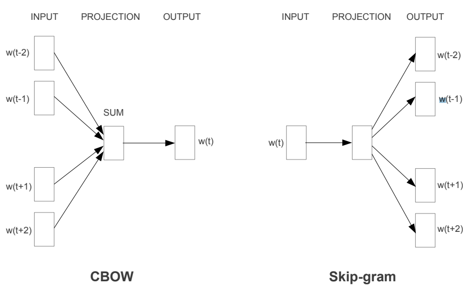

[『텐서플로2와 머신러닝으로 시작하는 자연어 처리』](http://www.kyobobook.co.kr/product/detailViewKor.laf?ejkGb=KOR&mallGb=KOR&barcode=9791158393168&orderClick=LAG&Kc=) 책을 보고 정리하기 위해 쓴 글이다.

# 단어 표현

**단순 이진화한 문자**

ex) '언' : 1100010110111000

언어적인 특성이 전혀 없기에 자연어 처리에는 적합하지 않다

**단어 표현**(word Representation)

`단어 임베딩(word embedding)`, `단어 벡터(word vector)`로 표현하기도 한다.

언어적인 특성을 반영해서 단어를 수치화하는 방법을 찾는 것

**원-핫 인코딩**(one-hot encoding)

각 단어의 인덱스를 정한 후 각 단어의 벡터에서 그 단어에 해당하는 인덱스의 값을 1로 표현하는 방식

문제점

* 실제에서는 단어가 너무 많아 벡터가 너무 커짐
* 그에비해 사용하는 값은 1이 되는 값 하나여서 비효율
* 단어만 알려주고 벡터값 자체는 단어의 의미, 특성 표현불가

**분포 가설**

비슷한 위치에 나오는 단어는 비슷한 의미를 가진다.

`count-based method`, `predictive method`가 있다.

**count-based method**

어떤 글의 문맥 안에 단어가 동시에 등장(Co-occurrence)하는 횟수를 센다. 동시 등장 횟수를 하나의 행렬로 나타낸 뒤 그 행렬을 수치화해서 단어 벡터로 만드는 방법을 사용한다.

* 특이값 분해(Singular Value Decomposition, SVD)
* 잠재의미분석(Latent Semnatic Analysis, LSA)
* Hyperspace Analogue to Language(HAL)
* Hellinger PCA(Principa Component Analysis)

모두 동시 출현 행렬(Co-occurrence Matrix)을 만들고 그 행렬들을 변형하는 방식

장점
* 빠르다, 단어 벡터 ↑, 시간 ↑, but 적은 시간으로 단어 벡터를 만들 수 있다
* 데이터가 많을 경우 단어가 잘 표현되고 효율적

**predictive method**

신경망 구조 혹은 어떠한 모델을 사용해 특정 문맥에서 어떤 단어가 나올지를 예측하면서 단어를 벡터로 만드는 방식

* Word2vec
* NNLM(Neural Network Language Model)
* RNNLM(Recurrent Neural Network Language Model)

`Word2Vec`의 모델
* CBOW(Continuous Bag of Words)
  * 어떤 단어를 문맥 안의 주변 단어들을 통해 예측
* Skip-Gram
  * 어떠 단어를 가지고 특정 문맥 주변 단어들을 예측

{: width="80%" height="80%" class="align-center"}

[source](https://arxiv.org/pdf/1309.4168v1.pdf) : Exploiting Similarities among Languages for Machine Translation

`CBOW`의 학습 순서

1. 각 주변 단어들을 원-핫 벡터로 만들어 입력값으로 사용(입력층 벡터)
2. 가중치 행렬(weight matrix)을 각 원-핫 벡터에 곱해서 n-차원 벡터를 만든다(N-차원 은닉층)
3. 만들어진 n-차원 벡터를 모두 더한 후 개수로 나눠 평균 n-차원 벡터를 만든다(출력 벡터)
4. n-차원 벡터에 다시 가중치 행렬을 곱해서 원-핫 벡터와 같은 차원의 벡터로 만든다.
5. 만들어진 벡터를 실제 예측하려고 하는 단어의 원-핫 벡터와 비교해서 학습한다.

`Skip-Gram`의 학습 순서

1. 하나의 단어를 원-핫 벡터로 만들어서 입력값으로 사용(입력층 벡터)
2. 가중치 행렬을 원-핫 벡터에 곱해서 n-차원 벡터를 만든다(N-차원 은닉층)
3. n-차원 벡터에 다시 가중치 행렬을 곱해서 원-핫 벡터와 같은 차원의 벡터로 만든다(출력층 벡터)
4. 만들어진 벡터를 실제 예측하려는 주변 단어들 각각의 원-핫 벡터와 비교해서 학습한다.

| 차이       | 입력값        | 학습         |
|-----------|-------------|------------|
| CBOW      | 여러 개의 단어 사용 | 하나의 단어와 비교 |
| Skip-Gram | 하나의 단어 사용   | 여러 단어와 비교  |

`Word2Vec` 모델의 장점

* 단어 간의 유사도를 잘 측정
* 단어들의 복잡한 특징까지도 잘 잡아낸다.

보통 `Skip-Gram`, `Predictive Method`가 성능이 좋다. `count-based method`와 `predictive method` 방법을 모두 포함하는 `Glove` 또한 자주 사용된다.

# Text Classification

**예시**
* 스팸 분류, (스팸/일반)
* 감정 분류, (긍정/.../부정) ex) 영화 리뷰
* 뉴스 기사 분류 (스포츠/경제/사회/...)

**지도 학습을 통한 텍스트 분류**

{: width="80%" height="80%" class="align-center"}

글에 대해 각각 속한 범주에 대한 라벨이 이미 주어져있어서 주어진 범주로 글을 모두 학습한 후 학습한 결과를 이용해 새로운 글의 범주를 예측

**지도 학습을 통한 문장 분류 모델**

* 나이브 베이즈 분류(Naive Bayes Classifier)
* 서포트 벡터 머신(Support Vector Machine)
* 신경망(Neural Network)
* 선형 분류(Linear Classifier)
* 로지스틱 분류(Logistic Classifier)
* 랜덤 포레스트(Random Forest)

**비지도 학습을 통한 텍스트 분류**

{: width="80%" height="80%" class="align-center"}

[source](https://en.wikipedia.org/wiki/K-means_clustering#/media/File:K-means_convergence.gif) : k-means clustering

라벨이 없어 데이터의 특성을 찾아내서 적당한 범주를 만들어 각 데이터를 나눈다.

**비지도 학습 모델**

* K-평균 군집화(K-means Clustering)
* 계층적 군집화(Hierarchical Clustering)

# Text Similarity

텍스트가 얼마나 유사한지를 표현하는 방식

**정량화 방법**
* 같은 단어의 개수를 사용하여 유사도 판단
* 형태소로 나누어 형태소를 비교
  * 형태소 : 의미를 가지는 요소로서는 더 이상 분석할 수 없는 가장 작은 말의 단위.
  * ex) 하늘은 스스로 돕는 자를 돕는다. → 하늘, 은, 스스로, 돕-, -는, 자, 를, 돕-, -는-, -다.
* 자소 단위로 나누어 단어를 비교
  * 자소 : 어떤 언어의 문자 체계에서 의미상 구별할 수 있는 가장 작은 단위를 가리킨다.
* 딥러닝, 텍스트를 벡터화한 후 벡터화된 각 문장간의 유사도측 측정

**자카드 유사도(Jaccard Similarity)**

{: width="80%" height="80%" class="align-center"}

두 문장을 각각 단어의 집합으로 만든 뒤 두 집합을 통해 유사도를 측정

**코사인 유사도(Cosine Similarity)**

{: width="80%" height="80%" class="align-center"}

두 개의 벡터값에서 코사인 각도를 구하는 방법, -1~1 사이의 값을 가지고 1에 가까울수록 유사하다. 방향성의 개념이 더해지기 때문에 일반적으로 성능이 좋다.

**유클리디언 유사도(Euclidean Distance)**

{: width="80%" height="80%" class="align-center"}

유클리디언 거리(Euclidean Distance) 혹은 L2 거리(L2-Distance) 라고도 불리며 $n$차원 공간에서 두 점 사이의 최단 거리를 구하는 접근법

차원의 크기에 따라 크기는 계속해서 커질 수 있기 때문에 값을 제한해야 한다. 벡터화한 각 문장을 일반화(Normalize)한 후 다시 유클리디언 유사도를 측정하면 0과 1 사이의 값을 갖는다.

L1 정규화 방법 : 각 벡터 안의 요소 값을 모두 더한 것이 크기가 1이 되도록 벡터들의 크기를 조정하는 방법

**맨하탄 유사도(Manhattan Similarity)**

사각형 격자로 이뤄진 지도에서 출발점에서 도착점까지를 가로지르지 않고 갈 수 있는 최단거리를 구하는 공식

{: width="80%" height="80%" class="align-center"}

{: width="80%" height="80%" class="align-center"}

[source](https://en.wikipedia.org/wiki/Taxicab_geometry#/media/File:Manhattan_distance.svg)

가장 적합한 맨하탄 거리는 파란색을 의미한다. 위 그림상 녹색선은 유클리디언(L2)거리이다.

{: width="80%" height="80%" class="align-center"}

# 자연어 생성

감정이나 논리 같은 숫자로 정량화하기 어려운 내용이 포함된 문장에 대해서는 아직까지는 컴퓨터가 작성하기 어렵지만 사실 기반의 기록에서는 충분히 효과적이다.

언어 생성은 사람의 대화를 최대한 많이 수집해서 대화를 배우게 하고 지속적으로 평가하는 과정을 반복해서 특정 목적에 맞는 텍스트를 생성하는 것이 주 목적이다.

# 기계 이해(Mechine Comprehension)

기계가 어떤 텍스트에 대한 정보를 학습하고 사용자가 질의를 던졌을 때 그에 대해 응답하는 문제

{: width="80%" height="80%" class="align-center"}

[source](https://towardsdatascience.com/machine-comprehension-with-bert-6eadf16c87c1)

기계는 위 텍스트의 내용을 토대로 추론해서 이에 대한 응답을 텍스트 내에서 하거나 정답 선택지를 선택하는 방식으로 답한다.

다른 자연어 처리 태스크와 비교하면 어렵고, 더욱 복잡한 모델링을 필요로 한다.

## 데이터셋

위키피디아나 뉴스기사를 가지고 데이터를 구성하며 대체로 텍스트와 지문, 정답 형태로 구성돼 있다.

**bAbI**

{: width="80%" height="80%" class="align-center"}

[source](https://arxiv.org/pdf/1502.05698.pdf)

페이스북 AI 연구팀에서 만들었으며, 20가지 부류의 질문으로 되어 있다. **시간** 순서대로 나열된 텍스트를 문장 정보와 그에 대한 질문으로 구성되어 텍스트 정보에 대해 질문을 던지고 응답하는 형태

기계 모델이 사람이 풀었을 때보다 더 좋은 점수를 내면서 이미 해결된 부분으로 알려짐

**SQuAD**

{: width="80%" height="80%" class="align-center"}

[source](https://arxiv.org/pdf/1606.05250.pdf)

스탠포드 자연어 처리 연구실에서 만들었으며 위키피디아에 있는 내용을 크라우드 소싱해서 QA 데이터셋으로 만들었다. 46개의 주제에 대해 약 10만 개의 질문 데이터셋으로 구성되어 있다. 10만개의 어휘와 짧은 텍스트에서부터 400단어가 넘는 긴 텍스트까지 다양한 길이와 지문을 포함한다.

모델링에서는 정답을 선택할 때 텍스트의 토큰 위치의 시작점과 끝점을 지정하도록 학습한다.

평가는 정답 위치와 완벽하게 일치하는지를 보는 `EM(Exact Matching)`점수와 정답 위치와 겹치는지를 보는 `F1` 점수를 통해 본다

현재는 `EM` 점수의 경우 사람보다 높게 나오며 `SQuAD 2.0`으로 새롭게 데이터셋을 구성해서 대회를 진행하고 있다.

**Visual Question Answering(VQA)**

{: width="80%" height="80%" class="align-center"}

[source](https://visualqa.org/challenge.html)

이미지에 대한 정보와 텍스트 질의를 통해 이미지 컨텍스트에 해당하는 응답을 알려주는 태스크

이미지에 대한 정보를 추출하는 모델과 질문 텍스트에 대한 정보를 추출하는 모델을 통해 두 정보를 조합해서 답을 추론하는 모델을 만들어 정답을 찾는 방법이 있다.

> 출처
 - 전창욱, 최태균, 조중현, 신성진,『텐서플로2와 머신러닝으로 시작하는 자연어 처리』, 위키북스(2020)
