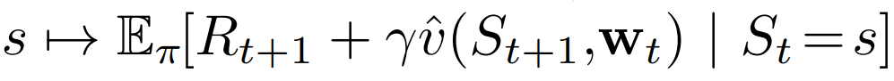
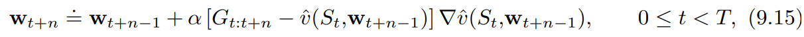
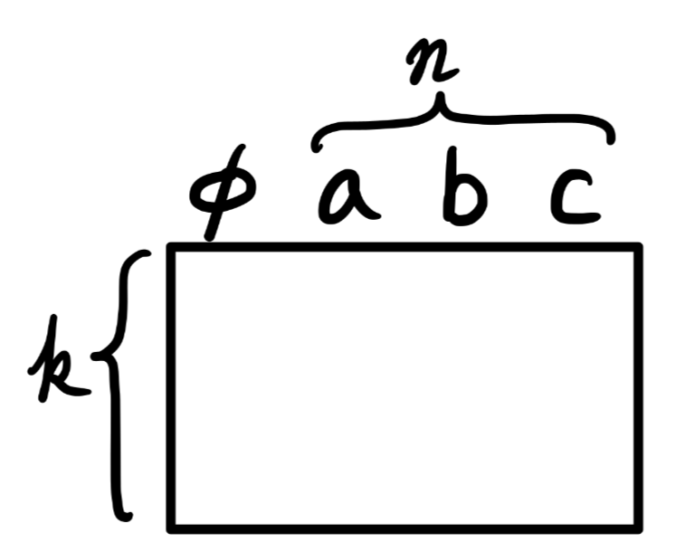
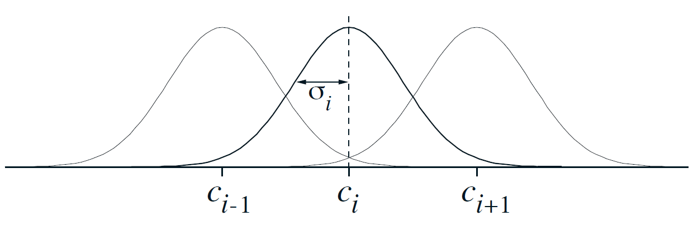
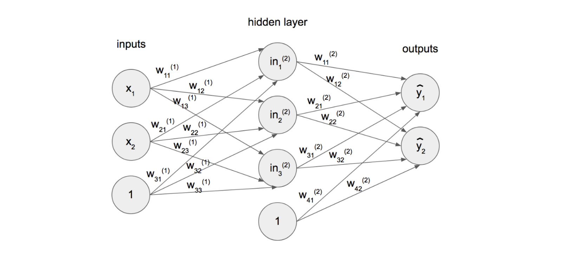
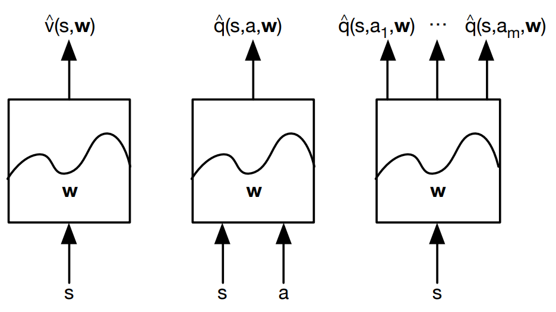
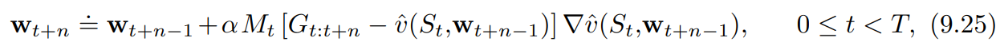
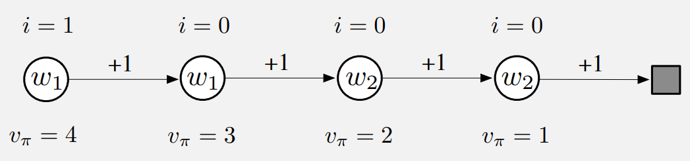

**활성 정책**으로부터 **상태가치 함수**를 추정하는 과정을 서술한다

* chap09 : 활성, 가치함수 근사
* chap10 : 활성, 최적정책 근사
* chap11 : 비활성, 정책 근사 (어렵다고 함)
* chap12 : eligibility trace

후에는 다음 내용들이 서술된다.

전에는 상태함수가 표 형태로 표현되었으나 이제는 가중치 벡터 $\textbf{w}\in\mathbb{R}^{d}$ 파라미터화된 함수 형태를 갖는다

$\hat{v}(s, \textbf{w}) \approx v_{\pi}(s)$ : 가중치

$\textbf{w}$가 굵은 글씨인 이유는 단일 숫자가 아닌 여러 숫자로 이루어진 벡터이기 때문인 듯 하다.

일반적으로, $\hat{v}$는 다층 인공 신경망에 의해 계산된 함수이고, $\textbf{w}$는 모든 층의 연결된 가중치 벡터일 수도 있다.

일반적으로 가중치의 개수($\textbf{w}$의 차원)은 상태의 개수보다 훨씬 적다($d \ll \mid \mathcal{S} \mid$), 결과적으로 하나의 상태가 갱신되면 그 변화는 다른 상태의 가치에 영향을 준다. 이러한 **일반화**(generalization)가 학습을 강력하게도, 이해가 어렵게도 만든다.

아래 그림을 보면 하나의 갱신이 다른 상태 가치에 영향을 준다는 말이 감이 올 것이다.

{: width="80%" height="80%" class="align-center"}

# 가치 함수 근사

이책의 모든 예측 방법은 특정 상태에서의 가치를 그 상태에 대한 '보강된 가치' 또는 **갱신 목표**(update target)를 향해 이동시키기 위한 가치 함수 추정값의 갱신으로 설명된다.

$s \mapsto u$
* $s$ : 상태(갱신의 대상)
* $u$ : $s$의 가치 추정값이 도달해야 하는 갱신의 목표

**ex)**

* `Monte Carlo` : $S_t \mapsto G_t$
* `TD(0)` : $S_t \mapsto R_{t+1}+\gamma \hat{v}(S_{t+1}, \textbf{w}_t)$
* `n-step TD` : $S_t \mapsto G_{t:t+n}$
* `DP policy-evaluation` : 

{: width="35%" height="35%" class="align-center"}

입출력 예제를 모사하기 위해 이러한 방식으로 학습하는 기계학습 방법을 **지도학습**(supervised learning) 방법이라 하고, 출력이 $u$와 같은 숫자일 경우 이 과정은 **함수 근사**(function approximation)라고도 한다. 함수 근사 방법은 근사하려고 하는 함수의 바람직한 입출력 관계를 나타내는 예제가 주어진다는 것을 전제로 한다.

강화학습에서 중요한 점
* 학습자가 환경이나 환경의 모델과 상호작용하며 온라인으로 학습할 수 있는 능력
  * 점증적으로 획득되는 데이터로부터 효율적으로 학습할 수 있는 방법 필요
* 일반적으로 nonstationary 목표 함수를 다룰수 있는 함수 근사 방법을 필요로 한다.
  * ex) 정책이 변하지 않았다 해도, 훈련 예제의 target value가 bootstrapping method(DP, TD)로 생성되었다고 하면 그것은 nonstationary이다.
  * Methods that cannot easily handle such nonstationarity are less suitable for reinforcement learning.

# The prediction objective

Tabular Case
* 학습된 가치 함수가 실제 가치 함수와 정확하게 같아질 수 있기 때문에(수렴한다는 뜻인 것 같다) 예측의 품질을 연속적으로 측정할 필요가 없다.
* 한 상태의 갱신이 다른 상태에 영향을 주지 않는다.

함수 근사
* 한 상태의 갱신이 다른 상태에 영향을 준다.
* **상태보다 가중치가 적다**는 가정 하에 한 상태의 가치 추정값을 더 정확하게 만드는 것은 언제나 **다른 상태를 덜 정확하게 만드는 것**을 의미한다.

따라서 각 상태 $s$에 대해 가치 추정의 오차를 줄이는 노력을 얼마나 기울일 것인가를 나타내는 상태 분포 $\mu(s) \geq 0, \sum_a \mu(s)=1$을 명시해야 한다.

(노력의 정도는 0 이상이어야 하고 각 상태에 1을 분배한다)

상태 공간에 걸쳐 $\mu$를 할당함으로써 자연스러운 목적 함수를 얻는다

*[근사 가치가 실제 가치와 얼마나 차이를 갖는지에 대한 지표]*

$\overline{VE}(\textbf{w}) \doteq \sum_{s \in \mathcal{S}} \mu(s) [v_{\pi}-\hat{v}(s,\textbf{w})]^2$

대체로 $\mu(s)$ 는 상태 $s$에서 소비된 시간의 비율이 되도록 선택된다.

활성 정책 훈련의 경우 이것은 **활성 정책 분포**(on-policy distribution)라고 불린다.
**연속적인 문제에서 활성 정책 분포는 정책 $\pi$를 따르는 `stationary` 분포다.**

$\overline{VE}$ 의 측면에서 global optimum을 찾으려고 하겠지만 복잡한 함수를 근사할 경우 local optimum으로 수렴하는 것을 찾으려고 할 수도 있다. 이는 global optimum을 보장하지 않지만 비선형 함수 근사에서 최선이고 충분한 경우가 꽤 있다.

많은 강화학습 문제에서 최적값 또는 근처의 제한되는 영역으로라도 값이 수렴한다는 것을 보장하지 못하며 어쩌면 $\overline{VE}$가 발산할 수도 있다.

# Stochastic-gradient and Semi-gradient Methods

**확률론적 경사도 강하**방법은 각 예제에 대해 오차를 가장 많이 감소시키는 방향으로 가중치 벡터를 조금씩 조정함으로써 관측된 예제의 오차를 최소화한다.

{: width="80%" height="80%"}

* $\alpha$ : 양의 시간 간격 파라미터

$\nabla f(\textbf{w}) \doteq (\frac{\partial f(\textbf{w})}{\partial w_1},\frac{\partial f(\textbf{w})}{\partial w_2},\cdots,\frac{\partial f(\textbf{w})}{\partial w_d})^T$

$\nabla f(\textbf{w})$ : 함수 $f(\textbf{w})$를 벡터의 성분에 대해 편미분한 열 벡터

**경사도 방향으로 작은 간격만을 취하는 이유**

모든 상태에 대해 오차가 0이 되는 가치 함수를 찾는 것이 아니라, 서로 다른 상태들 사이의 오차에 대해 **균형**을 맞추는 근사만을 추구하거나 기대한다.

예를 들어 $Q(s_1, a_1)=0.7$, $Q(s_q, a_2)=0.701$ 이런식으로 적은 차이에도 `Value Function`에 의한 `Policy`가 바뀔텐데 `step-size`를 작게 함으로써 변화에 천천히 다가갈 수 있게 한다.

---

$\textbf{w}_{t+1}=\textbf{w}_t - \alpha[U_t - \hat{v}(S_t, \textbf{w}_t)]\nabla \hat{v}(S_t,\textbf{w}_t)$

* $U_t$ : 실제 가치의 근삿값, $v_{\pi}(S_t)$를 $U_t$로 대체함으로써 $v_{\pi}(S_t)$를 근사한다

---

**몬테카를로**

목표인 $U_t \doteq G_t$는 그 정의상 $v_{\pi}(S_t)$의 편차 없는 추정값이 되므로 locally optimal approximation으로 수렴한다.(=locally optimal solution을 찾는 것이 보장)

{: width="80%" height="80%" class="align-center"}

---

**부트스트랩**

$v_{\pi}(S_t)$에 대한 **부트스트랩 추정값**이 목표 $U_t$로서 사용된다면 이와 동일한 보장(locally optimal approximation으로 **수렴**)을 받지 못한다.

`n-step returns` $G_{t:t+n}$이나 `DP target` $\sum_{a,s',r} \pi(a \mid S_t)p(s',r \mid S_t, a)[r + \gamma \hat{v}(s', \textbf{w}_t)]$ 는 모두 가중치 벡터 $\textbf{w}_t$의 영향을 받는데, 이것은 **부트스트랩 목표가 편차를 갖게 되어 진정한 경사도 강하 방법을 형성하지 못할것을 암시함**

한가지 관점은

{: width="80%" height="80%"}

의 핵심 단계가 $\textbf{w}_t$와는 독립적으로 존재하는 목표에 영향을 받는다고 보는 것이다 
($\textbf{w}_t$가 바뀌면 bootstrapping에서 미래의 예측치인 target도 변하게 되는데 이는 현재 예측치와 독립적이지 않다.)

부트스트랩 방법은 가중치 벡터 $\textbf{w}_t$를 변경하는 것이 추정값에 미치는 효과를 고려하지만 target에 미치는 효과는 무시한다. 이 방법은 오직 경사도의 일부만을 포함하고 따라서 이 방법을 **준경사도 방법**(semi-gradient method)이라고 부른다.

준경사도 방법은 경사도 방법처럼 안정적으로 수렴하지는 않지만, **선형 근사 함수의 경우와 같은 중요한 경우**에 있어서는 **안정적으로 수렴**한다.

일반적으로 빠른 학습을 가능하게 하는 장점이 있고 에피소드가 끝날때까지 기다릴 필요가 없다(bootstrapping의 장점)

{: width="80%" height="80%" class="align-center"}

**상태결집**(state aggregation)

상태가 너무 많을 경우 특정 범위의 상태를 묶어서 취급하는 방법이다.

이 [답변](https://stats.stackexchange.com/q/371956)에 의하면 에이전트에게는 다음 두가지 상태가 차이가 없기 때문이라고 한다.

* $s_1$에서 $s_k$를 단일 entity $x_1$로 표현하고 `value function` $v(x)$로 작업하여 aggregating states
* $v(s_1)$ ~ $v(s_k)$이 $v(s)$ 내에서 동일한 단일 테이블 룩업을 참조하도록 값 함수 내에서 aggregating.

*[figure 9-1]*

{: width="80%" height="80%" class="align-center"}

1000개의 state에서 왼쪽은 -1 오른쪽은 +1의 reward를 받는다. 1000개의 state가 100개씩 10개의 묶음으로 나누어졌다. 계단 효과는 상태 결집의 일반적인 현상이다. 각 묶음 내에서는 근사적 가치가 상수로 고정되고, 다음 묶음으로 가면서 갑자기 변화한다. 

이러한 근사적 가치는 

$\overline{VE}(\textbf{w}) \doteq \sum_{s \in \mathcal{S}} \mu(s) [v_{\pi}-\hat{v}(s,\textbf{w})]^2$

의 전역 최솟값과 가까운 값이다.

그림 아래 상태 분포 $\mu$ : 소비된 시간의 비율

가장 왼쪽과 오른쪽의 영역에서 $\mu$에 의해 결정되는 가중치의 비대칭성이 가장 크기 때문에 왼쪽에서는 가중치 없는 평균(True value)보다 큰 값, 오른쪽에서는 더 작은값으로 이동한다.

내 생각 : 다른 지역과 달리 극단은 상태별로 종단 확률이 다른데 (1~100)묶음은 1이 종단 확률이 50%이며 100으로 갈수록 작아진다. 그러므로 모든 상태가 50%의 확률로 온전히 -1에서 종단되는 것이 아니므로 True Value보다 좀더 크다. 반대로 생각하면 오른쪽도 될 것이다.

# Linear Methods

선형 방법은 $\textbf{w}$와 $\textbf{x}(s)$를 내적함으로써 상태 가치 함수를 근사한다.

$\hat{v}(s, \textbf{w}) \doteq \textbf{w}^{T}\textbf{x}(s) \doteq \sum_{i=1}^{d}w_{i}x_{i}(s)$

* $\textbf{x}(s)$ : 상태 $s$를 나타내는 feature vector
* $\textbf{x}(s)$의 각 성분 $x_{i}(s)$ : 함수 $x_i : \mathcal{S} \rightarrow \mathbb{R}$의 가치

이러한 함수들 중 한 함수의 **feature**는 그 함수의 전부를 나타내는 것으로 간주할 것이고 어떤 상태에 대한 함수의 가치를 **feature of s**라고 부를 것이다.

SGD 갱신에서 $\textbf{w}$에 대한 근사 가치 함수의 경사도는 다음과 같다.

$\nabla \hat{v}(s, \textbf{w}) = \textbf{x}(s)$

($\hat{v}(s, \textbf{w}) \doteq \textbf{w}^{T}\textbf{x}(s)$에서 $\hat{v}$는 $\textbf{w}$와 $\textbf{x}$의 선형결합이므로 $\textbf{w}$만 떼면 된다.)

따라서 SGD갱신이 다음과 같이 간소화된다.

$\textbf{w}_{t+1}=\textbf{w}_t - \alpha[U_t - \hat{v}(S_t, \textbf{w}_t)]\nabla \hat{v}(S_t,\textbf{w}_t)$

에서

$\textbf{w}_{t+1}=\textbf{w}_t - \alpha[U_t - \hat{v}(S_t, \textbf{w}_t)] \textbf{x}(s)$

로 간소화된다.

선형함수의 경우
* 오직 하나의 최적값만 존재한다.
* **지엽적 최적값 또는 그 근처로 수렴하는 것이 보장된 모든 방법은 전역 최적값 또는 그 근처로 수렴하는 것을 자동으로 보장한다.**
* 앞서 소개했던 `경사도 몬테카를로 알고리즘` 또한 $\alpha$가 보통의 조건에 따라 감소한다면 선형 함수 근사하에서 $\overline{VE}$의 전역 최적값으로 수렴한다.

준경사도 TD(0) 알고리즘 역시 선형 함수 근사하에서 수렴하지만 SGD에 대한 일반적인 결과로부터 귀결되는 것은 아니고 별도의 이론이 필요하다. **가중치 벡터가 수렴했어도 그 값은 전역 최적값이 아니고 지엽적 최적값 근처에 있는 어떤 값이다.**

**알고리즘의 가치**

* Global Optimum Convergence > Local Optimum Convergence
* Non-linear Convergence > Linear Convergence

// TODO
**증명**

책 248~250페이지

{: width="80%" height="80%" class="align-center"}

**왼쪽 그림**은 상태 결집을 활용한 준경사도 TD(0) 알고리즘에 의해 학습된 최종 가치 함수이다. **거의 점근적으로 수렴한 TD 근사가 *[figure 9-1]* 의 몬테카를로 근사보다 실제 가치로부터 더 멀리 떨어져 있다.**

(당장 종단상태가 되지 않고 다음 step만 취급하므로 종단 상태에 대해 덜 생각하게 된다.)

하지만 학습 속도 면에서 잠재적인 장점이 많으며 몬테카를로 방법을 일반화한다.

**오른쪽 그림**은 상태 결집을 활용한 n단계 방법의 성능이 표 형태의 표현을 활용했을 때의 성능과 놀라울 정도로 유사하다는 것을 보여준다. 19개의 상태를 가진 RW환경과 1000개의 상태를 가진 RW에서 상태결집을 활용해 50 X 20으로 묶어 20개의 상태를 갖게 한다면 표 기반 문제였던 전자와 정량적으로 가까워진다는 것이다.

{: width="80%" height="80%" class="align-center"}

이 알고리즘의 핵심 방정식은 $n$단계 이득을 사용하기 위한 자연스러운 상태 가치 학습 알고리즘

$V_{t+n}(S_t) \doteq V_{t+n-1}(S_t) + \alpha[G_{t:t+n}-V_{t+n-1}(S_t)], \quad 0 \le t < T$

와 유사한 것으로 다음과 같이 표현된다.

{: width="40%" height="40%" class="align-center"}

$n$단계 이득은 

$G_{t:t+n} \doteq R_{t+1} + \gamma R_{t+1}+ \cdots + \gamma^{n-1}R_{t+n}+\gamma^n V_{t+n-1}(S_{t+n})$

으로부터 다음과 같이 일반화된다.

$G_{t:t+n} \doteq R_{t+1} + \gamma R_{t+1}+ \cdots + \gamma^{n-1}R_{t+n}+\gamma^n \hat{v}(S_{t+n}, \textbf{w}_{t+n-1}), \quad 0 \le t \le T-n$

# Feature Construction for Linear Methods

선형 방법의 장점

* 수렴성 보장
* 계산의 효율성

선형 방법의 한계
* 특징들 사이의 상호작용을 전혀 고려할 수 없다.
  * [막대 균형 문제] 각도가 큰 상황에서 큰 각속도는 위험한 상태이며 작은 각도에서는 복원되는 상태를 의미한다. 
  * 선형 가치 함수의 feature가 각도와 각속도에 대해 별도로 코딩되어 있다면 선형 가치 함수는 이러한 상태를 표현할 수 없다. 이 경우 두 가지 상태의 차원을 결합한 것에 대한 특징이 필요하다

## Polynomials

작 작동하지는 않지만 가장 간단하다.

---

각각의 상태 $s$가 $k$개의 숫자 $s_1, s_2, ...s_k$에 대응된다고 가정하자. 이때 $s_i \in \mathbb{R}$ 이다 이러한 $k$차원 상태 공간에 대해 $n$차 다항식을 기저로 하는 각각의 특지어 $x_i$는 다음과 같이 표현된다

$x_i(s)=\prod_{j=1}^{k}s_{j}^{c_{i,j}}=s_{1}^{c_{i,1}} s_{2}^{c_{i,2}} \cdots s_{k}^{c_{i,k}}$

$c_{i,j}$ : 0 이상의 정수 $n$에 대해 집합 $\{0, 1, ..., n\}$의 원소다. 이러한 특징들은 $k$차원에 대한 $n$차 다항식의 기저를 형성하고, 이 기저로 $(n+1)^k$개의 각기 다른 특징을 나타낼 수 있다.

{: width="50%" height="50%" class="align-center"}

---

높은 차수의 다항식 기저는 더 복잡한 함수에 대한 근사를 가능하게 한다. 하지만 $n$차 다항식 기저로 나타낼 수 있는 특징의 개수는 $(n>0)$이라면 정상적인 상태 공간의 차원 수 $k$에 따라 기하급수적으로 증가하기 때문에, 그 많은 특징 중 함수 근사를 위한 특징을 선택하는 일반적인 과정이 필요하다. 

## Fourier Basis

---
각각의 상태 $s$가 $k$개의 숫자로 구성된 벡터 $\textbf{s}=(s_1, s_2, ..., s_k)^T$를 구성하고, $s_i \in [0,1]$이라고 가정하자. 그러면 $n$차 푸리에 코사인 기저의 $i$번째 특징은 다음과 같이 표현할 수 있다.

$x_i(s)=\cos(\pi \textbf{s}^T \textbf{c}^i)$

* $\textbf{c}^i$ : $(c_1^i,...,c_k^i)$
* $j=1,...,k$와 $i=1,...,(n+1)^k$에 대해 $c_j^i \in \{0, ..., n\}$

이것은 $(n+1)^k$개의 가능한 정수 벡터 $\textbf{c}^i$ 각각에 대한 특징을 정의한다. 내적 $\textbf{s}^T \textbf{c}^i$는 $\{0, ..., n\}$에 속하는 정수 하나를 $\textbf{s}$의 각 차원에 할당하는 효과가 있다. 1차원의 경우에서처럼, 이 정수는 그 차원에 대한 특징의 진동수를 결정한다. 물론, 특징은 특정 문제에서 가정하는 제한된 상태 공간에 적합하도록 이동하고 축소/확대될 수 있다.

{: width="80%" height="80%" class="align-center"}

일반적으로, 온라인 학습에 다항식을 사용하는 것을 권유하지는 않는다.

## 엉성한 부호화(Coarse Coding)

{: width="80%" height="80%" class="align-center"}

one-hot vector를 생각하면 편하다

|      | c1 | c2 | c3 | c4 | c5 | c6 | c7 | c8 | c9 | c10| c11| c12| c13|
|------|----|----|----|----|----|----|----|----|----|----|----|----|----|
| $s$  | 0  | 0  | 0  | 0  | **1**  | **1**  | 0  | 0  | **1**  | 0  | 0  | 0  | 0  |
| $s'$ | 0  | 0  | **1**  | 0  | 0  | **1**  | 0  | 0  | 0  | 0  | 0  | 0  | 0  |

상태가 원의 안쪽에 있다 : 1의 값을 갖고 **존재하는**(present) 상태라고 불림

상태가 원의 바깥에 있다 : 0의 값을 갖고 **부재중인**(absent) 상태라고 불림

이렇게 0과 1로 매겨진 특징을 **이진 특징**(binary feature)라고 부른다.

하나의 상태에서 훈련을 한다면 그 상태를 공유하는 모든 원의 합집합에 속하는 모든 상태에서 영향을 받는다. 

---

원의 크기가 작다면 일반화는 짧은 거리에 걸쳐 이루어질 것이다.

원의 크기가 크다면 일반화는 긴 거리에 걸쳐 이루어질 것이다.

특징의 모양은 일반화의 특성을 결정한다.

{: width="80%" height="80%" class="align-center"}

궁극적으로 달성 가능한 가장 세밀한 구분은 특징의 **수용 영역의 크기가 아니라 특징의 전체 개수에 더 많이 영향**을 받는다.

{: width="80%" height="80%" class="align-center"}

## Tile Coding

{: width="80%" height="80%" class="align-center"}

왼쪽 그림과 같이 상태공간을 겹치지 않고 균일하게 표현한다면 어떤 점은 단일 특징으로 표현되고 타일 밖에서는 일반화가 없을 것이다.(타일 수준에서는 표현할 수 없다)

엉성한 부호화(Coarse Coding)능력을 활용하려면 수용 영역들이 겹쳐져야 한다. 타일 부호화를 위하여 타일 너비의 일정 비율만큼 서로 떨어져 있는 다수의 타일 영역이 활용된다.

오른쪽 그림은 하얀 점이 4개의 각 타일 영역에서 하나의 영역에 속하게 되는 것을 보여준다.

예를 들어 위에서 우측 그림의 흰 점의 경우

* tile1 : [2,2]
* tile2 : [2,3]
* tile3 : [2,3]
* tile4 : [1,3]

에서 각 1의 값을 갇고 나머지 0을 가져 $4 \times 4 \times 4$의 성분을 가질 것이다.

장점 : 

* 각 타일에서 하나씩 활성화 되기 때문에 활성화된 **특징의 전체 개수가 모든 상태에서 동일**하다. -> step-size parameter $\alpha$를 쉽고 직관적인 방식으로 설정할 수 있게 한다.
* 각 성분이 0또는 1이므로, 근사적 가치 함수 $\hat{v}(s, \textbf{w}) \doteq \textbf{w}^{T}\textbf{x}(s) \doteq \sum_{i=1}^{d}w_{i}x_{i}(s)$ 계산이 간단하다. $d$번의 곱셈과 덧셈을 하기보다는 $n << d$ 개의 활성 특징에 대한 인덱스를 계산하고 그에 해당하는 가중치 **벡터의 성분** $n$**개를 합산**하면 된다. (벡터 자체도 Sparse 하기 때문에 인덱스만 구하여 더하는게 훨씬 좋다.)

{: width="80%" height="80%" class="align-center"}

모든 패턴이 뚜렷한 비대칭성 없이 훈련된 상태를 중심으로 형성되어 있기 때문에 **아래의 일반화 패턴이 더 바람직**하다고 한다.

실제로는, 서로 다른 타일 영역에서 서로 다른 모양의 타일을 사용하는 것이 종종 바람직하다.

(전체적으로 Randomness를 강조하는 듯 하다.)

# 방사형 기저 함수, Radial Basis Function

Coarse Coding(엉성한 부호화)를 연속적인 값을 갖는 특징으로 자연스럽게 일반화. 특징이 존재하는 다양한 정도를 반영할 수 있다. 

$x_i(s)=\exp(-\frac{\|s-c_i\|}{2 \sigma_i^2})$

일반적인 RBF 특징 $x_i$는 특징의 원형 상태 또는 중심 상태 $c_i$와 상태 $s$ 사이의 거리에 따라서만 값이 결정되고 특징의 너비 $\sigma_i$와 관련되어 있는 가우시안 반응 $x_i(s)$를 갖는다.

{: width="80%" height="80%" class="align-center"}

장점
* 부드럽게 변하고 미분 가능한 근사 함수를 도출한다.

단점(특히 비선형 RBF 네트워크)
* 계산의 복잡도가 크다
* 학습이 안정적이고 효율적으로 될 때까지 더 많은 수동 조율이 필요하다.

# Selecting Step-Size Parameters Manually

전통적으로 $\alpha_t=1/t$로 선택하는 것은 표 기반 `MC`방법에서 표본평균을 계산할 때 적용한 것으로서, `nonstationary` 문제를 위한 `TD` 방법이나 함수 근사를 하는 모든 방법에 적합하지 않다. 

선형 학습 방법으로는 최적의 시간 간격 행렬을 설정하기 위한 재귀적 최소 제곱법(recursive least-squares method)이 있고 이는 LSTD(Least-Squares TD) 방법에서와 같이 시간차 학습에 적용될 수 있다. 하지만 이렇게 하기 위해 $O(d^2)$개의 시간 간격 파라미터 또는 학습하는 파라미터 개수의 $d$배에 해당하는 개수의 파라미터가 필요하다. -> 규모가 큰 문제에서 사용하지 않는다.

시간 간격
* $\alpha = 1$ : 하나의 목표 이후에 표본 오차가 왼전히 제거
* $\alpha = \frac{1}{10}$ : 평균적 목표에 도달하기 위해 10번의 경험 필요
* $\alpha = \frac{1}{\tau}$ : 표기반의 추정값은 해당 상태에 대해 대략 $\tau$번의 경험이 진행된 이후에 목표의 평균값으로 수렴, **이때 가장 최근의 목표가 가장 큰 효과를 보임**

---

동일한 특징 벡터를 이용하여 $\tau$번의 경험 이후에 학습이 완료되기를 원한다면 좋은, SGD 방법의 시간 간격 파라미터

$\alpha \doteq (\tau \mathbb{E} [\textbf{x}^T \textbf{x}])^{-1}$

* $\textbf{x}$ : SGD에서 입력 벡터가 갖게 될 분포와 같은 분포로부터 무작위로 선택된 특징 벡터
* 이상적인 경우 : $\textbf{x}^T \textbf{x}$가 고정된 값이 되는 경우

# Nonlinear Function Approximation: ANN

{: width="80%" height="80%" class="align-center"}

|{: width="80%" height="80%" class="align-center"}| 

[image from *here*](https://learnopencv.com/understanding-activation-functions-in-deep-learning/)

$a = f(w_{0}+\sum_{i=1}^{m}x_{i}w_{i})$

 - $a$ : Output
 - $f$ : non-linear activation function
 - $w_{0}$ : bias
 - $w_{i}$ : weight
 - $x_{i}$ : input
 - $x_{i}w_{i}$ : Linear combination of inputs

위의 공식을 가지고 숫자들이 전파된다.

{: width="80%" height="80%" class="align-center"}

위와 같이 CNN을 활용한 ANN도 있으며 이는 이미지 인식에 탁월한 성능을 보인다.

{: width="80%" height="80%" class="align-center"}

나중에 나올 얘기지만 `Q-value`를 측정할때 신경망을 활용할 경우 $(s, a)$를 같이 집어넣어 $\hat{q}(s, a, \textbf{w})$를 산출하는 경우가 있고 $(s)$를 집어넣어 a의 갯수 $m$만큼 $\hat{q}(s, a_1, \textbf{w}),...,\hat{q}(s, a_m, \textbf{w})$ 를 반환하는 경우가 있는데 보통은 후자를 더 많이 쓴다.

# Least-Squares TD

// TODO

# Memory-based Function Approximation

이전까지 가치 함수를 근사하기 위하여 parametric 접근법에 대해 논의했다.

**메모리 기반 함수 근사 방법**은 훈련 예제가 들어올 때마다 어떠한 파라미터도 갱신하지 않고 단순히 훈련 예제를 메모리에 저장한다.(또는 최소한 예제의 일부를 저장한다) 시스템이 출력을 도출하도록 요청받을 때까지 훈련 예제를 처리하는 것이 지연되기 때문이다.

선형 함수나 다항 함수 같은 fixed parameterized class of functions로 제한되지 않는다. 대신 훈련 예제 자체나 쿼리 상태에 대한 가치 추정값을 도출하기 위해 **훈련 예제를 결합**하는 몇 가지 수단에 의해 함수의 형태가 결정된다.

메모리에 더 많은 훈련 예제가 축적될수록 nonparametric method 가 모든 target function에 대해 점점 더 정확한 근사를 만들어 낼 것이라고 기대된다.

현재 쿼리 상태 근처에서 오로지 지엽적으로 가치 함수를 근사하는 **지역 학습**(local-learning) 방법에 초점을 맞춘다.

이는 쿼리 상태와 가장 관련성(거리)이 있다고 판단되는 상태를 갖는 메모리로부터 훈련 예제들을 받는다.

**최근접 이웃(nearest neighbor)**
단순히 쿼리 상태와 가장 가까운상태를 갖는 메모리에서 예제를 찾아서 그 예제의 가치를 쿼리 상태에 대한 근삿값으로 도출

* $s$ : 쿼리 상태
* $s'$ : 쿼리 상태와 가장 가까운 상태

$s' \mapsto g$가 메모리의 예제가 되고, $g$가 상태 $s$의 근사적 가치로서 도출

**가중 평균(weighted average)**

최근접 이웃 예제를 받아서 그 예제의 목표 가치에 대한 **가중 평균** 도출

해당 상태와 쿼리 상태의 거리가 증가함에 따라 가중치는 일반적으로 감소

**지역 가중 회귀(locally weighted regression)**

$\overline{VE}(\textbf{w}) \doteq \sum_{s \in \mathcal{S}} \mu(s) [v_{\pi}-\hat{v}(s,\textbf{w})]^2$

과 같은 weighted error measure를 최소화하는 parametric approximation 방법을 통해 근사적 가치 함수를 가장 가까운 상태들의 가치에 맞춘다. 여기서 가중치는 쿼리 상태로부터의 거리에 따라 달라진다. 도출되는 가치는 쿼리 상태에서 지엽적으로 맞춰진 근사함수이고, 일단 가치가 도출된 이후에는 지역 근사 함수가 제거된다.

**Memory-based Function Approximation의 특징**

함수 근사를 미리 지정된 함수 형태로 맞추도록 제한하지 않는다. -> 데이터가 많이 축적될수록 정밀도 향상

RL에서 trajectory sampling이 상당히 중요하기 때문에 memory-based local method는 실제/시뮬레이션 trajectory에서 마주치는 State(or state-action pairs)의 근처 지역으로 함수 근사의 초점을 맞출 수 있다.

상태 공간의 많은 영역에는 도달하지 않아 전역적 근사는 필요하지 않을 수 있다.

학습자의 경험이 현재 상태 주변에 대한 가치 추정값에 비교적 즉각적 영향을 미칠 수 있게 해준다.

---

전역 근사를 하지 않는 것이 차원의 저주 문제를 다루는 방법이 되기도 한다

$k$차원의 상태 공간에 대해 전역 근사를 저장하는 tabular method는 $k$에 따라 exponential 한 메모리를 필요로 한다.

반면에 memory-based method에서는 예제 저장시 각 예제마다 $k$에 비례하는 메모리가 요구된다. $n$개 예제 저장시 필요한 메모리는 $n$에 대해 선형적으로 증가한다.

특별한 다차원 데이터 구조를 사용하여 훈련데이터를 저장하기 위해 $k$-$d$트리 구조를 이용하기도 한다.

# 커널 기반 함수 근사

메모리 기반 방법은 $s'$과 쿼리 상태 $s$ 사이의 거리에 따라 데이터베이스에 있는 예제 $s' \mapsto g$에 가중치를 할당하는 것에 의존한다.

이러한 가중치를 할당하는 함수를 **커널 함수**(커널)이라고 한다. 가중치는 거리가 아니라 상태들 사이의 유사성을 나타내는 지표들에 의존한다.

이 경우, $k : \mathcal{S} \times \mathcal{S} \rightarrow \mathbb{R}$이 되고 따라서 

$k(s, s')$ : $s$에 관한 요청이 응답하는 데 영향을 미치는 과정 속에서 $s'$ 주변의 데이터에 할당되는 가중치

다르게 $k(s,s')$는 $s'$로부터 $s$로 진행되는 일반화가 얼마나 강한지 나타내는 지표. 커널 함수는 어떤 상태에 관한 지식이 다른 상태에 얼마나 '연관되는지'를 수치적으로 나타낸다

파라미터 기반의 선형 함수 근사로부터 도출되는 일반화의 강도는 항상 커널 함수로 표현할 수 있다.

**커널 회귀**(kernel regression)

메모리에 저장된 '모든' 예제의 target에 대한 kernel weighted average을 계산하는 메모리 기반 방법으로 그 결과를 쿼리 상태에 할당한다.

* $\mathcal{D}$ : 저장된 예제의 집합
* $g(s')$ : 상태 $s'$에 대한 목표

이라 할때 커널 회귀는 목표 함수를 근사하는데, 이 경우 $\mathcal{D}$에 의존하는 가치 함수는 아래와 같다.

$\hat{v}(s, \mathcal{D})=\sum_{s' \in \mathcal{D}} k(s,s')g(s')$

파라미터 기반의 선형 회귀 방법은 무엇이든 커널 회귀로서 재구성될 수 있다.

$k(s, s')=\textbf{x}(s)^T \textbf{x}(s')$

* 상태 : 특징벡터 $\textbf{x}(s)=(x_1(s), x_2(s), ..., x_d(s))^T$로 표현

위와 같이 $k(s, s')$은 $s$와 $s'$의 특징 벡터를 내적한 것으로 주어진다.

이러한 커널 함수가 적용된 커널 회귀가 커널 함수에 적용된 특징 벡터를 사용하고 동일한 훈련 데이터에 대해 학습한다면, 커널 회귀는 파라미터 기반의 선형 방법과 동일한 근사 결과를 만들어낸다.

시사점:

파라미터 기반의 선형 함수 근사를 위해 특징을 만드는 대신, 특지 벡터를 전혀 언급하지 않고도 커널 함수를 직접 만들 수 있다,

$k(s, s')=\textbf{x}(s)^T \textbf{x}(s')$

처럼 특징 벡터의 내적으로 표현될 수 있는 커널 함수는 동일한 파라미터 기반의 방법에 중요한 장점을 제공한다.

$k(s, s')=\textbf{x}(s)^T \textbf{x}(s')$

위 식은 $d$차원의 특징 공간에 대한 어떠한 계산도 없이 평가될 수 있는 간단한 함수 형태를 갖는다. 이 경우, 이러한 특징 벡터로 표현되는 상태와 함께 파라미터 기반의 선형 방법을 직접 사용하는 것보다 커널 회귀가 훨씬 덜 복잡하다. 

이것이 실제로 저장된 훈련 예제에 대해서만 작동하면서 높은 차원을 갖는 방대한 특징 공간에 대해서도 효과적으로 작동하게 해주는 `kernel trick`이다.

# Looking Deeper at On-policy Learning: Interest and Emphasis

여태까지는 마주치는 모든 상태가 동일하게 중요한 것처럼 취급하였다. 하지만 어떤 경우 특정 상태에 더 많은 관심을 갖게 된다.

할인된 에피소딕 문제에서 나중 상태의 보상이 시작 상태의 가치보다 훨씬 덜 중요해질 수도 있기 때문이다.

또는 행동 가치 함수가 학습되고 있다면, 탐욕적 행동보다 가치가 훨씬 더 작은 행동의 가치를 정확하게 아는 것은 중요하지 않을 수도 있다. (선택과 집중)

이처럼 제한된 재원을 좀 더 목표 지향적으로 활용한다면 성능을 향상시킬 수 있을 것이다.

---

지금까지 마주치는 모든 상태를 동등하게 취급했던 한 가지 이유는, 그렇게 함으로써 준경사도 방법에 대한 튼튼한 이론적 결과를 제공하는 On-policy distribution에 따라 갱신을 수행할 수 있기 때문이다.

(On-policy distribution : Target policy를 따르는 동안 MDP에서 맞취는 상태의 분포)

이젠 그 개념을 일반화하는데, MDP를 위해 활성 정책 분포를 하나가 아니라 많이 갖는다. 

---

**관심지표**(Interest)

음이 아닌 스칼라 지표

$I_t$ : 시각 $t$에서 상태(또는 상태-행동 쌍)의 가치를 정확히 알아내는 것에 대한 관심의 정도

시각 $t$까지의 `trajectory`, 시각 $t$에서 학습된 파라미터 등의 임의의 간편한 방법으로 설정될 수 있다.

ex

시각 $t$에서 학습된 파라미터에 따라 정해질 경우

$\overline{VE}(\textbf{w}) \doteq \sum_{s \in \mathcal{S}} \mu(s) [v_{\pi}-\hat{v}(s,\textbf{w})]^2$

의 $\mu$는 목표 정책을 따르는 과정에서 마주친 상태들의 분포에 `Interest`를 가중치로 부여한 분포로서 정의된다.

**강조지표**(emphasis)

학습을 통한 갱신값에 곱해짐으로써 시각 $t$에 수행된 학습을 중요시하거나 경시한다.

$\hat{v} \approx v_{\pi}$를 추정하기 위한 $n$단계 준경사도 TD의 핵심 방정식인 

{: width="40%" height="40%" class="align-center"}

를 대체하는 일반적인 **$n$단계 학습 규칙**은 다음과 같이 표현된다

{: width="40%" height="40%" class="align-center"}

**n단계 이득**은 아래와 같이 주어지고

$G_{t:t+n} \doteq R_{t+1} + \gamma R_{t+1}+ \cdots + \gamma^{n-1}R_{t+n}+\gamma^n \hat{v}(S_{t+n}, \textbf{w}_{t+n-1}), \quad 0 \le t \le T-n$

**강조 지표**는 재귀 과정을 통해 관심지표로부터 다음과 같이 계산된다

$M_t=I_t+\gamma^n M_{t-n}$

* 모든 $t<0$에 대해 $M_t \doteq 0$
* $G_{t+n}=G_t$를 만족하고 모든 갱신이 에피소드 끝에서 수행
* $n=T-t$ 및 $M_t=I_t$를 만족하는 몬테카를로의 경우에도 사용될 수 있다.

---

**example 9.4) Interest and Emphasis**

{: width="80%" height="80%" class="align-center"}

4개의 상태를 갖는 보상 과정을 보자

에피소드의 가장 왼쪽에서 오른쪽으로 전이하며 각 단계마다 +1의 보상을 얻는다. 실제 가치는 왼쪽부터 [4, 3, 2, 1]이다.

가치 추정값은 파라미터를 이용한 가치 표현에 의해 제한되기 때문에 오직 실제 가치를 근사할 수 있다. 파라미터 벡터 $\textbf{w}=(w_1,w_2)^T$에는 두 개의 성분이 존재하고 파라미터를 이용한 표현은 각 상태 내부에 기록된다.

처음 두 상태의 가치 추정값은 $w_1$에 의해서만 주어지기 떄문에 실제의 가치 추정값은 $w_2$에 의해서만 주어지기 때문에 실제 가치가 다르더라도 가치 추정값은 동일해야 한다.

가장 왼쪽에 있는 상태에 `interest` 1을 할당하고, 나머지 모든 상태에 대해서는 `interest` 0을 할당한다.

**MC**

*[Gradient MC Algorithm for Estimating $\hat{v} \approx v_{\pi}$]*

$\textbf{w}_{t+1}=\textbf{w}_t - \alpha[U_t - \hat{v}(S_t, \textbf{w}_t)]\nabla \hat{v}(S_t,\textbf{w}_t)$

**`interest`와 `emphasis`를 고려하지 않음**

$\textbf{w}_{\infty}=(3.5, 1.5)$로 수렴할 것이다. (중간값)

**`interest`와 `emphasis`를 고려함**

반면 `interest`와 `emphasis`를 사용하면 첫 번째 상태에 가치를 올바른 값으로 학습할 것이다. 왼쪽의 상태를 제외하고 모든 상태의 `emphasis`가 0이기 때문에 $w_1$, $w_2$는 각각 $4, 0$으로 수렴할 것이다.

(왜 위에서는 `interest`를 할당하고 밑에서 `emphasis`가 근거가 되는지 모르겠다.)

**n-step semi-gradient TD**

*[n-step semi-gradient TD for estimating $\hat{v} \approx v_{\pi}$]*

{: width="40%" height="40%" class="align-center"}

$G_{t:t+n} \doteq R_{t+1} + \gamma R_{t+1}+ \cdots + \gamma^{n-1}R_{t+n}+\gamma^n \hat{v}(S_{t+n}, \textbf{w}_{t+n-1}), \quad 0 \le t \le T-n$

**`interest`와 `emphasis`를 고려하지 않음**

$\textbf{w}_{\infty}=(3.5, 1.5)$로 수렴한다

**`interest`와 `emphasis`를 고려함**

$\textbf{w}_{\infty}=(4, 2)$로 수렴

첫 번째 상태 및 (첫 번째 상태가 부트스트랩되어 나오는) 세 번째 상태에 대해 정확히 올바른 가치르 ㄹ도출하면서, 두 번째와 네 번째 상태에 대해서는 어떠한 갱신도 수행하지 않는다.

> 출처
 - Richard S. Sutton,『단단한 강화학습』, 김성우, 제이펍(2020)
 - https://en.wikipedia.org/wiki/Artificial_neural_network#/media/File:Two_layer_ann.svg
 - Y. Lecun, L. Bottou, Y. Bengio and P. Haffner, "Gradient-based learning applied to document recognition," in Proceedings of the IEEE, vol. 86, no. 11, pp. 2278-2324, Nov. 1998, doi: 10.1109/5.726791.
 - https://towardsdatascience.com/let-me-introduce-you-to-neural-networks-fedf4253106a