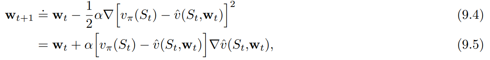

**활성 정책**으로부터 **상태가치 함수**를 추정하는 과정을 서술한다

* chap09 : 활성, 가치함수 근사
* chap10 : 활성, 최적정책 근사
* chap11 : 비활성, 정책 근사 (어렵다고 함)
* chap12 : eligibility trace

후에는 다음 내용들이 서술된다.

전에는 상태함수가 표 형태로 표현되었으나 이제는 가중치 벡터 $\textbf{w}\in\mathbb{R}^{d}$ 파라미터화된 함수 형태를 갖는다

$\hat{v}(s, \textbf{w}) \approx v_{\pi}(s)$ : 가중치

$\textbf{w}$가 굵은 글씨인 이유는 단일 숫자가 아닌 여러 숫자로 이루어진 벡터이기 때문인 듯 하다.

일반적으로, $\hat{v}$는 다층 인공 신경망에 의해 계산된 함수이고, $\textbf{w}$는 모든 층의 연결된 가중치 벡터일 수도 있다.

일반적으로 가중치의 개수($\textbf{w}$의 차원)은 상태의 개수보다 훨씬 적다($d \ll \mid \mathcal{S} \mid$), 결과적으로 하나의 상태가 갱신되면 그 변화는 다른 상태의 가치에 영향을 준다. 이러한 **일반화**(generalization)가 학습을 강력하게도, 이해가 어렵게도 만든다.

아래 그림을 보면 하나의 갱신이 다른 상태 가치에 영향을 준다는 말이 감이 올 것이다.

{: width="80%" height="80%" class="align-center"}

# 가치 함수 근사

이책의 모든 예측 방법은 특정 상태에서의 가치를 그 상태에 대한 '보강된 가치' 또는 **갱신 목표**(update target)를 향해 이동시키기 위한 가치 함수 추정값의 갱신으로 설명된다.

$s \mapsto u$
* $s$ : 상태(갱신의 대상)
* $u$ : $s$의 가치 추정값이 도달해야 하는 갱신의 목표

**ex)**

* `Monte Carlo` : $S_t \mapsto G_t$
* `TD(0)` : $S_t \mapsto R_{t+1}+\gamma \hat{v}(S_{t+1}, \textbf{w}_t)$
* `n-step TD` : $S_t \mapsto G_{t:t+n}$
* `DP policy-evaluation` : $s \mapsto \mathbb{E}_{\pi} [R_{t+1} + \gamma \hat{v}(S_{t+1}, \textbf{w}_{t}) \vert S_{t} = s]$

입출력 예제를 모사하기 위해 이러한 방식으로 학습하는 기계학습 방법을 **지도학습**(supervised learning) 방법이라 하고, 출력이 $u$와 같은 숫자일 경우 이 과정은 **함수 근사**(function approximation)라고도 한다. 함수 근사 방법은 근사하려고 하는 함수의 바람직한 입출력 관계를 나타내는 예제가 주어진다는 것을 전제로 한다.

강화학습에서 중요한 점
* 학습자가 환경이나 환경의 모델과 상호작용하며 온라인으로 학습할 수 있는 능력
  * 점증적으로 획득되는 데이터로부터 효율적으로 학습할 수 있는 방법 필요
* 일반적으로 nonstationary 목표 함수를 다룰수 있는 함수 근사 방법을 필요로 한다.
  * ex) 정챍이 변하지 않았다 해도, 훈련 예제의 target value가 bootstrapping method(DP, TD)로 생성되었다고 하면 그것은 nonstationary이다.
  * Methods that cannot easily handle such nonstationarity are less suitable for reinforcement learning.

# The prediction objective

Tabular Case
* 학습된 가치 함수가 실제 가치 함수와 정확하게 같아질 수 있기 때문에(수렴한다는 뜻인 것 같다) 예측의 품질을 연속적으로 측정할 필요가 없다.
* 한 상태의 갱신이 다른 상태에 영향을 주지 않는다.

함수 근사
* 한 상태의 갱신이 다른 상태에 영향을 준다.
* 상태보다 가중치가 적다는 가정 하에 한 상태의 가치 추정값을 더 정확하게 만드는 것은 언제나 다른 상태를 덜 정확하게 만드는 것을 의미한다.

따라서 각 상태 $s$에 대해 가치 추정의 오차를 줄이는 노력을 얼마나 기울일 것인가를 나타내는 상태 분포 $\mu(s) \geq 0, \sum_a \mu(s)=1$을 명시해야 한다.

(노력의 정도는 0 이상이어야 하고 각 상태에 1을 분배한다)

상태 공간에 걸쳐 $\mu$를 할당함으로써 자연스러운 목적 함수를 얻는다

$\overline{VE}(\textbf{w}) \doteq \sum_{s \in \mathcal{S}} \mu(s) [v_{\pi}-\hat{v}(s,\textbf{w})]^2$

근사 가치가 실제 가치와 얼마나 차이를 갖는지에 대한 지표

대체로 $\mu(s)$ 는 상태 $s$에서 소비된 시간의 비율이 되도록 선택된다.

활성 정책 훈련의 경우 이것은 **활성 정책 분포**라고 불린다.
연속적인 문제에서 활성 정책 분포는 정책 $\pi$를 따르는 stationary 분포다.

$\overline{VE}$ 의 측면에서 global optimum을 찾으려고 하겠지만 복잡한 함수를 근사할 경우 local optimum으로 수렴하는 것을 찾으려고 할 수도 있다. 이는 global optimum을 보장하지 않지만 비선형 함수 근사에서 최선이고 충분한 경우가 꽤 있다.

많은 강화학습 문제에서 최적값 또는 근처의 제한되는 영역으로라도 값이 수렴한다는 것을 보장하지 못하며 어쩌면 $\overline{VE}$가 발산할 수도 있다.

# Stochastic-gradient and Semi-gradient Methods

**확률론적 경사도 강하**방법은 각 예제에 대해 오차를 가장 많이 감소시키는 방향으로 가중치 벡터를 조금씩 조정함으로써 관측된 예제의 오차를 최소화한다.

{: width="80%" height="80%"}

* $\alpha$ : 양의 시간 간격 파라미터

$\nabla f(\textbf{w}) \doteq (\frac{\partial f(\textbf{w})}{\partial w_1},\frac{\partial f(\textbf{w})}{\partial w_2},\cdots,\frac{\partial f(\textbf{w})}{\partial w_d})^T$

$\nabla f(\textbf{w})$ : 함수 $f(\textbf{w})$를 벡터의 성분에 대해 편미분한 열 벡터

**경사도 방향으로 작은 간격만을 취하는 이유**

모든 상태에 대해 오차가 0이 되는 가치 함수를 찾는 것이 아니라, 서로 다른 상태들 사이의 오차에 대해 균형을 맞추는 근사만을 추구하거나 기대한다.

---

$\textbf{w}_{t+1}=\textbf{w}_t - \alpha[U_t - \hat{v}(S_t, \textbf{w}_t)]\nabla \hat{v}(S_t,\textbf{w}_t)$

* $U_t$ : 실제 가치의 근삿값, $v_{\pi}(S_t)$를 $U_t$로 대체함으로써 $v_{\pi}(S_t)$를 근사한다

**몬테카를로**

목표인 $U_t \doteq G_t$는 그 정의상 $v_{\pi}(S_t)$의 편차 없는 추정값이 되므로 locally optimal approximation으로 수렴한다.(=locally optimal solution을 찾는 것이 보장)

{: width="80%" height="80%" class="align-center"}

**부트스트랩**

$v_{\pi}(S_t)$에 대한 부트스트랩 추정값이 목표 $U_t$로서 사용된다면 이와 동일한 보장(locally optimal approximation으로 수렴)을 받지 못한다.

`n-step returns` $G_{t:t+n}$이나 `DP target` $\sum_{a,s',r} \pi(a \mid S_t)p(s',r \mid S_t, a)[r + \gamma \hat{v}(s', \textbf{w}_t)]$ 는 모두 가중치 벡터 $\textbf{w}_t$의 영향을 받는데, 이것은 부트스트랩 목표가 편차를 갖게 되어 진정한 경사도 강하 방법을 형성하지 못할것을 암시함

한가지 관점은

{: width="80%" height="80%"}

의 핵심 단계가 $\textbf{w}_t$와는 독립적으로 존재하는 목표에 영향을 받는다고 보는 것이다

($\textbf{w}_t$가 바뀌면 bootstrapping에서 미래의 예측치인 target도 변하게 되는데 이는 현재 예측치와 독립적이지 않다.)

부트스트랩 방법은 가중치 벡터 $\textbf{w}_t$를 변경하는 것이 추정값에 미치는 효과를 고려하지만 target에 미치는 효과는 무시한다. 이 방법은 오직 경사도의 일부만을 포함하고 따라서 이 방법을 **준경사도 방법**(semi-gradient method)이라고 부른다.

준경사도 방법은 경사도 방법처럼 안정적으로 수렴하지는 않지만, 선형 근사 함수의 경우와 같은 중요한 경우에 있어서는 안정적으로 수렴한다.

일반적으로 빠른 학습을 가능하게 하는 장점이 있고 에피소드가 끝날때까지 기다릴 필요가 없다(bootstrapping의 장점)

{: width="80%" height="80%" class="align-center"}

**상태결집**(state aggregation)

상태가 너무 많을 경우 특정 범위의 상태를 묶어서 취급하는 방법이다.

https://stats.stackexchange.com/q/371956

위 설명에 의하면 에이전트에게는 다음 두가지 상태가 차이가 없기 때문이라고 한다.

* $s_1$에서 $s_k$를 단일 entity $x_1$로 표현하고 `value function` $v(x)$로 작업하여 상태 집계
* $v(s_1)$ ~ $v(s_k)$이 $v(s)$ 내에서 동일한 단일 테이블 룩업을 참조하도록 값 함수 내에서 집계합니다.

*[figure 9-1]*

{: width="80%" height="80%" class="align-center"}

1000개의 state에서 왼쪽은 -1 오른쪽은 +1의 reward를 받는다. 1000개의 state가 100개씩 10개의 묶음으로 나누어졌다. 계단 효과는 상태 결집의 일반적인 현상이다. 각 묶음 내에서는 근사적 가치가 상수로 고정되고, 다음 묶음으로 가면서 갑자기 변화한다. 이러한 근사적 가치는 

$\overline{VE}(\textbf{w}) \doteq \sum_{s \in \mathcal{S}} \mu(s) [v_{\pi}-\hat{v}(s,\textbf{w})]^2$

의 전역 최솟값과 가까운 값이다.

그림 아래 상태 분포 $\mu$ =소비된 시간의 비율

가장 왼쪽과 오른쪽의 영역에서 $\mu$에 의해 결정되는 가중치의 비대칭성이 가장 크기 때문에 왼쪽에서는 가중치 없는 평균(True value)보다 큰 값, 오른쪽에서는 더 작은값으로 이동한다.

내 생각 : 다른 지역과 달리 극단은 상태별로 종단 확률이 다른데 1~100은 1이 종단 확률이 50%이며 100으로 갈수록 작아진다. 그러므로 모든 상태가 50%의 확률로 온전히 -1에서 종단되는 것이 아니므로 True Value보다 좀더 크다. 반대로 생각하면 오른쪽도 될 것이다.

# Linear Methods

선형 방법은 $\textbf{w}$와 $\textbf{x}(s)$를 내적함으로써 상태 가치 함수를 근사한다.

$\hat{v}(s, \textbf{w}) \doteq \textbf{w}^{T}\textbf{x}(s) \doteq \sum_{i=1}^{d}w_{i}x_{i}(s)$

* $\textbf{x}(s)$ : 상태 $s$를 나타내는 feature vector
* $\textbf{x}(s)$의 각 성분 $x_{i}(s)$ : 함수 $x_i : \mathcal{S} \rightarrow \mathbb{R}$의 가치

이러한 함수들 중 한 함수의 **feature**는 그 함수의 전부를 나타내는 것으로 간주할 것이고 어떤 상태에 대한 함수의 가치를 **feature of s**라고 부를 것이다.

SGD 갱신에서 $\textbf{w}$에 대한 근사 가치 함수의 경사도는 다음과 같다.

$\nabla \hat{v}(s, \textbf{w}) = \textbf{x}(s)$

($\hat{v}(s, \textbf{w}) \doteq \textbf{w}^{T}\textbf{x}(s)$에서 $\hat{v}$는 $\textbf{w}$와 $\textbf{x}$의 선형결합이므로 $\textbf{w}$만 떼면 된다.)

따라서 SGD갱신이 다음과 같이 간소화된다.

$\textbf{w}_{t+1}=\textbf{w}_t - \alpha[U_t - \hat{v}(S_t, \textbf{w}_t)]\nabla \hat{v}(S_t,\textbf{w}_t)$

에서

$\textbf{w}_{t+1}=\textbf{w}_t - \alpha[U_t - \hat{v}(S_t, \textbf{w}_t)] \textbf{x}(s)$

로 간소화된다.

선형함수의 경우
* 오직 하나의 최적값만 존재한다.
* **지엽적 최적값 또는 그 근처로 수렴하는 것이 보장된 모든 방법은 전역 최적값 또는 그 근처로 수렴하는 것을 자동으로 보장한다.**
* 앞서 소개했던 `경사도 몬테카를로 알고리즘` 또한 $\alpha$가 보통의 조건에 따라 감소한다면 선형 함수 근사하에서 $\overline{VE}$의 전역 최적값으로 수렴한다.

준경사도 TD(0) 알고리즘 역시 선형 함수 근사하에어 수렴하지만 SGD에 대한 일반적인 결과로부터 귀결되는 것은 아니고 별도의 이론이 필요하다. 가중치 벡터가 수렴했어도 그 값은 전역 최적값이 아니고 지엽적 최적값 근처에 있는 어떤 값이다.

**증명**

책 248~250페이지

{: width="80%" height="80%" class="align-center"}

**왼쪽 그림**은 상태 결집을 활용한 준경사도 TD(0) 알고리즘에 의해 학습된 최종 가치 함수이다. 거의 점근적으로 수렴한 TD 근사가 *[figure 9-1]* 의 몬테카를로 근사보다 실제 가치로부터 더 멀리 떨어져 있다.

하지만 학습 속도 면에서 잠재적인 장점이 많으며 몬테카를로 방법을 일반화한다.

**오른쪽 그림**은 상태 결집을 활용한 n단계 방법의 성능이 표 형태의 표현을 활용했을 때의 성능과 놀라울 정도로 유사하다는 것을 보여준다.

19개의 상태를 가진 RW환경과 1000개의 상태를 가진 RW에서 상태결집을 활용해 50 X 20으로 묶어 20개의 상태를 갖게 한다면 표 기반 문제였던 전자와 정량적으로 가까워진다는 것이다.

{: width="80%" height="80%" class="align-center"}

# Feature Construction for Linear Methods

선형 방법의 장점

* 수렴성 보장
* 계산의 효율성

선형 방법의 한계
* 특징들 사이의 상호작용을 전혀 고려할 수 없다.
  * [막대 균형 문제] 각도가 큰 상황에서 큰 각속도는 위험한 상태이며 작은 각도에서는 복원되는 상태를 의미한다. 
  * 선형 가치 함수의 feature가 각도와 각속도에 대해 별도로 코딩되어 있다면 선형 가치 함수는 이러한 상태를 표현할 수 없다. 이 경우 두 가지 상태의 차원을 결합한 것에 대한 특징이 필요하다

## Polynomials

작 작동하지는 않지만 가장 간단하다.

---

각각의 상태 $s$가 $k$개의 숫자 $s_1, s_2, ...s_k$에 대응된다고 가정하자. 이때 $s_i \in \mathbb{R}$ 이다 이러한 $k$차원 상태 공간에 대해 $n$차 다항식을 기저로 하는 각각의 특지어 $x_i$는 다음과 같이 표현된다

$x_i(s)=\prod_{j=1}^{k}s_{j}^{c_{i,j}}=s_{1}^{c_{i,1}} s_{2}^{c_{i,2}} \cdots s_{k}^{c_{i,k}}$

$c_{i,j}$ : 0 이상의 정수 $n$에 대해 집합 $\{0, 1, ..., n\}$의 원소다. 이러한 특징들은 $k$차원에 대한 $n$차 다항식의 기저를 형성하고, 이 기저로 $(n+1)^k$개의 각기 다른 특징을 나타낼 수 있다.

---

높은 차수의 다항식 기저는 더 복잡한 함수에 대한 근사를 가능하게 한다. 하지만 $n$차 다항식 기저로 나타낼 수 있는 특징의 개수는 $(n>0)$이라면 정상적인 상태 공간의 차원 수 $k$에 따라 기하급수적으로 증가하기 때문에, 그 많은 특징 중 함수 근사를 위한 특징을 선택하는 일반적인 과정이 필요하다. 

> 출처
 - Richard S. Sutton,『단단한 강화학습』, 김성우, 제이펍(2020)
 - https://en.wikipedia.org/wiki/Artificial_neural_network#/media/File:Two_layer_ann.svg