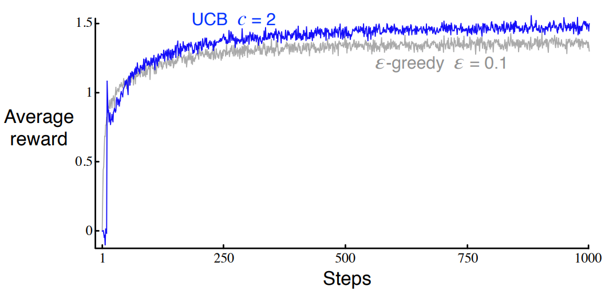
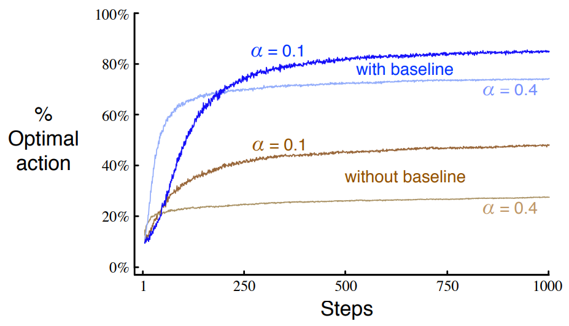
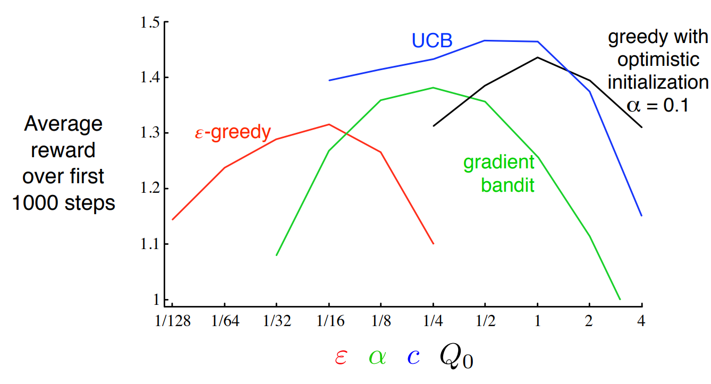

https://github.com/ShangtongZhang/reinforcement-learning-an-introduction/blob/master/chapter02/ten_armed_testbed.py

[단단한 강화학습](http://www.kyobobook.co.kr/product/detailViewKor.laf?ejkGb=KOR&mallGb=KOR&barcode=9791190665179&orderClick=LAG&Kc=) 책의 코드를 공부하기 위해 쓰여진 글이다.

# **`figure 2.1`**


{: width="80%" height="80%" class="align-center"}

```python
def figure_2_1():
    plt.violinplot(dataset=np.random.randn(200, 10) + np.random.randn(10))
    plt.xlabel("Action")
    plt.ylabel("Reward distribution")
    plt.savefig('./images/figure_2_1.png')
    plt.close()
```
**`numpy.random.randn`: Return a sample (or samples) from the “standard normal” distribution.**


`(1)`

`dataset=np.random.randn(200, 10) + np.random.randn(10)` : (200, 10) 크기의 표준 정규분포에 각 행마다 10개의 요소가 있을텐데 뒤의 (1, 10) 크기의 표준 정규분포를 각각 더한다, 뒤의 `+np.random.randn(10)`은 평행이동 역할을 한다. 해당 코드를 빼면 아래와 같은 모양이 나온다.

{: width="80%" height="80%" class="align-center"}

본 그림과 비교해보면 평균이 0에 더 가까운 것을 볼 수 있다.

**`violinplot` : Make a violin plot for each column of dataset or each vector in sequence dataset.**

각각의 column별로 값들을 plot한다

# **`Bandit`**

```python
class Bandit:
    # @k_arm: # of arms
    # @epsilon: probability for exploration in epsilon-greedy algorithm
    # @initial: initial estimation for each action
    # @step_size: constant step size for updating estimations
    # @sample_averages: if True, use sample averages to update estimations instead of constant step size
    # @UCB_param: if not None, use UCB algorithm to select action
    # @gradient: if True, use gradient based bandit algorithm
    # @gradient_baseline: if True, use average reward as baseline for gradient based bandit algorithm
    def __init__(self, k_arm=10, epsilon=0., initial=0., step_size=0.1, sample_averages=False, UCB_param=None,
                 gradient=False, gradient_baseline=False, true_reward=0.):
        self.k = k_arm
        self.step_size = step_size
        self.sample_averages = sample_averages
        self.indices = np.arange(self.k)
        self.time = 0
        self.UCB_param = UCB_param
        self.gradient = gradient
        self.gradient_baseline = gradient_baseline
        self.average_reward = 0
        self.true_reward = true_reward
        self.epsilon = epsilon
        self.initial = initial

    def reset(self):
        # real reward for each action
        self.q_true = np.random.randn(self.k) + self.true_reward
        # estimation for each action
        self.q_estimation = np.zeros(self.k) + self.initial
        # # of chosen times for each action
        self.action_count = np.zeros(self.k)
        self.best_action = np.argmax(self.q_true)
        self.time = 0

    # get an action for this bandit
    def act(self):
        if np.random.rand() < self.epsilon:
            return np.random.choice(self.indices)

        if self.UCB_param is not None:
            UCB_estimation = self.q_estimation + \
                self.UCB_param * np.sqrt(np.log(self.time + 1) / (self.action_count + 1e-5))
            q_best = np.max(UCB_estimation)
            return np.random.choice(np.where(UCB_estimation == q_best)[0])

        if self.gradient:
            exp_est = np.exp(self.q_estimation)
            self.action_prob = exp_est / np.sum(exp_est)
            return np.random.choice(self.indices, p=self.action_prob)

        q_best = np.max(self.q_estimation)
        return np.random.choice(np.where(self.q_estimation == q_best)[0])

    # take an action, update estimation for this action
    def step(self, action):
        # generate the reward under N(real reward, 1)
        reward = np.random.randn() + self.q_true[action]
        self.time += 1
        self.action_count[action] += 1
        self.average_reward += (reward - self.average_reward) / self.time

        if self.sample_averages:
            # update estimation using sample averages
            self.q_estimation[action] += (reward - self.q_estimation[action]) / self.action_count[action]
        elif self.gradient:
            one_hot = np.zeros(self.k)
            one_hot[action] = 1
            if self.gradient_baseline:
                baseline = self.average_reward
            else:
                baseline = 0
            self.q_estimation += self.step_size * (reward - baseline) * (one_hot - self.action_prob)
        else:
            # update estimation with constant step size
            self.q_estimation[action] += self.step_size * (reward - self.q_estimation[action])
        return reward
```

* `(14)` : `self.sample_averages` : `True`일 경우  $Q(A) \leftarrow Q(A) + \frac{1}{N(A)}[R-Q(A)]$로 갱신
* `(15)` : `self.indices` : `arm`의 개수 배열, `k=10`이면 `[0, 1, 2, ..., 9]`
* `(17)` : `self.UCB_param` : UCB 공식 $Q_t(a)+c\sqrt{\frac{\ln t}{N_t(a)}}$ 에서 $c$를 의미한다.
* `(27)` : 실제 $Q$ 값을 정의한다.
* `(32)` : 실제 $Q$ 값 (`q_true`) 값을 토대로 `best_action`을 정한다.
* `(37~38)` : `epsilon`의 확률로 `self.indices`중 하나를 무작위 선택 (=arm 중 하나를 무작위로 선택)
* `(40~44)` :
$$A_t \doteq \underset{a}{\text{argmax}} \left [ Q_t(a) + c \sqrt{\frac{\ln t}{N_t(a)}} \right ] \tag{2.10}$$
연산을 수행한다.

여기서는 연산의 편의를 위해 분자에 1, 분모에 작은 수를 더하여

$$A_t \doteq \underset{a}{\text{argmax}} \left [ Q_t(a) + c \sqrt{\frac{\ln t + 1}{N_t(a) + \epsilon}} \right ]$$

로 계산하게 된다.

동일 값이 있을 경우 동일 값 중에서 랜덤으로 선택하기 위하여 `q_best`를 통해 최댓값을 구한 후 `np.where`을 통해 해당 인덱스를 추출한다. 그리고 `np.random.choice`를 통해 해당 인덱스 중 동일확률로 하나를 추출하여 리턴한다.

여기서 헷갈리면 안되는게 UCB는 $Q$를 통한 보조 수단일 뿐이지 Q의 갱신에는 직접적으로 관련이 없다.

* `(46~49)` : Gradient Bandit Algorithms를 위한 코드이다 `exp_est`는 각 $Q$를 $e$의 지수승으로 만든다. 그리고 각각을 `np.sum(exp_est)`으로 나누어서 `action_prob`을 구하고(행동 선택 확률) 그 확률을 기반으로 `arm`중에 하나를 선택한다.

`np.random.choice`의 `p`를 인자로 주면 해당 값들의 상대적인 확률로 리스트에서 뽑는다.

$$\text{Pr}\{A_t=a\}\doteq \frac{e^{H_t(a)}}{\sum_{b=1}^{k}e^{H_t(b)}} \doteq \pi_t(a) \tag{2.11}$$

* `(51)` : `self.q_estimation`중 제일 큰 값을 선택하여 `q_best`에 저장
* `(52)` : `np.where`은 각 차원별로 같은 index를 `tuple`로 반환하는데, 여기는 1행이므로 첫번째 차원만 선택하면 된다. 그러면 `q_best`값과 같은 값을 가진 인덱스 중 하나를 `np.random`으로 무작위로 하나 선택한다. (=`q_best`에 저장된 값과 같은 값을 가지는 arm 중 하나를 무작위로 선택한다.)

* `(52)*`

```python
>>> test = np.array([[1, 2, 3, 3, 3, 6, 7], [2, 3, 4, 4, 4, 6, 7]])
>>> np.where(test == 3)
(array([0, 0, 0, 1], dtype=int64), array([2, 3, 4, 1], dtype=int64))
>>> type(np.where(test == 3))
<class 'tuple'>
```
(0,2), (0,3), (0,4), (1,1)이 해당된다는 뜻이다.

* `(57)` : 해당 `action`의 `q_true`에서 noise가 섞인 `reward`를 설정한다.
* `(60)` : $R_{avg} \leftarrow R_{avg} + \frac{1}{N}(R_n - R_{avg})$, 실제 `reward`의 평균을 점근적으로 계산한다.
* `(65~72)` :

$$
H_{t+1}(A_t) \doteq H_t(A_t) + \alpha(R_t-\bar{R}_t)(1-\pi_t(A_t)), \quad \text{and} \\
H_{t+1}(a) \doteq H_t(A_t) - \alpha(R_t-\bar{R}_t)\pi_t(a), \quad \text{for all} \; a \neq A_t
\tag{2.12}
$$

의 식을 구현한 것이다.

코드를 이해하기 위해서는 두번째 줄의 마이너스를 $\pi_t(a)$쪽으로 옮겨서

$$
H_{t+1}(A_t) \doteq H_t(A_t) + \alpha(R_t-\bar{R}_t)(1-\pi_t(A_t)), \quad \text{and} \\
H_{t+1}(a) \doteq H_t(A_t) + \alpha(R_t-\bar{R}_t)(0-\pi_t(a)), \quad \text{for all} \; a \neq A_t
$$

로 생각하면 이해가 될 것이다. `one_hot` 배열을 통해 `action` 에만 1을 할당한다. `gradient_baseline`이 `True`이면 `baseline`($\bar{R}_t$)에 지금까지 `reward`의 평균인 `average_reward`를 대입한다. 그 뒤에 한 줄로 (`one_hot`이 실제 `action`을 구분하고 나머지는 똑같다) 실제 `action`과 나머지 연산을 수행한다.

해당식은 $(R_t-\bar{R_t})$ 부분과 $(\text{one\_hot}-\pi_t)$를 부호에 따라 분리하면 생각하기 편하다

* 실제 행동 $(\text{one\_hot}-\pi_t) > 0$
  * 평균보다 `reward` 높다 $(R_t-\bar{R_t}) > 0$
    * $\text{update} > 0$ : 평균보다 높은 것을 하길 잘했으니 $Q$를 높인다.
  * 평균보다 `reward` 낮다 $(R_t-\bar{R_t}) < 0$
    * $\text{update} < 0$ : 평균보다 낮은 것을 하면 안됐으니 $Q$를 낮춘다.
* 안한 행동 $(\text{one\_hot}-\pi_t) < 0$
  * 평균보다 `reward` 높다 $(R_t-\bar{R_t}) > 0$
    * $\text{update} < 0$ : 평균보다 높은 것을 해야했다 $Q$를 낮춘다.
  * 평균보다 `reward` 낮다 $(R_t-\bar{R_t}) < 0$
    * $\text{update} > 0$ : 평균보다 낮은 것을 안하길 잘했으니 $Q$를 높인다.


* `(75)` : $Q(A) \leftarrow Q(A) + \alpha(R_n - Q(A))$ 여기서 *(default)* : `step_size=0.1`
* `(76)` : 해당 `step`이후 얻은 `reward`를 반환한다.


# `simulate`

```python
def simulate(runs, time, bandits):
    rewards = np.zeros((len(bandits), runs, time))
    best_action_counts = np.zeros(rewards.shape)
    for i, bandit in enumerate(bandits):
        for r in trange(runs):
            bandit.reset()
            for t in range(time):
                action = bandit.act()
                reward = bandit.step(action)
                rewards[i, r, t] = reward
                if action == bandit.best_action:
                    best_action_counts[i, r, t] = 1
    mean_best_action_counts = best_action_counts.mean(axis=1)
    mean_rewards = rewards.mean(axis=1)
    return mean_best_action_counts, mean_rewards
```

* `(2~3)` : (`figure 2.2`) : (3, 2000, 1000) `np.zeros` 생성
* `(4)` : 각 `Bandit`마다
* `(5~7)` : `r` : 2000번마다 bandit을 `reset`, `t` : 1000번
* `(8)` : `bandit`의 현재 환경에서 `action` 선택(`act()`)
* `(9)` : `(8)`에서 선택된 `action`을 `step`한다
* `(10)` : `rewards` (3, 2000, 1000) 에 저장한다. rewards[bandit의 종류, run, time]
* `(11~12)` : `action`이 `best_action`일 경우 `best_action_counts`에 1을 저장한다, `i` 의 `bandit`에서 `r`번째 `runs`에서 `t`번째 `time`에서 best action을 했다는 뜻
* `(13~14)` :

**`numpy.mean` : Compute the arithmetic mean along the specified axis.**

해당 `axis`의 방향으로 `mean`을 구한다. 이 예제의 경우 (3, 2000, 1000)인데 `axis=1`의 방향으로 구하므로 해당 차원은 없어지게 된다. 결과적으로 (3, 1000)의 차원을 가지게 된다. 쉽게 풀어서 설명하면 3개의 `bandit`을 `runs=2000`번 돌려서 각 `run`은 `time=1000`번 진행하게 된다. 근데 나는 `bandit`과 `time`별로 결과를 평균하여 알고 싶으므로 `run`을 기준으로 `mean`연산을 하는 것이다.

{: width="50%" height="50%"}

`np.sum`과 연산원리는 같다. 그림을 보면 이해가 도움이 될 것이다.

# **`figure 2.2`**

{: width="80%" height="80%" class="align-center"}

```python
def figure_2_2(runs=2000, time=1000):
    epsilons = [0, 0.1, 0.01]
    bandits = [Bandit(epsilon=eps, sample_averages=True) for eps in epsilons]
    best_action_counts, rewards = simulate(runs, time, bandits)

    plt.figure(figsize=(10, 20))

    plt.subplot(2, 1, 1)
    for eps, rewards in zip(epsilons, rewards):
        plt.plot(rewards, label='$\epsilon = %.02f$' % (eps))
    plt.xlabel('steps')
    plt.ylabel('average reward')
    plt.legend()

    plt.subplot(2, 1, 2)
    for eps, counts in zip(epsilons, best_action_counts):
        plt.plot(counts, label='$\epsilon = %.02f$' % (eps))
    plt.xlabel('steps')
    plt.ylabel('% optimal action')
    plt.legend()

    plt.savefig('./images/figure_2_2.png')
    plt.close()
```

* `(3)` : `sample_averages=True`인 `Bandit` 클래스를 `epsilon` 별로 생성한다.
* `(4)` : `simulate`의 결과를 받는다, `shape=(3, 1000)`
* `(8~13)` : `bandit` 별로 산출된 `step`값이 plot된다, 각 `step`값은 `runs=2000`개의 평균이다.
* `(15~20)` : `bandit` 별로 산출된 best_action을 할 확률이며 나머지 내용은(8~13)`과 같다.

# **`figure 2.3`**

{: width="80%" height="80%" class="align-center"}

```python
def figure_2_3(runs=2000, time=1000):
    bandits = []
    bandits.append(Bandit(epsilon=0, initial=5, step_size=0.1))
    bandits.append(Bandit(epsilon=0.1, initial=0, step_size=0.1))
    best_action_counts, _ = simulate(runs, time, bandits)

    plt.plot(best_action_counts[0], label='$\epsilon = 0, q = 5$')
    plt.plot(best_action_counts[1], label='$\epsilon = 0.1, q = 0$')
    plt.xlabel('Steps')
    plt.ylabel('% optimal action')
    plt.legend()

    plt.savefig('../images/figure_2_3.png')
    plt.close()
```

* `(3)` : `epsilon=0`이고 (greedy), 초기값인 `initial=5`로 하는 Bandit클래스를 생성하고 `bandits`에 `append`한다
* `(4)` : `epsilon=0.1`이고 ($\epsilon$-greedy) 초기값을 `initial=0`으로 하는 Bandit클래스를 생성하고 `bandits` 리스트에 `append`한다

# **`figure 2.4`**
{: width="80%" height="80%" class="align-center"}

```python
def figure_2_4(runs=2000, time=1000):
    bandits = []
    bandits.append(Bandit(epsilon=0, UCB_param=2, sample_averages=True))
    bandits.append(Bandit(epsilon=0.1, sample_averages=True))
    _, average_rewards = simulate(runs, time, bandits)

    plt.plot(average_rewards[0], label='UCB $c = 2$')
    plt.plot(average_rewards[1], label='epsilon greedy $\epsilon = 0.1$')
    plt.xlabel('Steps')
    plt.ylabel('Average reward')
    plt.legend()

    plt.savefig('../images/figure_2_4.png')
    plt.close()
```
# **`figure 2.5`**

{: width="80%" height="80%" class="align-center"}

```python
def figure_2_5(runs=2000, time=1000):
    bandits = []
    bandits.append(Bandit(gradient=True, step_size=0.1, gradient_baseline=True, true_reward=4))
    bandits.append(Bandit(gradient=True, step_size=0.1, gradient_baseline=False, true_reward=4))
    bandits.append(Bandit(gradient=True, step_size=0.4, gradient_baseline=True, true_reward=4))
    bandits.append(Bandit(gradient=True, step_size=0.4, gradient_baseline=False, true_reward=4))
    best_action_counts, _ = simulate(runs, time, bandits)
    labels = [r'$\alpha = 0.1$, with baseline',
              r'$\alpha = 0.1$, without baseline',
              r'$\alpha = 0.4$, with baseline',
              r'$\alpha = 0.4$, without baseline']

    for i in range(len(bandits)):
        plt.plot(best_action_counts[i], label=labels[i])
    plt.xlabel('Steps')
    plt.ylabel('% Optimal action')
    plt.legend()

    plt.savefig('../images/figure_2_5.png')
    plt.close()
```
# **`figure 2.6`**

{: width="80%" height="80%" class="align-center"}

```python
def figure_2_6(runs=2000, time=1000):
    labels = ['epsilon-greedy', 'gradient bandit',
              'UCB', 'optimistic initialization']
    generators = [lambda epsilon: Bandit(epsilon=epsilon, sample_averages=True),
                  lambda alpha: Bandit(gradient=True, step_size=alpha, gradient_baseline=True),
                  lambda coef: Bandit(epsilon=0, UCB_param=coef, sample_averages=True),
                  lambda initial: Bandit(epsilon=0, initial=initial, step_size=0.1)]
    parameters = [np.arange(-7, -1, dtype=np.float),
                  np.arange(-5, 2, dtype=np.float),
                  np.arange(-4, 3, dtype=np.float),
                  np.arange(-2, 3, dtype=np.float)]

    bandits = []
    for generator, parameter in zip(generators, parameters):
        for param in parameter:
            bandits.append(generator(pow(2, param)))

    _, average_rewards = simulate(runs, time, bandits)
    rewards = np.mean(average_rewards, axis=1)

    i = 0
    for label, parameter in zip(labels, parameters):
        l = len(parameter)
        plt.plot(parameter, rewards[i:i+l], label=label)
        i += l
    plt.xlabel('Parameter($2^x$)')
    plt.ylabel('Average reward')
    plt.legend()

    plt.savefig('../images/figure_2_6.png')
    plt.close()
```

* `(4~7)` : 인자를 받아 해당 인자를 `Bandit`클래스의 하이퍼파라미터에 대입하여 해당 `Bandit`클래스를 리턴하는 람다 함수이다
* `(8~11)` : 각각의 `np.arange`는 $[a,b)$의 범위를 가지며 이후 2의 지수로 들어가게 된다
* `(14~16)` : 각 index에 대응하는(n번째는 n번째끼리) `generator`과 `parameters`를 얻고 `parameters`를 풀어헤치면 `param`이 나오는데 그 `param`을 대응하는 `generator`에 2의 지수승을 하여 넣어서 해당 `Bandit` 클래스를 얻고 그것을 `bandits` 리스트에 넣는다.

그림에서 UCB를 예로 들면 UCB는 $[-4,3)$ `parameters`를 가지고 그것은 2의 지수승이 되면서 $[1/16, 8)$ 의 범위를 갖는데 이것은 그래프와 맞다.
