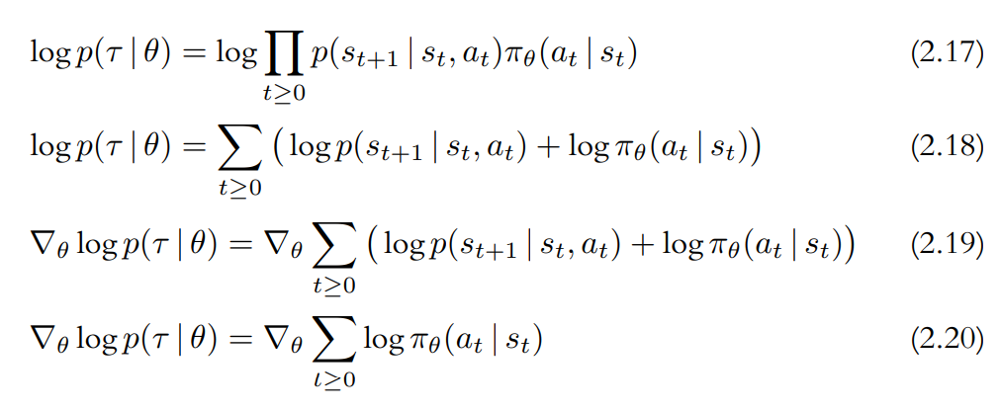
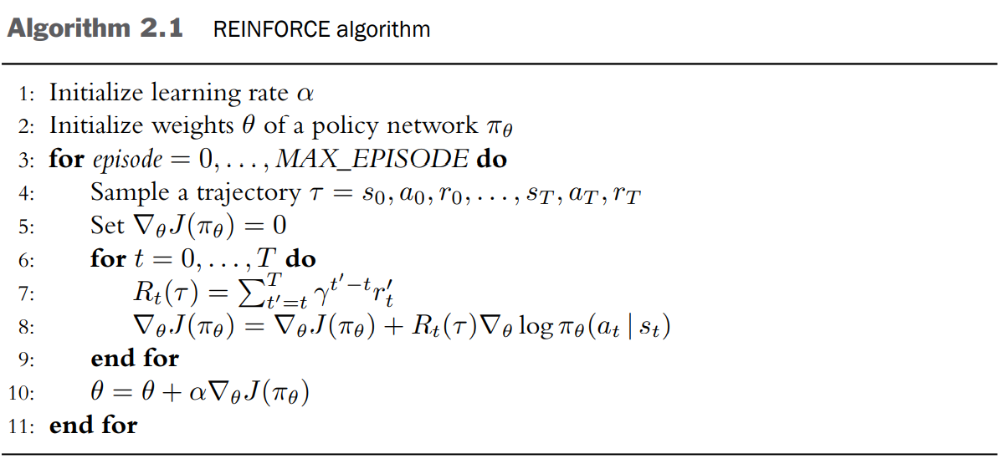

좋은 결과를 초래한 행동이 더 높은 확률로 선택되도록 에이전트를 학습시켜야 한다. 행동 확률이 **정책 경사**(policy gradient)를 따라 변하기 때문에 `REINFORCE`는 **정책 경사 알고리즘**으로 알려져 있다.

이 알고리즘은 세 가지 필수 요소를 갖는다.

1. 파라미터로 표현된 정책
2. 최대한 달성하고자 하는 목적
3. 정책 파라미터를 업데이트 하는 방법

---

학습 가능한 파라미터 $\theta$로 구성된 심층 신경망을 이용하여 정책을 표현

$$
\pi_\theta
$$


궤적의 이득 $R_t(\tau)$는 시간 단계 $t$로부터 궤적이 끝날 때까지 보상의 할인값을 더한 것으로 정의

$$
R_t(\tau)=\sum_{t'=t}^{T}\gamma^{t'-t}r_{t'}
$$

* $\tau = (s_0, a_0, r_0), ..., (s_T, a_T, r_T)$
  * 상태, 행동, 그리고 보상의 나열
  * `trajectory`의 t

**목적**($J(\pi_{\theta})$, objective)은 에이전트가 생성하는 모든 완전한 궤적에 대한 이득의 기댓값으로 정의

$$ J(\pi_{\theta})=\mathbb{E}_{\tau \sim \pi_{\theta}}[R(\tau)]=\mathbb{E}_{\tau \sim \pi_{\theta}} \left [ \sum_{t=0}^{T}\gamma^{t}r_{t} \right ] $$

정책 경사 알고리즘은 다음과 같은 문제를 해결한다

$$ \underset{\theta}{\max}J(\pi_{\theta})=\underset{\theta}{\max}\mathbb{E}_{\tau \sim \pi_{\theta}} \left [ R(\tau) \right ] $$

목적을 향상하기 위해 **경사**를 계산하고 그것을 이용해 아래 식과 같이 파라미터를 업데이트 한다

$$ \theta \leftarrow \theta + \alpha \nabla_{\theta}J(\pi_\theta) $$

* $\alpha$ : 학습률을 나타내는 스칼라값

정책경사 $\nabla_{\theta}J(\pi_\theta)$는 다음과 같이 정의된다. 아래 식은 행동 $a_t$가 발생할 로그확률의 경사와 그에 해당하는 이득 $R_t(\tau)$을 곱한 후 이를 모두 더한 값의 기댓값이 목적의 경사와 동일하다는 사실을 말해 준다.

$$ \nabla_{\theta}J(\pi_\theta)=\mathbb{E}_{\tau \sim \pi_{\theta}} \left [ \sum_{t=0}^{T} R_t(\tau) \nabla_{\theta} \log \pi_{\theta} (a_t \mid s_t)\right ] $$

* $\pi_{\theta} (a_t \mid s_t)$ : 에이전트가 시간 단계 $t$에서 취하는 행동의 확률

# 정책 경사 계산

$$ \nabla J (\pi_{\theta})=\nabla_{\theta}\mathbb{E}_{\tau \sim \pi_{\theta}}\left [ R(\tau)\right ] \tag{2.6}$$

위 식에는 $R(\tau)=\sum_{t=0}^{T}\gamma^{t}r_{t}$를 $\theta$에 대해 미분할 수 없다는 문제가 있다. 따라서 미분 가능한 형태로 변환하여 기댓값의 경사를 다음과 같이 표현할 수 있다.

{: width="80%" height="80%" class="align-center"}

**errata**

*(chain-rule)* → *(product-rule)*

* $f(x)$ : 함수
* $p(x \mid \theta)$ : 파라미터로 표현되는 확률분포
* $\mathbb{E}_{x \sim p(x \mid \theta)}[f(x)]$ : $f(x)$의 기댓값

위 항등식은 기댓값의 경사가 원래 함수에 로그 확률을 곱한 값의 경사에 대한 기댓값과 동일하다는 것을 말해 준다.

목적에 적용하기 위해 $x=\tau$, $f(x)=R(\tau)$, $p(x \mid \theta) = p(\tau \mid \theta)$ 를 대입하면

$$\nabla_{\theta}\mathbb{E}_{x \sim p(x \mid \theta)} \left [ f(x) \right ] = \mathbb{E} \left [ f(x) \nabla_{\theta} \log p(x \mid \theta) \right ]$$

는

$$\nabla_{\theta}J(\pi_{\theta}) = \mathbb{E}_{\tau \sim \pi_{\theta}}[R(\tau) \nabla_{\theta} \log p(\tau \mid \theta)] \tag{2.15}$$

로 표현될 수 있다.

`Equation 2.15`의 $p(\tau \mid \theta)$는 통제 가능한 정책 $\pi_{\theta}$와 연관될 필요가 있다 따라서 한층 더 확장될 필요가 있다.

궤적 $\tau$는 단지 $a_t$와 $s_{t+1}$이 번갈아 나타나는 나열일 뿐이라는 점을 주목해야 하는데 이때 $a_t$는 에이전트의 행동 확률 $\pi_{\theta}(a_t \mid s_t)$에서 추출되고 $s_{t+1}$은 환경의 전이 확률 $p(s_{t+1} \mid s_t, a_t)$에서 추출된다. 모든 확률은 서로 독립이기 때문에 전체 궤적의 확률은 개별 확률들의 곱으로 `Equation 2.16`과 같이 표현된다.

$$ p(\tau \mid \theta)=\prod_{t \ge 0}p(s_{t+1} \mid s_t, a_t)\pi_\theta(a_t \mid s_t) \tag{2.16}$$

로그 표현에 맞추기 위해 양변에 로그를 취하면 다음과 같이 표현된다.

{: width="80%" height="80%" class="align-center"}

좌변의 궤적 $\tau$는 우변에서 개별 시간 단계에 대해 합산한 것과 일치한다.

이 결과를 이용해서, `Equation 2.6`에서 시작된 $\nabla_\theta J(\pi_\theta)$를 미분 가능한 형태로 다시 표현할 수 있게 됐다.

$$\nabla_\theta \log p(\tau \mid \theta) = \nabla_\theta \sum_{t \ge 0}\log\pi_\theta(a_t \mid s_t) \tag{2.20}$$

을

$$\nabla_{\theta}J(\pi_{\theta}) = \mathbb{E}_{\tau \sim \pi_{\theta}}[R(\tau) \nabla_{\theta} \log p(\tau \mid \theta)] \tag{2.15}$$

에 대입하고 $R(\tau)$를 합의 기호 안쪽에 표현하면 다음 식을 얻게 된다.

$$\nabla_\theta J(\pi_\theta) = \mathbb{E}_{\tau \sim \pi_\theta}\left [\sum_{t=0}^{T} R(\tau) \nabla_{\theta} \log \pi_\theta(a_t \mid s_t)\right ] \tag{2.21}$$

이 식은 궤적에 따라 발생 가능한 많은 행동으로 인해 큰 분산을 갖는다. 시각 $t$에서 발생한 사건은 오직 미래에만 영향을 미치기 때문에 임의의 시각 $t$에서의 보상만을 고려하면 분산을 줄일 수 있다. 따라서 $R(\tau)$를 다음과 같이 수정하면 `Equation 2.21`을 얻는다.

$$R(\tau)=R_0(\tau)=\sum_{t'=0}^{T}\gamma^{t'}r_{t'} \rightarrow \sum_{t'=t}^{T}\gamma^{t'-t}r_{t'}=R_t(\tau)$$

---

$$ \nabla J (\pi_{\theta})=\nabla_{\theta}\mathbb{E}_{\tau \sim \pi_{\theta}}\left [ R(\tau)\right ] \tag{2.6}$$

은 미분 불가능한 형태의 함수를 포함한다는 것이 문제였다. 일련의 변화를 거친 후에

$$\nabla_\theta \log p(\tau \mid \theta) = \nabla_\theta \sum_{t \ge 0}\log\pi_\theta(a_t \mid s_t) \tag{2.20}$$

을 도출하게 됐다. `Equation 2.20`의 관계는 정책망 $\pi_\theta$를 이용하여 매우 쉽게 추정해 볼 수 있다. 이 과정에서의 경사 계산은 신경망 라이브러리의 자동 미분 기능을 이용하여 수행할 수 있다.

# REINFORCE Algorithm

{: width="80%" height="80%" class="align-center"}

**errata**

$R_t(\tau)=\sum_{t'=t}^{T}\gamma^{t'-t}{r'}_t$

↓↓↓

$R_t(\tau)=\sum_{t'=t}^{T}\gamma^{t'-t}r_{t'}$

`(7)~(8)` :

궤적 내의 시간 단계 $t$마다 이득 $R_t(\tau)$를 계산하고(7) $R_t(\tau)$를 이용해 정책 경사를 추정한다(8). 정책 경사가 과거의 어떤 정책 $\pi_{\theta'}$이 아닌 현재 정책 $\pi_{\theta}$에 의해 생성된 행동 확률 $\pi_\theta(a_t \mid s_t)$에 직접적으로 영향을 받기 때문에 이는 `on-policy` 알고리즘이다. 마찬가지로 $\tau \sim \pi_\theta$의 함수인 이득 $R_t(\tau)$ 또한 $\pi_\theta$로부터 생성 되어야 한다. 그렇지 않으면 행동 확률이 정책이 생성하지 않은 이득에 근거하여 조정될 것이다.

`REINFORCE`는 `on-policy` 알고리즘이기 때문에 궤적은 다시 사용할 수 없어 폐기해야 한다. (파라미터 업데이트 방정식이 현재의 정책에 따라 결정되면 알고리즘은 `on-policy` 알고리즘이 된다.)

# Improve REINFORCE

`Monte Carlo sampling`은 `return`이 궤적에 따라 크게 변할 수 있기 때문에 `policy gradient` 추정값은 큰 분산을 가질 수 있다. 이는 세 가지 요인에 기인한다.

1. 행동이 확률분포로부터 추출됐기 때문에 어느정도 무작위성을 갖는다.
2. 시작 상태가 에피소드마다 다를 수 있다.
3. 환경의 전이 함수가 확률론적 함수일 수 있다.

분산을 줄이기 위한 한 방법은 행동에 영향을 받지 않는 **적절한 기준값($b(s_t)$)을 이득에서 뺌**으로써 `return`을 조정한다

$$\nabla_\theta J(\pi_\theta) \approx \sum_{t=0}^{T}(R_t(\tau)-b(s_t))\nabla_\theta \log\pi_\theta(a_t \mid s_t) \tag{2.24}$$

**기준값으로 삼을 수 있는 것** 중에는 $V^\pi$가 있다. (Actor-Critic Algorithm)


**궤적에 대한 평균 이득을 기준값**으로 하는 것도 하나의 대안이다 즉 $b=\frac{1}{T}\sum_{t=0}^T R_t(\tau)$로 하는 것이다. 이 기준값은 궤적 안에서 상수고 상태 $s_t$에 따라 변하지 않는 값이다.

이렇게 하면 각 궤적마다 이득의 분포가 $0$을 중심으로 형성되게 만드는 효과가 있다. 궤적마다 평균적으로 가장 좋은 50%의 행동은 장려될 것이고 나머지는 억제될 것이다.

*예시) 모든 보상이 음의 값을 가질 경우*

매우 좋은 행동을 만들어내도 이득이 항상 음수이기 때문에 그 행동은 억제된다. 시간이 지나면 상대적으로 더 나쁜 행동이 더 억제되어서 더 좋은 행동의 확률을 간접적으로 증가시키나 이것은 확률이 한 방향으로만 조정되기 때문에 학습 속도가 느리다. 모든 보상이 양수인 환경에서는 그 반대일 것이다.

**행동 확률을 증가시키고 감소시키는 것이 모두 가능할 때 학습은 더 효율적으로 진행된다.** 따라서 양의 이득과 음의 이득이 모두 필요하다.

# 구현

## Foundations of Deep Reinforcement Learning


[Foundations of DRL, chap02](https://github.com/helpingstar/book_learning/blob/main/Foundations_of_Deep_Reinforcement_Learning/code_2_1.py)

```python
def train(pi, optimizer):
    # REINFORCE 알고리즘의 내부 경사 상승 루프
    T = len(pi.rewards)
    rets = np.empty(T, dtype=np.float32)  # 이득
    future_ret = 0
    # 이득을 효율적으로 계산
    for t in reversed(range(T)):
        future_ret = pi.rewards[t] + gamma*future_ret
        rets[t] = future_ret
    rets = torch.tensor(rets)
    log_probs = torch.stack(pi.log_probs)
    loss = - log_probs * rets  # 경사항, 최대화를 위해 음의 부호
    loss = torch.sum(loss)
    optimizer.zero_grad()
    loss.backward()  # 역전파, 경사를 계산
    optimizer.step()  # 경사 상승, 가중치를 업데이트
    return loss
```
* `(3)` : $\tau$
* `(4)` : $R_t$
* `(5)` : $J(\pi_\theta)$
* `(7~9)` : $R_t=\sum_{t}^{T}\gamma^{t'-t}r_t'$
* `(11)` : $\log \pi_\theta (a_t \mid s_t)$
* `(12)` : $R_t(\tau)\log \pi_\theta (a_t \mid s_t)$
* `(15)` : $\nabla_\theta$
* `(16)` : $\theta = \theta + \alpha\nabla_\theta J(\pi_\theta)$

## DRL in Action
* [DRL in Action, chap04](https://github.com/DeepReinforcementLearning/DeepReinforcementLearningInAction/blob/master/Chapter%204/Ch4_book.ipynb)

> 출처
 - Laura Graesser, Wah Loon Keng,『단단한 심층 강화학습』, 김성우, 제이펍(2022)
