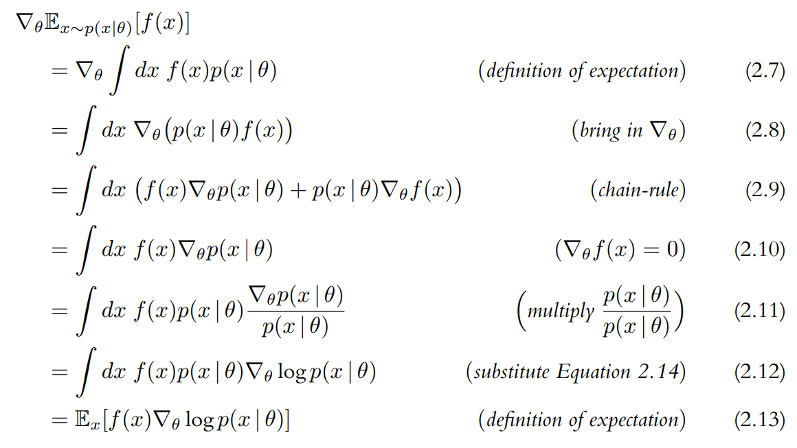

# 단단한 심층 강화학습

좋은 결과를 초래한 행동이 더 높은 확률로 선택되도록 에이전트를 학습시켜야 한다. 행동 확률이 **정책 경사**(policy gradient)를 따라 변하기 때문에 `REINFORCE`는 **정책 경사 알고리즘**으로 알려져 있다.

이 알고리즘은 세 가지 필수 요소를 갖는다.

1. 파라미터로 표현된 정책
2. 최대한 달성하고자 하는 목적
3. 정책 파라미터를 업데이트 하는 방법

---

학습 가능한 파라미터 $\theta$로 구성된 심층 신경망을 이용하여 정책을 표현

$$\pi_\theta$$

궤적의 이득 $R_t(\tau)$는 시간 단계 $t$로부터 궤적이 끝날 때까지 보상의 할인값을 더한 것으로 정의

$$R_t(\tau)=\sum_{t'=t}^{T}\gamma^{t'-t}r_{t'}$$

**목적**(objective)은 에이전트가 생성하는 모든 완전한 궤적에 대한 이득의 기댓값으로 정의

$$J(\pi_{\theta})=\mathbb{E}_{\tau \sim \pi_{\theta}}[R(\tau)]=\mathbb{E}_{\tau \sim \pi_{\theta}} \left [ \sum_{t=0}^{T}\gamma^{t}r_{t} \right ]$$

정책 경사 알고리즘은 다음과 같은 문제를 해결한다

$$\underset{\theta}{\max}J(\pi_{\theta})=\mathbb{E}_{\tau \sim \pi_{\theta}} \left [ R(\tau) \right ]$$

목적을 향상하기 위해 경사를 계산하고 그것을 이용해 아래 식과 같이 파라미터를 업데이트 한다

$$\theta \leftarrow \theta + \alpha \nabla_{\theta}J(\pi_\theta)$$

* $\alpha$ : 학습률을 나타내는 스칼라값이다.

정책경사 $\nabla_{\theta}J(\pi_\theta)$는 다음과 같이 정의된다. 아래 식은 행동 $a_t$가 발생할 로그확률의 경사와 그에 해당하는 이득 $R_t(\tau)$을 곱한 후 이를 모두 더한 값의 기댓값이 목적의 경사와 동일하다는 사실을 말해 준다.

$$\nabla_{\theta}J(\pi_\theta)=\mathbb{E}_{\tau \sim \pi_{\theta}} \left [ \sum_{t=0}^{T} R_t(\tau) \nabla_{\theta} \log \pi_{\theta} (a_t \mid s_t)\right ]$$

* $\pi_{\theta} (a_t \mid s_t)$ : 에이전트가 시간 단계 $t$에서 취하는 행동의 확률

## 정책 경사 계산

$$\nabla J (\pi_{\theta})=\nabla_{\theta}\mathbb{E}_{\tau \sim \pi_{\theta}}\left [ R(\tau)\right ]$$

위 식에는 $R(\tau)=\sum_{t=0}^{T}\gamma^{t}r_{t}$를 $\theta$에 대해 미분할 수 없다는 문제가 있다. 따라서 미분 가능한 형태로 변환하여 기댓값의 경사를 다음과 같이 표현할 수 있다.

{: width="80%" height="80%" class="align-center"}

* $f(x)$ : 함수
* $p(x \mid \theta)$ : 파라미터로 표현되는 확률분포
* $\mathbb{E}_{x \sim p(x \mid \theta)}[f(x)]$ : $f(x)$의 기댓값

> 출처
 - Laura Graesser, Wah Loon Keng,『단단한 심층 강화학습』, 김성우, 제이펍(2022)
