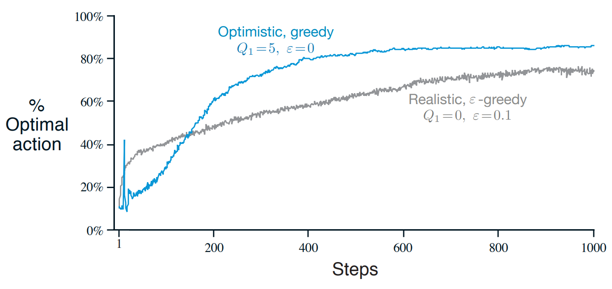
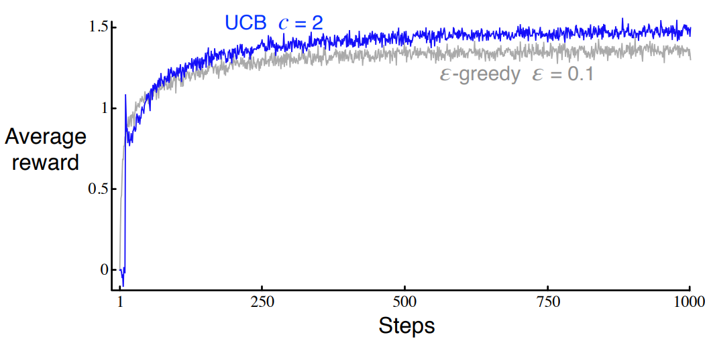

*[figure 2.3]*
{: width="100%" height="100%" class="align-center"}

위 그림에서 `Optimistic, greedy`의 경우 초반 부근에 스파이크가 나타난다.

*[figure 2.4]*
{: width="80%" height="80%" class="align-center"}

여기서 `UCB`의 경우에도 마찬가지이다.

**해당 코드에 대한 구현과 설명은 [여기서](https://helpingstar.github.io/rl/SuttonCode_ch02/) 볼 수 있다.**

두 스파이크에 대해 책에서는 exercise문제로 내고 있는데 해당 문제에 대한 답안은 다음과 같다.

[enjeener github](https://github.com/enjeeneer/sutton_and_barto/tree/main/exercises)

*[figure 2.3]*

The optimistic greedy policy with explore on every initial step as all value estimates are greater than their true value. It is possible, therefore, that it randomly selects the optimal action and then immediately forgets it in favour of yet-to-be-explored actions. This explains the spike at timestep

모든 초기 단계에서 탐색하는 `optimistic greedy policy`는 모든 추정치가 실제 값보다 높게 나온다. 따라서 `optimal action`을 무작위로 선택하고 아직 탐험되지 않은 `action`을 선호하며 바로 잊어버릴 수 있다. 이것은 timestep에서의 spike를 설명한다.

*[figure 2.4]*

After 10 timesteps the UCB algorithm has explored all 10 actions as, until they are selected, their upper confidence bound is infinite (as $N_t(a) = 0$) as so it guarenteed to be selected once in the first 10 actions. At this point the agent has one sample to assess the expected value of each arm and the same confidence/uncertainty in each action. With $c < 0$ it is likely to pick the action with highest return from first sample, which will likely give it an similarly large reward, creating the spike. Now, the upper confidence bound for that action will decrease and the agent will select another, less valuable action, causing the decrease in performance at the next timestep.

10번의 timestep이후에 UCB알고리즘은 모든 10 `action`을 탐험할 것이다 왜냐하면 `action`들의 UCB는 무한대이기 때문에($N_t(a)=0$) 첫 10개의 `action`에서 한번 선택받는 것을 보장한다. 이 시점에서 에이전트는 각 arm의 기댓값과 각 `action`에 대한 동일한 신뢰/불확실성을 평가할 표본이 하나 있다. $c < 0$이면 첫 번째 샘플에서 가장 높은 수익률을 가진 액션을 선택할 가능성이 높으며, 이는 비슷하게 큰 보상을 주어 스파이크를 생성할 가능성이 높다. 이제 해당 작업에 대한 UCB가 감소하고 에이전트는 가치가 낮은 다른 작업을 선택하여 다음 단계에서 성능이 저하됩니다.

[brynhayder github](https://github.com/brynhayder/reinforcement_learning_an_introduction/tree/master/exercises)

*[figure 2.3]*

At some point after step 10, the agent will find the optimal value. It will then choose this value greedily. The small step-size parameter (small relative to the initialisation value of 5) means that the estimate of the optimal value will converge slowly towards its true value.

10 step 이후 에이전트는 `optimal value`를 찾을 것이다. 그러면 에이전트는 그 value를 greedy하게 선택할 것이다. 작은 step-size parameter (초기값인 5보다 상대적으로 낮은)는 `optimal value`의 추정값이 천천히 실제 값으로 수렴함을 의미한다.

It is likely that this true value is less than 5. This means that, due to the small step size, one of the sub-optimal actions will still have a value close to 5. Thus, at some point, the agent begins to act sub-optimally again.

이 실제 값은 5보다 작을 수 있다. 이것은 step size가 작기 때문에 sub-optimal action이 여전히 5에 가까운 값을 갖는다는 것을 의미한다. 따라서 어느 시점에서 에이전트는 다시 sub-optimally 로 행동하기 시작한다. (sub-optimally로 행동한다는 것이 정확히 무슨 의미인지 모르겠다.)

*[figure 2.4]*

In the first 10 steps the agent cycles through all of the actions because when $N_t(a) = 0$ then $a$ is considered maximal. On the 11th step the agent will most often then choose greedily. The agent will continue to choose greedily until $\ln(t)$ overtakes $N_t(a)$ for one of the other actions, in which case the agent begins to explore again hence reducing rewards. Note that, in the long run, $N_t = O(t)$ and $ln(t)/t \rightarrow 1$. So this agent is ‘asymptotically greedy’.

첫 10 step후에 에이전트는 모든 액션을 돌고 올 것이다. 왜냐하면 $N_t(a)=0$이어서 $a$가 최대로 잡히기 때문이다. 11번째 step에서는 에이전트가 가장 자주 greedy하게 선택할 것이다. 에이전트는 $\ln(t)$가 다른 `action`중 하나에 대해 $N_t(a)$를 추월할 때까지 greedy하게 계속 선택할 것이며, 이 경우 다시 에이전트가 다시 탐험을 시작하며 `reward`를 감소시킨다. 장기적으로 $N_t = O(t)$ and $ln(t)/t \rightarrow 1$에 주의하라. 그래서 이 에이전트는 '점근적으로 탐욕스럽다'

# 내 생각

실제 값이 큰 값은 갱신시에 긍정적인 초기화 값보다 차이가 작기 때문에 갱신량이 적어 선택되는 기간이 더 길다.

첫 한번씩은 무조건 선택될 수 있지만 k+1의 timestep에서는 실제값이 제일 높은 것이 선택될 확률이 제일 높다.
