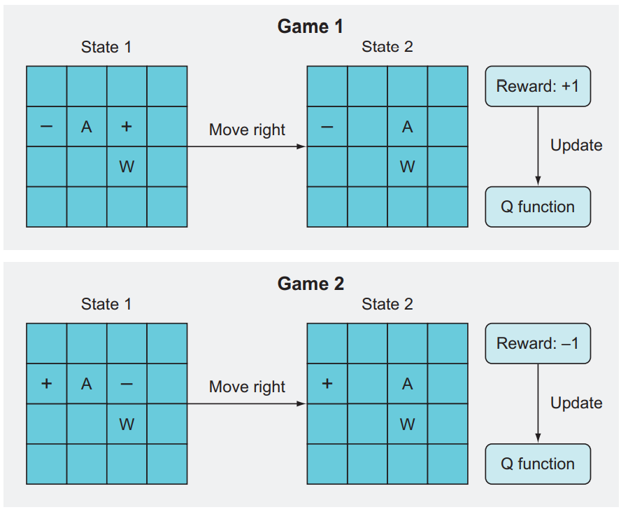
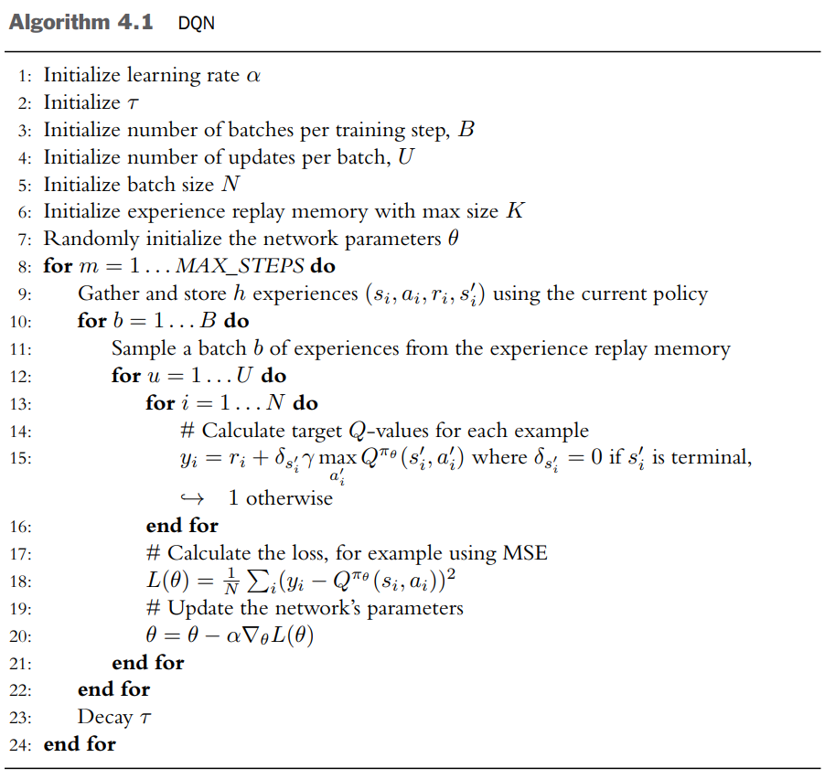

`DQN`은 $Q$함수를 근사하는 가치 기반 시간차(value-based temporal difference (TD)) 알고리즘이다. 학습된 $Q$ 함수를 이용하여 행동을 선택한다. `DQN`은 이산적 행동 공간을 갖는 환경에만 적용할 수 있다. `SARSA`와 달리 최적 $Q$ 함수를 학습함으로써 학습의 안정성과 속도를 향상시킨다. 즉 `DQN`은 `off-policy` 알고리즘이다. 최적 $Q$ 함수는 데이터를 수집하는 정책에 영향을 받지 않는다. 이론상 어떤 정책을 활용하여 데이터를 생성해도 상관 없으나 실제로는 더 적합한 정책이 존재한다.

`DQN`은 이전 경험과의 관계를 끊고 방대한 경험 재현 메모리로부터 일련의 경험을 무작위로 추출함으로써 경험을 재사용할 수 있다. 또한 동일한 경험을 사용하여 다수 파라미터의 업데이트를 수행할 수도 있다.

# `DQN`의 $Q$ 함수 학습

$$ Q^{\pi}_{\text{DQN}}(s,a) \approx r + \gamma\underset{a'}{\max}Q^{\pi}(s',a') \tag{4.1}$$
$$ Q^{\pi}_{\text{SARSA}}(s,a) \approx r + \gamma Q^{\pi}(s',a') \tag{4.2}$$
$$ Q^{\pi}_{\text{tar} \colon \text{DQN}}(s,a) = r + \gamma\underset{a'}{\max}Q^{\pi}(s',a') \tag{4.3}$$
$$ Q^{\pi}_{\text{tar}\colon\text{SARSA}}(s,a) = r + \gamma Q^{\pi}(s',a') \tag{4.4}$$

* $(4.1)$ : `DQN`의 벨만 방정식
* $(4.2)$ : `SARSA`의 벨만 방정식
* $(4.3)$ : `DQN`에서의 $Q^{\pi}_{\text{tar}}(s,a)$
* $(4.4)$ : `SARSA`에서의 $Q^{\pi}_{\text{tar}}(s,a)$

다음 상태 $s'$에서 실제로 취해진 행동 $a'$을 이용하여 $Q^{\pi}_{\text{tar}}(s,a)$를 추정하는 대신, `DQN`은 다음 상태에서 선택할 수 있는 잠재적인 모든 행동에 대한 $Q$ 가치 중에서 최대의 $Q$ 가치를 이용한다.

$Q^{\pi}_{\text{tar} \colon \text{DQN}}(s,a)$가 경험을 수집할 때 사용된 정책에 영향을 받지 않고 서튼과 바르토가 정의한 최적 정책의 영향을 받는다.

> 모든 상태에 대해 정책 $\pi'$의 기대 이득보다 크거나 같을 경우 정책 $\pi'$이 정책 $\pi$보다 더 좋거나 같은 수준이라고 정의된다. 다시 말해, 모든 $s \in \mathcal{S}$에 대해 $V^{\pi'}(s) \ge V^{\pi}(s)$일 경우에만 $\pi' \ge \pi$이다. 다른 모든 정책보다 좋거나 같은 수준인 정책은 언제나 적어도 하나 이상 존재한다. 이것이 최적 정책 $\pi^\ast$이다

최적 $Q$ 함수는 상태 $s$에서 행동 $a$를 선택하고 그 이후에는 최적 정책 $\pi^\ast$를 따르는 것으로서 정의된다. 아래에 표현되어 있다.

$$Q^\ast(s,a) = \underset{\pi}{\max}Q^\pi(s,a)=Q^{\pi^\ast}(s,a) \tag{4.5}$$

${Q^{\pi}_{\text{tar:DQN}}(s,a)}$를 다시 생각해보자.

$Q^\pi$의 추정값이 정확하다면 $Q^\pi(s',a')$을 최대화하는 행동을 선택하는 것이 최적일 것이다. 이것이 에이전트가 할 수 있는 최선이다. 이는 $Q^{\pi}_{\text{tar} \colon \text{DQN}}(s,a)$에 해당하는 정책이 최적 정책 $\pi^\ast$라는 것을 나타낸다.

# `DQN`의 행동 선택

`DQN` 에이전트가 경험울 수집하는 방법은 여전히 중요한데 이떄 고려해야 할 두가지 요소가 있다.

1. 탐험-활용 균형 문제를 마주한다. 훈련 초기에는 공간을 빠르게 탐험하고 훈련이 진행될 수록 탐험의 비율을 낮춰 이미 학습한 것을 활용하는데 더 많은 시간을 들여야 한다.
2. 상태-행동 공간이 연속적인 값으로 채워진 아주 큰 공간이거나 높은 차원의 이산적 공간이라면 모든 $(s,a)$ 쌍을 경험하기는 매우 어렵기 때문에, 경험하지 못한 $(s,a)$ 쌍은 $Q$ 가치가 정확하지 않을 수 있다.

---

**일반화와 신경망**

표 형태로 함수를 표현하면 각기 다른 상태와 행동이 서로 어떻게 연관되는지에 대해 어떤 것도 학습할 수 없다.

반면에 신경망은 이미 경험한 $(s,a)$에 대한 $Q$ 가치로부터 경험하지 못한 $(s',a')$을 예측 할 수 있다. 신경망이 각기 다른 상태와 행동이 서로 어떻게 연관되는지 학습하기 때문이다.

하지만 신경망도 일반화 능력에는 한계가 있다.
1. 신경망에 들어오는 입력이 신경망을 훈련할 때 사용했던 입력과 상당히 다를 경우 신경망이 올바른 값을 출력할 확률이 낮다. 일반적으로, 훈련 데이터를 둘러싼 좁은 영역으로부터 입력이 들어올 때 일반화 능력이 훨씬 더 좋다.
2. 신경망이 근사하려고 하는 함수가 급격한 불연속점을 갖는다면 신경망을 통한 일반화가 잘되지 않을 가능성이 높다. 이것은 신경망이 암묵적으로 가정하는 입력 공간이 특정 영역 내에서 부드럽고 연속적인 입력 공간이기 때문이다. $x$와 $x'$이 비슷하다면 출력 $y$와 $y'$도 비슷해야 한다.

---

상태-행동 공간이 크다면 좋은 정책이 자주 경험할 것 같은 상태와 행동에 집중하여 훈련한다면 이러한 환경에서도 좋은 성능을 낼 수 있다.

따라서 `DQN` 에이전트의 정책은 현재 $Q$ 함수 추정값에 대해 탐욕적으로 행동함으로써 경험하게 될 상태-행동과 상당히 유사한 상태-행동을 경험하도록 해야 한다. 이렇게 하면 에이전트의 현재 $Q$ 함수 추정값이 최적 정책의 $Q$ 함수 추정값이 된다. 이 두 정책이 생성하는 데이터의 분포는 유사해야 한다.

실제로 `ε-greedy policy` 또는 `Boltzmann policy` 정책을 이용하면 에이전트가 최적 정책의 추정 값을 사용하여 경험할 법한 데이터에 집중해서 학습하도록 도와준다.

`Boltzmann policy`에 대한 내용은 본 블로그의 포스트 [[볼츠만 머신, Boltzmann machine]](https://helpingstar.github.io/dl/other_network/) 에서도 확인할 수 있다.

# 파국적 망각, Catastrophic forgetting

에피소드를 끝낼 때마다 바로 역전파를 수행하는 온라인 학습 방식의 경사 하강법 기반 훈련 방법들에서 아주 중요한 문제이다.

{: width="60%" height="60%" class="align-center"}

* **+** : Goal
* **-** : Pit
* **W** : Wall
* **A** : Player

`Game 1`에서 `A`는 왼쪽 구덩이와 **오른쪽** 목표 사이에 있다. `ε-greedy`에서 일정 확률로 운 좋게 오른쪽 이동이 선택된다면 에이전트는 바로 목표에 도달한다. 높은 보상으로 역전파 과정을 통해 신경망은 이 특정한 상태-동작을 높은 가치와 연관시킨다.

`Game 2`에서 이번에도 플레이어는 구덩이와 목표 사이에 있지만 목표 타일이 **왼쪽**이고 구덩이가 오른쪽이다. 단순한 학습 알고리즘이 보기에 이 상황은 이전 에피소드와 아주 비슷하다. 이전에 오른쪽으로 이동해서 높은 긍정적 보상을 얻었으므로, 이번에도 오른쪽 이동을 선택한다. 그러나 보상은 -10이다. 다시 역전파를 수행해서 이 상태-동작 쌍의 가치를 갱신하게 되겠지만, 이 상태-동작 쌍은 이전에 배운 상태-동작 쌍과 아주 비슷하기 때문에, 이전에 배운 가치들이 새 가중치들로 대체된다. 즉 모형은 이전에 배운 것들은 모두 잊는다(망각).

이상이 파국적 망각이다. 이처럼 아주 비슷한(그러나 가치는 다른) 상태-동작 쌍들이 서로의 경험을 상쇄하면 신경망은 아무것도 제대로 배우지 못한다.

일반적으로 지도학습에서는 온라인 학습 접근 방식 대신 훈련 데이터를 한 부분집합으로 신경망을 실행하고 그 부분집합 전체에 대한 합 또는 평균 기울기를 계산한 후에야 가중치들을 갱신하는 배치 접근 방식을 사용하기 때문에 이런 문제가 잘 생기지 않는다. 그처럼 일정 단위의 데이터에 대한 평균을 사용하면 학습이 안정해진다.

# 경험 재현, Experience Replay

활성 정책 알고리즘을 표본 비효율적으로 만드는 두가지 요소

1. 활성 정책 알고리즘은 정책 파라미터 업데이트를 위해 오직 현재 정책에 따라 수집된 데이터만을 사용할 수 있다. 모든 경험이 한 번만 사용된다. 이것이 신경망과 같이 경사하강을 이용하는 함수 근사와 결합될 경우 경사는 현재 파라미터값 주위의 좁은 영역에서 하강 방향에 대해서만 의미 있는 정보를 주기 때문에 파라미터 업데이트의 크기는 작아야 한다. 예를 들면, 신경망이 예측하는 $Q$ 가치 $\hat{Q^{\pi}}(s,a_1)$과 $Q^\pi(s,a_1)$ 사이의 차이가 클 경우에 경험에 포함도니 모든 정보를 활용하기 위해 신경은 경험을 이용하여 파라미터를 여러 번 업데이트해야 할 수도 있다. 하지만 활성 정책 알고리즘은 이런 것을 할 수 없다.
2. 활성 정책 알고리즘을 훈련하기 위해 사용되는 경험들은 서로 밀접하게 연관되어 있다. 업데이트를 위한 데이터가 하나의 에피소드로부터 나오는데, 미래 상태와 보상은 이전 상태와 행동에 따라 결정되기 때문이다. 이러한 이유로 파라미터 업데이트의 분산은 커질 수 있다.

Long-Ji Lin[1](#footnote_1)은 **경험 재현**이라 불리는 방법을 제안하는데 TD 학습이 강화학습 특유의 데이터 수집을 위한 시행착오 메커니즘과 시간에 역행하는 방향으로 정볼르 전파할 필요성 떄문에 느려질 수 있다는 사실을 알아냈다. TD 학습의 속도를 높이기 위해 신뢰 할당 과정을 가속화하거나 시행착오 과정을 줄이면 되는데 경험 재현은 경험의 재사용을 가능하게 함으로써 후자의 방법에 집중한다.

경험 재현 메모리(Experience Replay Memory)는 에이전트가 확보한 $k$개의 가장 최신 경험을 저장하고 메모리가 다 차면 가장 오래된 경험은 폐기된다. 에이전트가 훈련할 때마다 하나 이상의 데이터 묶음이 경험 재현 메모리로부터 균일한 분포를 따라 무작위로 추출된다.

많은 에피소드에서 수집된 경험을 저장하기 위해 메모리의 크기는 충분히 커야 한다. **일반적으로 각기 다른 정책과 에피소드로부터 수집된 경험이 포함되어 서로 연관성이 낮아진다.** 이렇게 되면 파라미터 업데이트의 분산이 작아져 훈련을 안정화하는데 도움이 된다.

메모리의 크기는 작아질 필요도 있는데, 경험이 폐기되기 전에 두 번이상 추출될 확률을 높임으로써 학습이 좀 더 효율적으로 진행되게 하기 위함이다.

가장 오래된 경험을 폐기하는 것도 중요하다. 학습을 진행함에 따라 학습하는 $(s,a)$ 분포도 변화하는데 더 오래된 경험일수록 유용성이 떨어지는데, 상태가 더 오래될수록 에이전트가 그 상태를 경험할 확률이 낮아지기 때문이다.

## 경험 재현 작동 방식
1. 상태 $s$에서 동작 $a$를 취하고 새 상태 $s_{t+1}$과 보상 $r_{t+1}$을 관측한다.
2. 이 '경험'을 하나의 튜플 $(s_t, a_t, r_{t+1}, s_{t+1})$로 묶어서 목록에 추가한다.
3. 미리 정해둔 길이의 목록이 다 찰 때까지 단계 1과 2를 반복한다.
4. 경험 목록이 다 차면, 일부 경험들을 무작위로 선택해서 하나의 부분집합을 만든다.
5. 그 부분집합의 경험들로 가치들을 계산해서 개별 배열($Y$)에 저장하고, 경험들의 상태 $s$들을 또 다른 배열($X$)에 저장한다.
6. 이제 $X$와 $Y$를 하나의 미니배치로 두어서 배치 훈련을 실행한다.(여기까지가 하나의 훈련 주기이다. 훈련을 반복해서 경험 재현 목록이 꽉 차면, 그때부터는 목록의 기존 경험들이 새 경험들로 대체된다.)

# DQN Algorithm

## 볼츠만 정책을 적용한 DQN

*[figure 2.3]*
{: width="80%" height="80%" class="align-center"}

* `(15)` : 데이터 묶음의 개별 데이터에 대해 목표 $Q$ 가치를 계산하는데 다음 상태 $s'$에서 $Q$ 가치를 최대화하는 행동을 선택하는 과정이 포함된다. 이러한 이유로 DQN은 이산적 행동 공간을 갖는 환경에만 적용할 수 있다.

# 구현 코드 모음

* [DRL in Action, chap03](https://github.com/DeepReinforcementLearning/DeepReinforcementLearningInAction/blob/master/Chapter%203/Ch3_book.ipynb)
  * 첫 번째 : `DQN`
  * 두 번째 : `DQN`, `Experience Replay`

> 출처
 - Laura Graesser, Wah Loon Keng,『단단한 심층 강화학습』, 김성우, 제이펍(2022)
 - Alex Zai, Brandon Brown,『심층 강화학습 인 액션』, 류광, 제이펍(2020)

<a name="footnote_1">1</a>: https://link.springer.com/article/10.1007/BF00992699
