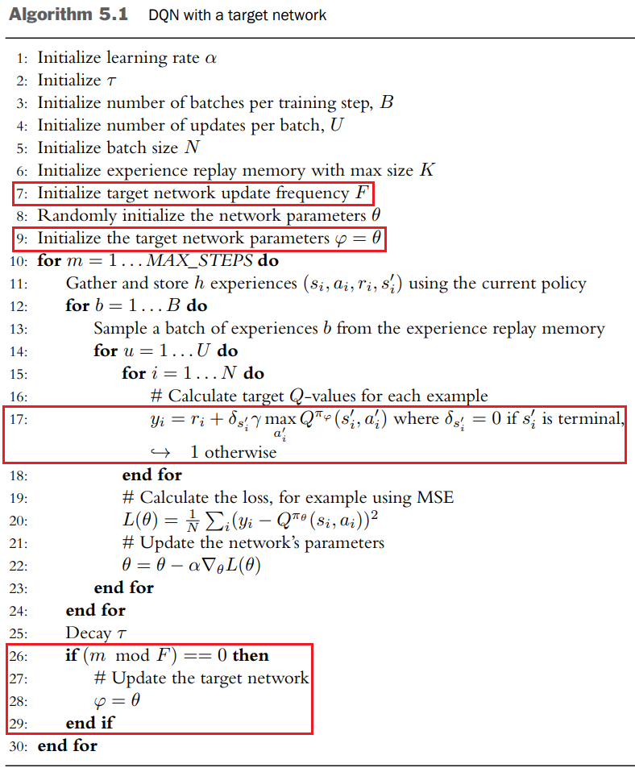
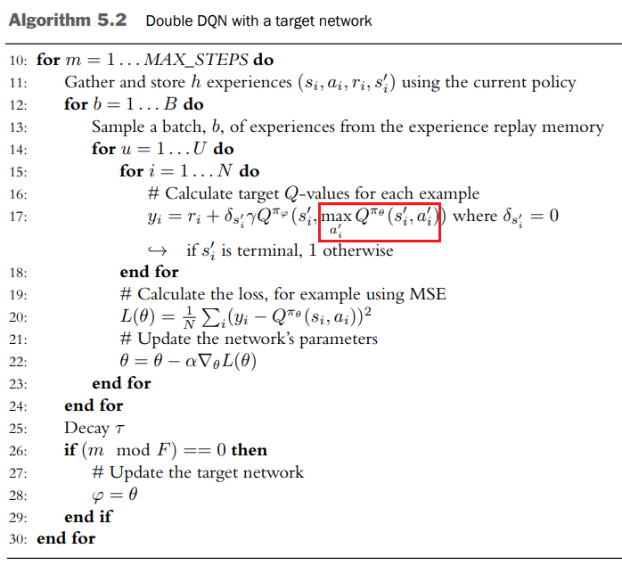
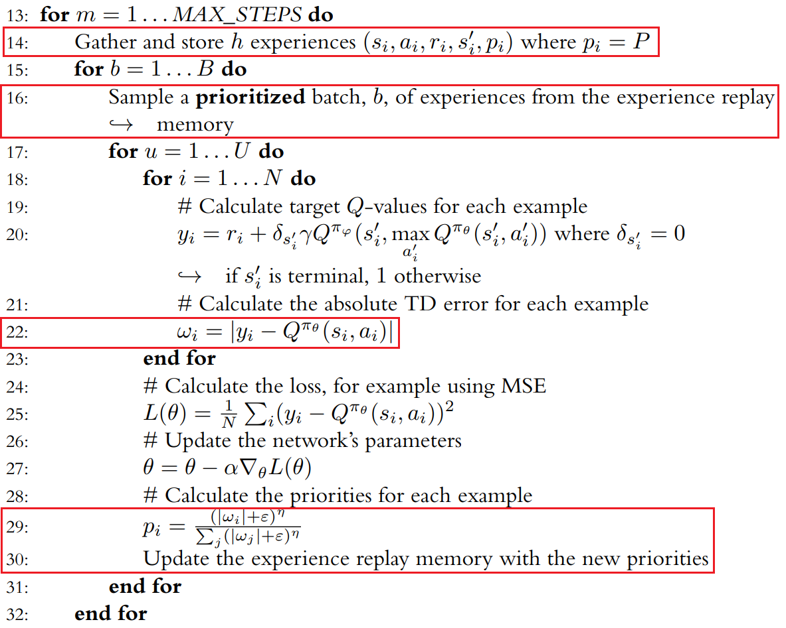

# Target Networks

원래의 `DQN` 알고리즘에서 $Q^{\pi}_{\text{tar}}$가 $\hat{Q^\pi}(s,a)$에 따라 결정되기 때문에 지속적으로 값이 변한다는 문제를 해결하기 위해 만들어졌다.

훈련 도중에 $\hat{Q^\pi}(s,a)=Q^{\pi_\theta}(s,a)$ 와 $$Q^{\pi}_\text{tar}$$ 의 차이를 최소화하기 위해 $$Q$$ 네트워크 파라미터 $\theta$를 조정하는데, $Q^{\pi}_\text{tar}$의 값이 훈련 단계마다 변하는 경우 이러한 조정이 어려워진다.

훈련 단계가 바뀔 때 $$Q^{\pi}_\text{tar}$$의 변화를 최소화 하기 위해 목표 네트워크를 사용한다. 목표 네트워크는 파라미터 $$\varphi$$를 갖는 네트워크로 $$Q$$ 네트워크 $$Q^{\pi_\theta}(s,a)$$의 지연된 버전이다.

아래 $(5.2)$식에서 볼 수 있듯이 목표네트워크 $Q^{\pi_\varphi}(s,a)$는 $Q^{\pi}_\text{tar}$를 계산하기 위해 사용된다.

$$Q^{\pi_\varphi}_{\text{tar}}(s,a)=r+\gamma \underset{a'}{\max}Q^{\pi_\varphi}(s',a') \tag{5.2}$$

$\varphi$는 $\theta$의 현재 값으로 주기적으로 업데이트된다. 이것을 치환 업데이트(replacement update)라고 부른다. $\varphi$의 업데이트 주기는 문제마다 다르며 간단한 문제일 수록 업데이트 주기가 작아도 충분하다.

$Q^{\pi_\theta}_{\text{tar}}(s,a)$가 계산될 때마다, 파라미터 $$\theta$$로 표현되는 $Q$ 함수는 조금 달라질 것이기 때문에 $$Q^{\pi_\theta}_{\text{tar}}(s,a)$$는 동일한 $$(s,a)$$에 대해 다른 값을 갖게 될 것이다.

이러한 '움직이는 목표'는 네트워크가 어떤 값을 도출해야 하는지를 모호하게 만들기 떄문에 훈련이 불안정해진다.

목표 네트워크를 도입하면 $\varphi$를 $\theta$로 업데이트 하는 사이에 $\varphi$가 고정되기 때문에 $\varphi$로 표현되는 $Q$함수가 변하지 않는다. 이렇게 함으로써 문제를 지도 회귀(supervised regression) 문제로 전환할 수 있다.

{: width="80%" height="80%" class="align-center"}

이전 [DQN 포스트의 [볼츠만 정책을 적용한 DQN]](https://helpingstar.github.io/rl/DQN/#%EB%B3%BC%EC%B8%A0%EB%A7%8C-%EC%A0%95%EC%B1%85%EC%9D%84-%EC%A0%81%EC%9A%A9%ED%95%9C-dqn)의 알고리즘과 다른 점은 다음과 같다.

* `(7)` : 목표 업데이트 빈도수 $F$ 추가
* `(9)` : 추가적인 네트워크를 목표 네트워크로 초기화하고 $\varphi$를 $\theta$로 설정한다.
* `(17)` : 목표 네트워크 $Q^{\pi_\varphi}_{\text{tar}}(s,a)$를 이용해서 $y_i$를 계산한다.
* `(26~29)` : 목표 네트워크는 주기적으로 업데이트된다.

목표 네트워크 파라미터 $\varphi$를 업데이트 하는 것은 두 가지 방법이 있다

$$\text{Replacement update : } \varphi \leftarrow \theta \tag{5.3}$$
$$\text{Polyak update : } \varphi \leftarrow \beta\varphi + (1-\beta)\theta$$

폴리악 업데이트(Polyak update)는 $\varphi$를 $\varphi$와 $\theta$의 가중평균으로 설정하는데 이는 업데이트를 부드럽게 한다. $\varphi$는 시간 단계마다 변하지만 $\theta$보다는 천천히 변하며 $\beta$로 $\varphi$의 변화속도를 조절한다. $\beta$가 클수록 $\varphi$는 천천히 변화한다.

**치환 업데이트(Replacement update)**
* $\varphi$가 수많은 단계동안 유지된다. 이는 움직이는 `target`을 제거하는 효과가 생긴다.
* $\varphi$와 $\theta$의 동역학적 지연를 발생시킨다. 그리고 이러한 지연은 $\varphi$가 마지막으로 업데이트된 이후 경과한 시간 단계의 개수에 영향을 받는다.

**폴리악 업데이트**
* $\varphi$는 훈련의 반복 과정 속에서 변화하지만 $\theta$보다는 덜 점진적으로 변화한다.
* $\varphi$와 $\theta$를 섞어놓은 것이 변하지 않기 때문에 시간 단계의 개수에 영향을 받는 동역학적 지연이 없다.

목표 네트워크의 한 가지 단점은 $Q^{\pi}_\text{tar}(s,a)$가 이전의 목표 네트워크로부터 생성되기 때문에 훈련 속도가 저하될 수 있다는 점이다. $\varphi$와 $\theta$가 너무 비슷한 값을 갖는다면 훈련 과정은 불안정해지겠지만 $\varphi$가 너무 천천히 변화한다면 훈련 과정은 불필요하게 느려질 것이다. $\varphi$의 변화 속도를 조절하는 하이퍼 파라미터(업데이트 빈도수 또는 $\beta$)는 안정성과 훈련속도 사이의 적절한 균형을 찾도록 조절되어야 한다.

# Double DQN

이중 추정(double estimation)을 이용하여 $Q^{\pi}_{\text{tar}}(s,a)$을 계산한다. `Double DQN`으로 알려진 이 알고리즘은 $Q$ 가치를 과대추정하는 문제를 해결한다.

식 $(5.5)$에서 볼 수 있듯이 `DQN`에서는 상태 $s'$에서 최대의 $Q$가치 추정값을 선택함으로써 $Q^{\pi}_{\text{tar}}(s,a)$를 구성한다.

$$
\begin{align*}
    Q^{\pi_\theta}_{\text{tar}}(s,a)&=r+\gamma \underset{a'}{\max}Q^{\pi_\theta}_{\text{tar}}(s',a') \\
&=r+\max (Q^{\pi_\theta}(s',a_{1}'),Q^{\pi_\theta}(s',a_{2}'),...,Q^{\pi_\theta}(s',a_{n}'))
\end{align*}
\tag{5.5}
$$

[Deep Reinforcement Learnign with Double Q-Learning](https://arxiv.org/abs/1509.06461)에서 밴 하셀트 등은 $Q^{\pi_\theta}(s',a')$에 오차가 조금이라도 있다면 $Q^{\pi_\theta}(s',a')$의 최댓값이 양의 방향으로 편향되어서 $Q$가치의 값이 과대 추정될 것임을 보여주었다.

$Q^{\pi_\theta}(s',a')$ 값이 정확히 맞지 않는데는 여러가지 이유가 있다.

* 신경망을 이용한 함수 근사는 완벽하지 않다.
* 에이전트가 환경을 완전히 탐험하지 않을 수 있다.
* 환경 자체에 노이즈가 많이 포함되어 있을 수 있다.

따라서  $Q^{\pi_\theta}(s',a')$이 어느 정도의 오차를 갖는다는것이 자명하기에 $Q$가치는 과대 추정될 수밖에 없을 것이다. 게다가 상태 $s'$으로부터 선택할 수 있는 행동의 개수가 많을수록 과대 추정의 정도는 더 커질 가능성이 높다.

---

**최대 기댓값 추정 예시**

가치 추정값에 노이즈가 포함되어 있을 경우 최대 추정의 기댓값이 양의 방향으로 편차를 갖는다.

`DQN`에서 최대 기댓값은 $\mathbb{E} \left [ \underset{a}{\max}Q^{\pi}(s,a)
\right ]$ 이고 $Q^{\pi_\theta}$로부터 노이즈가 섞인 추정값이 생성된다.

모든 가능한 행동 $a$에 대해 $Q^{\pi^{\ast}}(s,a)=0$이 되는 상태를 상정하고 $Q$가치 추정값이 노이즈를 포함하지만 편차는 없다고 가정해보자. $Q$ 가치가 평균이 0이고 표준편차가 1인 표준정규분포로부터 얻어진다고 가정함으로써 이러한 상황을 시뮬레이션해 볼 수 있다.

$\underset{a'}{\max}Q^{\pi}(s',a')$이 어느 정도까지 과대추정될 수 있는지는 표준정규분포로부터 $k$개의 값을 샘플링해 보고 그중 최댓값을 선택하는 과정을 통해 알 수 있따. 이때 $k$는 상태$s'$에서 취할 수 있는 행동 $a'$의 개수를 나타낸다. 이 과정을 여러 번 반복하고 모든 최댓값에 대해 평균을 계산하여 각각의 $k$에 대해 기대할 수 있는 최댓값을 추정한다.

아래 표는 $k=1, ..., 10$에 대해 각각 10,000개의 표본을 이용하여 계산한 최댓값의 기댓값을 보여준다. $\underset{a'}{\max}Q^{\pi}(s',a')$의 실젯값은 $0$인데, $k=1$일 경우 기댓값에 의한 추정은 정확하다. 하지만 $k$가 증가하면 추정값이 양의 방향으로 더욱 치우치게 된다.

| Number of Actions | $\mathbb{E} \left [ \underset{a}{\max}Q^{\pi}(s,a) \right ]$ | Number of Actions | $\mathbb{E} \left [ \underset{a}{\max}Q^{\pi}(s,a) \right ]$ |
|---|---|---|---|
| 1 | 0.00 | 6 | 1.27 |
| 2 | 0.56 | 7 | 1.34 |
| 3 | 0.86 | 8 | 1.43 |
| 4 | 1.03 | 9 | 1.48 |
| 5 | 1.16 | 10 | 1.53 |

---

$Q$ 가치의 과대 추정이 균일하게 과대추정됐다면 에이전트는 여전히 상태 $s$에서 올바른 행동 $a$를 선택하기 때문에 성능의 저하를 알아차릴 수 없다. 또한 경험하지 못하거나 아주 조금 경험한 상태를 과대추정하면 나중에 경험함으로써 상태의 좋고 나쁨에 대한 정보를 얻게 될 가능성이 높아지기 때문이다.

하지만 `DQN`은 자주 경험한 $(s,a)$ 쌍에 대해 $Q^{\pi}(s,a)$를 과대추정한다. 에이전트가 $(s,a)$를 균일하게 탐험하지 않을 경우 과대 추정도 균일하지 않을 것이고 따라서 $Q^{\pi}(s,a)$를 기준으로 선택한 행동이 잘못된 선택이 될 수도 있다. $Q^{\pi}(s,a)$의 과대 추정이 (`DQN`에서처럼) 부트스트랩 학습과 결합되면, $Q$ 가치에 대한 부정확한 상대적 평가가 시간에 역행하며 전파되어 더 이전의 $(s,a)$쌍에 대한 추정값의 오차도 증가한다. 따라서 $Q$ 가치의 과대 추정을 줄이는 것이 좋다.

`Double DQN`은 각기 다른 경험을 사용하여 2개의 $Q$ 함수 추정을 학습함으로써 $Q$ 가치의 과대 추정을 감소시킨다.
1. 첫 번째 추정값을 이용하여 $Q$ 가치를 최대로 만드는 행동 $a'$를 선택하고,
2. 이 행동을 이용하여 두 번째 추정으로부터 $Q^{\pi}_{\text{tar}}(s,a)$를 계산하기 위해 이용되는 $Q$ 가치를 생성한다.

첫 번째 추정에서와는 다른 경험을 이용하여 훈련된 두 번째 $Q$ 함수는 추정값이 갖는 양의 편차를 없애준다.

`DQN` 알고리즘은 동일한 네트워크 파라미터 $\theta$를 이용하여 행동 $a'$를 선택하고 그 행동에 대해 $Q$함수를 평가한다.

$$
\begin{align*}
    Q^{\pi}_{\text{tar:DQN}}(s,a)&=r+\gamma Q^{\pi_\theta}(s',a') \\
&=r+\gamma Q^{\pi_\theta}(s', \underset{a'}{\max}Q^{\pi_\theta}(s',a'))
\end{align*}
\tag{5.6}
$$

`Double DQN`은 2개의 각기 다른 네트워크 파라미터 $\theta$와 $\varphi$를 이용한다.
$$Q^{\pi}_{\text{tar:DoubleDQN}}(s,a)=r+\gamma Q^{\pi_\varphi}(s', \underset{a'}{\max}Q^{\pi_\theta}(s',a')) \tag{5.7}$$

* $\theta$ : $a'$를 선택하는데 사용
* $\varphi$ : $(s', a')$의 $Q$가치를 계산하는 데 사용

[목표네트워크](#target-networks)를 다룰 때 파라미터 $\theta$로 표현되는 훈련 네트워크와 파라미터 $\varphi$로 표현되는 목표 네트워크를 설명했다. 이 두 네트워크는 서로 중복되는 경험을 이용하여 훈련됐지만 $\varphi = \theta$로 초기화하는 시간 간격이 충분히 크다면 실질적으로 이 두 네트워크는 `Double DQN`을 위한 각기 다른 네트워크로 봐도 무방할 정도로 다르게 작동한다.

파라미터 $\theta$로 표현되는 훈련 네트워크는 행동 선택을 위해 사용된다. `Double DQN`을 도입한 이후에도 여전히 최적의 정책을 학습하도록 하는 것이 중요하다.

파라미터 $\varphi$로 표현되는 목표 네트워크는 행동을 평가하기 위해 사용된다. $\varphi$와 $\theta$사이의 지연 효과가 없다면($\varphi = \theta$) Equation $(5.7)$은 원래의 `DQN`과 같아진다.

{: width="80%" height="80%" class="align-center"}

* `(17)` : [목표네트워크](#target-networks)와 달리 $y_i$는 $\theta$와 $\varphi$ 모두를 이용하여 계산한다. 이것이 Algorithm $(5.1)$과 비교했을 때 유일한 차이점이다.

# Prioritized Experience Replay (PER)

스카울 등이 2015년에 소개한 [Prioritized Experience Replay](https://arxiv.org/abs/1511.05952) 을 이용한다. 이 방법의 주요 개념은 재현 메모리에 있는 일부 경험이 다른 것보다 더 많은 정보를 담고 있다는 사실에 기반한다.

$Q^{\pi_\theta}(s,a)$와 $$Q^{\pi}_{\text{tar}}(s,a)$$의 차이가 가장 심한 경험을 생각해보자. 이러한 경험은 에이전트에게 가장 놀라운 경험이다.(가장 배울 것이 많은 경험) 에이전트가 $Q^{\pi}_{\text{tar}}(s,a)$를 정확하게 예측할 수 있는 경험보다는 이 '놀라운' 경험을 더 자주 이용하여 훈련받는다면 에이전트의 학습 속도는 더 빨라질 것이다.

`PER`은 실제로 구현시 두 가지 어려움이 있다.

1. **어떻게 경험에 우선순위를 자동으로 부여할 수 있을까?**
2. **이 우선순위를 적용하여 재현 메모리로부터 경험을 추출하는 효율적인 방법은 무엇인가?**

**해결책**

1. `TD Error`로 알려진 $Q^{\pi_\theta}(s,a)$와 $Q^{\pi}_{\text{tar}}(s,a)$의 차이에 대한 절댓값을 이용하여 우선순위를 정한다. `TD Error`는 계산하고 구현하는 노력을 거의 들이지 않고도 `DQN`이나 `Double DQN`의 알고리즘의 과정 중에 모든 경험에 대해 계산할 수 있다. `TD Error`를 사용할 수 없는 경우 우선순위의 초기설정은 일반적으로 점수를 큰 상숫값으로 설정함으로써 이 문제를 해결한다.
2. 순위 기반 방법(rank-based)과 우선순위 방법(proportional prioritization)이 있다. 두 방법 모두 탐욕적 우선순위(점수를 기준으로 항상 최상위 $n$개의 경험을 추출하는 것)와 균일한 무작위 추출 사이의 내삽(interpolation)을 이용한다. 이렇게 하면 점수가 높은 경험이 더 많이 추출되면서도 추출될 확률이 0인 경험은 존재하지 않는다.

**비례적 우선순위**

$$P(i)=\frac{(| w_k |+\varepsilon)^\eta}{\sum_{j}(| w_k |+\varepsilon)^\eta)} \tag{5.8}$$
* $w_i$ : $i$번째 경험에 대한 `TD Error`
* $\varepsilon$ : 크기가 작은 양의 실수
* $\eta \in [0, \infty)$ : 우선순위의 크기를 결정한다 $\eta$의 값이 클수록 우선순위도 더 크다

---

$w_1=2.0,w_2=3.5$일 때 $\eta$값에 따른 확률

| $\eta$ | $P(1)$ | $P(2)$ |
|---|---|---|
| 0.0 | 0.50 | 0.50 |
| 0.5 | 0.43 | 0.57 |
| 1.0 | 0.36 | 0.64 |
| 1.5 | 0.30 | 0.70 |
| 2.0 | 0.25 | 0.75 |

---

## Importance Sampling

특정 예제에 우선순위를 부여하면 전체 데이터 분포에 대한 기댓값이 변하고, 이는 훈련 과정에 편차를 발생시킨다. 이 편차는 각 예제에 대한 `TD Error`에 가중치를 곱함으로써 보정할 수 있는데 이 방법을 **중요도 표본추출**(mportance sampling)이라고 한다.

편차가 작은 경우에 중요도 표본추출이 얼마나 효과가 있을지는 미지수다. 편차가 작은 경우 편차가 작아서 생기는 효과를 덮어버릴 수 있는 행동 노이즈나 `nonstationary` 데이터 분포와 같은 요소들이 있기 때문이다. 이러한 요소의 효과는 특히 학습 초기에 나타난다.

스카울은 [Prioritized Experience Replay](https://arxiv.org/abs/1511.05952)에서 편차를 보정하는 것이 훈련 막바지에 이르렀을 때만 중요할 것이라고 가정하고 편차를 보정하는 효과가 희석된다는 사실을 보여준다. 어떤 경우에는 `Importance Sampling`을 적용하면 성능이 좋아지지만 성능에 차이가 거의 없거나 성능이 더 저하되는 경우도 있다.

{: width="80%" height="80%" class="align-center"}

나머지 내용은 위와 같다.
* `(14)` : 재현 메모리는 경험에 추가적인 요소를 저장해야 한다. 바로 경험의 우선순위다
* `(16)` : sampling시에, 경험은 우선순위에 비례하여 추출된다.
* `(22)` : 경험을 훈련할 때마다 `TD Error`를 계산하고 저장해야 한다.
* `(29~30)` : `TD Error`를 이용하여 메모리에 있는 해당 예제의 우선순위를 업데이트한다.

학습시에 `PER`를 이용할 때는 학습률을 작게 유지하는 것이 일반적이다. 이것은 `PER`이 오차가 더 큰 전이를 더 자주 선택하여 평균적으로 더 큰 경사를 만들기 때문이다. 더 커진 경사를 보상하기 위해, 스카울 등은 [PER 논문](https://arxiv.org/abs/1511.05952)에서 학습률을 4분의 1로 줄이는 것이 도움이 된다는 사실을 알아냈다.

> 출처
 - Laura Graesser, Wah Loon Keng,『단단한 심층 강화학습』, 김성우, 제이펍(2022)
