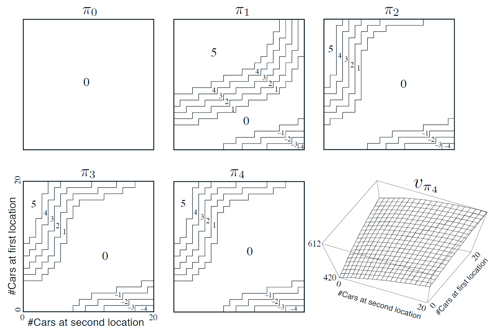

[ShangtongZhang github](https://github.com/ShangtongZhang/reinforcement-learning-an-introduction/tree/master/chapter04)

[단단한 강화학습](http://www.kyobobook.co.kr/product/detailViewKor.laf?ejkGb=KOR&mallGb=KOR&barcode=9791190665179&orderClick=LAG&Kc=) 책의 코드를 공부하기 위해 쓰여진 글이다.

# **`figure 4.2`**

{: width="80%" height="80%" class="align-center"}

**자동차 렌탈**

매일 몇 명의 고객이 자동차를 렌트하기 위해 각 지점을 방문한다. 차를 빌려주면 10달러의 보상을 받고, 빌려줄 차가 없으면 거래가 무산된다. 차는 회수된 다음 날부터 다시 대여가 가능하다. 두 지점에 있는 차량을 한 대당 2달러의 비용을 들여 교환할 수 있다. 한 지점에서 대여되고 회수되는 자동차의 개수가 `Poisson Distribution`을 따르는 확률변수라고 가정한다. `Poisson Distribution`을 따른다는 것은 자동차의 개수가 $n$이 될 확률이 $\frac{\lambda^n}{n!}e^{-\lambda}$임을 의미한다. 이때 $\lambda$는 개수의 평균값을 나타낸다. 대여되는 자동차 개수에 대한 $\lambda$의 값이 첫번째와 두 번째 지점에서 각각 $3$과 $4$이고, 회수되는 자동차 개수에 대한 $\lambda$ 값은 각각 $3$과 $2$라고 하자. 각 지점은 최대 20대까지만 자동차를 보유할 수 있다(20대 초과시 본사로 회수). 하루 밤사이 두 지점 사이에서 교환할 수 있는 자동차의 최대 개수는 5대. 할인률을 $\lambda$로 하고 이 문제를 연속적인 MDP 문제로 형식화한다.

* 시간 단계 : 하루 단위이고
* 상태 : 하루가 끝나는 시점에 각 지점이 보유한 자동차의 개수
* 행동 : 밤사이 두 지점 사이에서 교환되는 자동차의 총 개수

`figure 4.2`는 차량을 교환하지 않는 정책을 시작으로 하여 정책 반복을 수행한 결과를 보여준다. 처음 다섯 개의 다이어그램은 각 지점이 하루의 마지막 시점에 보유한 자동차의 개수가 주어졌을 때, 첫 번째 지점에서 두 번째 지점으로 옮겨져야 할 자동차의 개수가 얼마인지 보여준다.(음의 값: 두번째->첫 번째) 각 정책에 이웃한 다음 정책은 바로 이전 정책보다 분명히 향상되며, 마지막 정책이 최적 정책이다.

## **`Car Rental`**
```python
matplotlib.use('Agg')
# maximum # of cars in each location
MAX_CARS = 20
# maximum # of cars to move during night
MAX_MOVE_OF_CARS = 5
# expectation for rental requests in first location
RENTAL_REQUEST_FIRST_LOC = 3
# expectation for rental requests in second location
RENTAL_REQUEST_SECOND_LOC = 4
# expectation for # of cars returned in first location
RETURNS_FIRST_LOC = 3
# expectation for # of cars returned in second location
RETURNS_SECOND_LOC = 2
DISCOUNT = 0.9
# credit earned by a car
RENTAL_CREDIT = 10
# cost of moving a car
MOVE_CAR_COST = 2
# all possible actions
actions = np.arange(-MAX_MOVE_OF_CARS, MAX_MOVE_OF_CARS + 1)
# An up bound for poisson distribution
# If n is greater than this value, then the probability of getting n is truncated to 0
POISSON_UPPER_BOUND = 11
```
* **(3)** : `MAX_CARS=20` : 각 지점이 보유할 수 있는 자동차의 최대값
* **(5)** : `MAX_MOVE_OF_CARS` : 하루 밤사이 두 지점 사이에서 교환할 수 있는 자동차의 최대 개수
* **(7)** : `RENTAL_REQUEST_FIRST_LOC = 3` : 첫 번째 지점에서 대여되는 자동차 개수에 대한 $\lambda$
* **(9)** : `RENTAL_REQUEST_SECOND_LOC = 4` : 두 번째 지점에서 대여되는 자동차 개수에 대한 $\lambda$
* **(11)** : `RETURNS_FIRST_LOC = 3` : 첫 번째 지점에서 회수되는 자동차 개수에 대한 $\lambda$
* **(13)** : `RETURNS_SECOND_LOC = 2` : 두 번째 지점에서 회수되는 자동차 개수에 대한 $\lambda$
* **(16)** : `RENTAL_CREDIT = 10` : 차를 빌려주고 본사로부터 받는 보상
* **(18)** : `MOVE_CAR_COST = 2` : 차량 교환에 드는 비용
* **(20)** : `action`은 [-5,5]의 범위를 갖는다, 양수: 1->2, 음수: 2->1
* **(23)** : `POISSON_UPPER_BOUND = 11` n이 11보다 클 경우 확률은 0이 된다.


```python
def expected_return(state, action, state_value, constant_returned_cars):
    """
    @state: [# of cars in first location, # of cars in second location]
    @action: positive if moving cars from first location to second location,
            negative if moving cars from second location to first location
    @stateValue: state value matrix
    @constant_returned_cars:  if set True, model is simplified such that
    the # of cars returned in daytime becomes constant
    rather than a random value from poisson distribution, which will reduce calculation time
    and leave the optimal policy/value state matrix almost the same
    """
    # initailize total return
    returns = 0.0

    # cost for moving cars
    returns -= MOVE_CAR_COST * abs(action)

    # moving cars
    NUM_OF_CARS_FIRST_LOC = min(state[0] - action, MAX_CARS)
    NUM_OF_CARS_SECOND_LOC = min(state[1] + action, MAX_CARS)

    # go through all possible rental requests
    for rental_request_first_loc in range(POISSON_UPPER_BOUND):
        for rental_request_second_loc in range(POISSON_UPPER_BOUND):
            # probability for current combination of rental requests
            prob = poisson_probability(rental_request_first_loc, RENTAL_REQUEST_FIRST_LOC) * \
                poisson_probability(rental_request_second_loc, RENTAL_REQUEST_SECOND_LOC)

            num_of_cars_first_loc = NUM_OF_CARS_FIRST_LOC
            num_of_cars_second_loc = NUM_OF_CARS_SECOND_LOC

            # valid rental requests should be less than actual # of cars
            valid_rental_first_loc = min(num_of_cars_first_loc, rental_request_first_loc)
            valid_rental_second_loc = min(num_of_cars_second_loc, rental_request_second_loc)

            # get credits for renting
            reward = (valid_rental_first_loc + valid_rental_second_loc) * RENTAL_CREDIT
            num_of_cars_first_loc -= valid_rental_first_loc
            num_of_cars_second_loc -= valid_rental_second_loc

            if constant_returned_cars:
                # get returned cars, those cars can be used for renting tomorrow
                returned_cars_first_loc = RETURNS_FIRST_LOC
                returned_cars_second_loc = RETURNS_SECOND_LOC
                num_of_cars_first_loc = min(num_of_cars_first_loc + returned_cars_first_loc, MAX_CARS)
                num_of_cars_second_loc = min(num_of_cars_second_loc + returned_cars_second_loc, MAX_CARS)
                returns += prob * (reward + DISCOUNT * state_value[num_of_cars_first_loc, num_of_cars_second_loc])
            else:
                for returned_cars_first_loc in range(POISSON_UPPER_BOUND):
                    for returned_cars_second_loc in range(POISSON_UPPER_BOUND):
                        prob_return = poisson_probability(
                            returned_cars_first_loc, RETURNS_FIRST_LOC) * poisson_probability(returned_cars_second_loc, RETURNS_SECOND_LOC)
                        num_of_cars_first_loc_ = min(num_of_cars_first_loc + returned_cars_first_loc, MAX_CARS)
                        num_of_cars_second_loc_ = min(num_of_cars_second_loc + returned_cars_second_loc, MAX_CARS)
                        prob_ = prob_return * prob
                        returns += prob_ * (reward + DISCOUNT *
                                            state_value[num_of_cars_first_loc_, num_of_cars_second_loc_])
    return returns
```

* **(3~10)**
  * `state` : [첫 번째 지점의 차 개수, 두 번째 지점의 차 개수]
  * `action` : 양수 : 1->2, 음수 : 2->1


```python
def figure_4_2(constant_returned_cars=True):
    value = np.zeros((MAX_CARS + 1, MAX_CARS + 1))
    policy = np.zeros(value.shape, dtype=np.int)

    iterations = 0
    _, axes = plt.subplots(2, 3, figsize=(40, 20))
    plt.subplots_adjust(wspace=0.1, hspace=0.2)
    axes = axes.flatten()
    while True:
        fig = sns.heatmap(np.flipud(policy), cmap="YlGnBu", ax=axes[iterations])
        fig.set_ylabel('# cars at first location', fontsize=30)
        fig.set_yticks(list(reversed(range(MAX_CARS + 1))))
        fig.set_xlabel('# cars at second location', fontsize=30)
        fig.set_title('policy {}'.format(iterations), fontsize=30)

        # policy evaluation (in-place)
        while True:
            old_value = value.copy()
            for i in range(MAX_CARS + 1):
                for j in range(MAX_CARS + 1):
                    new_state_value = expected_return([i, j], policy[i, j], value, constant_returned_cars)
                    value[i, j] = new_state_value
            max_value_change = abs(old_value - value).max()
            print('max value change {}'.format(max_value_change))
            if max_value_change < 1e-4:
                break

        # policy improvement
        policy_stable = True
        for i in range(MAX_CARS + 1):
            for j in range(MAX_CARS + 1):
                old_action = policy[i, j]
                action_returns = []
                for action in actions:
                    if (0 <= action <= i) or (-j <= action <= 0):
                        action_returns.append(expected_return([i, j], action, value, constant_returned_cars))
                    else:
                        action_returns.append(-np.inf)
                new_action = actions[np.argmax(action_returns)]
                policy[i, j] = new_action
                if policy_stable and old_action != new_action:
                    policy_stable = False
        print('policy stable {}'.format(policy_stable))

        if policy_stable:
            fig = sns.heatmap(np.flipud(value), cmap="YlGnBu", ax=axes[-1])
            fig.set_ylabel('# cars at first location', fontsize=30)
            fig.set_yticks(list(reversed(range(MAX_CARS + 1))))
            fig.set_xlabel('# cars at second location', fontsize=30)
            fig.set_title('optimal value', fontsize=30)
            break

        iterations += 1

    plt.savefig('../images/figure_4_2.png')
    plt.close()
```
* **(2)** : `value` : [(0~21), (0~21)]의 범위를 갖고 첫 번째와 두 번째 지점이 각 개수의 자동차를 갖는 모든 경우의 수를 나타낸다. 각 위치의 가치를 저장하기 위한 table이다
* **(3)** : `policy` : 각 모든 경우의 수에서 정책을 저장할 table이다.
* **(5)** : `interation` 반복회수를 저장하기 위한 변수
* **(18)** : `policy evaluation`을 위한 반복문을 시작한다
* **(19)** : 기존의 `value`를 `old_value` 변수에 `deepcopy`한다.
* **(20~21)** : 모든 경우의 수에 대해 반복한다
