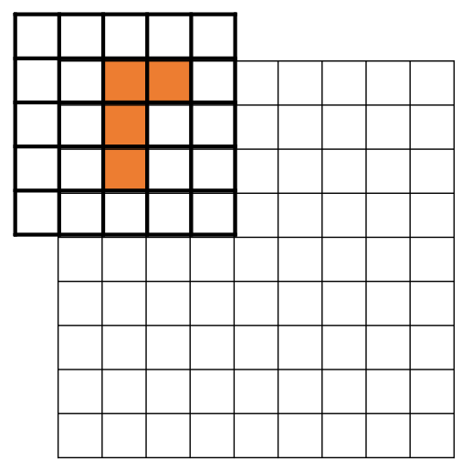

# State

## 1.

**state의 데이터 형식을 설정하고 그것에 맞춰 함수 알고리즘을 설정할 수도 있고 함수 알고리즘에 맞춰 데이터 형식을 설정할 수도 있다.**

내 경우를 예를 들어보면

{: width="50%" height="50%" class="align-center"}

9X9 board가 있고 5x5 배열에 저장된 블록을 board에 놓을 수 있는지 판단해야한다. 그것에 대해 연산하기 위하여 음수를 사용했다. 알고리즘을 짤 때는 `numpy`의 default 형식인 `int32` 기준으로 짰다. 그리고 나중에 적절한 데이터타입에 대한 실험을 하기 위해 `int`, `uint`, `float`들에 대하여 판단해 보았는데, uint에 대해서 casting 오류가 났다.

내 경우는 상태를 표현하는데 0과 1만 사용하기에 별 상관이 없었지만 만약 127~255 사이의 숫자를 사용해야 하는 상황이라면 `uint`를 사용해도 될 것을 `int`를 사용해야 하는 상황이 되는 것이다.

그리고 함수 자체도 음수를 사용하지 않아도 구현 난이도에는 큰 차이가 없었다. 이럴 경우 `uint`를 사용하는 것이 맞다. 내 경우에는 큰 차이가 없어서 그냥 냅두기로 했으나 다음에는 `state`의 데이터 타입에 대한 고려를 하고 `environment`를 구성하기로 했다.

## 2.

`deepcopy`와 `shallow_copy`에 주의한다.

나의 경우

```
...
envs
  ├─blocks.py
  ├─woodoku_env.py
  └─__init__.py
...
```
의 구조를 가지고 있었는데

```python
# blocks.py
# blocks['woodoku'].shape : (47, 5, 5)
blocks = {'woodoku': np.array([
    # 0
    [[0, 0, 0, 0, 0],
     [0, 0, 0, 0, 0],
     [1, 1, 1, 1, 1],
     [0, 0, 0, 0, 0],
     [0, 0, 0, 0, 0]],
     ...
```

```python
# woodoku_env.py
from .blocks import blocks
...
self._block_list = blocks[game_mode]

def _get_3_blocks(self) -> tuple:
        a = random.sample(range(self._block_list.shape[0]), 3)
        return (self._block_list[a[0]].copy(),
                self._block_list[a[1]].copy(),
                self._block_list[a[2]].copy())
```
근데 나는 `woodoku_env.py`에서 `blocks.py`를 `import` 한후 위와같이 `class` 변수에 그대로 대입하고 그것을 `_get_3_blocks`를 이용하여 그대로 사용했다.
지금은 수정되었지만 지금은 `copy()`를 하지 않고 그대로 `return`하여 `shallow copy`가 되어버렸고 이후 해당 블록을 모두 0으로 만들어버리는 연산이 있었는데 결국 `self._block_list` 가 훼손되었다. 이후 디버그를 통해 `copy()`연산으로 `deep copy`를 하여 해결할 수 있었다.
