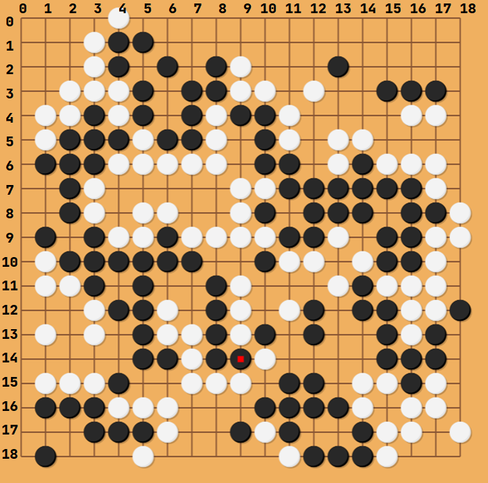

### 해당 포스트는 아래 글로 새로 업데이트 되었습니다. 삭제하기 아까워 남깁니다.

### [gymnasium 기반 single agent custom 강화학습 환경 만들기](https://helpingstar.github.io/rl/custom_rl_env_single/)

---

---

# State

## 1.

**state의 데이터 형식을 설정하고 그것에 맞춰 함수 알고리즘을 설정할 수도 있고 함수 알고리즘에 맞춰 데이터 형식을 설정할 수도 있다.**

내 경우를 예를 들어보면

{: width="50%" height="50%" class="align-center"}

9X9 board가 있고 5x5 배열에 저장된 블록을 board에 놓을 수 있는지 판단해야한다. 그것에 대해 연산하기 위하여 음수를 사용했다. 알고리즘을 짤 때는 `numpy`의 default 형식인 `int32` 기준으로 짰다. 그리고 나중에 적절한 데이터타입에 대한 실험을 하기 위해 `int`, `uint`, `float`들에 대하여 판단해 보았는데, uint에 대해서 casting 오류가 났다.

내 경우는 상태를 표현하는데 0과 1만 사용하기에 별 상관이 없었지만 만약 127~255 사이의 숫자를 사용해야 하는 상황이라면 `uint`를 사용해도 될 것을 `int`를 사용해야 하는 상황이 되는 것이다.

그리고 함수 자체도 음수를 사용하지 않아도 구현 난이도에는 큰 차이가 없었다. 이럴 경우 `uint`를 사용하는 것이 맞다. 내 경우에는 큰 차이가 없어서 그냥 냅두기로 했으나 다음에는 `state`의 데이터 타입에 대한 고려를 하고 `environment`를 구성하기로 했다.

## 2.

`deepcopy`와 `shallow_copy`에 주의한다.

나의 경우

```
...
envs
  ├─blocks.py
  ├─woodoku_env.py
  └─__init__.py
...
```
의 구조를 가지고 있었는데

```python
# blocks.py
# blocks['woodoku'].shape : (47, 5, 5)
blocks = {'woodoku': np.array([
    # 0
    [[0, 0, 0, 0, 0],
     [0, 0, 0, 0, 0],
     [1, 1, 1, 1, 1],
     [0, 0, 0, 0, 0],
     [0, 0, 0, 0, 0]],
     ...
```

```python
# woodoku_env.py
from .blocks import blocks
...
self._block_list = blocks[game_mode]

def _get_3_blocks(self) -> tuple:
        a = random.sample(range(self._block_list.shape[0]), 3)
        return (self._block_list[a[0]].copy(),
                self._block_list[a[1]].copy(),
                self._block_list[a[2]].copy())
```
근데 나는 `woodoku_env.py`에서 `blocks.py`를 `import` 한후 위와같이 `class` 변수에 그대로 대입하고 그것을 `_get_3_blocks`를 이용하여 그대로 사용했다.
지금은 수정되었지만 지금은 `copy()`를 하지 않고 그대로 `return`하여 `shallow copy`가 되어버렸고 이후 해당 블록을 모두 0으로 만들어버리는 연산이 있었는데 결국 `self._block_list` 가 훼손되었다. 이후 디버그를 통해 `copy()`연산으로 `deep copy`를 하여 해결할 수 있었다.

# Action

## 1. 할 수 있는데 안되는 행동
Action에는 못하는 것이 있고, 할수 있는데 안되는 것이 있다 말이 애매하니 예를 들어보겠다

바둑을 예로 들어보자 바둑판은 19X19의 칸으로 구성되어 있다.

{: width="50%" height="50%" class="align-center"}

그럼 아마 환경을 만들때 `action_space`를 `MultiDiscrete([19, 19])` 혹은 `Discrete(361)`로 정의를 하게 될 것이다. 후자는 `[x // 19, x % 19]`로 바꾸면 전자와 같기에 설명을 위해 표기는 전자의 방식을 하겠다. 전자의 경우 index는 0부터 시작하여 `[x, y]`는 x행의 y열에 돌을 두는 행위라고 하자, 이때 여기서는 만약 `x`, `y`가 19 이상의 값을 가진다면 이것은 오류를 발생시켜야 한다. 아마 해당 값이 `action_space`에 속해있지 않기 때문에 `gym`라이브러리에서 에러를 발생시킬 것이다. 예를 들어 `[20, 20]` 처럼 20행, 20열에는 돌을 둘 수 없기 때문이다.

그런데 다음 경우를 보자

{: width="50%" height="50%" class="align-center"}

여기에 `action`으로 `[1, 3]`을 한다고 생각하자, 해당 `action`은 문제가 없어 보인다. 하지만 생각해야할 점이 있다. 해당 위치에는 이미 돌이 있기 때문에 돌을 놓을 수 없기 때문이다. 근데 앞에서 소개한 돌을 놓을 수 없다는 것과는 의미가 약간 다르다. 앞에서 말한 '안된다'는 것은 아예 정의되지 않은 행위이기 때문이고 뒤에서 말한 '안된다'는 가능한 행위이나 게임 내적 규칙으로 인해 유효하지 않은 행위이기 때문이다.

약간 다르지만 비슷한 상황으로 atari의 breakout에서 맨 오른쪽에서 action을 '오른쪽으로 가기'를 선택하는 것도 있다.

{: width="50%" height="50%" class="align-center"}

[Image source]([atari_breakout](https://towardsdatascience.com/tutorial-double-deep-q-learning-with-dueling-network-architectures-4c1b3fb7f756))


이럴때 `step`을 어떻게 해야할까

물론 정답은 없지만 나는 이 상황에서 `assert`를 하는 것은 적절하지 않다는 생각이다.

물론 환경마다 처리방식은 다를 수 있다. 바둑의 경우 해당 행위를 '아무 돌도 두지 않기'로 바꿔서 `step` 할 수도 있고 atari의 breakout의 맨 오른쪽에서 오른쪽으로 가는 행위는 그냥 처리해도 문제는 없다.

이에 대한 내생각은 다음과 같다

1. `action`이 이산적일 경우 유효한 행동에 한해서 최대의 값을 뽑아낼 수는 있겠지만 각 상태에 따라 유효한 행동을 골라내는 작업이 상당히 오래 걸릴 수 있다. 특히나 `action_space`가 연속적일 경우 이는 더 오래 걸릴 수 있다.
2. 해당 `action`을 오류가 안나지 않는 선에서 적절히 처리해준다면 (바둑의 예시처럼 아무 동작도 안하는 것) 해당 `action`은 결국 장기적으로 `Q value`가 떨어질 것이고 해당 행동을 덜 선택하게 될 것이기 때문이다.
3. 유효하지 않은 행동은 환경에 따라 상당히 여러가지가 될 수 있는데 모든 경우에 대해 적절히 한 `action`으로 일반화하지 않고 각각 처리해준다면 강화학습의 일반화 측면에서도 맞지 않고 알고리즘의 확장성도 떨어질 수 있다.

해당 생각으로 내가 강화학습 환경을 만든다면 유효하지 않은 행동에 대해서는 아직 최대한 개입을 하지 않는 것으로 하고 있다. 더 공부하게 된다면 생각이 바뀔지도 모르겠으나, 주변 사람에게 물어봐도 나와 같은 생각을 하고 있는 듯 하다.

# 2. action_mask

[**Action-1. 할 수 있는데 안되는 행동**](#1-할-수-있는데-안되는-행동) 에서 나온 상황을 Illegal Action 이라고 칭한다.

Petting Zoo documentation을 보다가 알았다. 특히 2인용게임의 보드게임에서 많이 나오는 상황이기 때문인 듯 하다.

이렇게 Illegal Action이 있는 환경같은 경우에는 Legal Action과 Illegal Action을 구분해서 표시해주는 action_mask를 구현하는게 좋다. Legal Action을 1, Illegal Action을 0으로 표시한다.

info에 넣는 방법이 있고 observation에 넣는 방법이 있다. gymnasium 환경에서는 info에 넣는 것이 좋은 것 같다. pettingzoo에서는 observation에 넣는 것이 표준인 듯 하다.

# Space

## 1.

**[해당 커밋](https://github.com/Farama-Foundation/Gymnasium/commit/1bf58d8eb46dcb7e2da1a34c35b19af2565badf1#diff-09b11a63d0b8a53af3031d436624c12c82864156a4eddf296179b4cf85f26f12L33-L38)을 보면 WARN을 발생시키는 해당 코드가 지워졌다. 차기 버전에서는 오류가 뜨지 않게 될 듯 하다.**

여태까지 [gym_woodoku](https://github.com/helpingstar/gym-woodoku), [gym_snakegame](https://github.com/helpingstar/gym-snakegame), [gym-game2048](https://github.com/helpingstar/gym-game2048) 을 만들었다. 각 observation은 다음과 같은데
1. gym-woodoku : 25 x 25 그리드에 각 셀이 0또는 1
2. gym-snakegame : size X size 그리드에 각 셀이 4개의 값 중 하나
3. gym-game2048 : size X size 그리드에 각 셀이 11개의 값 중 하나

이를 구현하기 위해 `observation_space`를 정의해야 하는데 `gymnasium`에는 각 게임에 해당하는 적절한 `Space`가 없다. 그나마 `Box`가 적합한데 예를 들어  `snakegame`에서는 그리드의 각 셀이 0, 1, 3, 5 중 하나의 값을 갖고 5는 지정된 개수만 존재하는데 `spaces.Box(low=0, high=5, shape=(size, size), dtype=np.float32)`는 보기에 적절해보이지만 적절하지 않다. $[\text{low}, \text{high}]$범위의 숫자가 임의로 등장할 수 있다는 뜻인데 게임에서는 불가능한 상황이 나올 수도 있기 때문이다. 예를 들면 그리드의 모든 셀이 apple인 경우가 그렇다. 또 4는 등장하지도 않는다.

`gym-game2048`에서는 처음에는 0, 2, 4, 8과 같이 실제 게임과 같이 환경 내부도 구현했다가. 0, 1, 2, 3으로 바꿨다. 그러면 이런 경우에는 `spaces.Box(low=0, high=self.board_goal, shape=(size, size, 1), dtype=np.uint8)`로 해도된다! 하지만
```
WARN: It seems a Box observation space is an image but the lower and upper bounds are not [0, 255]. Actual lower bound: 0, upper bound: 11. Generally, CNN policies assume observations are within that range, so you may encounter an issue if the observation values are not.
```

과 같은 `WARN`이 발생한다. `Box` observation space가 이미지같아 보이는데 정수라면 [0, 255]의 범위를 가져야하는데 그렇지 않다는 것이다.

```python
if np.any(observation_space.low != 0) or np.any(observation_space.high != 255):
  logger.warn(
    "It seems a Box observation space is an image but the lower and upper bounds are not [0, 255]. "
    f"Actual lower bound: {np.min(observation_space.low)}, upper bound: {np.max(observation_space.high)}. "
    "Generally, CNN policies assume observations are within that range, so you may encounter an issue if the observation values are not."
  )
```

때문인데 이 때문에 Farama Foundation 디스코드에 물어봤더니
{: width="50%" height="50%" class="align-center"}

라는 답변을 달아주었다. 그래서 그냥 무시하기로했다.
