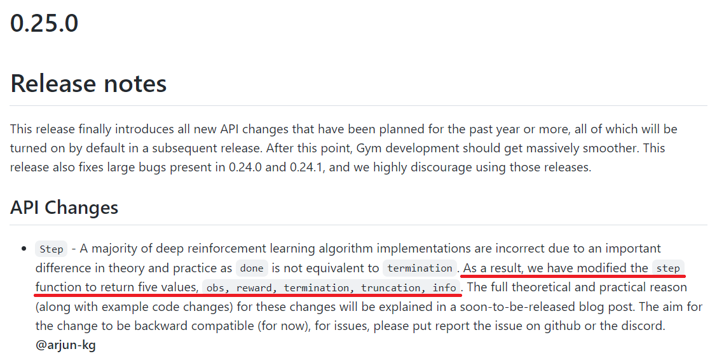
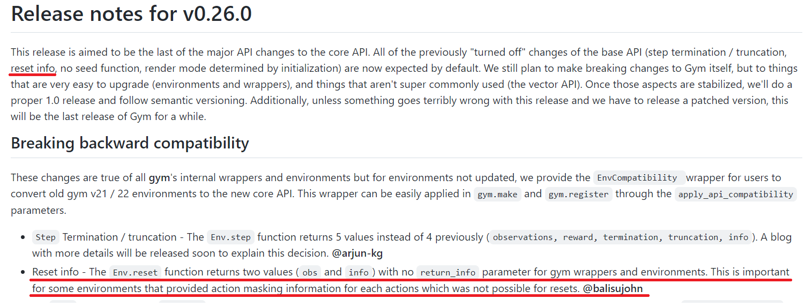

### 1.

```python
next_state, reward, done, _ = self.env.step(action)
```

```
ValueError: too many values to unpack (expected 4)
```

강화학습에서 `step`시 위와 같은 오류를 겪을때가 많다. 4개를 기대하고 있는데 그 이상의 `value`들이 unpack 되었다는 뜻이다.

{: width="80%" height="80%" class="align-center"}

기존에는 `step` 함수가 `(observation, reward, done, info)`를 반환했는데 `done`이 `truncated`, `terminated` 두 의미를 모두 담고 있기 때문에 그것을 구분하기 위하여 `(observation, reward, terminated, truncated, info)`로 4개에서 5개로 바뀌었다. 과거의 코드에서 `truncated` 부분이 구현되어 있지 않다면 `next_state, reward, done, _, _` 와 같이 `truncated` 부분을 무시하면 해결된다.

[gym github](https://github.com/openai/gym/commit/907b1b20dd9ac0cba5803225059b9c6673702467#diff-86c2f21adb3a307a751fcee4c6bea1f14f9dfcb99fa3f3d9161167c1377e8ffaR189)를 보면 `cartpole`에서 `step`의 `return`부분이 수정된 것을 확인할 수 있다.

### 2.

```python
state = self.env.reset()
...
self.obs_buf[self.ptr] = obs
```

```
ValueError: setting an array element with a sequence. The requested array would exceed the maximum number of dimension of 1.
```

`ReplayBuffer`에 `dimension`이 최대 1인 것을 넣어야 하는데 `sequence`가 들어가서 생긴 문제이다. `obs`부분에서 문제가 보통 발생하는데 이유는 다음과 같다.

{: width="80%" height="80%" class="align-center"}

`env.reset()` 도 바뀌었다. 그전에는 `env.reset()`에 `return_info=True`로 하면(default = `False`) `(obs, info)`를 반환했는데 이제는 무조건 `(obs, info)`를 반환하게 되었다. 그러므로 `reset`시에 `info`를 처리해줘야 하므로

```python
# info required
state, info = self.env.reset()
# no info required
state, _ = self.env.reset()
```
으로 바꿔주면 될 것이다.
