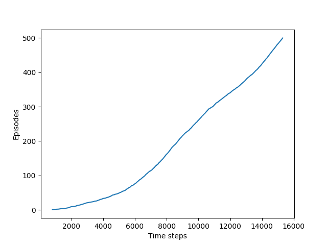

[ShangtongZhang github](https://github.com/ShangtongZhang/reinforcement-learning-an-introduction/tree/master/chapter06)

[단단한 강화학습](http://www.kyobobook.co.kr/product/detailViewKor.laf?ejkGb=KOR&mallGb=KOR&barcode=9791190665179&orderClick=LAG&Kc=) 책의 코드를 공부하기 위해 쓰여진 글이다.

# Windy GridWorld

```python
# world height
WORLD_HEIGHT = 7
# world width
WORLD_WIDTH = 10
# wind strength for each column
WIND = [0, 0, 0, 1, 1, 1, 2, 2, 1, 0]
# possible actions
ACTION_UP = 0
ACTION_DOWN = 1
ACTION_LEFT = 2
ACTION_RIGHT = 3
# probability for exploration
EPSILON = 0.1
# Sarsa step size
ALPHA = 0.5
# reward for each step
REWARD = -1.0
START = [3, 0]
GOAL = [3, 7]
ACTIONS = [ACTION_UP, ACTION_DOWN, ACTION_LEFT, ACTION_RIGHT]
```

* (1~4) : 환경의 높이(세로)가 7이고 너비(가로)가 10인 GridWorld를 만든다.
* (6) : 각 열에 해당하는 바람 값으로 바람이 있는 곳에서 이동하면 위로 이동하게 된다. 4번째 값이 1일때 4번째 열에서 이동하면 도착지점에서 한칸 위로 가게 된다.
* (13) : ε-greedy 정책을 위한 ε이다. ε의 확률로 무작위 행동을 한다.
* (15) : Q값 업데이트를 위한 step-size이다.
* (17) : 한 행동당 받는 보상이다. 좀 더 빠르게 목표에 도달하도록 유도할 것이다.
* (18~19) : 출발지점과 목표지점이다.
* (20) : 가능한 행동의 목록을 나타낸다.

```python
def step(state, action):
    i, j = state
    if action == ACTION_UP:
        return [max(i - 1 - WIND[j], 0), j]
    elif action == ACTION_DOWN:
        return [max(min(i + 1 - WIND[j], WORLD_HEIGHT - 1), 0), j]
    elif action == ACTION_LEFT:
        return [max(i - WIND[j], 0), max(j - 1, 0)]
    elif action == ACTION_RIGHT:
        return [max(i - WIND[j], 0), min(j + 1, WORLD_WIDTH - 1)]
    else:
        assert False
```
바람은 아래에서 위로 불기 때문에 행에 대해서 `WIND[j]`만큼 마이너스 연산을 하면된다

* (1) : `state`와 `action`을 인자로 받는다.
* (2) : `state`를 `i, j`에 언패킹한다 각각 행과 열이다. 숫자가 올라갈수록 아래로, 오른쪽 위치이다.
* (3~4) : 올라가는 행동이기 때문에 행 수준에 대해서 -1 연산을 한다. 그리고 바람에 대한 연산을 한다. 음수가 될 수 있기 때문에 최소값을 0으로 한다. (`max` 연산을 하므로 음수는 0을 반환한다.)
* (5~6) : 아래로 내려가기도 하고 위로 바람이 불수도 있다. 그러므로 i + 1 - WIND[j] 를 통해 위치를 계산하고 `[0, WORLD_HEIGHT-1]`로 클리핑한다. 0부터 시작하기 때문에 `WORLD_HEIGHT-1`이 최댓값이다.
* (7~10) : 행수준에 대해서는 바람의 영향만 계산하고 이는 위로 올라가기 때문에 음수의 값만 처리해준다. 왼쪽으로 가는 것은 `max`연산을 통해 음수가 되지 않게 하고 오른쪽으로 가는 것은 `min(j+1, WORLD_WIDTH - 1)`연산을 통해 주어진 너비를 넘어가지 않게 한다

```python
# play for an episode
def episode(q_value):
    # track the total time steps in this episode
    time = 0

    # initialize state
    state = START

    # choose an action based on epsilon-greedy algorithm
    if np.random.binomial(1, EPSILON) == 1:
        action = np.random.choice(ACTIONS)
    else:
        values_ = q_value[state[0], state[1], :]
        action = np.random.choice([action_ for action_, value_ in enumerate(values_) if value_ == np.max(values_)])

    # keep going until get to the goal state
    while state != GOAL:
        next_state = step(state, action)
        if np.random.binomial(1, EPSILON) == 1:
            next_action = np.random.choice(ACTIONS)
        else:
            values_ = q_value[next_state[0], next_state[1], :]
            next_action = np.random.choice([action_ for action_, value_ in enumerate(values_) if value_ == np.max(values_)])

        # Sarsa update
        q_value[state[0], state[1], action] += \
            ALPHA * (REWARD + q_value[next_state[0], next_state[1], next_action] -
                     q_value[state[0], state[1], action])
        state = next_state
        action = next_action
        time += 1
    return time
```
* (2) : 함수의 파라미터로 `q_value`를 받는다.
* (4) : `time`은 한 에피소드동안 총 tiem step을 나타내며 처음에 0으로 초기화된다.
* (7) : 시작위치를 초기 상태로 지정한다 ($s_0$)
* (10~11):

`numpy.random.binomial(n, p, size=None)` : Draw samples from a binomial distribution.

이항분포 확률에 따라 0에서 n까지의 숫자중 하나를 출력한다. 0부터 n까지의 숫자 중 어떤 숫자 x(p에 몇번 해당되었는지)가 산출될 확률은 아래와 같다.

$$P(N)=\binom{n}{x}p^x(1-p)^{n-x}$$

코드에서는 `np.random.binomial(1, EPSILON)`으로 되어 있는데 그러면 반환값이 1이 나올 확률이 `EPSILON`이 된다는 뜻이다. 그러므로 해당 조건문은 `EPSILON`의 확률로 `True`를 반환한다.

* (13) : `values_`에 `state`에 해당하는 Q값을 가져온다. `values_`는 현재 `state`의 각각의 `action`(4개)에 해당하는 Q값을 저장한다.
* (14) : 현재 상태에서 가장 Q값이 높은 행동을 선택한다. 이때 구현상 그냥 `max`를 쓸 경우 가장 앞에 있는 행동만 할 수 있기 때문에 함수 안에서 가장 높은 값을 가진 값들을 추려서 리스트에 넣은 후에(가장 큰 값을 가진 행동이 여러개일 수 있으므로) 그 리스트 안에서 랜덤으로 추첨한다.
* (17) : 목표지점에 도달할 때까지 행동을 계속한다.
* (18) : 환경에 대해 행동을 취하고 다음 상태를 받는다. `reward`도 받는 경우가 있는데 여기는 `reward`가 고정되어있다.
* (19~23) : (10~14)와 같다. `EPSILON`의 확률로 무작위 행동을 하고 이외에는 가장 Q값이 높은 행동을 `next_action`에 저장한다.
* (26~28) : 아래 수식과 같이 Q값을 업데이트한다.

$$ Q(S,A) \leftarrow Q(S,A)+\alpha \left [ R+\gamma Q(S',A')-Q(s,A)\right ]$$

* (29~30) : `next_state`와 `next_action`을 `state`, `action`에 저장한다.
* (32) : `time`을 반환한다. 이는 `step` 횟수가 될 수도 있고 -1을 곱하면 한 에피소드의 리턴값이 될 수 있다. (discount factor($\gamma$)가 없으므로)

```python
def figure_6_3():
    q_value = np.zeros((WORLD_HEIGHT, WORLD_WIDTH, 4))
    episode_limit = 500

    steps = []
    ep = 0
    while ep < episode_limit:
        steps.append(episode(q_value))
        # time = episode(q_value)
        # episodes.extend([ep] * time)
        ep += 1

    steps = np.add.accumulate(steps)

    plt.plot(steps, np.arange(1, len(steps) + 1))
```

* (2) : q_value는 `(WORLD_HEIGHT, WORLD_WIDTH)`의 각 공간에 4개의 값을 갖고 있다. (행동의 개수가 4개이므로)
* (3) : 총 실행할 에피소드 수이다.
* (5) : 각 에피소드의 `step` 수를 기록할 리스트이다.
* (6) : 반복문 탈출을 위한 에피소드 카운터이다.
* (8) : 한 에피소드를 실행하고 해당 결과를 `steps` 리스트에 추가한다.
* (13) :

`numpy.ufunc.accumulate(array, axis=0, dtype=None, out=None)` : Accumulate the result of applying the operator to all elements.

`ufunc`에 해당하는 연산을 오른쪽으로 이동하면서 수행한다. (누적연산이라 생각하면 될 것이다, `reduce`랑 비슷하다.)

```python
>>> np.add.accumulate([2, 3, 5])
array([ 2,  5, 10])
```

각 `steps`들을 누적하며 더하므로 결과로 `steps` 리스트의 x번째 요소의 값은 x번째 에피소드를 끝내기까지 걸린 `steps`의 총 누적수(업데이트 수)와 같을 것이다. 위 작은 예시로 생각하면 0번째는 2, 2번째까지는 10번의 `step`이 들었다고 생각하면 될 것이다.

* (15) : x축에는 `stpes`의 누적값, y에는 에피소드의 인덱스를 넣어 그래프를 그린다. 그래프의 기울기는 다음과 같다.

$$\text{gradient}=\frac{\text{episode}}{\text{steps}}$$

한 에피소드당 `step`이 적을수록 빠르게 도착했다는 뜻이므로 기울기 값이 높을수록 좋은 정책이라는 뜻이다.

{: width="50%" height="50%" class="align-center"}

// TODO 추가 그래프
