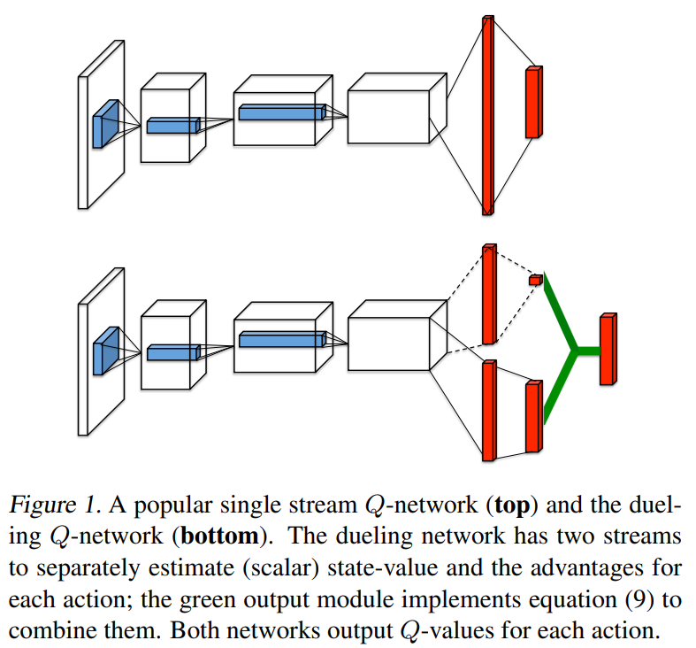
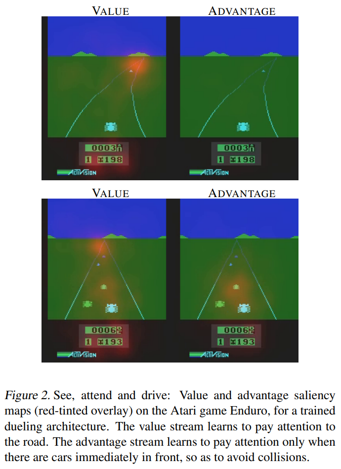

[Dueling Network Architectures for Deep Reinforcement Learning](https://arxiv.org/abs/1511.06581), Wang et al, 2015. Algorithm: Dueling DQN.

# Paper

## Abstract

Dueling network는 하나는 state value function, 하나는 state-dependent action advantage action로 두 개로 나뉘어진 estimator를 소개한다. 이 구조의 주된 이익은 근본적인 강화학습 알고리즘에 어떤 변화도 도입하지 않고 일반화된 학습을 하는 것이다. 우리의 결과는 이 구조가 많은 비슷한 가치의 행동들이 있을 때 더 나은 정책 평가를 유도한다.

## Introduction

최근 발전의 초점은 improved control 및 RL 알고리즘을 설계하거나 단순히 기존 신경망을 RL method에 통합하는데 있다. 우리는 주로 model-free RL에 더 적합한 신경망 구조를 혁신하는데 초점을 둔 보완적이고 대안적인 접근방법을 취한다.

dueling architecture이라고 명명한 제안된 구조는 state value와 state-dependent action advantage의 표현을 분명하게 분리한다. 그러면서 공통되는 convolutional feature learning module은 공유한다.

{: width="80%" height="80%" class="align-center"}

figure 1에서 보이는 것처럼 state-action value function Q를 추정하기 위해 두개의 흐름이 한 특별한 종합 층으로 결합된다. 이 dueling network는 Deep Q-Networks(2015) 같은 기존에 존재하는 single-stream Q network 을 대체하는 single Q network with two streams로 이해되어야 한다. Dueling network는 추가 지도(supervision) 없이 자동으로 state value function 과 advantage function으로 분리된 추정치를 생산한다.

직관적으로 dueling 구조는 각 상태에서의 각 행동이 어떤 효과를 가지는지 학습하지 않고 어떤 상태가 가치있는지 학습할 수 있다. 이것은 행동이 관련 방식으로 환경에 영향을 미치지 않는 상태에서 특히 유용하다.

{: width="80%" height="80%" class="align-center"}

이것을 분명히 보여주기 위해 Figure 2의 특징 맵을 보자. 그림은 두 다른 time step의 value와 advantage 특징 맵을 보여준다. 한 time step에서 (왼쪽), value network이 도로와 특히 새로운 차가 등장할 수 있는 지평선에 관심을 갖는 것을 볼 수 있다. 또한 점수판에도 관심을 가진다. Advantage stream에서는 차가 앞에 없을 때 행동 선택은 거의 무관하기 때문에 visual input 에 거의 관심을 갖지 않는다. 그러나 두번째 time step에서 (오른쪽) advantage stream은 차가 거의 앞에 있기 때문에 관심을 가지고 행동 선택을 매우 적절하게 만든다.

## The Dueling Network Architecture

Figure 2 그림에서 묘사된 것과 같이 우리의 새로운 구조의 주요 통찰은 많은 state에서 각 action 선택의 가치를 추정할 필요가 없다는 것이다. 예를 들어 Enduro 게임에서(Figure 2) 왼쪽으로 이동할지 오른쪽으로 이동할지는 충돌이 임박한 경우에만 중요하다. 몇몇 상태에서는, 어떤 행동을 취할지가 가장 중요했지만 많은 다른 상태에서는 행동을 선택하는 것이 어떤 일이 일어날지에 아무런 영향을 주지 않았다. 그러나 bootstrapping based algorithms에서는 모든 상태에서 state value를 측정하는 것이 대단히 중요했다.

이러한 통찰이 성과를 보기 위해, 우리는 dueling network이라고 명명한 Figure 1에 묘사된 것과 같이 single Q-network 을 고안하였다. dueling network의 lower layer는 original DQN 의 convolutional 같은 것이다. 하지만 Conv layer 뒤로 single fc layer 대신 두 fc layer stream을 사용하였다. stream들은 그것들이 value, advantage function 추정을 분리하는 기능을 가지도록 구성되었다. 최종적으로, 단일 Q function을 output으로 생산하기 위해 합쳐진다. 2015 DQN처럼 신경망의 출력은 Q value의 집합이며 각각 하나의 행동을 가리킨다.

dueling network의 출력은 Q function 이기 때문에 DDQN, SARSA같은 기존에 존재하는 많은 알고리즘과 같이 학습될 수 있다. 게다가 더 나은 replay memory라던지 더 나은 탐험 정책, 내재적 보상같이 알고리즘들에 개선을 할 수 있다.

fc layer의 두 스트림을 결합하여 Q 추정치를 출력하는 모듈은 매우 신중한 설계가 필요하다.

advantage $Q^{\pi}(s, a)=V^{\pi}(s) + A^{\pi}(s, a)$ 수식과 state-value $V^{\pi}(s) = \mathbb{E}\_{a \sim \pi (s)} \left [ Q^{\pi}(s,a)\right ]$는 $\mathbb{E}\_{a \sim \pi(s)}\left [ A^{\pi}(s,a) \right ]=0$을 따른다.게다가 결정론적인 정책에서, $a^{\ast} = \text{argmax}_{a'\in\mathcal{A}}Q(s,a')$는 $Q(s,a^{\ast})=V(s)$ 를 따르고  이런 이유로 $A(s,a^{\ast})=0$ 이 된다.

Figure 1에서 보여준 dueling network에서 한 fc layer stream은 scalar $V(s;\theta;\beta)$를 출력하고 다른 stream은 $\left | \mathcal{A}\right |$-차원의 벡터 $A(s,a;\theta;\alpha)$를 출력하도록 만들었다고 생각하자.
* $\theta$ : parameters of the conv layer
* $\alpha$, $\beta$ : parameters of two streams of fc layer

advantage 의 정의를 이용하여, 우리는 모듈을 종합한 구조를 다음과 같이 만들고 싶어질 것이다.

$$Q(s, a; \theta, \alpha, \beta)=V(s;\theta,\beta)+A(s, a; \theta, \alpha) \tag{7}$$

이 공식은 모든 $(s, a)$ 인스턴스에 적용한다. 그것은, 행렬 형태를 가진 표현 방정식 $(7)$에서 우리는 scalar $V(s;\theta, \beta)$를 $\left \| \mathcal{A}\right \|$번 복제해야 한다는 것을 주의해야 한다.

그러나 우리는 $Q(s, a; \theta, \alpha, \beta)$는 는 실제 Q-function의 parameterized estimate라는 것을 기억할 필요가 있다.게다가 $V(s; \theta, \beta)$가 state-value function의 좋은 estimator이거나 마찬가지로 $A(s, a; \theta, \alpha)$가 advantage function의 합리적인 estimate를 제공한다고 하는 것은 잘못된 것이다.

Equation $(7)$은 주어진 $Q$로 $V$와 $A$를 유일하게 복구할 수 없다는 점에서 식별할 수 없다. 이것을 보기 위해 상수를 $V(s;\theta,\beta)$에 더하고 같은 상수를 $A(s,a; \theta, \alpha)$에 뺀다고 하자. 이 상수는 상쇄되어 같은 Q 값이 된다. 이 식별 가능성의 부족은 이 방정식을 직접 사용할 때 부족한 실제 성능으로 반영된다.

이런 식별 가능성 문제를 설명하기 위해 우리는 advantage function estimator가 선택한 행동에서 zero advantage를 가지게 강제할 수 있다. 즉, 우리는 네트워크의 마지막 모듈을 아래와 같이 정방향 매핑을 구현한다.

$$
\begin{align*}
Q(s,a;\theta,\alpha,\beta)=V(s;\theta,\beta)+ & \\
& \left ( A(s, a; \theta, \alpha) - \underset{a' \in \left | \mathcal{A} \right |}{\max}A(s,a';\theta,\alpha) \right ). \tag{8}
\end{align*}
$$

이제, $a^{\ast}=\text{argmax}\_{a' \in \mathcal{A}}Q(s,a';\theta, \alpha, \beta) = \text{argmax}\_{a' \in \mathcal{A}} A(s,a';\theta,\alpha)$, 에서 우리는 $Q(s,a^{\ast};\theta, \alpha, \beta)=V(s;\theta, \beta)$.을 얻는다. 그런 이유로 stream $V(s;\theta, \beta)$는 다른 stream이 advantage function에 대한 추정을 출력하는 동안 value function에 대한 추정을 출력한다.

대체 모듈은 max operator 를 average로 대체한다.

$$
\begin{align*}
Q(s, a; \theta, \alpha, \beta)=V(s;\theta, \beta)+  & \\
&\left(A(s, a; \theta, \alpha) - \frac{1}{\left|A\right|}\sum_{a'}A(s, a'; \theta, \alpha) \right). \tag{9}
\end{align*}
$$

한편으로는 $V$와 $A$가 이제 상수에 의해 off-target이기 때문에 $V$와 $A$의 원래 의미를 잃지만 다른 한편으로는 최적화의 안정성을 높인다. $(9)$에서 advantage는 $(8)$에서 optimal action's advantage에 대한 변경을 보상하는 대신 평균만큼 빨리 변경하면 된다. 우리는 equation $(8)$의 softmax version도 실험했지만, equation $(9)$의 간단한 module과 결과가 비슷했다. 그러므로 모든 실험은 equation $(9)$를 이용했다.

Equation $(9)$에서 평균을 빼는 것은 identifiability를 도와주는 것이지, $A$, $Q$의 상대적인 순위를 변경하지는 않으므로 Equation $(7)$의 Q값에 기반한 greedy나 $\varepsilon$-greedy 정책은 유지된다. 실행시에 의사결정을 위한 advantage stream을 평가하기 위하기에는 충분하다.

Equation $(9)$가 별도의 알고리즘 단계가 아니라 네트워크의 일부로 보고 구현된다는 점에 유의해야 한다. Standard Q networks와 같이 dueling architecture를 학습하는 것은 오직 back-propagation을 요구한다. $V(s; \theta, \beta)$와 $A(s,a;\theta, \alpha)$는 추가 지도나 알고리즘적 수정 없이 자동으로 계산된다.

Dueling architecture가 standard Q networks와 같은 입출력 형태를 가지기 때문에 duelign architecture를 학습하기 위해 Q network를 가진 모든 학습을 재활용할 수 있다.
