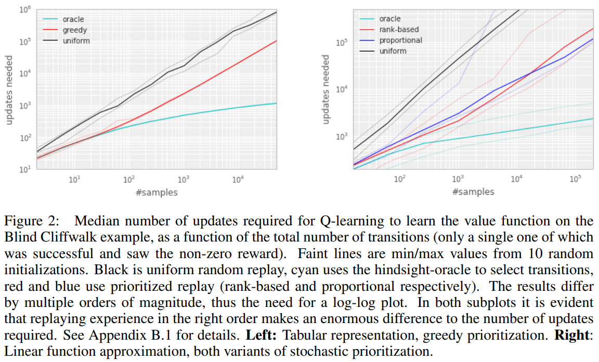
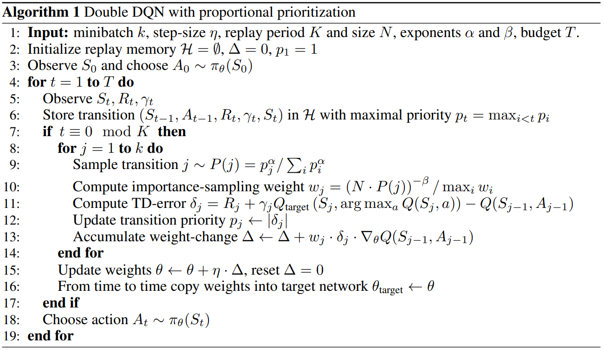

[Prioritized Experience Replay](https://arxiv.org/abs/1511.05952), Schaul et al, 2015. Algorithm: Prioritized Experience Replay (PER).

# Paper

## Abstract

Experience replay는 online reinforcement learning agent가 과거의 경험들을 기억하고 재사용할 수 있게 해준다. 과거의 일에서는 experience transition이 replay memory로부터 균일하게 추출되었다. 그러나 이런 접근은 transition을 본래 경험한 대로 중요성에 관계없이 재현할 뿐이다. 이 논문에서 중요한 transition을 더 자주 재현하여 더 효율적으로 학습하기 위해 경험에 우선순위를 매기는(prioritizing) 프레임워크를 개발하였다. 우리는 많은 아타리 게임에서 인간 수준의 성과를 거둔 DQN 강화학습 알고리즘에 PER을 사용하였다. PER를 적용한 DQN은 SOTA를 달성하였고 49개의 게임 중 41게의 게임에서 uniform replay를 능가하였다.

## Introduction

Online reinforcement learning agent는 경험의 흐름을 관찰하는 동안 정책, 가치함수, 모델의 파라미터를 점점 갱신한다. 가장 간단한 형태로 그것은 단일 업데이트 후에 들어오는 데이터를 바로 폐기한다. 이것에 대한 두가지 문제는 (a) 많은 유명한 확률적 기울기 기반 알고리즘의 iid 가정을 깨는 강력히 연관된 업데이트 (b) 나중에 유용할 수 있는 희귀한 경험들을 빠르게 잊어버리는 것 이다.

Experience Replay는 이 두 가지 문제를 다룬다. replay memory에 경험들을 저장하면, 적은 최근의 경험을 많은 경험들과 섞어서 업데이트에 사용함으로써 시간적 상호연관성을 깨는 것이 가능해진다. 그리고 희귀한 경험들은 단일 업데이트보다 더 많이 사용될 것이다. 이것은 심층 신경망으로 표현된 가치함수의 학습을 experience replay를 이용하여 안정시키는 DQN 알고리즘 논문에 설명되었다. 특히 DQN는 랜덤으로 균일하게 샘플링하고 각각의 transition을 재방문하는 큰 sliding window replay memory(순차적으로 저장하는 것을 말하는 듯)을 사용하였다. 일반적으로 experience replay는 학습에 필요한 경험의 양을 줄일 수 있고 그것을 더 많은 연산량과 메모리로 대체한다. 이것들은 RL agent가 그들의 환경과 직접 상호작용하는 것보다 싸다. (더 많은 메모리와 연산량을 가지는 대신 더 적은 경험을 필요로 하는데 이것은 환경과의 상호작용을 늘리는 것보다 싸다는 뜻이다)

특별하게, 우리는 TD error의 양으로 측정된 학습 진척이 클 것으로 기대되는 transition을 더 자주 재현하는 것을 제시한다. 이렇게 우선순위를 매기는 것은 다양성의 상실로 이어질 수 있으며, 이는 확률적 우선순위로 완화되며 중요도 샘플링을 통해 수정되는 편향을 도입한다. 우리의 결과 알고리즘은 더 빠른 학습과 SOTA 성과를 얻은 Atari 2600 benchmark들에서 소개했듯이 강건하고 가변적이다.

## Prioritized Replay

Replay memory를 사용하는 것은 두 가지 수준에서 선택하도록 하는 것으로 이어진다. 하나는 경험을 저장하는 것이고, 하나는 경험을 재현하는 것이다. 이 논문은 후자에 대해서만 소개한다. 학습을 위해 replay memory를 가장 효율적으로 사용하는 것은 우리의 control의 밖이라고 가정한다.

### A motivating example

{: width="50%" height="50%" class="align-center"}

우선순위 지정의 잠재적인 이점을 이해하기위해, 우리는 보상이 드물어 탐험을 요구하는 것을 예시화한 인공적인 환경 (Figure 1의 왼쪽) 'Blind Cliffwalk'을 소개한다. n개의 상태만으로 환경은 첫번째 non-zero reward까지 기하급수적인 개수의 임의적인 step을 필요로 한다. 정확히 말하면 일련의 임의적인 행동으로 보상으로 이어질 확률은 $2^{-n}$이다. 게다가 가장 연관있는 transition(희귀한 성공에 의한)은 많은 상당히 불필요한 실패 사례 (양발 로봇이 어떻게 걷는지 알기 전까지 반복적으로 실패하는 것과 비슷하게) 속에 숨겨져 있다.

우리는 두 에이전트의 학습 시간 차이를 강조하기 위해 이 예시를 사용하였다. 두 에이전트는 같은 replay memory에서 추출된 transition을 통해 Q-learning update를 수행하였다. 첫번째 에이전트는 random으로 균일하게 transition을 재현하였고 두 번쨰 에이전트는 oracle(절대자, 이상적인 상황을 생각하면 된다)을 통해 transition에 우선순위를 매겼다. 이 oracle은 현재 상태(돌아보면, 파라미터 업데이트 후)에서 global loss를 최대로 줄일 수 있는 transition을  greedy하게 선택한다. Figiure 1의 오른쪽은 transition을 좋은 순서로 선택하는 것이 uniform choice에 비해 기하급수적인 속도 상승으로 이어질 수 있다는 것을 보여준다. oracle은 물론 비현실적이다, 하지만 큰 차이는 uniform random replay을 개선하는 실용적인 접근을 위한 연구에 동기를 부여하였다.

### Prioritizing with TD-Error

prioritized replay의 중심적인 요소는 각 transition의 중요성을 측정하는 기준이다. 한 이상적인 기준은 RL agent가 현재의 상태에서 학습할 수 있는 양일 것이다(기대되는 학습 진행). 이런 측정은 직접적으로 측정가능하지 못하는데 반하여 얼마나 '놀라운지' 또는 기대하지 못한 transition인지(특히 가치가 그것의 next step bootstrap 추정치와 얼마나 차이가 큰지)를 나타내는 transition의 TD Error $\delta$의 크기는 합리적인 대안이다. 이것은 미리 TD-error 를 계산하고 $\delta$에 비례하여 파라미터를 업데이트하는 SARSA나 Q-learning같은 incremental, online RL algorithm에 적합하다. 예를 들어 보상이 noisy할 때와 같은 상황은 TD-Error가 좋지 못한 추정일 수 있다.

{: width="50%" height="50%" class="align-center"}

TD error에 의한 prioritizing replay의 잠재적인 효율성을 설명하기 위해 'Blind Cliffwalk' 환경에서 uniform, oracle baseline과 'greedy TD-Error prioritization'을 비교하였다. 이 알고리즘은 가장 최근에 마주친 TD error 를 각각의 transition과 같이 replay memory에 저장한다. 가장 큰 aboluste TD error를 가진 transition은 memory에서 재현된다. Q-learning 업데이트는 이 TD error에 비례하여 가중치를 업데이트하는 transition에 적용된다. 새로운 transition은 알려진 TD-error 없이 도착하므로 모든 경험이 최소 한 번은 볼 수 있도록 보장하기 위해 그것들에게 최대의 우선순위를 부여한다. Figure 2의 오른쪽은 이 알고리즘이 Blind Cliffwalk task를 풀기 위해 요구되는 노력을 상당히 줄인 결과를 보여준다.

**Implementation** : 큰 메모리 사이즈 $N$을 조절하기 위해, 우리는 우선순위 큐를 위해 최대 우선순위를 가진 transition을 샘플링 할 때는 $O(1)$, 우선순위(learning step후에 새로운 TD-error)를 업데이트 할 때는 $O(\log N)$가 소요되는 이진 힙 자료구조를 사용하였다.

### Stochastic Prioritization

하지만, greedy TD-error prioritization은 몇몇 문제를 가지고 있다. 첫 번째, 전체 replay memory에 대한 expensive sweeps를 피하기 위해 replay되는 transition에 대해서만 TD error 가 업데이트된다. 한 결과는 처음 방문시 TD error가 낮은 transition이 오랫동안 재생되지 않을 수 있다는 것이다(이것은 사실상 sliding window replay memory를 사용하지 않음을 의미한다). 게다가, 그것은 근사 오류가 다른 noise의 원인으로 나타나는 bootstrapping에 의해 악하될 수 있는 noise spike에 예민하다(예를 들어 보상이 확률적일 때). 마지막으로, greedy prioritization은 경험의 작은 부분에 초점을 맞춘다. 오류는 특히 함수 근사를 사용할 때 천천히 줄어든다. 즉, 처음에 높은 오류를 가진 transition이 자주 재현된다는 뜻이다. 이런 다양성의 부족은 시스템을 과대적합하는 경향이 있다.

이 문제를 극복하기 위해서, pure greedy prioritization과 uniform random sampling을 보간한 stochastic sampling 방법을 소개한다.
우리는 lowest-priority transition에서도 0이 아닌 확률을 보장하면서 transition의 priority에서 샘플링 확률이 단조로운 것을 보장한다. 구체적으로, 우리는 transition $i$의 샘플링 확률을 다음과 같이 정의한다.

$$P(i)=\frac{p_{i}^{\alpha}}{\sum_{k}p_{k}^{\alpha}} \tag{1}$$

$p_i > 0$은 transition $i$의 우선순위를 나타낸다. 지수 $\alpha$는 얼마나 우선순위가 반영될지를 결정한다. $\alpha = 0$일 때 uniform case를 나타낸다.

우리가 고려한 첫 번째 변형은 $p_i = \left \| \delta_{i} \right \| + \epsilon$인 직접적이고 부분적인 우선순위이다. $\epsilon$은 오류가 0일 때 transition을 다시 방문하지 않는 극단적 경우를 방지하기 위한 아주 작은 양수이다. 두번째 변형은 $p_i=\frac{1}{\text{rank}(i)}$인 간접적이고 순위 기반의 우선순위이다. $\text{rank}(i)$는 replay memory가 $\left\| \delta_{i} \right\|$ 에 따라 정렬되어 있을 때의 transition $i$의 순위이다. 이 경우에서 $P$는 지수 $\alpha$에 따른 power-law distribution이 된다. 두 분포는 모두 $\left\| \delta_{i} \right\|$에서 단조롭지만, 후자가 이상치에 더 둔감하기 때문에 더 강건할 것 같다. stochastic prioritization의 두 변형은 Figure 2의 오른쪽과 같이 Cliffwalk task에서 uniform baseline에서 훨씬 속도를 높였다.

**Implementation** : $(1)$ 분포에서 효율적으로 샘플링하기 위해, 복잡도는 $N$에 의존할 수 없다. 순위 기반 변형의 경우, 동일한 확률의 k 세그먼트를 사용하여 piecewise linear function를 사용하여 누적 밀도 함수를 근사할 수 있다. segment 경계들은 미리 계산될 수 있다(경계들은 $N$이나 $\alpha$가 바뀔때 바뀐다). 실행시간에, segment를 샘플링하고 그 안에서 transition을 균일하게 샘플링한다. 이것은 미니 배치 사이즈인 $k$개를 고르고 각 segment에서 정확히 한 개의 transition을 샘플링하는 미니배치 기반 알고리즘과 함께 사용될때 특히 좋다. segment는 미니배치의 균형을 맞추는 추가 이점이 있는 stratified sampling의 한 형태이다. (항상 높은 크기의 $\delta$를 가진 transition과 중간 크기의 transition이 하나 있을 것이다). The proportional variant는 다르며, 효율적으로 업데이트하고 샘플링할 수 있는 'sum-tree' 자료구조(여기서 모든 노드는 자식 노드의 합이며, 우선 순위가 리프 노드이다)를 기반으로 하는 효율적인 구현을 허용한다.

{: width="50%" height="50%" class="align-center"}

### Annealing The Bias

Stochastic update들을 사용한 예상 값 추정은 그것의 기대값과 같은 분포의 업데이트에 의존한다. Prioritized replay는 통제되지 않은 방식으로 그것의 분포를 바꾸기 때문에 bias를 들여오고 따라서 추정이 수렴되는 솔루션을 변경한다(정책 및 상태 분포가 고정된 경우에도). 우리는 $\beta=1$일 때 non-uniform 확률들인 $P(i)$ 을 완전히 보상하는 importance sampling(IS) weights를 사용함으로써 이 편향을 바로잡을 수 있다.

$$w_{i}=\left ( \frac{1}{N} \cdot \frac{1}{P(i)} \right )^{\beta}$$

이 가중치는 $w_{i}\delta_{i}$를 $\delta_{i}$ 대신 사용함으로써 Q-learning에 편입될 수 있다(그러므로 이것은 일반적인 IS가 아니라 weighted IS이다). 안정성상의 이유로, 우리는 $1/\max_{i}w_{i}$로 항상 정규화하여 업데이트를 하향조정한다.

일반적인 강화학습 시나리오에서는 변화하는 정책, 상태 분포 및 bootstrap targets으로 인해 프로세스가 상당히 non-stationary하기 때문에 훈련이 끝날 때 수렴 근처에서 업데이트의 편향되지 않은 특성이 가장 중요하다. 우리는 작은 편향은 이 맥락에서 무시될 수 있다고 가정하였다. 그러므로 우리는 $\beta$를 학습의 마지막에 1에 도달하도록 정의함으로써 훈련시간동안 importance sampling correction의 정도를 annealing하는 것의 유연성을 이용하였다. 실제로 우리는 $\beta$를 $\beta_0$부터 1까지 선형적으로 annealing하였다. 이 하이퍼파라미터를 고르는 것은 prioritization exponent $\alpha$를 고르는 것과 상호작용한다는 것을 주의하라. 두가지를 동시에 증가시키면 더 강력하게 수정(IS weight)하는 동시에 더 공격적으로 샘플링의 우선순위를 지정한다.

Importance Sampling은 (심층 신경망같은) 비선형 함수 근사의 맥락에서 prioritized replay와 결합될 때 또 다른 이점을 가지고 있다. 여기 큰 step들은 기울기의 1차 근사가 지역적으로만 신뢰할 수 있고 더 작은 global step-size로 방지해야 하기 때문에 매우 파괴적일 수 있다. 대신 우리의 접근인 prioritization은 큰 오류의 transition은 자주 보이는 것을 보장하는 반면 IS 수정은 기울기의 크기(따라서 매개변수 공간에서 효율적인 step-size)를 줄이고, 알고리즘이 고도의 비선형 최적화의 곡률을 따르도록 한다(TD-Error가 크기 때문에 경사가 크다는 뜻인듯). 테일러 급수가 지속적으로 재근사되기 때문이다.

우리는 우리의 prioritized replay 알고리즘을 SOTA인 Double DQN알고리즘에 기반을 둔 full-scale RL agent에 결합하였다. 우리의 이론적인 수정은 Double DQN에서 쓰인 uniform random sampling을 우리의 stochastic prioritization and importance sampling method로 대체한 것이다.
