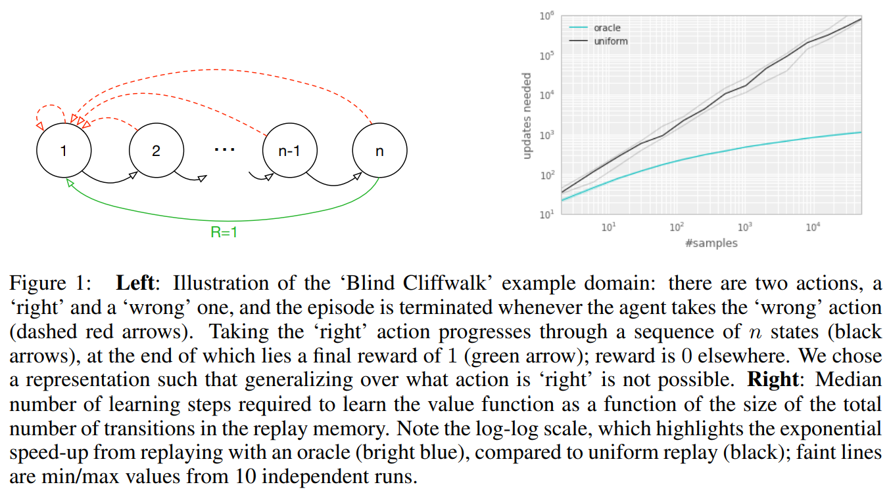

[Prioritized Experience Replay](https://arxiv.org/abs/1511.05952), Schaul et al, 2015. Algorithm: Prioritized Experience Replay (PER).

# Paper

## Abstract

Experience replay는 online reinforcement learning agent가 과거의 경험들을 기억하고 재사용할 수 있게 해준다. 과거의 일에서는 experience transition이 replay memory로부터 균일하게 추출되었다. 그러나 이런 접근은 transition을 본래 경험한 대로 중요성에 관계없이 재현할 뿐이다. 이 논문에서 중요한 transition을 더 자주 재현하여 더 효율적으로 학습하기 위해 경험에 우선순위를 매기는(prioritizing) 프레임워크를 개발하였다. 우리는 많은 아타리 게임에서 인간 수준의 성과를 거둔 DQN 강화학습 알고리즘에 PER을 사용하였다. PER를 적용한 DQN은 SOTA를 달성하였고 49개의 게임 중 41게의 게임에서 uniform replay를 능가하였다.

## Introduction

Online reinforcement learning agent는 경험의 흐름을 관찰하는 동안 정책, 가치함수, 모델의 파라미터를 점점 갱신한다. 가장 간단한 형태로 그것은 단일 업데이트 후에 들어오는 데이터를 바로 폐기한다. 이것에 대한 두가지 문제는 (a) 많은 유명한 확률적 기울기 기반 알고리즘의 iid 가정을 깨는 강력히 연관된 업데이트 (b) 나중에 유용할 수 있는 희귀한 경험들을 빠르게 잊어버리는 것 이다.

Experience Replay는 이 두 가지 문제를 다룬다. replay memory에 경험들을 저장하면, 적은 최근의 경험을 많은 경험들과 섞어서 업데이트에 사용함으로써 시간적 상호연관성을 깨는 것이 가능해진다. 그리고 희귀한 경험들은 단일 업데이트보다 더 많이 사용될 것이다. 이것은 심층 신경망으로 표현된 가치함수의 학습을 experience replay를 이용하여 안정시키는 DQN 알고리즘 논문에 설명되었다. 특히 DQN는 랜덤으로 균일하게 샘플링하고 각각의 transition을 재방문하는 큰 sliding window replay memory(순차적으로 저장하는 것을 말하는 듯)을 사용하였다. 일반적으로 experience replay는 학습에 필요한 경험의 양을 줄일 수 있고 그것을 더 많은 연산량과 메모리로 대체한다. 이것들은 RL agent가 그들의 환경과 직접 상호작용하는 것보다 싸다. (더 많은 메모리와 연산량을 가지는 대신 더 적은 경험을 필요로 하는데 이것은 환경과의 상호작용을 늘리는 것보다 싸다는 뜻이다)

특별하게, 우리는 TD error의 양으로 측정된 학습 진척이 클 것으로 기대되는 transition을 더 자주 재현하는 것을 제시한다. 이렇게 우선순위를 매기는 것은 다양성의 상실로 이어질 수 있으며, 이는 확률적 우선순위로 완화되며 중요도 샘플링을 통해 수정되는 편향을 도입한다. 우리의 결과 알고리즘은 더 빠른 학습과 SOTA 성과를 얻은 Atari 2600 benchmark들에서 소개했듯이 강건하고 가변적이다.

## Prioritized Replay

Replay memory를 사용하는 것은 두 가지 수준에서 선택하도록 하는 것으로 이어진다. 하나는 경험을 저장하는 것이고, 하나는 경험을 재현하는 것이다. 이 논문은 후자에 대해서만 소개한다. 학습을 위해 replay memory를 가장 효율적으로 사용하는 것은 우리의 control의 밖이라고 가정한다.

### A motivating example

{: width="50%" height="50%" class="align-center"}

우선순위 지정의 잠재적인 이점을 이해하기위해, 우리는 보상이 드물어 탐험을 요구하는 것을 예시화한 인공적인 환경 (Figure 1의 왼쪽) 'Blind Cliffwalk'을 소개한다. n개의 상태만으로 환경은 첫번째 non-zero reward까지 기하급수적인 개수의 임의적인 step을 필요로 한다. 정확히 말하면 일련의 임의적인 행동으로 보상으로 이어질 확률은 $2^{-n}$이다. 게다가 가장 연관있는 transition(희귀한 성공에 의한)은 많은 상당히 불필요한 실패 사례 (양발 로봇이 어떻게 걷는지 알기 전까지 반복적으로 실패하는 것과 비슷하게) 속에 숨겨져 있다.

우리는 두 에이전트의 학습 시간 차이를 강조하기 위해 이 예시를 사용하였다. 두 에이전트는 같은 replay memory에서 추출된 transition을 통해 Q-learning update를 수행하였다. 첫번째 에이전트는 random으로 균일하게 transition을 재현하였고 두 번쨰 에이전트는 oracle(절대자, 이상적인 상황을 생각하면 된다)을 통해 transition에 우선순위를 매겼다. 이 oracle은 현재 상태(돌아보면, 파라미터 업데이트 후)에서 global loss를 최대로 줄일 수 있는 transition을  greedy하게 선택한다. Figiure 1의 오른쪽은 transition을 좋은 순서로 선택하는 것이 uniform choice에 비해 기하급수적인 속도 상승으로 이어질 수 있다는 것을 보여준다. oracle은 물론 비현실적이다, 하지만 큰 차이는 uniform random replay을 개선하는 실용적인 접근을 위한 연구에 동기를 부여하였다.

### Prioritizing with TD-Error

prioritized replay의 중심적인 요소는 각 transition의 중요성을 측정하는 기준이다. 한 이상적인 기준은 RL agent가 현재의 상태에서 학습할 수 있는 양일 것이다(기대되는 학습 진행).
