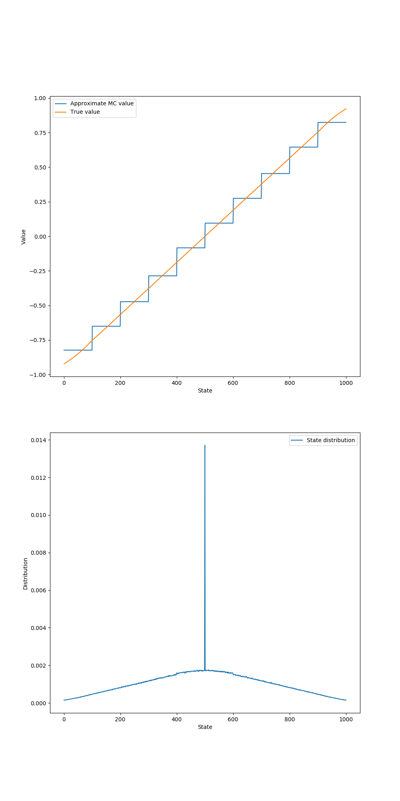
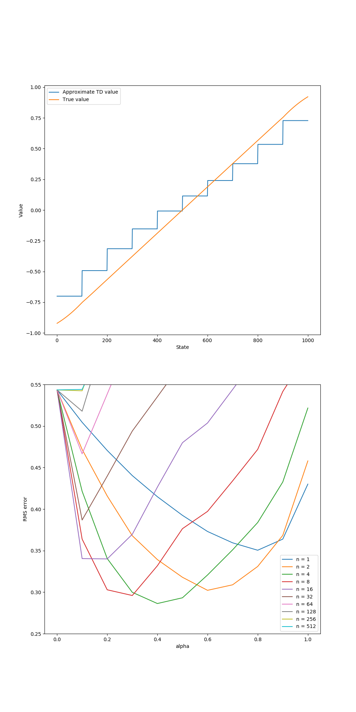

[ShangtongZhang github](https://github.com/ShangtongZhang/reinforcement-learning-an-introduction/tree/master/chapter09)

[단단한 강화학습](http://www.kyobobook.co.kr/product/detailViewKor.laf?ejkGb=KOR&mallGb=KOR&barcode=9791190665179&orderClick=LAG&Kc=) 책의 코드를 공부하기 위해 쓰여진 글이다.

# `step`

```python
# take an @action at @state, return new state and reward for this transition
def step(state, action):
    step = np.random.randint(1, STEP_RANGE + 1)
    step *= action
    state += step
    state = max(min(state, N_STATES + 1), 0)
    if state == 0:
        reward = -1
    elif state == N_STATES + 1:
        reward = 1
    else:
        reward = 0
    return state, reward
```
* **(3)** : $[1, \text{STEP\_RANGE}]$ 범위에서 한 정수를 무작위로 추출하여 `step`에 대입한다.
* **(4)** : 해당 `step`에 `action`을 곱한다 (`action`은 (-1 / 1)로 (왼쪽 / 오른쪽)을 의미한다.)
* **(5)** : 현재 `state`에 `step`을 더하여 `state`를 옮긴다.
* **(6)** : `state`가 0보다 작을 경우 0으로 `N_STATES+1`보다 클 경우 `N_STATES+1`로 클리핑한다.
* **(7~12)** : `state`가 0(왼쪽 끝)일 경우 -1, `N_STATES`+1 일 경우 1, 그 외는 0를 `reward`로 받는다.
* **(13)** : `state`(새로운 상태), `reward를` 반환한다.

# `get_action()`
```python
# get an action, following random policy
def get_action():
    if np.random.binomial(1, 0.5) == 1:
        return 1
    return -1
```
* **(3)** :

`numpy.random.binomial(n, p, size=None)` : Draw samples from a binomial distribution.

p의 당첨확률을 가진 복권을 n개 사서 몇개가 당첨될지 테스트를 size번 하는 것이다.

이항분포 확률에 따라 0에서 n까지의 숫자중 하나를 출력한다. 0부터 n까지의 숫자 중 어떤 숫자 x(p에 몇번 해당되었는지)가 산출될 확률은 아래와 같다.

$$P(N)=\binom{n}{x}p^x(1-p)^{n-x}$$

코드에서는 `np.random.binomial(1, 0.5)`으로 되어 있는데 그러면 반환값이 1이 나올 확률이 `0.5`이 된다는 뜻이다. 그러므로 해당 조건문은 `0.5`의 확률로 `True`를 반환한다.


# `ValueFunction`

```python
# a wrapper class for aggregation value function
class ValueFunction:
    # @num_of_groups: # of aggregations
    def __init__(self, num_of_groups):
        self.num_of_groups = num_of_groups
        self.group_size = N_STATES // num_of_groups

        # thetas
        self.params = np.zeros(num_of_groups)

    # get the value of @state
    def value(self, state):
        if state in END_STATES:
            return 0
        group_index = (state - 1) // self.group_size
        return self.params[group_index]

    # update parameters
    # @delta: step size * (target - old estimation)
    # @state: state of current sample
    def update(self, delta, state):
        group_index = (state - 1) // self.group_size
        self.params[group_index] += delta
```
* **(5)** : `self.num_of_groups` : 결집의 개수(몇 개로 결집할 것인지), 10개
* **(6)** : `self.group_size` : 한 결집에 포함된 상태의 개수 (`N_STATES // num_of_groups` == 100)
* **(8~9)** : $\theta$, 각 state들을 결집해서 근사한 group의 value를 저장할 배열
* **(11~12)** : state의 value를 반환하는 함수이다.
* **(13~14)** : state가 0 또는 `N_STATES+1 == 1001` 일 경우 0을 반환한다.
* **(15)** : state를 해당하는 group으로 바꿔준다. {0: [1, 100], 2: [101, 200], ..., 9: [901, 1000]} 과 같이 10개로 나눠진다.
* **(16)** : 해당하는 `group_index`의 value를 반환한다.
* **(18~21)** : delta와 현재 state를 받아서 value를 업데이트하는 함수
* **(22)** : group_index를 구한다. **(15)** 와 같다.
* **(23)** :
$$\textbf{w} \leftarrow \textbf{w} + \alpha \left [ G_t-\hat{v}(S_t, \textbf{w}) \right ]\nabla \hat{v}(S_t, \textbf{w})$$


# `gradient_monte_carlo`
```python
# gradient Monte Carlo algorithm
# @value_function: an instance of class ValueFunction
# @alpha: step size
# @distribution: array to store the distribution statistics
def gradient_monte_carlo(value_function, alpha, distribution=None):
    state = START_STATE
    trajectory = [state]

    # We assume gamma = 1, so return is just the same as the latest reward
    reward = 0.0
    while state not in END_STATES:
        action = get_action()
        next_state, reward = step(state, action)
        trajectory.append(next_state)
        state = next_state

    # Gradient update for each state in this trajectory
    for state in trajectory[:-1]:
        delta = alpha * (reward - value_function.value(state))
        value_function.update(delta, state)
        if distribution is not None:
            distribution[state] += 1
```
* **(6)** : 현재 상태 `state`를 `START_STATE` == 500 으로 둔다
* **(7)** : trajectory를 추적할 리스트의 초깃값으로 `state`를 넣는다.
* **(9)** : termination에서 1 혹은 -1의 보상을 얻고 이외의 상태에서는 0의 보상을 얻으므로 $\gamma=1$이면 return이 마지막의 보상과 같다.

$$G_t \doteq R_{t+1}+\gamma R_{t+2} + \gamma^{2}R_{t+3} + \cdots = \sum^{\infty}_{k=0} \gamma^{k} R_{t+k+1}$$

* **(11)** : state가 `END_STATES = [0, N_STATES + 1]`에 포함되지 않을 때까지 (양 끝에 도달하기 전까지) 반복문을 실행한다.
* **(12)** : 행동 둘 중 하나를 0.5의 확률로 정한다.
* **(13)** : `step` 함수에 현재 상태(state)와 행동(action)을 인수로 집어넣어 다음 상태(next_state)와 보상(reward)를 받는다.
* **(14)** : **(7)**에서 정의한 `trajectory`에 **(13)**에서 얻은 새로운 상태(next_state)를 append한다.
* **(15)** : 새로운 상태를 state에 저장한다.

* **(17)** : trajectory의 각 state에 대해 gradient update를 한다.
* **(18)** : 마지막 state를 제외하고 state를 처음부터 탐색한다.
* **(19)** : $\text{delta}=\alpha \left [ G_t-\hat{v}(S_t, \textbf{w}) \right ]$, 환경 특성상 $G_t = R_T$ 이다
* **(20)** : 구한 delta와 탐색하는 state에 대해 업데이트 한다.
* **(21~22)** : `distribution`이 주어질 경우 방문한 state 인덱스의 값을 1 늘린다.

# `semi_gradient_temporal_difference`
```python
# semi-gradient n-step TD algorithm
# @valueFunction: an instance of class ValueFunction
# @n: # of steps
# @alpha: step size
def semi_gradient_temporal_difference(value_function, n, alpha):
    # initial starting state
    state = START_STATE

    # arrays to store states and rewards for an episode
    # space isn't a major consideration, so I didn't use the mod trick
    states = [state]
    rewards = [0]

    # track the time
    time = 0

    # the length of this episode
    T = float('inf')
    while True:
        # go to next time step
        time += 1

        if time < T:
            # choose an action randomly
            action = get_action()
            next_state, reward = step(state, action)

            # store new state and new reward
            states.append(next_state)
            rewards.append(reward)

            if next_state in END_STATES:
                T = time

        # get the time of the state to update
        update_time = time - n
        if update_time >= 0:
            returns = 0.0
            # calculate corresponding rewards
            for t in range(update_time + 1, min(T, update_time + n) + 1):
                returns += rewards[t]
            # add state value to the return
            if update_time + n <= T:
                returns += value_function.value(states[update_time + n])
            state_to_update = states[update_time]
            # update the value function
            if not state_to_update in END_STATES:
                delta = alpha * (returns - value_function.value(state_to_update))
                value_function.update(delta, state_to_update)
        if update_time == T - 1:
            break
        state = next_state
```
* **(6~7)** : 초기 state에 시작 상태를 대입한다. `START_STATE = 500`
* **(9~12)** : state와 reward를 저장할 리스트를 생성한다. mod trick을 이용하면 state, reward를 `n`만큼만 생성해도 되지만, 편리한 구현을 위해 모두 저장한다.
* **(14~15)** : termination까지 진행된 tiem step의 개수를 저장한다.
* **(17~18)** : 마지막 time step을 의미하는 $T$를 $\infty$로 초기화한다.
* **(23~24)** : 에피소드의 길이를 저장한다.
* **(20~21)** : 타임스텝이 진행됨으로써 `time`에 1을 더한다.
* **(23)** : 1씩 증가하는 `time`이 $T$보다 작으면 진행한다. **(32~33)** 에서 `END_STATES`로 가면서 $T$에 `time`이 대입되면 이 조건문은 실행되지 않는다.
* **(24~25)** : [get_action()](#get_action) 함수를 이용하여 왼쪽, 오른쪽 중 하나를 50% 확률로 선택한다.
* **(26)** : [step(state, action)](#step) 함수에 따라 $s_t, a_t$ 를 인수로 주고 $s_{t+1}, r_{t+1}$를 얻는다.
* **(28~30)** : $s_{t+1}, r_{t+1}$를 리스트에 저장한다.
* **(32~33)** : 만약 $s_{t+1}$이 `END_STATES = [0, N_STATES + 1]` 에 속한다면 마지막 time step을 의미하는 $T$에 현재 `time`을 대입한다.
* **(35~36)** : $\tau \leftarrow t - n + 1$인데 코드는 `update_time = time - n`인 이유 : 코드상에서는 구현상 **(21)**에서 1을 더한다. 책에서는 $R_{t+1}, S_{t+1}$를 구할 때 $t$인데 코드에서는 $t+1$이다. 그러므로 코드상에서는 1이 미리 더해져 있으므로 n만 빼는 것이다.
* **(37)** : 업데이트를 시작하는 `update_time`이 0 이상인지 확인한다.
* **(38)** : return 값인 $G$ 를 저장할 `returns` 변수를 선언한다.
* **(39~41)** :

$$ G \leftarrow \sum_{i=\tau+1}^{\min(\tau + n, T)}\gamma^{i-\tau-1} R_{i} $$

현재 환경에서는 $\gamma = 1$이므로 해당 부분을 생략한다. 만약 $\gamma \neq 1$ 이라면 `returns += pow(GAMMA, t-update_time-1) * rewards[t]` 가 되었을 것이다.

* **(42~44)** : $\hat{v}(\text{terminal}, \cdot)=0$ 이므로 terminal이 아닐 경우 ($\text{If } \tau + n < T$)

$$G \leftarrow G + \gamma^{n}\hat{v}(S_{\tau + n}, \textbf{w})$$

* **(45)** : 업데이트하고자 하는 state를 `start_to_update`에 저장한다 ($S_{\tau}$와 같다)
* **(46~49)** : 만약 $S_{\tau}$가 terminal state가 아니라면 ($\tau \neq T$) 다음과 같이 업데이트를 진행한다.

$$\textbf{w} \leftarrow \textbf{w} + \alpha \left [ G - \hat{v}(S_{\tau}, \textbf{w}) \right ] \nabla \hat{v} (S_{\tau + n}, \textbf{w})$$

여기서 $\text{delta} = G - \hat{v}(S_{\tau}, \textbf{w})$이다 이것을 `value_function.update()`를 이용해 $\textbf{w}$를 조정한다.

* **(50~51)** : $\tau = T - 1$ 이 되면 반복문을 종료한다.
* **(52)** : state를 갱신한다.

# figure 9_1

{: width="50%" height="50%" class="align-center"}

```python
# Figure 9.1, gradient Monte Carlo algorithm
def figure_9_1(true_value):
    episodes = int(1e5)
    alpha = 2e-5

    # we have 10 aggregations in this example, each has 100 states
    value_function = ValueFunction(10)
    distribution = np.zeros(N_STATES + 2)
    for ep in tqdm(range(episodes)):
        gradient_monte_carlo(value_function, alpha, distribution)

    distribution /= np.sum(distribution)
    state_values = [value_function.value(i) for i in STATES]
```
* **(4)** : `alpha` : step size
* **(7)** : 10개로 결집된 상태의 가치를 나타내는 클래스를 정의한다.
* **(8)** : 전체 상태의 방문 횟수를 계산한다.
* **(9~10)** : `episodes` 횟수만큼 `gradient_monte_carlo` 를 수행한다.
* **(12)** :

$$\mu(s) = \frac{\mu(s)}{\sum_{s'}\mu(s')}, \text{for all } s \in \textbf{S}$$

* **(13)** : 각 state의 가치를 저장한다.
  * `N_STATES = 1000`
  * `STATES = np.arange(1, N_STATES + 1)`

# figure 9_2

{: width="50%" height="50%" class="align-center"}

# figure 9_2 left

```python
# semi-gradient TD on 1000-state random walk
def figure_9_2_left(true_value):
    episodes = int(1e5)
    alpha = 2e-4
    value_function = ValueFunction(10)
    for ep in tqdm(range(episodes)):
        semi_gradient_temporal_difference(value_function, 1, alpha)

    stateValues = [value_function.value(i) for i in STATES]
```
# figure 9_2 right
