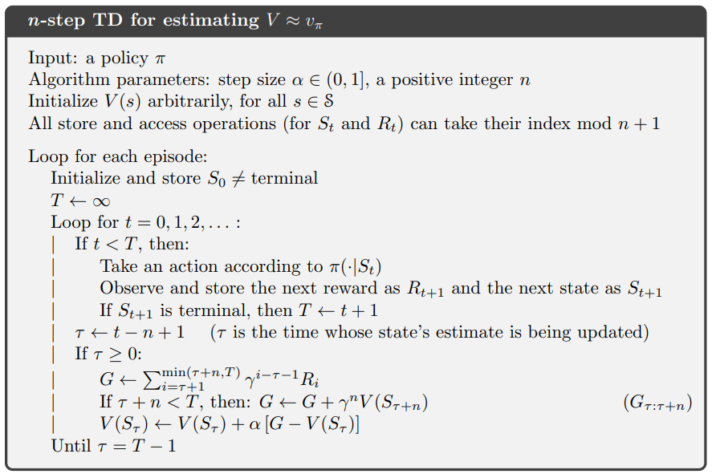
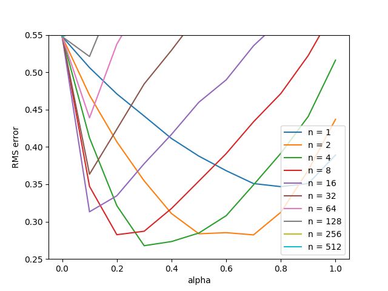

[ShangtongZhang github](https://github.com/ShangtongZhang/reinforcement-learning-an-introduction/tree/master/chapter07)

[단단한 강화학습](http://www.kyobobook.co.kr/product/detailViewKor.laf?ejkGb=KOR&mallGb=KOR&barcode=9791190665179&orderClick=LAG&Kc=) 책의 코드를 공부하기 위해 쓰여진 글이다.

{: width="80%" height="80%" class="align-center"}

# `temporal difference`
```python
# all states
N_STATES = 19

# discount
GAMMA = 1

# all states but terminal states
STATES = np.arange(1, N_STATES + 1)

# start from the middle state
START_STATE = 10

# two terminal states
# an action leading to the left terminal state has reward -1
# an action leading to the right terminal state has reward 1
END_STATES = [0, N_STATES + 1]

# true state value from bellman equation
TRUE_VALUE = np.arange(-20, 22, 2) / 20.0
TRUE_VALUE[0] = TRUE_VALUE[-1] = 0

# n-steps TD method
# @value: values for each state, will be updated
# @n: # of steps
# @alpha: # step size
def temporal_difference(value, n, alpha):
    # initial starting state
    state = START_STATE

    # arrays to store states and rewards for an episode
    # space isn't a major consideration, so I didn't use the mod trick
    states = [state]
    rewards = [0]

    # track the time
    time = 0

    # the length of this episode
    T = float('inf')
    while True:
        # go to next time step
        time += 1

        if time < T:
            # choose an action randomly
            if np.random.binomial(1, 0.5) == 1:
                next_state = state + 1
            else:
                next_state = state - 1

            if next_state == 0:
                reward = -1
            elif next_state == 20:
                reward = 1
            else:
                reward = 0

            # store new state and new reward
            states.append(next_state)
            rewards.append(reward)

            if next_state in END_STATES:
                T = time

        # get the time of the state to update
        update_time = time - n
        if update_time >= 0:
            returns = 0.0
            # calculate corresponding rewards
            for t in range(update_time + 1, min(T, update_time + n) + 1):
                returns += pow(GAMMA, t - update_time - 1) * rewards[t]
            # add state value to the return
            if update_time + n <= T:
                returns += pow(GAMMA, n) * value[states[(update_time + n)]]
            state_to_update = states[update_time]
            # update the state value
            if not state_to_update in END_STATES:
                value[state_to_update] += alpha * (returns - value[state_to_update])
        if update_time == T - 1:
            break
        state = next_state
```
* **(1~2)** : 모든 상태의 개수를 나타낸다. 19개이며 terminal state를 제외한 것이다.
* **(4~5)** : discount factor $\gamma$이며 여기서는 1이다.
* **(7~8)** : termial state를 제외한 상태들의 배열이다. chapter09에서 쓰이며 여기서는 쓰이지 않는다.
* **(10~11)** : 시작지점을 나타내며 인덱스 10이다. 그렇게 양쪽에 terminal state 1개, not terminal state 9개씩 가지게 된다. terminal state까지 합치면 $2 \times (1+9) + 1 = 21$이 된다.
* **(13~16)** : 두 개의 terminal states를 나타내며 맨 왼쪽(0)은 -1의 보상을 주고 맨 오른쪽(20=N_STATES+1)은 1의 보상을 준다.
* **(18~20)** : 벨만 방정식에 의한 참값 테이블이다. 21개의 값에 대해서 $\left [ -1, -0.9, -0.8, ..., 0.8, 0.9, 1 \right ]$을 취하고 terminal state를 0으로 만들어 $\left [ 0, -0.9, -0.8, ..., 0.8, 0.9, 0\right ]$의 테이블을 만든다.
* **(22~26)** : n-step TD 방법을 이용하여 업데이트하는 함수이다.
  * value: 각 상태의 가치를 저장한 배열, 업데이트의 대상
  * n : n-step에서 n을 나타내며 몇번 스텝 후에 업데이트할 것인지
  * $\alpha$ : step size를 의미한다. n-step의 step size랑 다르다.
* **(27~28)** : 현재 상태를 `START_STATE=10`으로 초기화한다.

$$\text{Initialize and store }S_0 \neq\text{terminal}$$

* **(30~33)** : 상태와 보상을 저장할 리스트를 만든다. n-step의 경우 n개의 상태와 보상만 저장하면 되지만(mod trick) 구현의 편의성을 위해 모두 저장한다.
* **(35~36)** : 시간을 추적할 변수를 0으로 초기화한다. 알고리즘에서 $t$를 의미한다.
* **(38~39)** : 종단 시간(=에피소드의 길이)를 무한대로 초기화한다.

$$T \leftarrow \infty$$

* **(40~42)** : **(35~36)**에서 0으로 초기화한 `time`을 하나씩 높이며 반복문을 실행한다.

$$\text{Loop for }t=0, 1, 2, ...:$$

* **(44)** : terminal state 전까지 행동을 선택하는 행동을 반복한다. 무한대인데 어떻게 끝나냐고 할 수 있겠지만, **(62~63)** 에서 $T$가 변경된다.

$$\text{If }t < T,\text{then}:$$

* **(45~49)** : 주어진 정책에 따라 행동을 선택한다. 0과 1을 각각 50%의 확률로 선택한다. 1이 나오면 `next_state = state + 1`로 오른쪽으로 한 칸 가고 0이 나오면 `next_state=state - 1`로 한 칸 왼쪽으로 간다.
  * `np.random.binomial(n, p)` : p확률로 True인 시행을 n번 했을때 True의 횟수를 출력한다. 여기서는 1, 0.5이므로 True가 1번, 0번 나올 확률은 각각 0.5, 0.5이다. $P(x)=\binom{n}{x}p^x(1-p)^{n-x}$

  * $n$ : number of trial, $p$ probability of success, $x$: number of successes.

$$\text{Take an action according to }\pi(\cdot \vert S_t)$$

* **(51~56)** : next_state(다음 상태, $S_{t+1}$)가 terminal state일 경우 0이면 -1, 20이면 1을 `reward`($R_{t+1}$)에 대입하고 그 외의 상태에는 0을 대입한다.

* **(58~60)** : 행동으로 인한 다음 상태($S_{t+1}$)와 보상($R_{t+1}$)을 저장한다.

$$\text{Observe and store the next reward as }R_{t+1} \text{ and the next state as }S_{t+1}$$

* **(62~63)** : 다음 상태($S_{t+1}$)가 terminal state일 경우 `T`에 현재 `time`을 저장한다

$$\text{If }S_t \text{ is terminal, then }T \leftarrow t+1$$

* **(65~66)** : 업데이트될 시점을 저장한다

$$\tau \leftarrow t - n + 1 \quad (\tau\text{ is the time whose state's estimate is being updated})$$

코드는 `update_time = time - n`인데 알고리즘은 왜 $\tau \leftarrow t - n + 1$일까

알고리즘의 경우 반복문을 돌면서 $t=0$으로 시작해서 반복문이 새로 시작될 때 $t$가 1이 증가하는 것으로 가정하나 코드의 경우 **(41~42)** 처럼 사전에 1을 증가하기 때문에 지금 시점에서는 $t$가 알고리즘상 $t+1$인 상태이므로 $n$만 뺀다.

* **(67)** : 업데이트 대상 시점($\tau$)이 시작 시점인 0보다 크면 상태를 업데이트한다.

$$\text{If }\tau \geq 0$$

* **(68)** : 누적 보상을 저장할 변수를 0으로 정의한다.
* **(69~71)** : 업데이트할 시점부터 n개의 보상에 discount factor를 적용하여 `returns`에 누적한다

$$G \leftarrow \sum_{i=\tau+1}^{\min(\tau+n, T)}\gamma^{i-\tau-1}R_i$$

이해를 돕기 위해 풀어쓰면 다음과 같다

$$G \leftarrow R_{\tau+1}+\gamma R_{\tau+2}+\gamma^{2}R_{\tau+3}+...+\gamma^{n-1}R_{\tau+n}$$

* **(72~74)** : 추정 대상인 $\tau + n$이 마지막 시점이 아닐 경우 누적된 `returns`에 다음 상태의 추정치를 더한다. (마지막 시점일 경우 그 이후의 보상은 없으므로 추정치가 0이다)

$$\text{If }\tau+n<T, \text{ then: } G \leftarrow G+\gamma^n V(S_{\tau+n})$$

* **(75)** : 업데이트 시점의 상태를 `start_to_update`에 저장한다 `update_time`이 $\tau$라면 `start_to_date`는 해당 시점의 상태인 $S_{\tau}$를 의미한다.
* **(76~78)** : 업데이트할 상태($S_{\tau}$)가 terminal state가 아니라면 해당 상태를 업데이트한다.

$$V(S_{\tau}) \leftarrow V(S_{\tau}) + \alpha \left [ G - V(S_{\tau}) \right ]$$

* **(79~80)** : 업데이트 대상 시점이 terminal 바로 전이라면 반복문을 종료한다 (다음 상태는 terminal이므로 더이상 업데이트 할 것이 없다.)

$$\text{Until } \tau = T-1$$

# figure 7_2
{: width="80%" height="80%" class="align-center"}
```python
# Figure 7.2, it will take quite a while
def figure7_2():
    # all possible steps
    steps = np.power(2, np.arange(0, 10))

    # all possible alphas
    alphas = np.arange(0, 1.1, 0.1)

    # each run has 10 episodes
    episodes = 10

    # perform 100 independent runs
    runs = 100

    # track the errors for each (step, alpha) combination
    errors = np.zeros((len(steps), len(alphas)))
    for run in tqdm(range(0, runs)):
        for step_ind, step in enumerate(steps):
            for alpha_ind, alpha in enumerate(alphas):
                # print('run:', run, 'step:', step, 'alpha:', alpha)
                value = np.zeros(N_STATES + 2)
                for ep in range(0, episodes):
                    temporal_difference(value, step, alpha)
                    # calculate the RMS error
                    errors[step_ind, alpha_ind] += np.sqrt(np.sum(np.power(value - TRUE_VALUE, 2)) / N_STATES)
    # take average
    errors /= episodes * runs
```

* **(3~4)** : n-step에서의 n을 의미하며 스텝의 개수를 나열한다, $\left [ 2^0, 2^1, ..., 2^9 \right ]$를 의미한다.
* **(6~7)** : $\alpha$를 의미한다. $\left [ 0, 0.1, ... 1.0 \right ]$을 나타낸다.
* **(9~10)** : 각각의 실행은 10번의 에피소드를 가진다.
* **(12~13)** : 100번의 독립시행을 가진다.
  * 각 독립시행 안에서 같은 value table로 10번의 에피소드를 실행하고 시행이 끝나면 value table은 초기화한다.
* **(15~16)** : n-step은 행을 의미하고 $\alpha$는 열을 나타내는 평균 오차 테이블(행렬)을 만든다. `errors[1][1]`은 n-step이 2이고 $\alpha=0.1$인 실행의 오차 평균을 나타낸다.
* **(17)** : 100번의 독립시행을 한다.
* **(18~19)** : 하이퍼파라미터의 인덱스와 하이퍼파라미터값을 `@@_ind`, `@@` 에 저장한다. `steps`의 두번째 값의 경우 `step_ind`의 경우 1을 가지고(2번째) `step`은 $2^1=2$를 가진다.
* **(21)** : 각 상태의 가치를 0으로 초기화한다. `N_STATES=19`에서 양쪽의 Terminal State 2개를 합쳐 `N_STATES + 2`개의 요소를 가진 배열을 만든다.
* **(22)** : 한 시행에 할당된 에피소드를 반복한다(`episodes=10`)
* **(23)** : [`temporal_difference`](#temporal-difference)함수에 해당하는 n-step, $\alpha$를 넣고 value table을 업데이트한다.
* **(24~25)** : 추정 value를 실제 값과 비교하여 RMSE를 산출하고 해당 값을 오차 행렬의 해당 부분에 누적한다. $\text{Error}(n, \alpha) = \sqrt{\frac{1}{n}\sum_{s} (\hat{v}(s) - v(s))^2}$
* **(26~27)** : 각 누적된 에러를 episode * runs 만큼 나누어 평균을 취한다.
