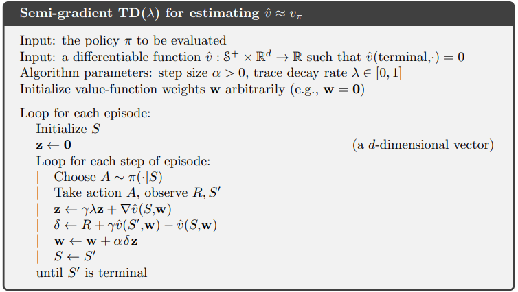
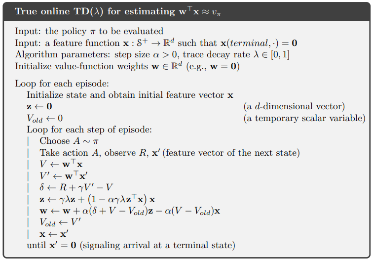
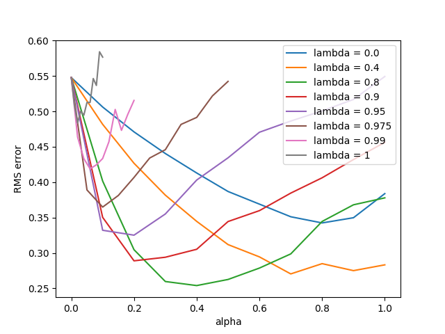
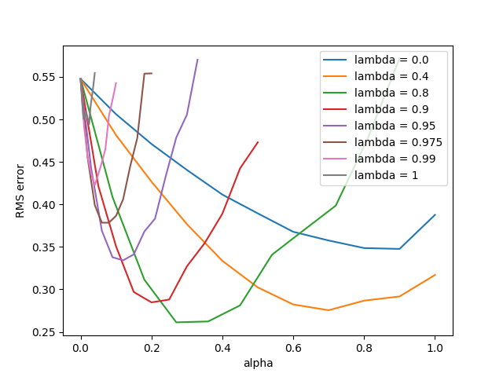
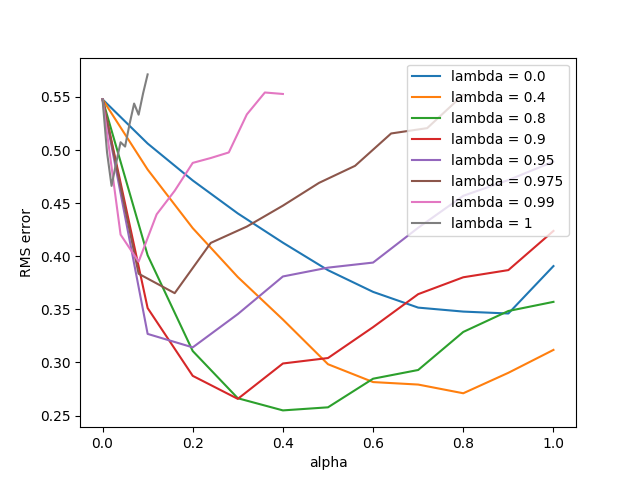

[ShangtongZhang github](https://github.com/ShangtongZhang/reinforcement-learning-an-introduction/tree/master/chapter12)

[단단한 강화학습](http://www.kyobobook.co.kr/product/detailViewKor.laf?ejkGb=KOR&mallGb=KOR&barcode=9791190665179&orderClick=LAG&Kc=) 책의 코드를 공부하기 위해 쓰여진 글이다.

# random_walk

```python
# all states
N_STATES = 19

# all states but terminal states
STATES = np.arange(1, N_STATES + 1)

# start from the middle state
START_STATE = 10

# two terminal states
# an action leading to the left terminal state has reward -1
# an action leading to the right terminal state has reward 1
END_STATES = [0, N_STATES + 1]

# true state values from Bellman equation
TRUE_VALUE = np.arange(-20, 22, 2) / 20.0
TRUE_VALUE[0] = TRUE_VALUE[N_STATES + 1] = 0.0
```
* **(1~2)** : [SuttonCode_ch07](ttps://helpingstar.github.io/rl/SuttonCode_ch07/)와 같이 19개의 상태를 갖는다.
* **(4~5)** : terminal state를 제외한 상태 배열 $[1, 19]$
* **(7~8)** : 시작 상태를 10으로 하여 terminal state를 제외하고 좌우로 9개의 상태를 가진다.
* **(10~13)** : terminal state를 0, `N_STATES+1` (=20)로 한다. 가장 왼쪽(=0)은 -1, 가장 오른쪽(=20)은 1의 보상을 얻는다.
* **(15~17)** : 실제값을 지정한다. $[-20, -18, ..., 18, 20]$을 20으로 나눠 $[-1, -0.9, ..., 0.9, 1.0]$를 만들고 terminal state의 인덱스인 0, 20을 0으로 바꾼다.

## ValueFunction
```python
# base class for lambda-based algorithms in this chapter
# In this example, we use the simplest linear feature function, state aggregation.
# And we use exact 19 groups, so the weights for each group is exact the value for that state
class ValueFunction:
    # @rate: lambda, as it's a keyword in python, so I call it rate
    # @stepSize: alpha, step size for update
    def __init__(self, rate, step_size):
        self.rate = rate
        self.step_size = step_size
        self.weights = np.zeros(N_STATES + 2)

    # the state value is just the weight
    def value(self, state):
        return self.weights[state]

    # feed the algorithm with new observation
    # derived class should override this function
    def learn(self, state, reward):
        return

    # initialize some variables at the beginning of each episode
    # must be called at the very beginning of each episode
    # derived class should override this function
    def new_episode(self):
        return
```
* **(1~4)** : $\lambda$ 기반 알고리즘의 base 클래스. 다른 알고리즘 클래스는 이 `ValueFunction`을 상속한다. 상태 결집을 사용하여 19개의 그룹을 나타내는데 19개의 값을 사용하므로 가중치는 그 상태의 값이 된다.
* **(5~10)** : lambda가 파이썬 키워드이므로 `rate`로 바꾼다. $\lambda$, $\alpha$를 클래스 내부에 저장하고 terminal state를 포함한 19+2개의 가치를 나타내는 배열을 0으로 초기화한다
* **(12~14)** : 상태의 가치는 가중치를 그대로 반환한다.
* **(16~19)** : 상태와 보상으로 학습한다. 파생 클래스는 이 함수를 오버라이딩해야한다.
* **(21~25)** : 에피소드 시작시에 호출되어야 하며 몇몇 변수가 초기화된다. 파생클래스는 이 함수를 오버라이딩해야한다.


## OffLineLambdaReturn

```python
# Off-line lambda-return algorithm
class OffLineLambdaReturn(ValueFunction):
    def __init__(self, rate, step_size):
        ValueFunction.__init__(self, rate, step_size)
        # To accelerate learning, set a truncate value for power of lambda
        self.rate_truncate = 1e-3

    def new_episode(self):
        # initialize the trajectory
        self.trajectory = [START_STATE]
        # only need to track the last reward in one episode, as all others are 0
        self.reward = 0.0

    def learn(self, state, reward):
        # add the new state to the trajectory
        self.trajectory.append(state)
        if state in END_STATES:
            # start off-line learning once the episode ends
            self.reward = reward
            self.T = len(self.trajectory) - 1
            self.off_line_learn()

    # get the n-step return from the given time
    def n_step_return_from_time(self, n, time):
        # gamma is always 1 and rewards are zero except for the last reward
        # the formula can be simplified
        end_time = min(time + n, self.T)
        returns = self.value(self.trajectory[end_time])
        if end_time == self.T:
            returns += self.reward
        return returns

    # get the lambda-return from the given time
    def lambda_return_from_time(self, time):
        returns = 0.0
        lambda_power = 1
        for n in range(1, self.T - time):
            returns += lambda_power * self.n_step_return_from_time(n, time)
            lambda_power *= self.rate
            if lambda_power < self.rate_truncate:
                # If the power of lambda has been too small, discard all the following sequences
                break
        returns *= 1 - self.rate
        if lambda_power >= self.rate_truncate:
            returns += lambda_power * self.reward
        return returns

    # perform off-line learning at the end of an episode
    def off_line_learn(self):
        for time in range(self.T):
            # update for each state in the trajectory
            state = self.trajectory[time]
            delta = self.lambda_return_from_time(time) - self.value(state)
            delta *= self.step_size
            self.weights[state] += delta
```
* **(1~2)** : Offline lambda return 알고리즘을 구현한 클래스이며 `ValueFunction`을 상속한다.
* **(3~4)** : 상속한 [`ValueFunction`](#valuefunction)의 생성자를 호출하여 `rate`($\lambda$), `step_size`($\alpha$), `weights` 배열을 클래스 변수로 저장한다.
* **(5~6)** : 학습을 더 빠르게 하기 위해 $\lambda$의 제곱이 0.001보다 작으면 무시한다.
* **(8)** : 에피소드 시작시에 호출되는 함수
* **(9~10)** : 에피소드의 궤적을 저장하는 `self.trajectory`에 `START_STATE`를 넣고 시작한다.
* **(11~12)** : terminal state를 제외하고 보상이 0이므로 마지막 상태의 보상만 추적한다
* **(14)** : 학습을 위한 함수로 `state`와 `reward`를 인수로 받는다.
* **(15~16)** : trajectory에 `state`를 추가한다.
* **(17~21)** : state가 terminal state일 경우 (에피소드가 끝날 경우), 클래스 변수에 reward, 에피소드의 길이(`self.T`)를 저장하고 `self.off_line_learn`을 호출한다.
* **(23~24)** : $n$, $t$를 통해 $G_{t:t+n}$, (=n-step return)을 구하는 함수이다.
* **(25~26)** : $\gamma$가 1이고 마지막 보상을 제외하고 보상은 0이므로 공식이 단순화될 수 있다.

$$G_{t:t+n} \doteq R_{t+1} + \gamma R_{t+2} + \cdots + \gamma^{n-1}R_{t+n} + \gamma^{n} V_{t+n-1}(S_{t+n})$$

* **(27)** : $t+n$과 $T$중 더 빠른 것을 `end_time`에 저장한다. 여기서 `end_time`은 `terminal_state`가 될 수 없다. 왜냐하면 `end_time`이 취할 수 있는 최대값이 `self.T`인데 `self.T=len(self.trajectory) - 1`이기 때문에 trajectory에 마지막으로 추가되는 terminal state가 제외된다.
* **(28)** : `returns`에 $\gamma^{n}V_{t+n-1}(S_{t+n})$을 저장하는데 $\gamma=1$ 이므로 $V_{t+n-1}(S_{t+n})$을 대입한다.
* **(29~30)** : `end_time == self.T`이면 `returns`에 `self.reward`를 더한다. 자세히 말해보자면 `end_state=min(time + n, self.T)`이기 때문에 `end_time == self.T`라는 것은 $\left [ t, t+n\right ]$ 안에 $T-1$가 포함되어 terminal state로 가는 과정에서 1또는 -1의 보상을 받았다는 뜻이다. 그렇기 때문에 에피소드 종료시에 `self.reward`에 저장했던 보상값을 더한다.
* **(31)** : 누적된 보상값($G_{t:t+n}$)을 반환한다.
* **(33~34)** : $t$에 해당하는 $G^{\lambda}_{t}$를 구하는 함수이다.
* **(35)** : 보샹을 누적할 `returns` 변수를 0으로 초기화한다.
* **(36)** : $\lambda$를 누적제곱할 항이다. 처음에는 1이고 계속해서 $\lambda$를 곱한다.
* **(37)** : $\sum^{T-t-1}_{n=1}$를 의미하는 반복문이다
* **(38)** : 누적하여 합하여 $\sum$의 효과를 낸다. $\sum_{n=1}^{T-t-1}\lambda^{n-1}G_{t:t+n}$을 의미한다. $G_{t:t+n}$은 `self.n_step_return_from_time`를 통해 얻는다.
* **(39)** : 반복마다 `lambda_power`에 $\lambda$를 곱함으로써 $\lambda^{n-1}$의 기능을 한다.
* **(40~42)** : **(5~6)** 과 같이 $\lambda^{n-1}$이 `self.rate_truncate=1e3` 보다 작으면 이후 과정을 버린다.
* **(43)** : $(1-\lambda)\sum_{n=1}^{T-t-1}\lambda^{n-1}G_{t:t+n}$ 를 계산한다
* **(44~45)** : $\lambda^{n-1}$이 계속 진행되었다면 $\lambda^{T-t-2}$ 까지 진행되었을 것이고 거기에 $\lambda$를 곱하면 $\lambda^{T-t-1}$이 될 것이다. 코드상에서는 반복문에서 첫 값을 사용하고 **(39)** 처럼 그 후에 곱하고 다음에 사용하기 때문에 곱해진 해당 값을 구대로 사용하면 된다. 이는 $(12.3)$에서 $\lambda^{T-t-1}G_t$를 의미한다. 해당 구현상에서는 $\lambda^{T-t-1}$이 `self.rate_truncate`보다 작으면 무시한다.
* **(46)** :

$$G_t^{\lambda}=(1-\lambda)\sum_{n=1}^{T-t-1}\lambda^{n-1}G_{t:t+n} + \lambda^{T-t-1}G_t$$

* **(48~49)** : 에피소드 종료시에 offline learning을 수행한다.
* **(50)** : 에피소드의 길이만큼 반복한다. 에피소드의 길이는 terminal state를 제외하고 거쳐간 모든 상태들의 개수이다
* **(51)** : trajectory의 각각의 상태들을 갱신한다.
* **(52)** : 업데이트하게 될 해당 시간의 상태를 저장한다. $S_t$를 의미한다.
* **(53)** : $G^{\lambda}\_{t} - \hat{v}(S_t, \textbf{w})$를 의미하며 $G^{\lambda}\_{t}$는 `self.lambda_return_from_time`를 통해 얻는다.


## TemporalDifferenceLambda

{: width="80%" height="80%" class="align-center"}
```python
# TD(lambda) algorithm
class TemporalDifferenceLambda(ValueFunction):
    def __init__(self, rate, step_size):
        ValueFunction.__init__(self, rate, step_size)
        self.new_episode()

    def new_episode(self):
        # initialize the eligibility trace
        self.eligibility = np.zeros(N_STATES + 2)
        # initialize the beginning state
        self.last_state = START_STATE

    def learn(self, state, reward):
        # update the eligibility trace and weights
        self.eligibility *= self.rate
        self.eligibility[self.last_state] += 1
        delta = reward + self.value(state) - self.value(self.last_state)
        delta *= self.step_size
        self.weights += delta * self.eligibility
        self.last_state = state
```
* **(1~2)** : $\text{TD}(\lambda)$를 나타내는 클래스, [`ValueFunction`](#valuefunction)을 상속한다.
* **(3~4)** : 상속한 [`ValueFunction`](#valuefunction)의 생성자를 호출하여 `weights` 배열, `rate`($\lambda$), `step_size`($\alpha$) 을 클래스 변수로 저장한다.
* **(5)** : 각 에피소드별로 [`random_walk`](#random_walk) 호출시에 `new_episode()`가 실행되므로 중복된 코드이다.
* **(7)** : 새로운 에피소드가 시작될때 호출되는 함수이다.
* **(8~9)** : 적격 흔적 벡터를 0으로 초기화한다.
* **(10~11)** : 마지막(최근) 상태를 시작상태로 초기화한다.
* **(13)** : 상태와 보상을 인수로 받는 클래스 함수이다. 여기서 $\nabla\hat{v}(S, \textbf{w})=1$, $\gamma = 1$ 이다. 
* **(15~16)** : $\textbf{z} \leftarrow \gamma \lambda \textbf{z} + \nabla\hat{v}(S, \textbf{w})$
  * `eligibility` : $\textbf{z}$
  * `rate` : $\lambda$
* **(17)** : $\delta \leftarrow R + \gamma \hat{v}(S', \textbf{w})-\hat{v}(S, \textbf{w})$
  * `delta` : $\delta$
  * `reward` : $R$
* **(18~19)** : $\textbf{w} \leftarrow \textbf{w} + \alpha \delta \textbf{z}$
  * `step_size` : $\alpha$
* **(20)** : $S \leftarrow S'$

## TrueOnlineTemporalDifferenceLambda

{: width="80%" height="80%" class="align-center"}

```python
# True online TD(lambda) algorithm
class TrueOnlineTemporalDifferenceLambda(ValueFunction):
    def __init__(self, rate, step_size):
        ValueFunction.__init__(self, rate, step_size)

    def new_episode(self):
        # initialize the eligibility trace
        self.eligibility = np.zeros(N_STATES + 2)
        # initialize the beginning state
        self.last_state = START_STATE
        # initialize the old state value
        self.old_state_value = 0.0

    def learn(self, state, reward):
        # update the eligibility trace and weights
        last_state_value = self.value(self.last_state)
        state_value = self.value(state)
        dutch = 1 - self.step_size * self.rate * self.eligibility[self.last_state]
        self.eligibility *= self.rate
        self.eligibility[self.last_state] += dutch
        delta = reward + state_value - last_state_value
        self.weights += self.step_size * (delta + last_state_value - self.old_state_value) * self.eligibility
        self.weights[self.last_state] -= self.step_size * (last_state_value - self.old_state_value)
        self.old_state_value = state_value
        self.last_state = state
```
* **(1~2)** : $\text{TD}(\lambda)$를 나타내는 클래스, [`ValueFunction`](#valuefunction)을 상속한다.
* **(3~4)** : 상속한 [`ValueFunction`](#valuefunction)의 생성자를 호출하여 `weights` 배열, `rate`($\lambda$), `step_size`($\alpha$) 을 클래스 변수로 저장한다.
* **(6)** : 새로운 에피소드가 시작될때 호출되는 함수이다.
* **(7~8)** : 적격 흔적 벡터($\textbf{z}$)를 0으로 초기화한다.
* **(9~10)** : 마지막(최근) 상태를 시작상태로 초기화한다.
* **(11~12)** : 이전 상태 가치($V_{\text{old}}$)를 0으로 초기화한다
* **(14)** : 상태($S=\textbf{x}$)와 보상($R$)을 인수로 받아 가중치를 갱신하는 함수, $\gamma=1$
* **(16)** : $V \leftarrow \textbf{w}^{\top}\textbf{x}$
  * `last_state_value` : $V$
* **(17)** : $V' \leftarrow \textbf{w}^{\top}\textbf{x}'$
  * `state_value` : $V'$
* **(18)** : $\text{dutch} \leftarrow (1-\alpha \gamma \lambda \textbf{z}^{\top}_{t-1} \textbf{x})\textbf{x}$
  * $\textbf{x}_t \doteq \textbf{x}(S_t)$인데 여기서는 근사하지 않고 표에서 그 상태 자체로 계산하므로 one-hot 벡터이다. 즉 벡터로 보면 벡터로 봐도 되고 단일 스칼라 값으로 계산해도 구현상 문제없다는 뜻이다.
  * `step_size` : $\alpha$
  * `rate` : $\lambda$
  * `eligibility` : $\textbf{z}$
* **(19~20)** : $\textbf{z} \leftarrow \gamma \lambda \textbf{z} + (1-\alpha \gamma \lambda \textbf{z}^{\top}_{t-1} \textbf{x})\textbf{x}$
* **(21)** : $\delta \leftarrow R + \gamma \hat{v}(S', \textbf{w})-\hat{v}(S, \textbf{w})$
  * `delta` : $\delta$
* **(22~23)** : $\textbf{w} \leftarrow \textbf{w} + \alpha(\delta+V-V_{\text{old}})\textbf{z} - \alpha(V-V_{\text{old}})\textbf{x}$
* **(24)** : $V_{\text{old}} \leftarrow V'$
* **(25)** : $\textbf{x} \leftarrow \textbf{x}'$


## `parameter_sweep`
```python
# general plot framework
# @valueFunctionGenerator: generate an instance of value function
# @runs: specify the number of independent runs
# @lambdas: a series of different lambda values
# @alphas: sequences of step size for each lambda
def parameter_sweep(value_function_generator, runs, lambdas, alphas):
    # play for 10 episodes for each run
    episodes = 10
    # track the rms errors
    errors = [np.zeros(len(alphas_)) for alphas_ in alphas]
    for run in tqdm(range(runs)):
        for lambdaIndex, rate in enumerate(lambdas):
            for alphaIndex, alpha in enumerate(alphas[lambdaIndex]):
                valueFunction = value_function_generator(rate, alpha)
                for episode in range(episodes):
                    random_walk(valueFunction)
                    stateValues = [valueFunction.value(state) for state in STATES]
                    errors[lambdaIndex][alphaIndex] += np.sqrt(np.mean(np.power(stateValues - TRUE_VALUE[1: -1], 2)))

    # average over runs and episodes
    for error in errors:
        error /= episodes * runs

    for i in range(len(lambdas)):
        plt.plot(alphas[i], errors[i], label='lambda = ' + str(lambdas[i]))
    plt.xlabel('alpha')
    plt.ylabel('RMS error')
    plt.legend()
```
* **(1~6)** :
  * `value_function_generator` : value function의 객체를 생성한다(클래스를 넣는다)
  * `runs` : 독립적인 실행의 횟수
  * `lambdas` : 서로 다른 lambda 값 배열
  * `alphas` : 각 `lambdas`에 해당하는 step size 배열

* **(7~8)** : 각 독립적인 실행은 10번의 에피소드를 진행한다.
* **(9~10)** : RMS error를 저장하는 행렬, i행 j열이면 i번째 $\lambda$를 적용했을 때 대응하는 alphas의 i번째 행의 j열의 $\alpha$ 값의 RMS error이다.
* **(11)** : `runs` 횟수만큼 독립 실행이 일어난다
* **(12~13)** : $\lambda$ 값을 결정하면 그에 해당하는 배열을 `alphas` 배열에서 `alphas[lambdaIndex]`를 통해 얻은 후 배열의 각 $\alpha$ 값에 대해 실험을 진행한다.
* **(14)** : `value_function_generator`에 $\lambda, \alpha$를 파라미터로 넣은 객체를 `valueFunction`에 저장한다.


## figure 12_3

{: width="80%" height="80%" class="align-center"}

```python
# Figure 12.3: Off-line lambda-return algorithm
def figure_12_3():
    lambdas = [0.0, 0.4, 0.8, 0.9, 0.95, 0.975, 0.99, 1]
    alphas = [np.arange(0, 1.1, 0.1),
              np.arange(0, 1.1, 0.1),
              np.arange(0, 1.1, 0.1),
              np.arange(0, 1.1, 0.1),
              np.arange(0, 1.1, 0.1),
              np.arange(0, 0.55, 0.05),
              np.arange(0, 0.22, 0.02),
              np.arange(0, 0.11, 0.01)]
    parameter_sweep(OffLineLambdaReturn, 50, lambdas, alphas)
```

* **(3)** : 실험에 사용할 $\lambda$ 값의 목록이다.
* **(4~11)** : 같은 인덱스의 $\lambda$에 대응하는 $\alpha$의 값의 목록


## figure 12_6

{: width="80%" height="80%" class="align-center"}

```python
# Figure 12.6: TD(lambda) algorithm
def figure_12_6():
    lambdas = [0.0, 0.4, 0.8, 0.9, 0.95, 0.975, 0.99, 1]
    alphas = [np.arange(0, 1.1, 0.1),
              np.arange(0, 1.1, 0.1),
              np.arange(0, 0.99, 0.09),
              np.arange(0, 0.55, 0.05),
              np.arange(0, 0.33, 0.03),
              np.arange(0, 0.22, 0.02),
              np.arange(0, 0.11, 0.01),
              np.arange(0, 0.044, 0.004)]
    parameter_sweep(TemporalDifferenceLambda, 50, lambdas, alphas)
```

* **(3)** : 실험에 사용할 $\lambda$ 값의 목록이다.
* **(4~11)** : 같은 인덱스의 $\lambda$에 대응하는 $\alpha$의 값의 목록

## figure 12_8

{: width="80%" height="80%" class="align-center"}

```python
# Figure 12.7: True online TD(lambda) algorithm
def figure_12_8():
    lambdas = [0.0, 0.4, 0.8, 0.9, 0.95, 0.975, 0.99, 1]
    alphas = [np.arange(0, 1.1, 0.1),
              np.arange(0, 1.1, 0.1),
              np.arange(0, 1.1, 0.1),
              np.arange(0, 1.1, 0.1),
              np.arange(0, 1.1, 0.1),
              np.arange(0, 0.88, 0.08),
              np.arange(0, 0.44, 0.04),
              np.arange(0, 0.11, 0.01)]
    parameter_sweep(TrueOnlineTemporalDifferenceLambda, 50, lambdas, alphas)
```

* **(3)** : 실험에 사용할 $\lambda$ 값의 목록이다.
* **(4~11)** : 같은 인덱스의 $\lambda$에 대응하는 $\alpha$의 값의 목록