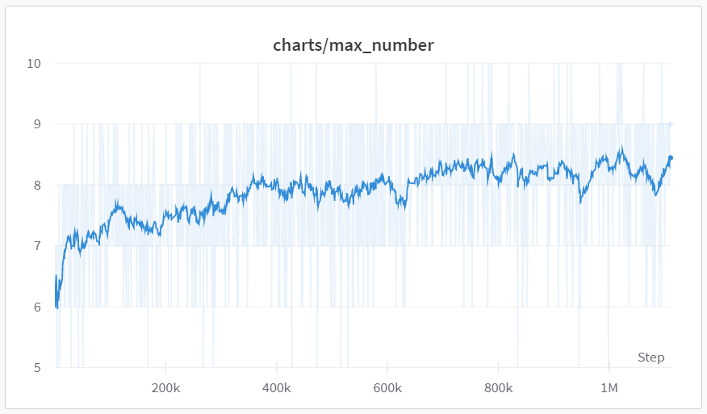

2048 게임을 정복하기 위해 [gym-game2048](https://github.com/helpingstar/gym-game2048) 강화학습 환경을 만들고 그것을 정복하기 위해 시도한 시행착오를 적어놓은 일지이다.

(2023-05-19 23:43:28)

# 1. sparse reward vs dense reward

2048 게임의 목표는 2048이라는 숫자를 만드는 것이다. 그리고 점수는 합쳐진 숫자들의 합이다. 예를 들어 4와 4를 합쳐서 8을 만들었다면 8점이 추가된다. 또 2와 2, 4와 4를 합쳤다면 12점이 올라가게 된다. 여기서 보상을 어떻게 설정할 것인가에 대해 고민이 있었다.

게임의 목표를 2048을 최대한 빨리 만드는 것으로 한다면 점수를 보상으로 하였을 때 게임을 바로 끝내지 않고 더 점수를 얻고 끝내는 상황이 나올수 있다는 생각이 들었다. 또한 예를 들어서

```
2 4 2 4
0 0 0 0
0 0 0 0
0 0 0 0
```

와 같은 상황에서 위로 올리면 블록이 새로 스폰되지도 않고 아무일도 일어나지 않으나 이것은 한 스텝에 해당한다. 이럴 경우 게임 진행이 거의 멈춰버릴 수 있다. 이를 방지하기 위해 모든 스텝에 대해 -0.001의 보상을 주고 학습을 했다. 그리고 실패, 성공 각각에 대해 -5, +5의 보상을 주고 학습을 했다.

결과는 실패였다. 원인은 다음과 같다. 스텝의 수가 일정 횟수를 넘어가면 그것이 실패의 보상인 -5보다 낮아진다. 그럴 경우 에이전트는 "기약없는 무의미한 행동을 반복할 바에는 빨리 죽어서 보상을 최대화하자" 라고 생각하게 된다.

# 2. truncated의 주의점

1번과 같은 이유로 `TimeLimit`을 이용해서 일정 횟수를 넘어가면 truncate를 했다. 이것은 무행동을 반복하고 있을 확률이 높기 때문에 그전에 끊어버리는 것이다. 이러면 경우에 따라 문제가 각각 있었다.
1. 시간제한 × (step의 보상) 이 클리어 실패시 보상보다 높을 경우 (예를 들어 -0.0001 × 30000 > -5) 학습이 되지 않는다. 지정된 시간 내에 빨리 클리어를 해서 보상을 높이라는 의도였으나. 실패할바에 그때까지 최대한 버텨서 보상을 높이는 것이다.
2. 시간제한 × (steps의 보상) 이 클리어 실패시 보상보다 낮을 경우 다른 관점으로 문제가 발생하는데, 스텝이 너무 높아지면 이득이 너무 낮아지므로 그 전에 최대한 빨리 게임을 끝내버리려고 하는 것이다.

TimeLimit가 효과가 없던 것은 결국 양의 보상이 너무 희소하기 때문에 벌어진 일이었다.

# 3. 보상 설계 변경

보상을 게임의 게임의 점수 체계와 같게 하였다. 합쳐진 블록에 각각 $\log_2$를 취하고 0.1을 곱해서 모두 더하였다. 예를 들어 4+4, 2+2가 동시에 합쳐졌다면, 8, 4가 만들어지므로 0.3, 0.2를 더해서 0.5의 보상을 받는 것이다. 로그를 취하는 것이 맞는것일까 라는 생각을 했다. 2048을 만들면 나오는 1.1과 1024를 만들면 나오는 1.0의 보상의 가치가 같을까 하는 생각이 든다. 게다가 2048을 만들면 게임이 끝나버려서 더이상의 보상을 어디 못하게 된다.

# 4. 한계
{: width="50%" height="50%" class="align-center"}

현재까지의 상황이다. 어느정도 학습은 되었지만. 7~9에서 장시간 떨리는 양상을 보인다. 더 시간을 투자한다면 해결될 수도 있지만, 여기까지에 대해 세가지 개선 방안을 생각해 보았다.

1. (16, 64), (64, 64), (64, ~) 로 설계된 actor, critic 신경망의 유닛 개수를 늘려 보기
2. CNN을 사용해서 공간 정보를 더 얻어보기, 예를 들어 위 아래는 게임적으로 연관이 있으나 Flatten 되면서 공간 정보가 사라지게 된다.
3. 마지막 클리어에 대한 보상을 더 높이기, 현재는 보상이 선형적인데 때문에 최종 보상에 대한 모티브가 부족한게 아닐까 싶다. 1, 2를 현재 실험결과와 비교해본 뒤에 시도해볼 생각이다.
