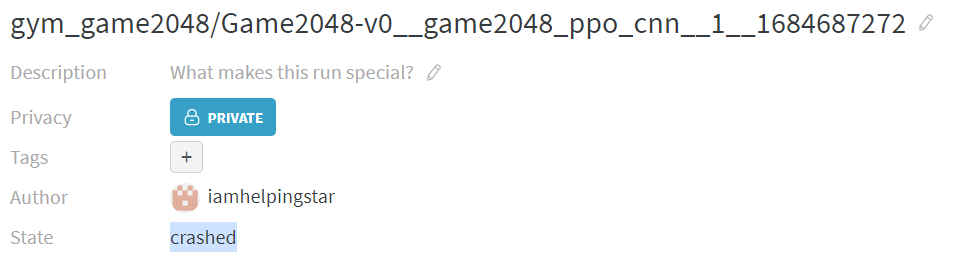
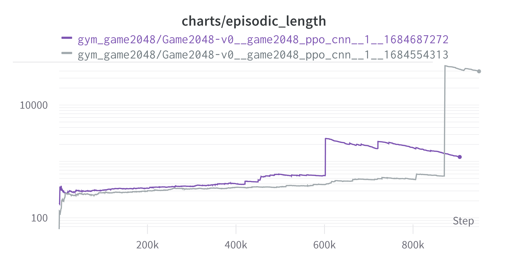

2048 게임을 정복하기 위해 [gym-game2048](https://github.com/helpingstar/gym-game2048) 강화학습 환경을 만들고 그것을 정복하기 위해 시도한 시행착오를 적어놓은 일지이다.

(2023-05-19 23:43:28)

# 1. sparse reward vs dense reward

2048 게임의 목표는 2048이라는 숫자를 만드는 것이다. 그리고 점수는 합쳐진 숫자들의 합이다. 예를 들어 4와 4를 합쳐서 8을 만들었다면 8점이 추가된다. 또 2와 2, 4와 4를 합쳤다면 12점이 올라가게 된다. 여기서 보상을 어떻게 설정할 것인가에 대해 고민이 있었다.

게임의 목표를 2048을 최대한 빨리 만드는 것으로 한다면 점수를 보상으로 하였을 때 게임을 바로 끝내지 않고 더 점수를 얻고 끝내는 상황이 나올수 있다는 생각이 들었다. 또한 예를 들어서

```
# ex1
2 4 2 4
0 0 0 0
0 0 0 0
0 0 0 0
```

와 같은 상황에서 위로 올리면 블록이 새로 스폰되지도 않고 아무일도 일어나지 않으나 이것은 한 스텝에 해당한다. 이럴 경우 게임 진행이 거의 멈춰버릴 수 있다. 이를 방지하기 위해 모든 스텝에 대해 -0.001의 보상을 주고 학습을 했다. 그리고 실패, 성공 각각에 대해 -5, +5의 보상을 주고 학습을 했다.

결과는 실패였다. 원인은 다음과 같다. 스텝의 수가 일정 횟수를 넘어가면 그것이 실패의 보상인 -5보다 낮아진다. 그럴 경우 에이전트는 "기약없는 무의미한 행동을 반복할 바에는 빨리 죽어서 보상을 최대화하자" 라고 생각하게 된다.

# 2. truncated의 주의점

1번과 같은 이유로 `TimeLimit`을 이용해서 일정 횟수를 넘어가면 truncate를 했다. 이것은 무행동을 반복하고 있을 확률이 높기 때문에 그전에 끊어버리는 것이다. 이러면 경우에 따라 문제가 각각 있었다.
1. 시간제한 × (step의 보상) 이 클리어 실패시 보상보다 높을 경우 (예를 들어 -0.0001 × 30000 > -5) 학습이 되지 않는다. 지정된 시간 내에 빨리 클리어를 해서 보상을 높이라는 의도였으나. 실패할바에 그때까지 최대한 버텨서 보상을 높이는 것이다.
2. 시간제한 × (steps의 보상) 이 클리어 실패시 보상보다 낮을 경우 다른 관점으로 문제가 발생하는데, 스텝이 너무 높아지면 이득이 너무 낮아지므로 그 전에 최대한 빨리 게임을 끝내버리려고 하는 것이다.

TimeLimit가 효과가 없던 것은 결국 양의 보상이 너무 희소하기 때문에 벌어진 일이었다.

# 3. 보상 설계 변경

보상을 게임의 게임의 점수 체계와 같게 하였다. 합쳐진 블록에 각각 $\log_2$를 취하고 0.1을 곱해서 모두 더하였다. 예를 들어 4+4, 2+2가 동시에 합쳐졌다면, 8, 4가 만들어지므로 0.3, 0.2를 더해서 0.5의 보상을 받는 것이다. 로그를 취하는 것이 맞는것일까 라는 생각을 했다. 2048을 만들면 나오는 1.1과 1024를 만들면 나오는 1.0의 보상의 가치가 같을까 하는 생각이 든다. 게다가 2048을 만들면 게임이 끝나버려서 더이상의 보상을 어디 못하게 된다.

# 4. 한계
{: width="80%" height="80%" class="align-center"}

<p style="text-align: center; font-style: italic;"> (Exponential Moving Average: 0.99) </p>

 전체적으로 상승곡선을 그리기 때문에 더 시간을 투자한다면 해결될 수도 있지만, 여기까지에 대해 세가지 개선 방안을 생각해 보았다.

1. (16, 64), (64, 64), (64, ~) 로 설계된 actor, critic 신경망의 유닛 개수를 늘려 보기
2. CNN을 사용해서 공간 정보를 더 얻어보기, 예를 들어 위 아래는 게임적으로 연관이 있으나 Flatten 되면서 공간 정보가 사라지게 된다.
3. 마지막 클리어에 대한 보상을 더 높이기, 현재는 보상이 선형적인데 때문에 최종 보상에 대한 모티브가 부족한게 아닐까 싶다. 1, 2를 현재 실험결과와 비교해본 뒤에 시도해볼 생각이다.

(2023-05-22 12:14:21)

# 5. CNN의 적용

모델을 개선하기 위해 CNN을 적용시키기로 했다. 그와 함께 몇가지를 수정하였다. 수정사항은 다음과 같다.

**기존**

1. MLP만 사용한다.
2. **(1, 4, 4)** ⇒ *Flatten* ⇒ **(16, )** ⇒ *(16, 64)* ⇒ **(64, )** ⇒ *(64, actor/critic)* ⇒ **(actor/critic)**
3. 활성화함수로 Tanh 사용

**변경**

1. CNN도 사용한다.
2. **(1, 4, 4)** ⇒ *(32, 3, 3) kernel* ⇒ **(32, 2, 2)** ⇒ *Flatten* ⇒ **(128, )** ⇒ *(128, actor/critic)* ⇒ **(actor/critic)**
3. 활성화 함수로 ReLU 사용

결과는 다음과 같다. 회색 그래프가 CNN이 적용된 모델이다. 결과 그래프를 보기 전에 특이(원하지 않았던)현상을 먼저 살펴보자

{: width="80%" height="80%" class="align-center"}

새로운 모델 적용 과정에서 한 특정 에피소드가 **턱에 걸리는(필자가 만들어낸 표현, 아무의미 없는 행동을 많이 반복하는) 현상이 발생했다.** 이전 모델에도 그런 부분이 있긴 했으나 지금만큼 심하지는 않았다. 이로 인해 한 에피소드에서 상당한 양의 스텝을 소비하게 되었다. 이로 인해서 그래프가 약간 이상해졌는데 이에 대해서는 뒤에 자세히 서술하겠다.

그리고 단순 턱에 걸리는 현상 때문인지 성능 향상으로 인해서 한 에피소드에 소비되는 스텝의 양이 증가했기 때문인지 모르겠지만 그로 인하여 아래와 같이 업데이트당 소모하는 스텝이 늘면서 아래와 같은 그래프가 나왔다.

{: width="80%" height="80%" class="align-center"}

그로 인하여 회색 그래프가 중간에 끊겼다. 아래는 결과이다. (exponential Smoothing: 0.99)

{: width="80%" height="80%" class="align-center"}

{: width="80%" height="80%" class="align-center"}

상기해보면 우리의 목표는 max_number를 최대한 크게 만드는 것이었고 그를 위해 보상을 합쳐져서 만들어진 블록에 $\log_2$를 취하고 0.1을 곱하는 것이었다. 그리하여 보상은 [0.2, 0.3, ..., 1.1]을 가지게 된다.
초반 추세는 회색 그래프가 빠르지만 마무리 상태에서는 비슷하다. 무의미한 행동에 많은 스텝을 소모하게 되면서 제대로된 비교는 못하게 되었다. 하지만 여기까지의 결과에 대해 몇가지 생각을 했다. 엄밀하지는 않다.

1. 늘어난 가중치 때문인지, CNN 때문인지는 확실하지는 않지만 성능의 상승을 주는 것은 맞는 것으로 보인다. 이후의 실험에서는 CNN을 사용하기로 했다.
2. 턱에 걸리는 상황을 피해야 한다. 턱에걸리는 상황은 주로 다음과 같은 상황에서 나오게 된다.

```
# ex2
128 4  2  0
252 2  16 0
128 8  2  0
16  32 4  0
```
에이전트는 한쪽(방향은 무관한 것 같다)으로 높은 숫자를 몰아높고 하나씩 몰아주면서 점점 늘려가는 방식을 취하는데 왼쪽으로 몰아놓았다고 가정할 때 에이전트가 선호하는 방향은 왼쪽, 위쪽, 아래쪽일 것이다. 근데 위와 같은 상황에서는 왼쪽, 위, 아래가 의미없는(행동을 해도 아무런 효과가 없는) 행동이 된다. 의미있는 행동은 오른쪽으로 가는 행동인데 이것은 왼쪽에 이쁘게 모여있는 높은 숫자들의 대형을 흐트리게 된다. 높아진 숫자는 다시 모서리로 넣기 힘들다. 사람 입장에서도 기피하고 싶은 이 상황은 에이전트에게도 확률이 아주 낮게 설정되어 있어 벗어나기 아주 힘든 상태가 된다.

이런 2번같은 상황을 벗어나기 위해 해결책을 생각해보았다.

# 6. 턱에 걸린상태에서 넘어가기

턱에서 넘어가지 않는 상황에 대해 다음과 같은 생각을 해 보았다.
1. 장기적으로는 그것이 보상이 별로라는 사실에 대해 알기 때문에 장기적으로는 기대보상이 0인 상황을 벗어나기 위해 바로 움직이게 될 것이다.
2. 턱에서 벗어나려는 동기가 부족할 수도 있다. 벗어나려면 이쁘지 않지만 어찌됐든 그 상태를 벗어나야 한다. 어차피 가많이 있어봤자 보상은 0이기 때문이다. ex2로 생각하면 오른쪽으로 옮겨야 하는 것이다. 그런데 2와 2를 합쳐서 보상을 0.2를 얻는 것과 256과 256을 합쳐서 0.8의 보상을 얻는 것이 거의 차이가 나지 않으니 더 큰 숫자를 합치는 것에 대해 동기가 부족한게 아닐까 하는 생각을 했다.
3. 일반적인 행동에 대해 음의 보상을 주는것은 어떨까, 성공, 실패만을 보상 설정에 이용하는 경우(보상의 희소했던 경우) step에 대해 음의 보상을 주는 것은 역효과가 있었지만, 지금과 같이 나름 학습이 잘 되는 경우 턱에 걸린 상황에서 음의 보상을 주는 것은 효과가 있을 수도 있겠다는 생각이 들었다.
4. 시간 제한(TimeLimit)을 두는 것이다. 최악의 상황에서 모든 블록이 2로 스폰되었고 16칸을 모두 1024로 만들 때 무의미한 행동(아무 블럭도 움직이지 않는 행동)을 안 한다고 가정하면 1024 * 16 / 2 = 8192번의 행동이 필요하다. 그런데 심한 경우 에피소드의 길이가 10만 단위까지 넘어가기도 한다. 이럴 경우 시간 제한을 통해 truncation으로 다음 학습을 도모하는 것도 나쁘지 않을 것 같다는 생각도 든다. 하지만 그런 행동에 대해 진짜 얼마나 나쁜지 확인하기 전에 학습하기 전에 끊어버릴경우 그 것이 얼마나 나쁜지를 영영 모를 수도 있다느 생각이 들었다.

# 7. 보상체계 변경

[**6 턱에 걸린상태에서 넘어가기**](#6-턱에-걸린상태에서-넘어가기)의 3번과 관련해서 과연 512 두개를 합쳐서 얻는 1($0.1 \times \log_{2}1024$)의 보상이 2 두개를 합쳐서 얻는 0.2($0.1 \times \log_{2} 4$)의 5배라는 것이 타당한가라는 생각이 들었다. 숫자 4를 5번 만드는 것의 보상이 1024를 만드는 것과 같다. 하지만 이를 만드는데 드는 행동은 약 2 × 5 vs 512로 약 50배가 차이난다.

보상에 log를 취했던 목적은 보상의 범위를 좁히기 위함이었다. 보상의 추세가 $2^x$를 따라가니 보상의 큰 값(또는 분산)이 학습을 어렵게 하지 않을까라는 나의 추측 때문이었다.

그래서 각 보상의 체계를 노력의 정도와 같게 했다. 각 보상의 다음 단계보상까지의 행동의 횟수는 $2^n$ 의 추세를 따라가므로 보상도 그렇게 바꾸었다. 이는 결국 만든 숫자의 추세(4, 8, 16, ...)와 같다. 그리하여 보상쳬계를 다음과 같이 바꾸었다.

보상 체계 변경은 [`RewardByScore`](https://github.com/helpingstar/gym-game2048/blob/main/gym_game2048/wrappers/reward_by_score.py) wrapper를 이용하였다.

합쳐서 만들어진 숫자들을 $\\{c_1, c_2, ..., c_n\\} \in C$ 라고하자, 합쳐진 것이 없을 경우에 보상은 둘다 0이다.

**기존**

$$R = 0.1 \times \sum_{i}^{n}\log_{2}c_i$$
* 범위 : $\left [ 0, 0.1 \times \log_{2}(\text{goal}) \right ]$
* 예시(goal=2048) : 0, 0.1, 0.2, ..., 1.1

**변경**

$$R = 0.01 \times \sum_{i}^{n}c_i$$
* 범위 : $\left [ 0, 0.01 \times \text{goal} \right ]$
* 예시(goal=2048) : 0, 0.02, 0.04, ... 20.48

(2023-05-24 15:20:46)

실험의 결과를 보자 return의 경우는 reward 산정 방식이 달라졌기 때문에 의미가 없어 제외하였다.
<span style="color: purple">**보라색**</span>이 새로운 결과이다.

일단 예상치 못한 변수가 있었다.

{: width="80%" height="80%" class="align-center"}

아파트 변압기 교체로 인하여 정전이 일어났다! 그래서 실험이 중간에 멈추긴 했지만 나름 진행되고 멈춰서 결과는 어느정도 확인할 수 있었다.

{: width="80%" height="80%" class="align-center"}
<p style="text-align: center; font-style: italic;"> (Exponential Moving Average: 0.99) </p>

실험의 목적인 "보드에 있는 숫자의 최댓값을 높이기, 2048을 달성하기"에 대해서는 더욱 효과가 있는 것으로 나타났다. 아무래도 노력의 추세와 보상의 추세를 동일하게 만든 것이 효과를 본 것 같다.

또한 "턱에 걸린상태를 벗어나기", 직접적인 목표와는 관련이 없지만 학습을 효율적으로 하기 위한 것에 대해서 효과가 있었는지 살펴보자

{: width="80%" height="80%" class="align-center"}
<p style="text-align: center; font-style: italic;"> (Exponential Moving Average: 0.99, Log Scale) </p>

이전보다 더 나아졌다고 볼 수도 있지만. 이상치를 제외한 대부분에 있어서는 새 실험이 오히려 더 에피소드 길이가 늘어났다. 성능이 더 좋아졌기 때문에 그럴수도 있지 않냐 라고 할 수 있겠지만 해당 그래프의 세로축은 로그단위인 것을 감안하면 성능 향상에 의한 효과 이상으로 에피소드의 길이가 길어졌다고 판단된다. 그러므로 단순히 보상체계 변경이 "턱에 걸리는 상태를 벗어나기"라는 관점에서는 실패한 것으로 판단하였다.

# 8. 이어달리기

[7. 보상체계 변경](#7-보상체계-변경) 에서 정전으로 인해 실험이 끊겼다. 다행히 모델의 가중치는 일정 간격마다 저장했고 가장 최근의 가중치를 이어서 로드후에 학습을 다시 시작하였다.

<span style="color: pink">**분홍색**</span>이 새로운 결과이다.

{: width="80%" height="80%" class="align-center"}
<p style="text-align: center; font-style: italic;"> (Exponential Moving Average: 0.99) </p>

{: width="80%" height="80%" class="align-center"}
<p style="text-align: center; font-style: italic;"> (Exponential Moving Average: 0.99) </p>

보상 산정방식은 동일하기 때문에 return 그래프도 넣었다. 보다시피 두개 모두 이어서 하는 것 자체는 잘 되는 것으로 보인다.

{: width="80%" height="80%" class="align-center"}
<p style="text-align: center; font-style: italic;"> (Exponential Moving Average: 0.99) </p>

{: width="80%" height="80%" class="align-center"}
<p style="text-align: center; font-style: italic;"> (Exponential Moving Average: 0.99) </p>

그런데 이 그래프를 보고 더 이상 개선될 여지가 있을까? 라는 생각이 들었다. 목표에 점점 다가갈수록 경우의 수가 급격하게 늘어나기 때문에 학습이 잠시 멈춘 것 처럼 보일 수 있지만 학습이 되고 있는 것일 수도 있기 때문이다.

하지만 [7. 보상체계 변경](#7-보상체계-변경) 의 실험 결과로 인해 "턱에 걸리는 현상"은 해결을 못했다는 것이 밝혀졌기 때문에 어차피 개선도 안되는 것 같은데(확실하진 않지만) 이참에 좀 수정을 해보고 다시 실험을 진행해보자는 생각이 들었다.

# 9. 새로운 실험 설계

그동안 의문이었던 것을 수정하고 다시 실험하기로 하였다.

**기존**

1. 클리어시 추가 보상 없음 (20.48의 보상을 받고 종료)
2. (1, 4, 4) ⇒ *[(32, 3, 3) kernel]* ⇒ (32, 2, 2) ⇒ *[Flatten]* ⇒ (128, ) ⇒ *[(128, actor/critic)]* ⇒ (actor/critic), MLP의 유닛을 128개로 하였다.
3. 블록이 합쳐질 때만 보상을 주고 나머지는 0을 부과한다.

**변경**

1. 클리어시 **추가 보상 부과** (20의 보상을 추가로 준다.)
2. **(1, 4, 4)** ⇒ *[(**128**, 3, 3) kernel]* ⇒ (**128**, 2, 2) ⇒ *[Flatten]* ⇒ (**512**, ) ⇒ *[(**512**, actor/critic)]* ⇒ (actor/critic), MLP의 유닛을 512개로 늘렸다.
3. 모든 보상에 대해 **-0.001 의 보상을 추가**한다.

수정이 필요했다고 느낀 점은 다음과 같다.

1. 내 목표는 점수를 높이는 것이 아니라, 게임의 클리어 확률을 높이는 것이다. 그런데 보상체계는 점수와 같다. 그렇다면 1024와 1024를 합쳐서 2048을 만드는 것과 같이 클리어가 가능한 순간에 다른 블럭을 합쳐서 더 큰 점수를 얻을 수 있다면 에이전트는 그것을 선택할 것이다. 512를 4개 만들거나, 1024를 두개 더 만들면 같다. 물론 discount factor 같은 것들이 그런 것들의 효과를 줄여주긴 하지만 혹시 몰라 넣었다. 20.48과 비슷한 20점을 추가로 주기로 하였다. [`RewardByScore`](https://github.com/helpingstar/gym-game2048/blob/main/gym_game2048/wrappers/reward_by_score.py)를 사용하였다.
2. 신경망의 크기에 대한 직관, 지식이 부족하기 때문에 다른 문제들의 신경망을 참고한다. 내가 본 두 신경망은 [`cleanrl/ppo.py`](https://github.com/vwxyzjn/cleanrl/blob/master/cleanrl/ppo.py), [`cleanrl/ppo_atari.py`](https://github.com/vwxyzjn/cleanrl/blob/master/cleanrl/ppo_atari.py) 두개였다. 전자는 cartpole문제에 대해 MLP(64)를 두개 사용하였고 후자는 CNN을 통과시킨 후 MLP(512)를 두개 통과시켰다. 전자의 코드를 참고하느라 MLP의 유닛을 64개로 사용하였고 그것이 부족하여 128개로 늘렸다. 그런데 2048의 문제에 대해서 observation의 경우의 수가 $11^{16}$이다. 그렇기 때문에 cartpole 보다는 atari에 가까운 복잡도라 생각하였고 MLP의 유닛을 대폭 늘렸다. atari보다는 덜 복잡하다고 생각하였고 CNN을 3개 통과한 atari코드에 비해 CNN을 한개만 통과시켜 가중치 개수는 그보다 적게 하였다.
3. [gym(gymnasium) 환경 구성시 고려할 점](https://helpingstar.github.io/rl/gym_env_tip/#1-1) 에서 적기도 하였는데, 할수 있는데 못하는 행동(바둑에서 이미 돌이 있는 곳에 돌을 두는 행위같은 것)에 대해 고민이 많았다. 최근에 알게 되었는데 이런 행동을 illegal action이라고 한다. gymnasium에 구현된 환경들은 이런 illegal action이 없었다. 그러다가 멀티 에이전트 환경을 모아놓은 [PettingZoo](https://pettingzoo.farama.org/)을 보았다. illegal한 행동을 할 경우 -1의 보상과 함께 게임을 종료(좀 심한 것 아닌가?)시키는 [Chess/Legal Actions Mask](https://pettingzoo.farama.org/environments/classic/chess/#legal-actions-mask)가 구현된 것과 illegal action이 들어오면 `illegal_reward`와 함께 게임을 종료시키는 [TerminateIllegalWrapper](https://pettingzoo.farama.org/api/wrappers/pz_wrappers/#pettingzoo.utils.wrappers.TerminateIllegalWrapper) 를 보니 illegal action 에 대해 강경(?) 하게 대처하는 것을 확인할 수 있다. 두 플레이어가 있어서 legal action을 하는 것이 중요한 상황은 아니니 게임을 종료시키기는 좀 그렇고 전체 step마다 -0.001의 보상을 추가하기로 했다. illegal 한 행동을 검출하여 해당 행동에만 음의 보상을 줄 수도 있었지만 다른 reward가 0.001에 비해 충분히 높기 때문에 그냥 빼기로 했다.

# 10. 바보야, 문제는 신경망이야!

실수로 실험을 끊어버리긴 했지만 그전 실험과 비교해 유의미한 결과가 나왔다. 차트를 직접 보면 직관적으로 이해가 갈 것이다.

<span style="color: #e78555">**주황색**</span>이 9번을 적용한 새로운 결과이다.

{: width="80%" height="80%" class="align-center"}
<p style="text-align: center; font-style: italic;"> (Exponential Moving Average: 0.99) </p>

{: width="80%" height="80%" class="align-center"}
<p style="text-align: center; font-style: italic;"> (Exponential Moving Average: 0.99) </p>

{: width="80%" height="80%" class="align-center"}
<p style="text-align: center; font-style: italic;"> (Exponential Moving Average: 0.99) </p>

압도적으로 성능이 좋은 것을 확인할 수 있다. 시간적 한계로 인하여 개선점 세 개를 한번에 적용하였지만 몇가지 결론을 얻을 수 있었다.

1. **episodic length** 그래프를 보면 '턱에 걸리는 상황'을 억제하는 데는 효과가 크지 않은 것을 볼 수 있다. 물론 성능이 증가했기 때문에 그럴 수 있지만. 전체적인 억제 효과는 미미했던 것 같다. 물론 학습이 지속된다면 점점 억제되는 효과는 있지 않을까 싶다.
2. 목표(11)에 도달하면 추가적인 보상을 주었는데 도달하기 전에 이미 전 실험결과를 뛰어넘었다. 그럼 9.1처럼 성공시 보상 추가에 대한 효과 덕분은 아니라는 뜻이다. 그래서 전반적인 성능 향상은 신경망의 크기 증가 덕분이라고 결론내렸다.
3. 성공시 보상 추가에 대한 것은 해당 파라미터만 조절후 다시 도전해보는 것이 좋을 것 같다.

(2023-05-27 18:39:21)

# 11. 모로 가도 서울만 가면 안된다.

학습된 에이전트의 플레이 영상을 보다가 든 생각이다. 먼저 그림을 보자

{: width="80%" height="80%" class="align-center"}

내가 원하는 상황은 오른쪽이다. 2048을 완성하는 것이다. 나는 [**7. 보상 체계 변경**](#7-보상체계-변경) 에서 점수와 보상체계를 같게 했다. 그러면 실제 점수와 받는 보상의 상대관계가 같다는 이야기이다.(물론 discount factor, GAE등의 요소들이 있기 때문에 1:1로 비교하기에는 무리가 있다.)

그런데 사진을 보면 오른쪽을 지향하는데 불구하고 점수는 거의 차이가 나지 않는다. 물론 이런 상황을 충분히 예상해서 [**# 9.1**](#9-새로운-실험-설계)에서 클리어시에 보상을 20을 더 줬고 이는 점수로 환산하면 2000에 해당하는 값이다. 에이전트는 클리어시에 40.24의 값을 받고 종료하기 때문에 충분히 큰 값이라 생각했다.

현재 학습의 척도는 점수이고 직접 찾아보지는 않았지만 클리어시보다 비 클리어시에 점수가 더 높은 상황이 충분히 많이 발생할 수 있다는 생각이 들었다. 그럴 경우 에이전트는 클리어가 가능한 상황에서 클리어를 하지 않고 점수를 최대한 올리는 상황을 선택할 수도 있다. 계산해보면 4만 나오는 경우에는 18432, 2만 나오는 경우는 20480이다.

클리어 보너스를 왜 진작 높은 값으로 하지 않았냐에 대해서는 reward가 너무 커질 경우 학습이 안정적이지 않을 우려가 있어서였다. 근데 다시생각해보니, 클리어는 진짜 최종 목표인데 충분히 큰 값으로 해야하나 하는 생각이 들었다. 지금 하고 있는 학습이 끝나면 클리어시 보상을 더 높여볼 생각이다.

바로 클리어를 하지 않는 상황의 예시는 다음과 같다. 윗 내용 작성중에 발견하였다.

{: width="80%" height="80%" class="align-center"}

스텝이 1차이나는데 903 스텝에서 바로 클리어를 할 수 있지만 점수를 더 얻고 끝내기 위하여 위로 옮겨서 4점을 더 얻은 다음 905스텝에서 2048을 만들고 클리어한다. 여기에 대해 몇가지 생각이 들었다.
1. 최대한 빨리 클리어 하는 것이 목표라면 이것은 잘못된 행동이다. 그런데 나는 일단 클리어를 목적으로 하였기 때문에 수정하지는 않았다.
2. 위로 올리는 행동을 하더라도 2048을 만들 수 있다는 것을 알고 행동을 했다면 바람직한 행동이라고도 볼 수 있다.
3. 904 스텝에서 아래로 내린 후에 오른쪽으로 옮긴다면 더 큰 점수를 얻을 수 있지만 그렇게 하지는 않았다. 학습이 덜 된 것인지 알고리즘 설계상 그것이 더 높은 가치가 있었는지 낮은 확률이었는데 되었는지는 모르겠다.

PPO의 보상추정이랑, 행동 선택 이유를 추적하는 방법을 공부해야할 것 같다.
