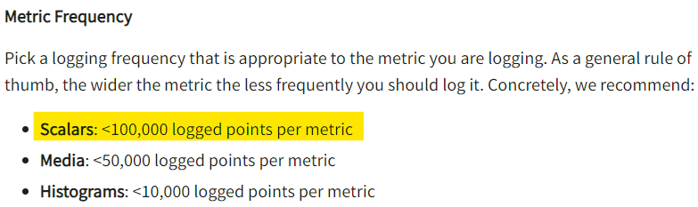

# 1. 한 메트릭의 스칼라는 100K 이하여야 한다.

wandb를 사용하면서 왜 뒤로갈수록 그래프가 간격도 넓어지고 이상해지지 라는 생각을 했다. csv로 다운할때도 계속 100K개로 고정되고 에피소드가 길어져서 그런건가 생각했는데 wandb 문서에서 다음과 같은 것을 발견했다.

{: width="80%" height="80%" class="align-center"}

한 메트릭에 100K개 이상 로그하면 안된다. 나는 약 10M 개를 로그하려다보니까 그래프의 로그 빈도가 점점 줄어들어 플로팅에 오류가 있었던 것 같다.

그래서 특정 간격마다 로그를 저장하도록 코드를 수정하였다.
