Woodoku는 특정 게임의 이름입니다. 좋은 이름이 떠오르지 않아 환경 또한 Woodoku로 이름지었습니다. 비슷한 게임이 여럿 있는 것으로 알고있지만 어떤 게임이 원조인지는 모릅니다. Woodoku 이름 관련하여 문제가 있을 경우 왼쪽 프로필의 이메일로 연락 주시길 바랍니다.

Woodoku is the name of a specific game. I couldn't come up with a good name so I also named the environment Woodoku. I know there are several similar games, but I don't know which one is the original. If you have any problems with the Woodoku name, please contact me at the email on the left profile.

---

Woodoku 게임을 정복하기 위해 [**Woodoku 강화학습 환경**](https://github.com/helpingstar/gym-woodoku)을 만들고 그것을 정복하기 위해 시도한 시행착오를 적어놓은 일지이다.

# 1. 게임 방식

플레이스토어에서 5000만 이상의 다운로드를 기록한 게임이다. [이 링크를 통해](https://play.google.com/store/apps/details?id=com.tripledot.woodoku) 다운로드 하여 플레이해볼 수 있다. 게임화면은 다음과 같이 생겼다.

{: width="35%" height="35%" class="align-center"}

아래의 세 블록을 위의 격자에 배치시킨다. 블록을 겹쳐놓거나 격자 바깥에 걸쳐놓을 수 없다. 가로, 세로, 3x3 공간을 채우면 블록이 비워지며 점수를 얻는다. 세 블록을 모두 사용하면 세 블록이 새로 들어온다. 아무 블록도 배치할 수 없는 상태가 되면 게임은 종료된다.

비슷한 여러 게임들이 있다.
{: width="70%" height="70%" class="align-center"}


# 2. 강화학습 측면 분석

블록을 배치하는 격자는 9 x 9 로 되어있으며 각 격자는 블록이 있냐/없냐로 2가지 상태가 있다. 그러므로 격자의 observation_space는 $2^{9\times9}\approx 2.4 \times 10^{24}$ 이다.

블록은 Woodoku 기준 47개가 있다. 47개 중 3개가 선택되며 각 블록이 최소 하나는 화면에 존재하며 블록이 존재할 수도 존재하지 않을 수도 있으므로 이에 대한 경우의 수는 $P(47, 3) \times (2^3 -1) \approx 6.8 \times 10^5$

그러므로 observation의 전체 경우의 수는 약 $1.6 \times 10^{30}$이다. 실제 활용시에는 CNN을 통과하기 위해 15x15 격자에 각 요소를 배치한다.

행동은 3개의 블록중 하나를 선택해서 81개의 격자 중 하나에 배치하는 것이므로 $3 \times 81 = 243$ 이 된다.

이전의 [2048 게임](https://helpingstar.github.io/rl/game2048_trial_and_error/)과 구별되는 가장 큰 특징은 action space가 이산이면서 매우 높다는 것이다. 각 상태에서 최적의 행동을 찾으려면 243개의 행동 중 하나를 선택해야 하니 엄청난 시간이 소요될 것으로 예상된다.

(2023-06-11 23:38:00)

# 3. 연속 개념

보통 이런 류의 게임은 점수설정에 있어서 두가지 항목에 가산점이 들어간다.

1. 연속으로 블록 제거, 이 연속을 straight 라고 하겠다.
2. 한 턴에 여러 블록 제거, 이 숫자를 combo 라고 하겠다.

즉 현재 상태에서 전에 straight가 많이 쌓여 있는 경우, 블록을 배치하기 보다는 블록을 부술 수 있는 위치에 두는 것이 더욱 유리할 수 있다. 그런데 현재는 블록과 보드만 observation으로 받는다. 그러므로 에이전트는 이에 대해 알 방법이 없다. 일종의 Partially Observed MDP인 것이다. 내 지식 선에서는 이럴 경우 순환 신경망이나. 프레임 여러개를 사용하는 것으로 알고 있다.

하지만 지금은 그런 것을 고려하기보다는 일단 블록을 최대한 부숴서 게임을 오래 유지하는 것도 목적에 어느정도 부합하기 때문에 그런 측면에서 먼저 해결 후에 straight 개념을 도입할 예정이다.

# 4. 느린 학습

일단 보상 체계는 다음과 같이 하였다. Illegal Action은 1번 블록칸이 비어있는데 1번 블록을 사용한다던지, 아니면 이미 블록이 있는 칸에 놓으려고 한다던지 같은 경우다.

1. Illegal Action시에 -5의 보상을 주고 Terminate
2. 블록 놓을 때마다 0.1의 보상
3. 블록 파괴시 1 + 파괴된 블록 덩어리 수 (combo)

그렇게 했을 때 그래프를 보자

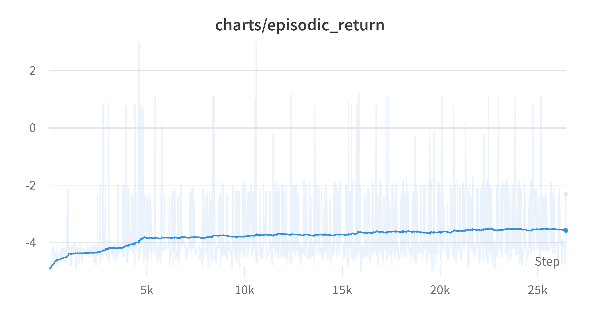{: width="80%" height="80%" class="align-center"}

<p style="text-align: center; font-style: italic;"> (Exponential Moving Average: 0.99) </p>

PPO, 4개의 병렬 환경, total_timestep이 20,000,000이다.


이전 2048과 다르게 학습이 엄청 오래 걸렸다. 런타임은 22시간이다. 블록 하나를 합칠때 최소 2점인 것을 생각하면 매우 느리게 올라가는 것 같다. 243개의 행동중에 Illegal Action의 비중이 엄청나게 높다보니 그런 것이라고 추측하고 있다.

y축을 조정하면 다음과 같다.

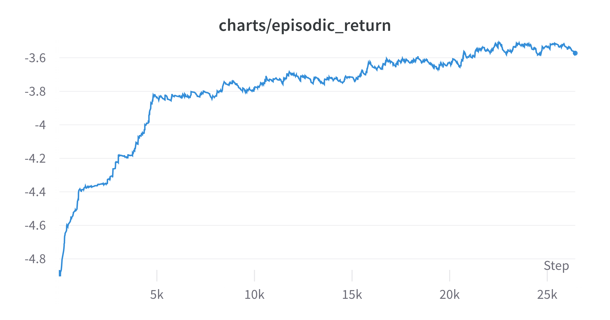{: width="80%" height="80%" class="align-center"}

<p style="text-align: center; font-style: italic;"> (Exponential Moving Average: 0.99) </p>

그나마 긍정적인 측면은 그래프가 올라가고 있다는 것이다. 일단 엄밀하게는 아니지만 이미 사용한 블록을 또 사용하지 않는 것(1번 블록을 사용하면 2, 3번블록이 남게 되는데 이러면 0~80 행동이 Illegal Action이 된다.)만으로도 Illegal Action을 1/3은 방지하게 되는데 이것을 먼저 학습하는 것 같다.

그래도 일단 학습이 되고 있다는 것을 확인했으니 위 그래프에서 weight를 받은 후 학습을 계속 진행시켜봤다.

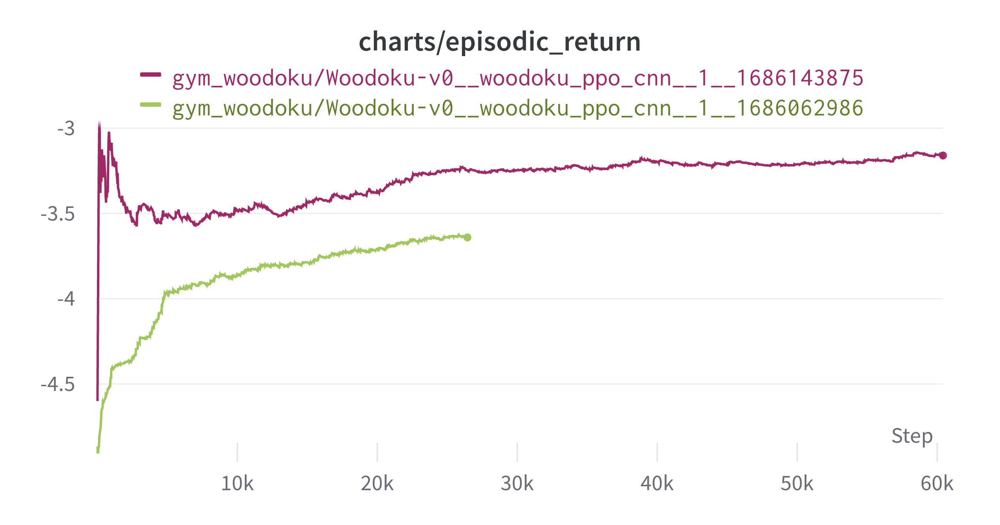{: width="80%" height="80%" class="align-center"}

<p style="text-align: center; font-style: italic;"> (Exponential Moving Average: 0.99) </p>

위에있는 초록색 그래프가 위에서 제시한 그래프이다. 초록색 끝에서 weight를 이어받아서 빨간색으로 계속 학습시킨 것이다. 학습에 55시간이 들었다. 더 학습을 진행할까 하다가 문득 그생각이 들었다.

이 방법이 맞을까? 옳은 학습 방법일까? 다른 방법은 더 빠를 수도 있지 않을까? 하고 말이다. 그래서 신경망 weight는 일단 저장후 다른 파라미터를 적용하여 실험해보기로 했다.

실험에서의 일종의 exploration을 한 것이다.

# 5. Exploration

**5., 5.5에 진행하는 실험은 추후 성능을 파악하기 위해 아주 극초반만 실험해본 것이다. 축의 크기에 유의해야 한다.**

하이퍼파라미터를 바꿔보면서 실험을 진행했는데 변경 내용은 다음과 같다.


기존

1. learning-rate : 0.00025
2. clip-coef : 0.2
3. kernel-size : 3

변경

1. learning-rate : 0.0005
2. learning-rate : 0.0001
3. clip_coef : 0.1
4. clip_coef : 0.3
5. kernel-size : 5

다른 것은 건드리지 않고 위 사항만 바꿔보고 10M
 step 만큼 실험을 진행했다. 결과는 다음과 같다.

(2023-06-13 13:51:19)

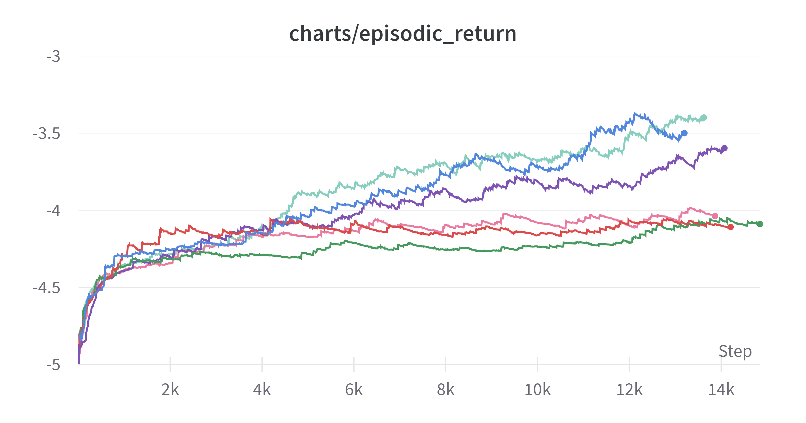{: width="80%" height="80%" class="align-center"}

<p style="text-align: center; font-style: italic;"> (Exponential Moving Average: 0.99) </p>

1. <span style="color: #87cebf">**기존**</span>
2. <span style="color: #5387dd">**kernel size = 5**</span>
3. <span style="color: #7d54b2">**clip coef = 0.1**</span>
4. <span style="color: #e87b9f">**clip coef = 0.3**</span>
5. <span style="color: #da4c4c">**learning rate = 0.0005**</span>
6. <span style="color: #479a5f">**learning rate = 0.001**</span>

색이 잘 안보일 수도 있어 0.999로 smoothing 했을 때 최종 결과가 좋은 순으로 위에서부터 적었다.

하이퍼 파라미터 조정으로 인한 눈에 띄는 변화는 없었다. 커널 사이즈 변화시에 엎치락 뒷치락 하는 정도는 있으나 큰 변화는 없다.

또한 어느정도 속도를 높이고자 하는 욕심에 learning-rate를 높여보았는데 이 부분은 실패하였다. 강화학습이 역시 다른 학습에 비해 learning-rate에 대해 민감한 것 같다.

그런데 특이한 점은 에피소드 길이에 있었다.

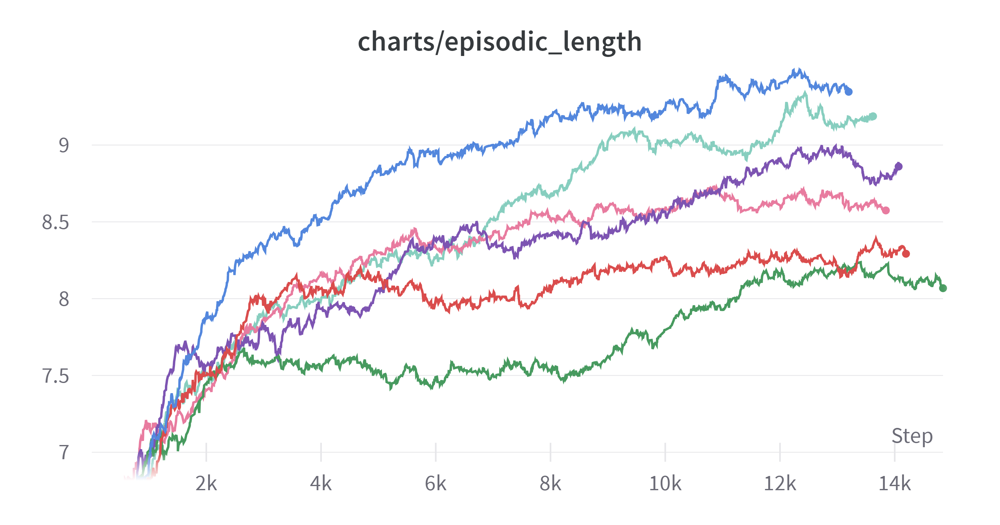{: width="80%" height="80%" class="align-center"}

<p style="text-align: center; font-style: italic;"> (Exponential Moving Average: 0.99) </p>

<span style="color: #5387dd">**커널 사이즈를 크게 한 것**</span>이 return은 적은데도 불구하고 에피소드의 길이는 전반적으로 긴 경향을 보였다. 이에 대해 몇가지 추론을 해봤다.

1. 에피소드 길이가 더 짧은데도 불구하고 리턴이 비슷하다면 커널 사이즈가 작은 것이 줄을 더 잘 완성시키는 것이다.
2. 파란색이 확실하게 더 길이가 더 긴데도 불구하고 리턴은 비슷하거나 혹은 더 작은 이유가 무엇일까


확실한 경향은 알 수가 없었다.

실험은 한번만 진행되었기 때문에 실험이 더 진행됐을 때 추세가 다를 수도 있다. 그래서 더 실험을 진행해보기로 했다.

이전 실험결과에서 결과가 좋았던 3개(clip coef 0.3, 기존, kernel 5)를 그대로 하거나 조합하여 더욱 실험을 진행해보았다.

이번에는 에피소드 길이를 10M에서 20M으로 늘렸다.

실험은 다음과 같다.

1. 기존
2. kernel size 5
3. clip coef 0.1
4. kernel size 5 & clip coef = 0.1

1, 2, 3은 그대로지만 20M까지 진행하여 10M에서의 우열이 계속 적용되는지 지켜보려고 한다.

(2023-06-15 21:15:19)

# 5.5 추가 실험

갑자기 그런 생각이 들었다. 학습률을 높이는 것은 오히려 학습의 성능을 떨어뜨렸다. 그럼 학습률을 낮추면 어떻게 될까?

learning rate를 0.0001로 고정하고 실험을 진행하였다.

실험 내용은 다음과 같이 4개를 추가하였다.

|   | clip coef | kernel size |
|---|-----------|-------------|
| 1 | 0.1       | 3           |
| 2 | 0.1       | 5           |
| 3 | 0.2       | 3           |
| 4 | 0.2       | 5           |

그래프를 보자 실험결과가 쌓이니 부자가 된 기분이다.

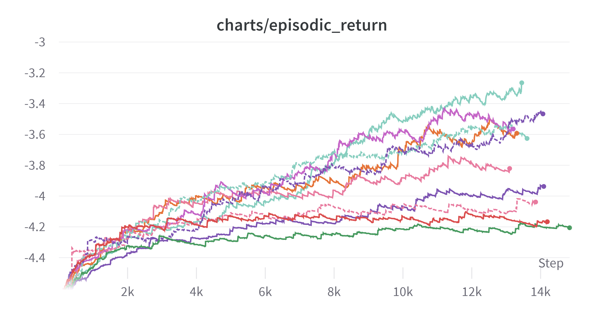{: width="80%" height="80%" class="align-center"}

<p style="text-align: center; font-style: italic;"> (Exponential Moving Average: 0.99) </p>

너무 많은 것 같으니 가운데 분홍 실선 그래프 위만 추려서 남겨보자

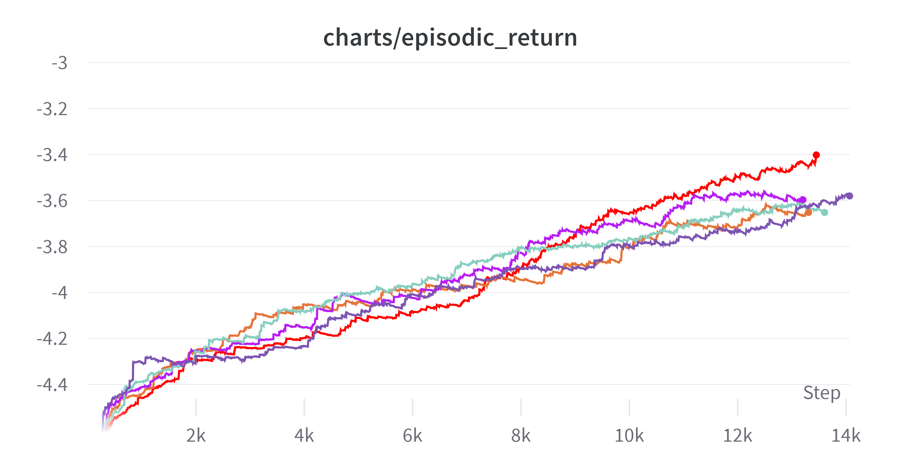{: width="80%" height="80%" class="align-center"}

<p style="text-align: center; font-style: italic;"> (Exponential Moving Average: 0.995) </p>

좀더 보기 쉽게 하기 위해 Smoothing을 0.995까지 했다. 색상 구분을 쉽게 하기 위해 위의 그래프와 색이 다르다.

끝점이 위에 있는 것 기준으로 적어보면 다음과 같다.

| 순위 | 색 | clip coef | learning rate | kernel size |
|---|-------|-----------|---------------|-------------|
| 1 | <span style="color: #ff0000">**■**</span> | 0.1 | 0.0001  | 3 |
| 2 | <span style="color: #7d54b2">**■**</span> | 0.1 | 0.00025 | 3 |
| 3 | <span style="color: #b71ef3">**■**</span> | 0.2 | 0.00025 | 5 |
| 4 | <span style="color: #87cebf">**■**</span> | 0.2 | 0.00025 | 3 |
| 5 | <span style="color: #e57439">**■**</span> | 0.1 | 0.0001  | 5 |

실험을 통해 알 수 있는 부분이 몇 가지 있다.

<span style="color: #ff0000">**빨간색**</span>이 눈에 띄게 좋은 성능을 보인다. 초반에 성능이 안좋다가 갑자기 역전한 것이 매우 특이하다.

그리고 clip coef가 0.1이면 learning rate가 0.0001인 것이 성능이 좋았고 clip coef가 0.2이면 learning rate가 0.00025인 것이 성능이 좋았다.

**clip coef와 learning rate가 어느정도 비례해서 움직이는 것이 좋은 것 같다.**

그리고 새로운 실험(learning rate: 0.0001) 안에서 특징을 발견할 수 있었는데 그래프를 보자

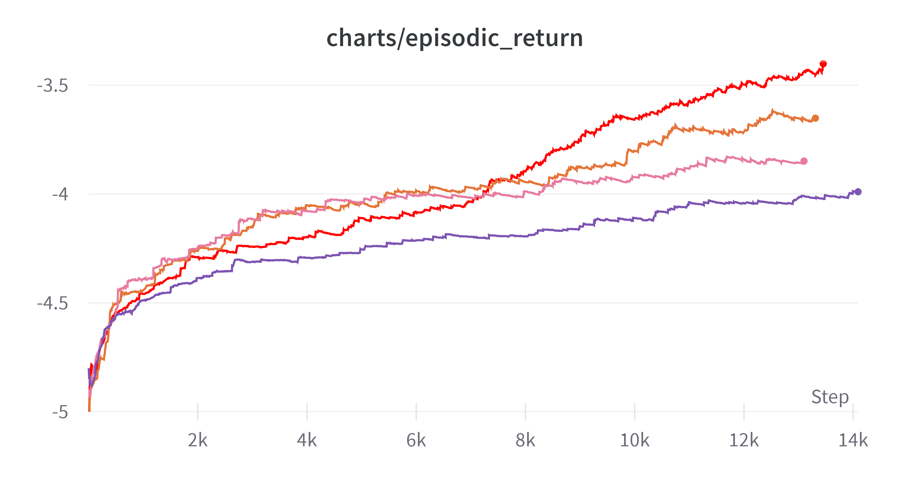{: width="80%" height="80%" class="align-center"}

<p style="text-align: center; font-style: italic;"> (Exponential Moving Average: 0.995) </p>

| 순위 | 색 | clip coef | learning rate | kernel size |
|---|-------|-----------|---------------|-------------|
| 1 | <span style="color: #ff0000">**■**</span> | 0.1 | 0.0001 | 3 |
| 2 | <span style="color: #e57439">**■**</span> | 0.1 | 0.0001 | 5 |
| 3 | <span style="color: #e87b9f">**■**</span> | 0.2 | 0.0001 | 3 |
| 4 | <span style="color: #7d54b2">**■**</span> | 0.2 | 0.0001 | 5 |


특징이 보이는가? learning rate가 0.0001일 때 clip coef가 같다면 **kernel size가 작은 것**이 더 결과가 좋았다.

learning rate가 작으면 어떻게 될까 해서 혹시나 해서 해본 실험이다. 얻어간 것이 많은 것 같다. 이전에

1. default (kernel size: 3, clip coef : 0.2)
2. kernel size 5
3. clip coef 0.1
4. kernel size 5 & clip coef = 0.1

이 네개로 20M step으로 실험해보겠다 했는데 결과가 좋은 실험이 몇 개 있어 위 네개에 추가로 두 개를 더 실험해볼 계획이다.

1. learning rate 0.0001 & kernel size 5 & clip coef 0.1
2. learning rate 0.0001 & kernel size 3 & clip coef 0.1

# 6. 엎치락 뒷치락

20M step에 대한 실험 결과는 다음과 같다.

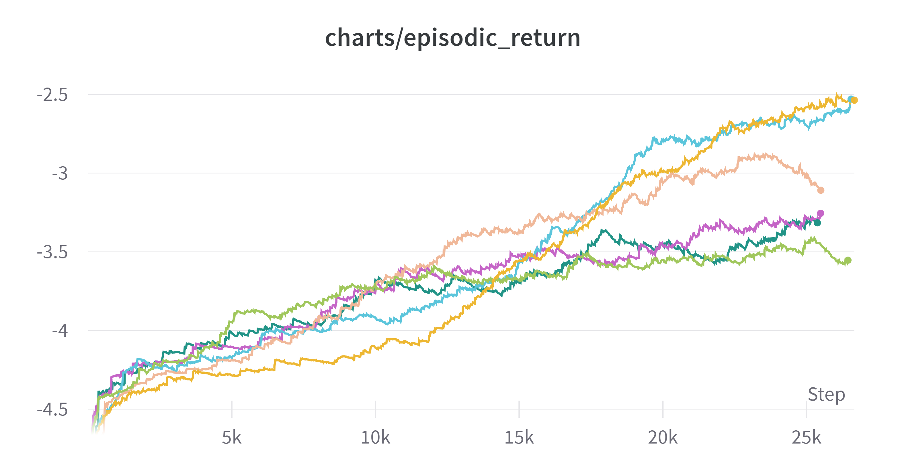{: width="80%" height="80%" class="align-center"}

<p style="text-align: center; font-style: italic;"> (Exponential Moving Average: 0.99) </p>

| 순위 | 색 | clip coef | learning rate | kernel size |
|---|-------------------------------------------|-----|---------|---|
| 1 | <span style="color: #5bc5db">**■**</span> | 0.1 | 0.00025 | 3 |
| 2 | <span style="color: #edb732">**■**</span> | 0.1 | 0.00025 | 5 |
| 3 | <span style="color: #f0b899">**■**</span> | 0.1 | 0.0001  | 3 |
| 4 | <span style="color: #c565c7">**■**</span> | 0.2 | 0.00025 | 5 |
| 5 | <span style="color: #229487">**■**</span> | 0.1 | 0.0001  | 5 |
| 6 | <span style="color: #a0c75c">**■**</span> | 0.2 | 0.00025 | 3 |

step을 늘려보고 다시 실험해본 의미가 있는 것 같다. 이전 실험에서 clip coef: 0.1, learning-rate 0.0001 로 했을 때 결과가 가장 좋았는데 그래프를 보면 중반 이후로 1, 2등과의 경사도 그렇고 뒤떨어진 모습을 보인다. 사정상 엄밀하게 실험은 진행하지 못하나 여태까지는 clip coef를 0.1로 하고 learning rate를 0.00025로 하는 것이 kernel size에 관계없이 1, 2등을 했기 때문에 괜찮은 하이퍼 파라미터라고 생각하고 1등의 하이퍼 파라미터로 실험을 진행하기로 했다.

# 6. 신경망의 크기 - 1

신경망은 현재 MLP 수준에서 1024 레이어가 두개가 있다. 그런데 여태까지의 실험을 보니 과연 이정도 속도가 과연 맞는 것인가 라는 생각이 들었다.

하이퍼 파라미터마다 변화는 있지만 차이가 엄청난 수준은 아니니, 신경망의 크기를 늘려보는 것은 어떨까? 사실 이전에 2048에서도 성능 향상의 가장 큰 주요 요인은 신경망의 크기였다. 그래서 신경망을

1. 2048 레이어 두개
2. 4096 레이어 두개

로 각각 실험해보기로 했다. 물론 그에 따른 속도 저하도 고려해볼 생각이다.

이렇게 하게 된 것에는 이유가 있다. 다음 그림을 보자

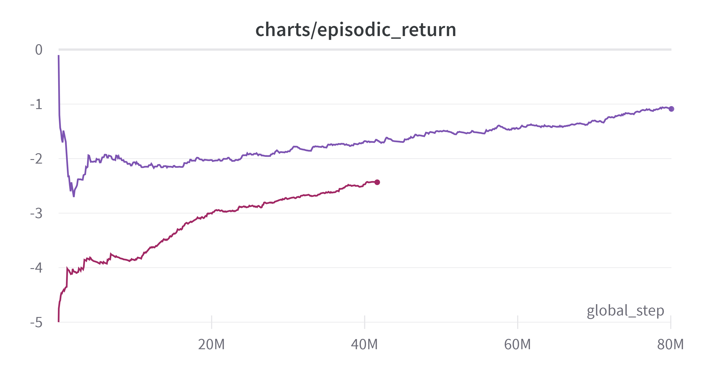{: width="80%" height="80%" class="align-center"}

<p style="text-align: center; font-style: italic;"> (Exponential Moving Average: 0.99) </p>

보다시피 성능이 상승하고 있다. 그런데 너무 느리다. 빨간색 그래프로 학습을 진행하다가 중간에 정전이 있어서 저장된 가중치로 보라색 실험을 하였다. 언젠간 학습이 되겠지만 과연 이것이 맞는가라는 생각이 들었다. 두 학습이 합쳐서 120시간이 걸렸는데 아무리 행동공간이 283이라 해도 너무 느린 것 아닌가 싶었다.

그러다가 이건 아니라는 생각이 들었고 신경망의 크기를 키우자는 생각이 들었다. 만약 그것도 안되면 Behavior Cloning 같은 Imitation Learning 방법을 활용해볼 생각이다. 가만히 하던 그대로 학습시키면 학습은 어느정도 되겠지만 그것이 나의 목표는 아니라는 생각이 들었다.

# 7. 신경망의 크기 - 2

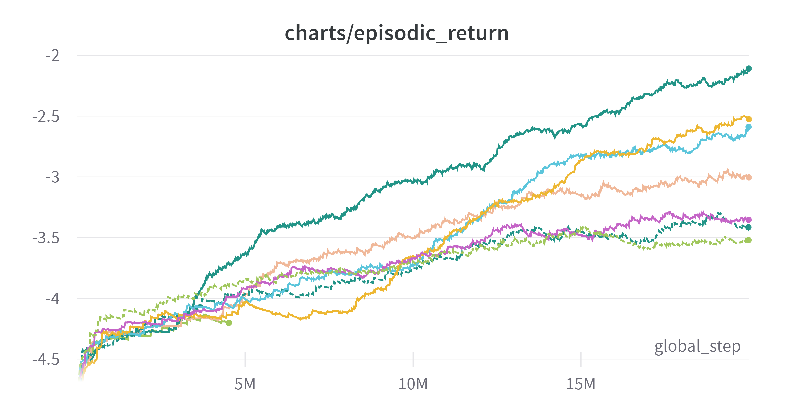{: width="80%" height="80%" class="align-center"}

<p style="text-align: center; font-style: italic;"> (Exponential Moving Average: 0.99) </p>

맨 위의 초록색이 MLP를 1024에서 2048로 늘렸을 때의 결과이다. 압도적이다.

신경망의 크기를 늘렸다고 해서 학습 속도가 지나치게 줄어들지 않았다. 전체적인 신경망의 크기를 엄청나게 늘리지 않은 것도 있고, 아무래도 CPU의 병목이 더 큰 영향을 미치기 때문에 그런 것 같다.

사실 여태까지 실험은 신경망을 내 임의로 고정하고 다른 하이퍼 파라미터를 조정하였다. 이전 실험(2048)에서도 제일 큰 문제가 신경망이었던 것을 알았음에도 불구하고 내 섣부른 판단이 시간을 낭비한 것 같다. 다음 실험부터는 신경망의 크기와 그에 따른 속도의 트레이드오프를 계산해보고 신경망의 크기부터 결정하고 그 다음에 하이퍼파라미터를 조정해야겠다는 생각이 들었다.

이후로는 신경망을 4096까지 늘려보기도 하고 이제 해당 신경망을 토대로 실험을 더 진행해볼 생각이다.

# 8. 신경망의 크기 - 3

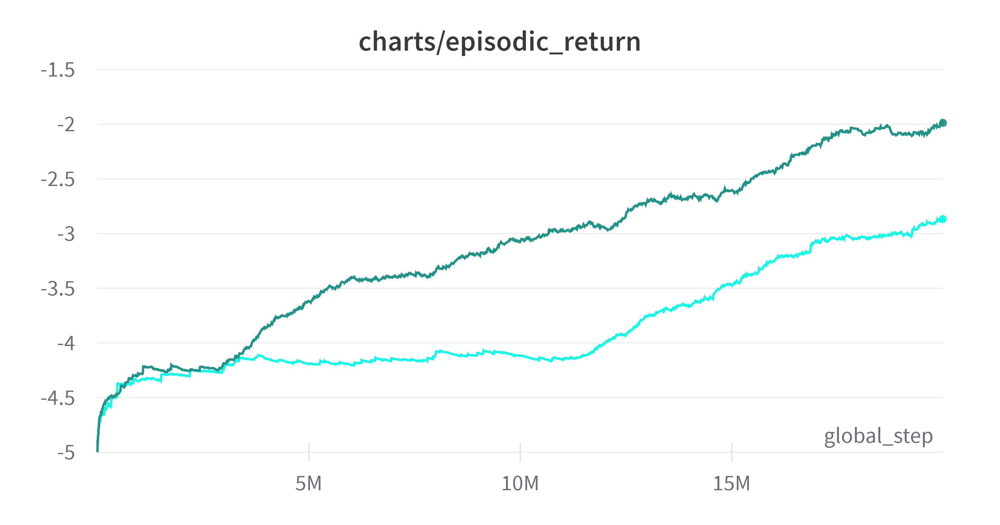{: width="80%" height="80%" class="align-center"}

<p style="text-align: center; font-style: italic;"> (Time Weighted EMA: 0.99) </p>

초록색이 MLP를 2048로 한 것이고 옥색은 4096이다. 옥색은 유닛이 너무 많아 초반에 시간이 좀 걸린 것 같다. 여기서 확신이 생겼다. 신경망은 CPU에 영향을 주지 않는다면 점점 줄여나가는 것이 맞는 것 같다. 그럼 두 개중 어느 것을 선택해야 할까. 두개는 학습속도에 있어서는 큰 차이가 나지 않는 것 같다. 그런데 일정 구간 이후에 학습 속도가 평행하다. 그렇다면 처음부터 올라가는 초록색을 선택하는 것이 맞지 않을까? 그런데 또 더 진행한다면 옥색이 역전할지도 모른다.

그래도 일단 보이는 것은 초록색이 더 높기 때문에 초록색(2048)로 학습을 더 진행해보기로 했다.

# 9. 환경의 중요성

이전 내용을 쓴 후 시간이 많이 지났는데 다시 도전하던 중 뭔가 이상한 것을 발견하였다.

새롭게 구한 컴퓨터가 16스레드인데 여기에 작업을 하기 위해 병렬을 16개로 늘리고 학습을 돌렸는데 1step iteration에 31초가 드는 것이다. 본능적으로 이것은 이상하다는 생각이 들었다. 왜냐하면 내가 이 환경을 구현했고 다른 환경도 구현해 봤을때 이정도 속도가 나올리가 없기 때문이다. 이럴 경우 문제는 환경, 학습 알고리즘 둘 중 하나이다. 그런데 학습 알고리즘은 오픈소스를 쓰기 때문에 문제가 있을 확률은 거의 없다.

이전에는 3~6개의 환경으로 돌렸기 때문에 1 iteration에 3초가 나와도 그러려니 했는데 이정도가 되니 뭔가 잘못됨을 느꼈다.

그래서 환경을 하나하나 쪼개가면서 각 부분의 시간을 측정했다.

```python
class Tracker:
    def __init__(self) -> None:
        self.count = dict()
        self.timer = dict()

    def start(self, n):
        if n not in self.count:
            self.count[n] = 0
            self.timer[n] = 0
        self.s_time = time.time()

    def end(self, n):
        self.timer[n] += time.time() - self.s_time
        self.count[n] += 1

for k in tracker.timer.keys():
    result[k] = tracker.timer[k] / tracker.count[k]

print(sorted(result.items(), key=lambda x: x[1]))
```

임시로 위와 같은 클래스를 정의하여 각 부분을 n으로 표시하고 각 시간을 합산하고 방문횟수로 나누어 시간이 얼마나 들었는지를 측정하였다.

시간이 많이 나온 부분은 쪼개고 계속 쪼갰더니 다음과 같은 결과가 나왔다.

```
[(5, 8.103847503662109e-07), 
(9, 1.0602749311006987e-06), 
(0, 1.1301957643949068e-06), 
(-1, 1.7571907777052659e-06), 
(2, 9.246349334716796e-06), 
(6, 1.4503161112467448e-05), 
(1, 4.3779611587524414e-05), 
(4, 7.352383931477864e-05), 
(7, 0.0031295727094014488), 
(8, 0.00621118453832773)]
```

지수를 보면 알 수 있듯이 3위 이하는 시간이 압도적으로 적게 들었는데, 1위의 경우 함수 딱 하나였다. 다음과 같은 함수였다.

```python
    def _get_legal_actions(self):
        """
        Checks whether there is a block corresponding to the action
        Check if the block can be placed at the location.
        """
        for action in range(243):
            if self._is_valid_block(action) and self._is_valid_position(action):
                self.legality[action] = 1
            else:
                self.legality[action] = 0
```

다음 함수를 실행하는 부분이었다.

`self.is_valid_block`은 해당 블록이 존재하는지 여부를 판단하는 것으로 바로 판단이 되지만 `self._is_valid_position`의 경우 

```python
    def _is_valid_position(self, action: int) -> bool:
        block, location = self.action_to_blk_pos(action)
        # board와 block 비교
        for row in range(0, self.BLOCK_LENGTH):
            for col in range(0, self.BLOCK_LENGTH):
                # Condition for block position in block array
                if block[row][col] == 1:
                    # location - 2 : leftmost top (0, 0)
                    # When the block is located outside the board
                    if not (
                        0 <= (location[0] - 2 + row) < 9
                        and 0 <= (location[1] - 2 + col) < 9
                    ):
                        return False

                    # When there is already another block
                    if self._board[location[0] - 2 + row][location[1] - 2 + col] == 1:
                        return False

        return True
```

이해못해도 된다. 5 x 5 공간을 하나하나씩 훑으며 해당 공간에 블록이 있으면 (`if block[row][col] == 1`) 그때 검사를 하는 것이다.
그것을 모든 공간에다 하니 시간이 엄청 오래 걸렸다.

이 부분에 대해서 생각을 하다가 5 x 5 공간을 매번 훑기보다 3개의 블록을 뽑는 순간 해당 블록이 존재하는 칸을 미리 저장해두면 되지 않나 하는 생각이 들었다. 블록이 아예 없을 경우에는 `self._is_valid_block`에서 걸러지기 때문에 상관이 없다.

그래서 다음과 같이 코드를 짰다.

```python
    def _get_3_blocks(self) -> Tuple[np.ndarray, np.ndarray, np.ndarray]:
        a = self.np_random.choice(range(self._block_list.shape[0]), 3, replace=False)
        self._block_valid_pos = []
        for i in range(3):
            valid_list = []
            for r in range(5):
                for c in range(5):
                    if self._block_list[a[i]][r][c] == 1:
                        valid_list.append((r, c))
            self._block_valid_pos.append(valid_list)
```
블록을 뽑는 순간에 `self._block_valid_pos`에 유효 위치를 저장하고 해당 부분만 검증하는 것이다.

```python
    def _is_valid_position(self, action: int) -> bool:
        block, location = self.action_to_blk_pos(action)
        # board와 block 비교
        for row, col in self._block_valid_pos[action // 81]:
            # location - 2 : leftmost top (0, 0)
            # When the block is located outside the board
            if not (
                0 <= (location[0] - 2 + row) < 9
                and 0 <= (location[1] - 2 + col) < 9
            ):
                return False

            # When there is already another block
            if self._board[location[0] - 2 + row][location[1] - 2 + col] == 1:
                return False
```

`for ... for ... if`가 `for`문 하나로 줄은 모습을 볼 수 있다.

수정 내용은 [해당 커밋](https://github.com/helpingstar/gym-woodoku/commit/1f4a50f2b32bdf071788fbdd888f4d85e0018d65)에서 볼 수 있다.

결과는 어떻게 되었을까?

```
(7, 0.0031295727094014488), 
(8, 0.00621118453832773)
↓
(7, 0.0005186151663462321),
(8, 0.0010165496611259353)
```

가장 많은 시간을 소비하던 부분의 시간이 1/6으로 줄은 것을 확인할 수 있다.

아주 간단한 메커니즘 아닌가? 싶을 수 있다. 아직 완전한 해결책도 아닐 수 있다. 근데 내가 이상한 것을 느끼고 직접 검증하기 위한 클래스를 만들어서 시간이 많이 드는 부분을 찾아내고 직접 개선했다는 것. 너무 뿌듯하여 이렇게 기록으로 남긴다.

# 9.5. 내용 추가

2024-04-12 에 추가한 내용으로 이 내용은 9, 10을 작성한 후에 작성하는 글이다.

9.에서 알고리즘이 극히 느렸던 이유는 gymnasium에서 환경을 vectorizing 할 때, `SyncVectorEnv`를 이용해 vectorizing했기 때문이다. 이 방법은 환경들을 한 코어에서 순차적으로 step을 실행하는 방식이다. 기본적으로 속도 측면에서 잘못 작성된 코드이지만 덕분에 환경의 로직을 최적화 할 수 있었다.

gymnasium 환경 사용시 여러 개의 CPU 코어를 활용하고 싶다면 `multiprocessing` 을 활용하는 `AsyncVectorEnv`를 활용해야 한다. 

# 10. action masking 적용

관련 내용은 아래 서술하였다. 그동안 왜 안했지 싶을 정도로 정말 높은 성능 향상이 있었다.

[https://helpingstar.github.io/rl/invalid_action_masking/](https://helpingstar.github.io/rl/invalid_action_masking/)