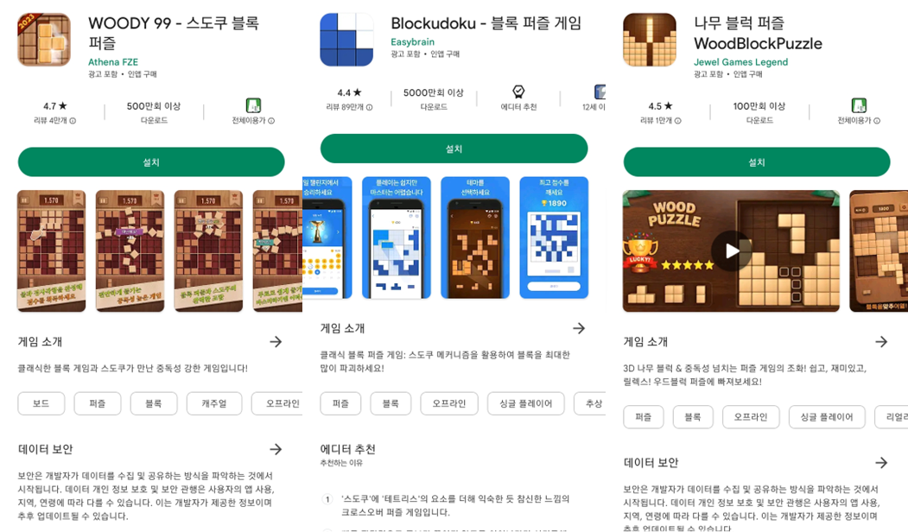

Woodoku는 특정 게임의 이름입니다. 좋은 이름이 떠오르지 않아 환경 또한 Woodoku로 이름지었습니다. 비슷한 게임이 여럿 있는 것으로 알고있지만 어떤 게임이 원조인지는 모릅니다. Woodoku 이름 관련하여 문제가 있을 경우 왼쪽 프로필의 이메일로 연락 주시길 바랍니다.

Woodoku is the name of a specific game. I couldn't come up with a good name so I also named the environment Woodoku. I know there are several similar games, but I don't know which one is the original. If you have any problems with the Woodoku name, please contact me at the email on the left profile.

---

Woodoku 게임을 정복하기 위해 [**Woodoku 강화학습 환경**](https://github.com/helpingstar/gym-woodoku)을 만들고 그것을 정복하기 위해 시도한 시행착오를 적어놓은 일지이다.

# 1. 게임 방식

플레이스토어에서 5000만 이상의 다운로드를 기록한 게임이다. [이 링크를 통해](https://play.google.com/store/apps/details?id=com.tripledot.woodoku) 다운로드 하여 플레이해볼 수 있다. 게임화면은 다음과 같이 생겼다.

{: width="35%" height="35%" class="align-center"}

아래의 세 블록을 위의 격자에 배치시킨다. 블록을 겹쳐놓거나 격자 바깥에 걸쳐놓을 수 없다. 가로, 세로, 3x3 공간을 채우면 블록이 비워지며 점수를 얻는다. 세 블록을 모두 사용하면 세 블록이 새로 들어온다. 아무 블록도 배치할 수 없는 상태가 되면 게임은 종료된다.

비슷한 여러 게임들이 있다.
{: width="70%" height="70%" class="align-center"}

# 2. 강화학습 측면 분석

블록을 배치하는 격자는 9 x 9 로 되어있으며 각 격자는 블록이 있냐/없냐로 2가지 상태가 있다. 그러므로 격자의 observation_space는 $2^{9\times9}\approx 2.4 \times 10^{24}$ 이다.

블록은 Woodoku 기준 47개가 있다. 47개 중 3개가 선택되며 각 블록이 최소 하나는 화면에 존재하며 블록이 존재할 수도 존재하지 않을 수도 있으므로 이에 대한 경우의 수는 $P(47, 3) \times (2^3 -1) \approx 6.8 \times 10^5$

그러므로 observation의 전체 경우의 수는 약 $1.6 \times 10^{30}$이다. 실제 활용시에는 CNN을 통과하기 위해 15x15 격자에 각 요소를 배치한다.

행동은 3개의 블록중 하나를 선택해서 81개의 격자 중 하나에 배치하는 것이므로 $3 \times 81 = 243$ 이 된다.

이전의 [2048 게임](https://helpingstar.github.io/rl/game2048_trial_and_error/)과 구별되는 가장 큰 특징은 action space가 이산이면서 매우 높다는 것이다. 각 상태에서 최적의 행동을 찾으려면 243개의 행동 중 하나를 선택해야 하니 엄청난 시간이 소요될 것으로 예상된다.
