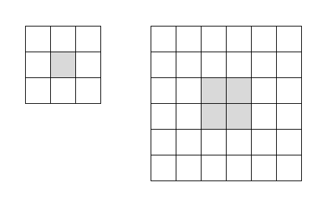

[ShangtongZhang github](https://github.com/ShangtongZhang/reinforcement-learning-an-introduction/tree/master/chapter08)

[단단한 강화학습](http://www.kyobobook.co.kr/product/detailViewKor.laf?ejkGb=KOR&mallGb=KOR&barcode=9791190665179&orderClick=LAG&Kc=) 책의 코드를 공부하기 위해 쓰여진 글이다.

# Maze

## PriorityQueue

```python
class PriorityQueue:
    def __init__(self):
        self.pq = []
        self.entry_finder = {}
        self.REMOVED = '<removed-task>'
        self.counter = 0

    def add_item(self, item, priority=0):
        if item in self.entry_finder:
            self.remove_item(item)
        entry = [priority, self.counter, item]
        self.counter += 1
        self.entry_finder[item] = entry
        heapq.heappush(self.pq, entry)

    def remove_item(self, item):
        entry = self.entry_finder.pop(item)
        entry[-1] = self.REMOVED

    def pop_item(self):
        while self.pq:
            priority, count, item = heapq.heappop(self.pq)
            if item is not self.REMOVED:
                del self.entry_finder[item]
                return item, priority
        raise KeyError('pop from an empty priority queue')

    def empty(self):
        return not self.entry_finder
```
<!-- * **(1)** : 우선순위 큐를 구현한 클래스이다.
* **(2~6)** : 생성자를 정의한다.
  * `self.pq` : 요소를 저장할 리스트
  * `self.entry_finder` : 아이템(key) 우선순위를 위한 entry(value)를 연결하는 dict이다.
  * `self.REMOVED` : 해당 entry가 제거된 것인지 체크하기 위한 문자열
  * self.counter -->


## Maze
```python
# A wrapper class for a maze, containing all the information about the maze.
# Basically it's initialized to DynaMaze by default, however it can be easily adapted
# to other maze
class Maze:
    def __init__(self):
        # maze width
        self.WORLD_WIDTH = 9

        # maze height
        self.WORLD_HEIGHT = 6

        # all possible actions
        self.ACTION_UP = 0
        self.ACTION_DOWN = 1
        self.ACTION_LEFT = 2
        self.ACTION_RIGHT = 3
        self.actions = [self.ACTION_UP, self.ACTION_DOWN, self.ACTION_LEFT, self.ACTION_RIGHT]

        # start state
        self.START_STATE = [2, 0]

        # goal state
        self.GOAL_STATES = [[0, 8]]

        # all obstacles
        self.obstacles = [[1, 2], [2, 2], [3, 2], [0, 7], [1, 7], [2, 7], [4, 5]]
        self.old_obstacles = None
        self.new_obstacles = None

        # time to change obstacles
        self.obstacle_switch_time = None

        # initial state action pair values
        # self.stateActionValues = np.zeros((self.WORLD_HEIGHT, self.WORLD_WIDTH, len(self.actions)))

        # the size of q value
        self.q_size = (self.WORLD_HEIGHT, self.WORLD_WIDTH, len(self.actions))

        # max steps
        self.max_steps = float('inf')

        # track the resolution for this maze
        self.resolution = 1

    # extend a state to a higher resolution maze
    # @state: state in lower resolution maze
    # @factor: extension factor, one state will become factor^2 states after extension
    def extend_state(self, state, factor):
        new_state = [state[0] * factor, state[1] * factor]
        new_states = []
        for i in range(0, factor):
            for j in range(0, factor):
                new_states.append([new_state[0] + i, new_state[1] + j])
        return new_states

    # extend a state into higher resolution
    # one state in original maze will become @factor^2 states in @return new maze
    def extend_maze(self, factor):
        new_maze = Maze()
        new_maze.WORLD_WIDTH = self.WORLD_WIDTH * factor
        new_maze.WORLD_HEIGHT = self.WORLD_HEIGHT * factor
        new_maze.START_STATE = [self.START_STATE[0] * factor, self.START_STATE[1] * factor]
        new_maze.GOAL_STATES = self.extend_state(self.GOAL_STATES[0], factor)
        new_maze.obstacles = []
        for state in self.obstacles:
            new_maze.obstacles.extend(self.extend_state(state, factor))
        new_maze.q_size = (new_maze.WORLD_HEIGHT, new_maze.WORLD_WIDTH, len(new_maze.actions))
        # new_maze.stateActionValues = np.zeros((new_maze.WORLD_HEIGHT, new_maze.WORLD_WIDTH, len(new_maze.actions)))
        new_maze.resolution = factor
        return new_maze

    # take @action in @state
    # @return: [new state, reward]
    def step(self, state, action):
        x, y = state
        if action == self.ACTION_UP:
            x = max(x - 1, 0)
        elif action == self.ACTION_DOWN:
            x = min(x + 1, self.WORLD_HEIGHT - 1)
        elif action == self.ACTION_LEFT:
            y = max(y - 1, 0)
        elif action == self.ACTION_RIGHT:
            y = min(y + 1, self.WORLD_WIDTH - 1)
        if [x, y] in self.obstacles:
            x, y = state
        if [x, y] in self.GOAL_STATES:
            reward = 1.0
        else:
            reward = 0.0
        return [x, y], reward
```
* **(1~4)** : 미로를 형성하는 클래스이다.
* **(5)** : 클래스 생성시 실행되는 생성자부분이다.
* **(6~10)** :
  * 너비(가로) : 9
  * 높이(세로) : 6
* **(12~17)** : 위, 아래, 왼쪽, 오른쪽 방향으로 이동하는 행동에 각각 0, 1, 2, 3의 번호를 부여하고 `actions` 변수에 리스트로 저장한다.
* **(19~23)** : 시작상태 : (2, 0), 목표 상태 : (0, 8)
* **(25~28)** : 초기 장애물을 설정한다. `old_obstacles`, `new_obstacles`는 figure 8.4 에서 장애물의 위치를 바꿀때 사용한다.
* **(30~31)** : 장애물을 바꾸게 되는 시간, 해당 시간이 지나면 장애물의 위치가 바뀐다.
* **(36~37)** : Q값을 저장하기 위해 정의된 Q테이블의 크기, (높이, 너비, 행동의 개수) 로 정의된다.
* **(39~40)** : 최대 스텝을 정의한다. 해당 스텝까지만 움직인다.
* **(42~43)** : 미로의 해상도를 나타낸다.
* **(45~48)** : 상태를 더 큰 해상도의 미로에 대응시킨다.
  * `state` : 원래 해상도의 상태
  * `factor` : 확장 인자, 상태는 확장 후에 $\text{(factor)}^{2}$ 개의 상태가 된다.
* **(49)** : 상태를 확장된 크기에 맞게 새로운 위치로 옮긴다.
* **(50)** : 새로운 상태들을 저장할 리스트를 선언한다.
* **(51~53)** : 새로운 위치에서 행, 열 방향으로 `factor` 만큼 확장한다.
  * ex)
{: width="50%" height="50%"}
* **(54)** : 새로운 상태들을 리턴한다.
