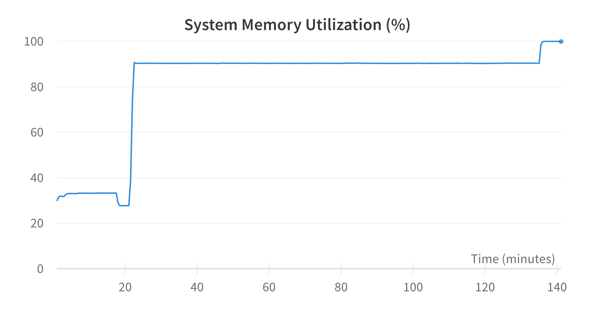
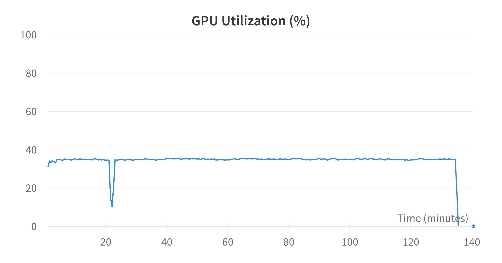
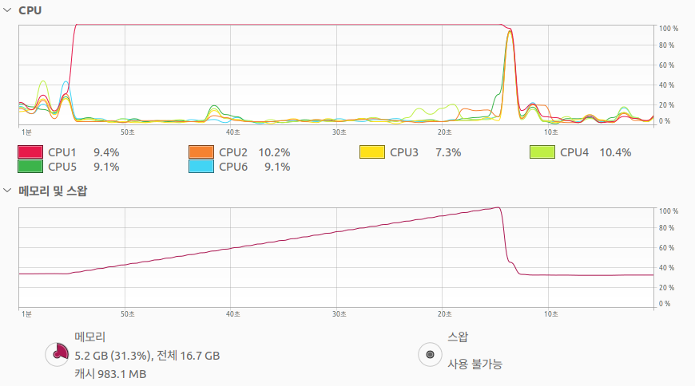
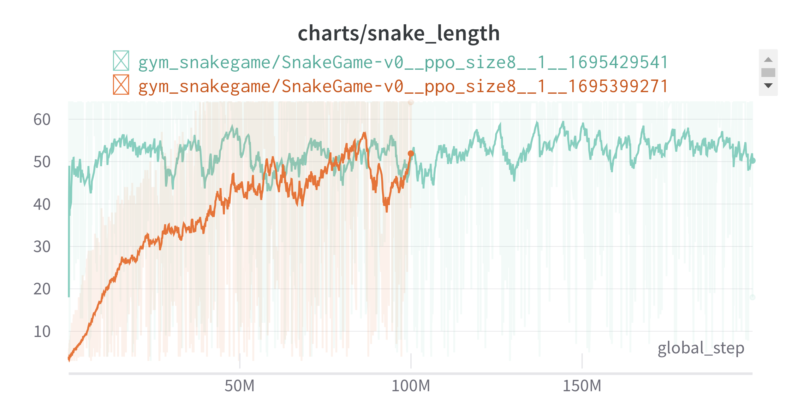
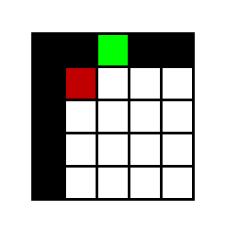
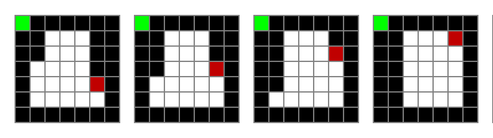
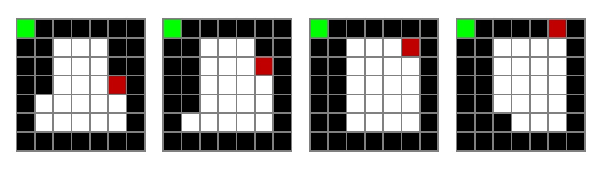
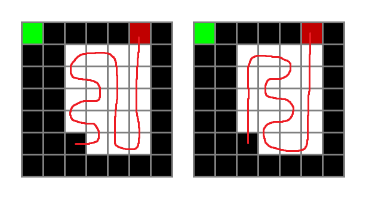
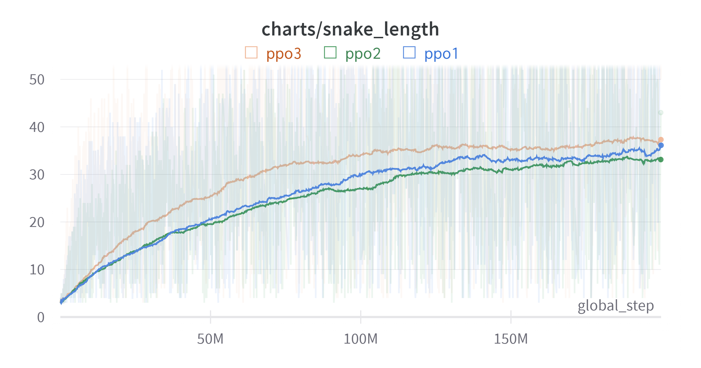
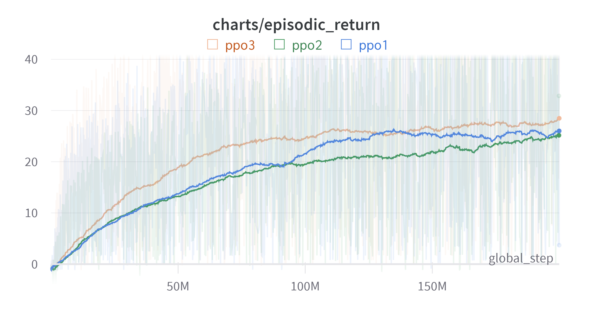

스네이크 게임은 정해진 그리드 격자 배열 안에서 뱀을 움직이면서 1개 이상의 아이템을 먹으면서 몸을 키우는 게임이다. 아이템을 먹으면 몸이 1칸 늘어나게 된다. 자기 몸에 박거나 벽에 박게 되면 게임이 종료된다.

구글에서 **snake game**이라고 검색하면 플레이해볼 수 있다.

이전에 이 문제를 해결하기 위한 여러 시도가 있었다.

1. 격자의 크기를 15로 한 후 DQN으로 문제를 풀려고 시도했지만 실패하였다. 보드의 크기가 크기 때문에 보상을 얻기까지 너무 힘들어 보상의 너무 희소했기 때문인 것 같다.
2. 그래서 격자의 크기를 5로 한 후 문제를 풀어서 성공했었다.

하지만 이제 크기 15에 대해 도전해보려고 한다.

## 0. 초기 설정

* 보상 디자인
  * 아이템을 먹을 때마다 보상을 준다.
  * 죽을 때마다 음의 보상을 준다.
* observation : (15, 15) 크기의 격자
* 알고리즘 : PPO

## 1. 희소한 보상 문제

병렬 환경을 4~6개로 늘렸기 때문에 동시에 많은 환경을 탐색하기에 보상을 금방 학습할 것이라 예상했으나 실패하였다.

1. 양의 보상은 들어오지 않고 죽거나 음의 보상만 주어지니 0의 보상을 받는 행동을 하기 위해 같은 자리를 계속 멤돈다.
2. 이러한 행위를 방지하기 위해 그냥 움직이는 행동에 대해 약한 음의 보상을 주었다. 그랬더니 음의 보상의 누적보다 죽는게 낫겠다 싶어서 죽어버린다.
3. 이럴 경우 에피소드가 아예 끝나지 않는 현상이 발생하여 TimeLimit 을 10000으로 조정하였다. 격자의 개수인 225개에 대한 짐작된 숫자이다.
4. 그냥 죽을 경우 보상을 -10, 의미 없는 움직임일 경우 -0.001 이래도 TimeLimit을 꽉 채워서 죽는 발생하였다. Truncation으로 에피소드가 끝날 경우 다음 보상이 계산된다는 것과 discount factor에 의해 TD Target이 더 작기 때문일 것이다.

## 2. 렌더림 메모리 문제

학습중에 메모리가 치솟으며 중간에 학습이 꺼지는 현상이 발생하였다.

{: width="80%" height="80%" class="align-center"}

{: width="80%" height="80%" class="align-center"}

메모리 사용량이 치솟더니 함께 학습이 종료되었다.

오픈소스 CleanRL을 사용했기 때문에 코드 자체에는 문제가 없다고 생각하고 일단 환경에 문제가 있지 않을 까 생각했다.

가장 유력한 후보인 렌더링 문제가 아닐까 생각하였고 200 에피소드마다 에피소드를 동영상으로 렌더링하는데 이 문제가 아닐까 싶었다. 게다가 이 영상을 wandb로 전송하니 말이다.

렌더링을 켰을 경우 모두 같은 문제가 생겼는데 일단 렌더링 옵션을 꺼놓고 (영상 출력이 안되게 해놓고) 학습을 해보았는데 나머지를 동일하게 한 결과 문제가 발생하지 않아 문제가 렌더링 문제가 아닐까 가정하였다.

그리고 고의로 절대 에피소드가 끝나지 않도록 에이전트를 설계하고 실험하였다.

{: width="80%" height="80%" class="align-center"}

결과는 예상대로였다. 메모리가 치솟고 프로그램이 종료된다.

실험 결과를 통해 파라미터나 보상 전략을 수정하려고 하였으나 여러 문제가 있었다. 이에 대해 몇가지 대처사항이 있다.

1. FPS를 높여서 영상의 크기를 줄인다.
2. 렌더링을 하지 않는다.
3. 무한루프를 벗어나도록 에이전트를 디자인한다.

근데 지금은 일단 실험의 안전성을 위해 당분간 렌더링을 하지 않고 실험 결과는 에피소드의 길이로 추론해보기로 했다.

## 3. 작은 환경에서 테스트

분위기를 환기하기 위해 일단 간단한 코드를 돌려보았다.

이전에는 5 X 5 를 DQN으로 돌렸는데 이번에는 많은 병렬처리가 가능해져 8 X 8로 돌려보았다. 숫자에 큰 의미는 없다.

쉽게 해결이 가능했다.

`4.` 에서 언급할 내용에 대한 생각으로 보통의 행동(보상도 안먹고 죽지도 않는 행동)에 대해 -0.01을 보상으로 주었다. 하지만 격자가 작아져서 해결된 것인지, 보상 때문인지는 확실하지 않다.

아래 링크에서 플레이 영상을 확인할 수 있다.

[Reinforcement Learning SnakeGame 8 X 8 - Youtube](https://youtube.com/shorts/ENcE14AYOWo?si=0fuPEDunFc3PmR6Z)

{: width="80%" height="80%" class="align-center"}

* 주황색으로 학습한 후 weight를 저장한 후에 연두색에서 하습을 계속하였다.

## 3. 무한루프 vs 포기

포기 : 시작하자마자 게임을 안좋은 쪽으로 끝내는 행위 (Ja살을 직접 쓸 수 없어서 쓴 말)

결국 에이전트는 보상을 최대화하는 방향으로 행동을 선택하는데

벽에 박아서 죽는 것이 너무 큰 음의 보상을 준다면 그것을 피하기 위해 양의 보상을 찾으러 갈 수도 있지만 양의 보상을 찾지 못할 경우 작은 음의 보상을 주는 무한루프 행동에 빠질 수 있다.

그렇다고 무한루프를 방지하기 위해 보통의 행동에 대해 음의 보상을 더 높인다면 벽에 바로 박아버리는 현상이 발생한다.

그럼 둘 중에 하나를 선택해야 한다. 환경은 snakegame이라 가정하겠다.

이전에는 똑같이 별로인 것 아닌가 생각했는데 곰곰히 생각해봤는데 다른 점이 있다. 갱생의 여지는 '포기' 쪽이 더 있다. 왜냐하면 무한루프의 경우 10000 스텝(TimeLimit)을 무의미한 행동에 쓰게 되는데 '포기'의 경우 최대한 빨리 끝낸다면 10스텝 정도다. 그러면 1000번의 에피소드를 더 할 수 있는데 최대한 빨리 끝내는 과정에서 그 중간에 아이템을 먹을 확률이 더 높다.

무한루프의 경우는 말 그대로 무한루프이기 때문에 해당 경로에 아이템이 없다면 (또는 그게 좋은 것인지 학습하기 전이라면) 10000스텝을 생으로 날리게 된다.

그래서 보상을

TimeLimit X (보통의 행동) < 가장 빠른 포기 행위로 지정해서 exploration의 여지를 최대한 늘려보기로 했다.

## 4. MDP 만족 여부

작은 환경에서 성공을 하였지만 의문이 있었다. 왜 `snake_length`가 64에 도달하지 못할까?

신경망이 작기 때문일까? 하고 여러 고민을 해보던 중 치명적인 실수를 발견하였다.

내가 신경망에 주입하는 observation은 MDP를 만족하지 못한다.

예를 들어 환경에서 observation은 다음과 같다.

* 0 : snake
* 1 : blank
* 3 : head
* 5 : target

그러면 다음 상황을 시각화를 쉽게 하기 위해

snake, blank, head, target을 각각 흰색, 검은색, 빨간색, 초록색이라 해보자

이라면 뱀은 어디를 향해 가는 것일까?

몸통의 몸에 의하면 위(↑) 아니면 왼쪽(←)으로 향하고 있을 것이다. 즉 이 observation만 보고는 환경을 정확히 파악할 수 없다.

예를 들어서 위로 가고 있는 상황에서 오른쪽을 선택하게 된다면 몸통에 부딪혀 바로 게임이 끝나게 되지만, 왼쪽으로 가고 있을 경우 오른쪽을 선택하면 아무 일도 일어나지 않기 때문에 왼쪽으로 한 칸 전진하게 될 것이다.

그럼 저런 상황에서는 무조건 위로 가게 하면 되지 않나? 할 수 있지만 왼쪽에 타겟이 바로 왼쪽에 있고 왼쪽으로 바로 가는 것이 최적의 행동이라면 그것을 선택 할 수 없게 된다.

하나가 더 있다. 한칸 앞으로 간다면 꼬리가 한칸 비게 될텐데 어느 공간이 비게 될까? 이것은 더 복잡하다. 뱀이 어떻게 꼬여서 저런 직사각형 모양을 형성했을 지 모르기 때문에 파악하기가 더 힘들다.

일단 해당 문제에 대해 `info`에 snake의 방향도 같이 넣어주기로 하였고 학습을 위해서는 POMDP를 최대한 MDP로 취급할 수 있게 LSTM을 활용하던가 FrameStack을 활용할 생각이다.

## 5. PPO-LSTM 1

PPO-LSTM을 시도했다. 하지만 학습이 너무나 느려서 FrameStack을 시도했다. 하지만 이는 완벽한 대안이 아닌데 그 이유는 아래 서술한다.

## 6. FrameStack

MDP를 만족할 수 있게 `FrameStack`을 이용했다. 그렇다고 엄밀하게 충족되는 것은 아니다. 다음 그림를 보자

마지막 프레임에서 뱀의 머리는 윗 방향을 향하고 있다는 것을 알게 되었으므로 왼쪽 방향을 선택하지 않을 것이다. (우측으로 가는 것이라면 왼쪽 방향으로 가는 것이 아무런 방향 전환을 하지 않으므로 직접적인 죽음이 발생하지 않는다.)

위로 올라가는 행동을 다시 선택하여 계속 위로 올라간다고 해보자 그럼 다음 observation은 다음과 같을 것이다.

그럼 여기서 문제가 발생한다. 여기서 왼쪽으로 꺾는다면 다음으로 없어지는 공간은 어디일까?

대표적으로 다음과 같은 두 가지 경우가 있다. (더 있지만 편의를 위해 두가지만 생각해보자)

첫번째라면 꼬리에서 오른쪽 블록이 비게 될 것 이고 두번째라면 꼬리에서 위쪽 블록이 비게 될 것이다.

이는 FrameStack으로도 알수 없는 부분이다. 그래도 어느정도 완화되는 부분이 있기에 학습을 진행해보았다.

* ppo1 : FC Layer : 512
* ppo2 : FC Layer : 2024
* ppo3 : FC Layer : 512, FrameStack : 4

{: width="80%" height="80%" class="align-center"}

 Time Weighted EMA: 0.99 

{: width="80%" height="80%" class="align-center"}

 Time Weighted EMA: 0.99 

그래프를 보면 100M 까지는 학습이 상당히 빨리 진행되는 것을 볼 수 있다. 하지만 그 이후부터는 학습이 느려지는 것을 볼 수 있다. snake의 길이가 길어지면서 몸통의 구조를 파악하기 훨씬 더 어려워지기 때문인 것 같다. 

실험은 하나라서 정확한 파악은 힘들지만 snake_length은 비슷해질 수도 있겠지만 episodic_return의 경우는 유의미한 차이를 보이기 때문에 일단 FrameStack이 어느 정도 효과는 있었다고 볼 수 있겠다.

하지만 여전히 한계는 있어보여 다른 방법을 더 찾아보기로 했다. LSTM의 경우는 학습을 오래 하면 되는 것 같긴 하지만 (컴퓨터를 써야하는) 현실적인 한계가 있어 어떻게 학습을 이어갈지에 대해 고민을 해봐야겠다.