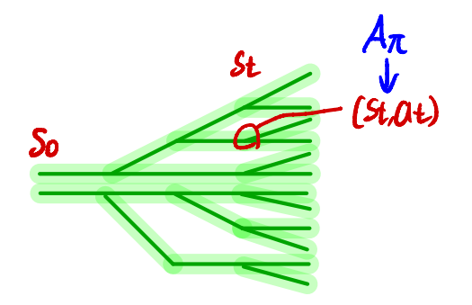
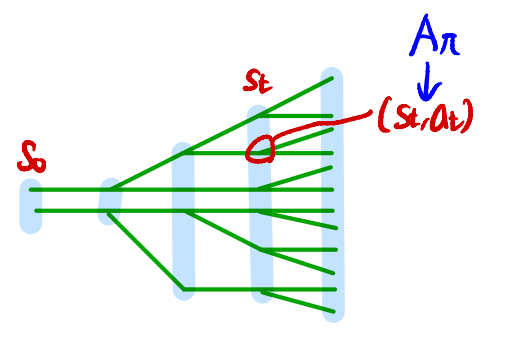
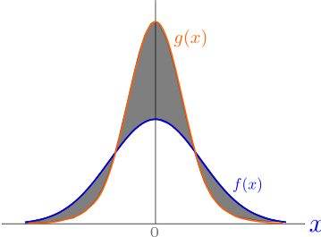
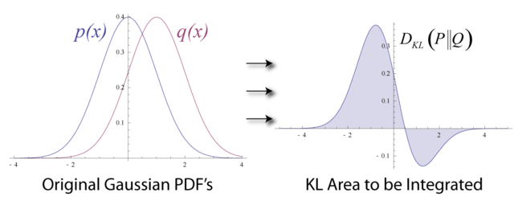
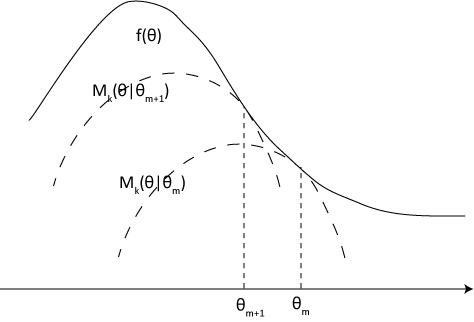

(수정중... 지속적으로 수정될 예정)

* 논문 : [https://arxiv.org/abs/1502.05477](https://arxiv.org/abs/1502.05477)
* 참고자료
  * [오승상 강화학습 TRPO 1/2/3](https://youtu.be/c15b9AjHxBA?si=o0SuPynSb0z3cJgE)

## Preliminaries

* $\mathcal{S}$ : finite set of states
* $\mathcal{A}$ : finite set of actions
* $P: \mathcal{S} \times \mathcal{A} \times \mathcal{S} \rightarrow \mathbb{R}$ : transition probability distribution
* $r: \mathcal{S} \rightarrow \mathbb{R}$ : reward function
* $\rho\_0: \mathcal{S} \rightarrow \mathbb{R}$ : distribution of the initial state $s\_0$
* $\gamma \in (0,1)$ : discount factor.
* $\pi$ : stochastic policy 
  * $\pi: \mathcal{S} \times \mathcal{A} \rightarrow [0,1]$
  * $\tilde{\pi}$ : another policy (or new policy)
* $\eta(\pi)$ : expected discounted reward

$$
\begin{align*}
&\eta(\pi) = \mathbb{E}_{s_0,a_0,\dots} \left[ \sum_{t=0}^{\infty} \gamma^t r(s_t) \right], \text{ where}\\
&s_0 \sim \rho_0(s_0),\ a_{t} \sim \pi(a_t \vert  s_t), \ s_{t+1} \sim P(s_{t+1} \vert  s_t, a_t).\nonumber
\end{align*}
$$

* $Q\_{\pi}$ : state-action value function
* $V\_{\pi}$ : the value function
* $A\_{\pi}$ : the advantage function 

$$
\begin{align*}
&Q_{\pi}(s_t, a_t) = \mathbb{E}_{s_{t+1},a_{t+1},\dots}\; \left[ {\sum_{l=0}^{\infty} \gamma^{l} r(s_{t+l})} \right], \nonumber\\
&V_{\pi}(s_t) =\ \mathbb{E}_{a_t,s_{t+1},\dots} \left[ {\sum_{l=0}^{\infty} \gamma^{l} r(s_{t+l})} \right] ,\\
&A_{\pi}(s,a) =\  Q_{\pi}(s,a) - V_{\pi}(s), \text{ where} \\
&\quad a_{t} \sim \pi(a_t \vert  s_t), s_{t+1} \sim P(s_{t+1} \vert  s_t, a_t) \text{ for $t\ge 0$}. \nonumber
\end{align*}
$$

* $l$ : delay

$\eta(\pi)$ : expected discounted reward. **(최대화 하기를 원하는 것)**, DDPG와 달리 Q function이 아니라 return을 maximize

$$
\eta(\tilde{\pi})=\eta(\pi)+\mathbb{E}_{s_0, a_0, \cdots, \sim \tilde{\pi}} \left [ \sum_{t=0}^{\infty} \gamma^{t}A_{\pi}(s_t, a_t) \right ] \tag{1}
$$

* old policy $\pi$ 에 대한 $\eta$를 가지고 new policy $\tilde{\pi}$ 에 대한 $\eta$를 계산
* *Kakade & Langford (2002)*
* $s\_0, a\_0, \cdots,=\tau$

$$
\begin{aligned}
    \mathbb{E}_{\tau \sim \tilde{\pi}} \left [ \sum_{t=0}^{\infty} \gamma^{t}A_{\pi} (s_t, a_t) \right ] & = \mathbb{E}_{\tau \sim \tilde{\pi}} \left [ \sum_{t=0}^{\infty} \gamma^{t} (r(s_t) + \gamma V_{\pi}(s_{t+1})-V_{\pi}(s_t)) \right ] \\
    & = \eta(\tilde{\pi}) + \mathbb{E}_{\tau \sim \tilde{\pi}} \left [ \sum_{t=0}^{\infty} \gamma^{t+1} V_{\pi}(s_{t+1}) - \sum_{t=0}^{\infty}\gamma^{t}V_{\pi}(s_t) \right ] \\
    & = \eta(\tilde{\pi}) - \mathbb{E}_{s_0} \left [ V_{\pi} (s_0) \right ] \\
    & = \eta(\tilde{\pi}) - \eta(\pi)
\end{aligned}
$$

$$\begin{align*}
A_{\pi}(s_t, a_t) &= Q_{\pi}(s_t, a_t) - V_{\pi}(s_t) \\
&= r(s_t) + \gamma \mathbb{E}_{s_{t+1} \sim P(s_{t+1} \vert s_t,a_t)}[V_{\pi}(s_{t+1})] - V_{\pi}(s_t).
\end{align*}$$

* $\mathbb{E}\_{\tau \sim \tilde{\pi}}$는 $\mathbb{E}\_{s\_{t+1} \sim P(s\_{t+1} \vert s\_t,a\_t)}$를 포함하기 때문에 $\gamma \mathbb{E}\_{s\_{t+1} \sim P(s\_{t+1} \vert s\_t,a\_t)}[V\_{\pi}(s\_{t+1})]$가 $\mathbb{E}\_{\tau \sim \tilde{\pi}}$안으로 들어갈 때 $V\_{\pi}(s\_{t+1})$ 만 남는다.
* $\eta(\tilde{\pi}) = \mathbb{E}\_{\tau \sim \tilde{\pi}} \left[ \sum\_{t=0}^{\infty} \gamma^t r(s\_t) \right]$

---

$\rho\_{\pi}$ be the (unnormalized) discounted visitation frequencies.

$$
\begin{align*}
\rho_\pi(s) & = P(s_0 = s) + \gamma P(s_1 = s) + \gamma^2 P(s_2 = s) + \cdots \\
& = \sum_{t=0}^{\infty} \gamma^{t}P(s_t=s)
\end{align*}
$$

* $s\_0 \sim \rho\_0$ and the actions are chosen according to $\pi$
* 정책 $\pi$를 따를 때 $s\_t=s$ 확률을 계산하고 그것을 모든 $t$에 대해 적용($\sum\_{t=0}^{\infty}$)
* 아래와 같이 쓰기도 한다
  * $\rho\_\pi(s) = \sum\_{t=0}^{\infty} \gamma^{t}P(s\_t=s \vert \pi)$

---

$$
\begin{align*}
\mathbb{E}_{\tau \sim \tilde{\pi}} \left[ \sum_{t=0}^{\infty} \gamma^t A_{\pi}(s_t, a_t) \right] & = \sum_{t=0}^{\infty} \sum_{s} P(s_t = s | \tilde{\pi}) \sum_a \tilde{\pi}(a | s) \gamma^t A_{\pi}(s, a) \\
& = \sum_s \left( \sum_{t=0}^{\infty} \gamma^t P(s_t = s | \tilde{\pi}) \right) \sum_a \tilde{\pi}(a | s) A_{\pi} (s, a) \\
& = \sum_s \rho_{\tilde{\pi}}(s) \sum_a \tilde{\pi}(a | s) A_{\pi} (s, a)
\end{align*}
$$

* $\rho\_\pi(s) = \sum\_{t=0}^{\infty} \gamma^{t}P(s\_t=s \vert \pi)$
* (Equation 2)와 사실상 같은 수식이다.

**접근법**

아래 두개는 더해주는 순서만 다르다.

$$\mathbb{E}_{\tau \sim \tilde{\pi}} \left[ \sum_{t=0}^{\infty} \gamma^t A_{\pi}(s_t, a_t) \right]$$

* $\sum\_{t=0}^{\infty}$ 부분이 안에 있다
  * 한 에피소드의 모든 timestep에 대해 advantage function을 더함
* $E\_{\tau \sim \tilde{\pi}}$ 부분이 밖에 있다
  * 에피소드가 일어날 확률을 곱해 expectation을 구함

{: width="50%" height="50%"}

$$\sum_{t=0}^{\infty} \sum_s P(s_t = s \vert \tilde{\pi}) \sum_a \tilde{\pi}(a \vert s) \gamma^t A_{\pi}(s, a)$$

* $E\_{\tau \sim \tilde{\pi}} = \sum\_s P(s\_t = s \vert \tilde{\pi}) \sum\_a \tilde{\pi}(a \vert s)$ 이 안쪽으로 들어감
  * timestep 고정
  * 주어진 timestep에서 어떤 state가 나올 확률 $P(s\_t=s \vert \tilde{\pi})$ 과 해당 state에서 어떤 action이 나올 확률 $\tilde{\pi}(a \vert s)$ 을 가지고 advantage function의 expectation을 구함
* $\sum\_{t=0}^{\infty}$ 부분이 밖에 있다.
  * 모든 timestep에 대해 더해준다.

{: width="50%" height="50%"}

---

$$
\begin{align}
\eta(\tilde{\pi}) &= \eta(\pi) + \sum_{t=0}^{\infty} \sum_s P(s_t = s|\tilde{\pi}) \sum_a \tilde{\pi}(a \vert s)\gamma^t A_\pi(s,a) \notag \\
&= \eta(\pi) + \sum_{t=0}^{\infty} \sum_s \gamma^t P(s_t = s|\tilde{\pi}) \sum_a \tilde{\pi}(a \vert s)A_\pi(s,a) \notag \\
&= \eta(\pi) + \sum_s \rho_{\tilde{\pi}}(s) \sum_a \tilde{\pi}(a \vert s)A_\pi(s,a).
\end{align}
\tag{2}
$$

> However, in the approximate setting, it will typically be unavoidable, due to estimation and approximation error, that there will be some states $s$ for which the expected advantage is negative, that is, $\sum\_a \tilde{\pi}(a \vert s)A\_\pi(s,a) < 0$.

* 목표 : $\eta(\tilde{\pi}) \geq \eta(\pi)$
  * 조건 : $\sum\_s \rho\_{\tilde{\pi}}(s) \sum\_a \tilde{\pi}(a \vert s)A\_\pi(s,a) \geq 0$
  * $\rho\_{\tilde{\pi}}$가 확률이기 때문에 모든 state에 대해 $\sum\_a \tilde{\pi}(a \vert s)A\_\pi(s,a) \geq 0$ 이어야 한다.

> The complex dependency of $\rho\_{\tilde{\pi}}$ on $\tilde{\pi}$ makes Equation (2) difficult to optimize directly

* 문제 : 찾아야 하는 new policy $\tilde{\pi}$ 에 대한 state visitation frequency $\rho\_{\tilde{\pi}}$는 구하기 힘들다.

$$
\begin{align*}
\eta(\tilde{\pi})&=\eta(\pi)+\mathbb{E}_{s_0, a_0, \cdots, \sim \tilde{\pi}} \left [ \sum_{t=0}^{\infty} \gamma^{t}A_{\pi}(s_t, a_t) \right ] \\
&= \eta(\pi) + E_{\tau \sim \tilde{\pi}} \left[ \sum_{t=0}^{\infty} \gamma^t A_{\pi}(s_t, a_t) \right] \\
&= \eta(\pi) + \sum_s \rho_{\tilde{\pi}}(s) \sum_a \tilde{\pi}(a | s) A_{\pi} (s, a)
\end{align*}
$$

**Approximation 1)** 다음과 같은 근사를 적용한다 : $\rho\_{\tilde{\pi}} \rightarrow \rho\_{\pi}$

$\rho\_{\pi}$를 적용함으로써 policy update에 의한 state visitation frequency의 변화를 고려하지 않아도 된다. 이렇게 근사가 적용된 식을 아래와 같이 $L_\pi(\tilde{\pi})$ 로 표기한다.

$$
L_\pi(\tilde{\pi}) = \eta(\pi) + \sum_s \rho_\pi(s) \sum_a \tilde{\pi}(a \vert s)A_\pi(s,a). \tag{3}
$$

> Note that $L\_{\pi}$ uses the visitation frequency $\rho\_{\pi}$ rather than $\rho\_{\tilde{\pi}}$, ignoring changes in state visitation density due to changes in the policy. However, if we have a parameterized policy $\pi\_{\theta}$, where $\pi\_{\theta}(a\vert s)$ is a differentiable function of the parameter vector $\theta$, then $L\_{\pi}$ matches $\eta$ to first order (see  Kakade & Langford(2002)).
That is, for any parameter value $\theta\_0$

<!-- TODO 이것 증명 -->

$$
\begin{align*}
L_{\pi_{\theta_0}} (\pi_{\theta_0}) &= \eta(\pi_{\theta_0}), \quad (\because \sum_s \rho_{\pi_{\theta_0}} \sum_a \pi_{\theta_0}(a \vert s)A_{\pi_{\theta_0}}(s,a) = 0) \\
\nabla_{\theta} L_{\pi_{\theta_0}} (\pi_{\theta})\big|_{\theta=\theta_0} &= \nabla_{\theta} \eta(\pi_{\theta})\big|_{\theta=\theta_0}.
\end{align*}
\tag{4}
$$

> Equation $(4)$ implies that a sufficiently small step $\pi\_{\theta\_0} \rightarrow \tilde{\pi}$ that improves $L\_{\pi\_{\theta\_{\mathrm{old}}}}$ will also improve $\eta$, **but does not give us any guidance on how big of a step to take.**

$(4)$에 대한 설명

$$
\begin{align*}
A(s, a) & = Q(s, a) - V(s) \\
& = Q(s, a) - \mathbb{E}_a \left [ Q(s, a) \right ]
\end{align*}
$$

* $\mathbb{E}\_a$ : action 에 대한 expectation

$$
\begin{align*}
\mathbb{E}_a \left [ A(s, a) \right ] & = Q(s, a) - V(s) \\
& = \mathbb{E}_a \left [ Q(s, a) - \mathbb{E}_a \left [ Q(s, a) \right ]\right ] \\
& = 0 \quad \text{(same policy)}
\end{align*}
$$

Advantage function에서 같은 policy로 모든 action에 expectation을 취하면 0이 된다. 그러므로

$$\sum_s \rho_{\pi_{\theta_0}} \sum_a \pi_{\theta_0}(a \vert s)A_{\pi_{\theta_0}}(s,a) = 0$$

* parameterized policy $\pi\_{\theta}$가 있고 $\pi\_\theta(a \vert s)$가 파라미터 벡터 $\theta$에 대해 미분 가능한 함수이다.
* $\pi\_{\theta\_{0}}$은 old policy를 나타낸다고 생각하면 된다.
* $L\_\pi(\tilde{\pi}) = \eta(\pi) + \sum\_s \rho\_\pi(s) \sum\_a \tilde{\pi}(a \vert s)A\_\pi(s,a)$
  * $\pi \leftarrow \pi\_{\theta\_0}$, $\tilde{\pi} \leftarrow \pi\_{\theta\_0}$
  * $L\_{\pi\_{\theta\_0}}(\pi\_{\theta\_0}) = \eta(\pi\_{\theta\_0}) + \sum\_s \rho\_{\pi\_{\theta\_0}}(s) \sum\_a \pi\_{\theta\_0}(a \vert s)A\_{\pi\_{\theta\_0}}(s,a)$

<!-- TODO 1차미분이 같은 이유 설명 -->

* *Kakade & Langford (2002)*

---

### conservative policy iteration

Kakade & Langford (2002)

> To define the conservative policy iteration update, let $\pi\_{\mathrm{old}}$ denote the current policy, and let $\pi' = \mathrm{argmax}\_{\pi'} L\_{\pi\_{\mathrm{old}}}(\pi')$.
The new policy $\pi\_{\mathrm{new}}$ was defined to be the following **mixture**:

$$
\pi_\text{new}(a \vert s)=(1 - \alpha)\pi_{\text{old}}(a \vert s) + \alpha \pi' (a \vert s) \tag{5}
$$

* $\pi\_\text{old}$ : current policy
* $\pi'=\arg \max\_{\pi'}L\_{\pi\_\text{old}}(\pi')$
* $\alpha$ 비율 만큼 $\pi'$ 적용

$$
\begin{align*}
\eta(\pi_{\mathrm{new}})
&\!\ge\! L_{\pi_{\mathrm{old}}}(\pi_{\mathrm{new}}) - \frac{2 \epsilon \gamma  }{(1-\gamma)^2} \alpha^2 \nonumber\\
&\text{ where } \epsilon = \max_s \left| \mathbb{E}_{a \sim \pi'(a\vert s)} \left[ A_{\pi}(s,a) \right] \right|.
\end{align*}
\tag{6}
$$

* $\alpha$ ↑ ⇒ 더 많은 new policy $\pi'$ ⇒ 오차 ↑ ⇒ lower bound ↓
* discount factor $\gamma \in (0,1)$ ↑ ⇒ time step이 커질수록 discount 하는 양 ↓(discount factor는 크다) ⇒ 오차가 더 커짐 ⇒ lower bound ↓
  * $\gamma$ ↑ ⇒ 분모가 작아짐, 분자가 커짐 ⇒ 음의 방향이므로 lower bound가 작아짐
* $\epsilon$
  * 모든 state에 대해 max 값을 구하는 것이 어려움
  * new policy $\tilde{\pi}$를 사용하는 것이 힘듬

> Note, however, that so far this bound only applies to mixture policies generated by Equation (5). **This policy class is unwieldy and restrictive in practice**, and it is desirable for a practical policy update scheme to be applicable to all general stochastic policy classes.

## Monotonic Improvement Guarantee for General Stochastic Policies

> Our principal theoretical result is that the policy improvement bound in Equation (6) can be extended to general stochastic policies, rather than just mixture polices, by replacing $α$ with a distance measure between $π$ and $\tilde{π}$, and changing the constant $ϵ$ appropriately.    우리의 주요 이론적 결과는 식(6)의 policy improvement bound가 mixture policy뿐만 아니라 general stochastic policies로 확장될 수 있음을 보여준다. $α$를 $π$와 $\tilde{π}$ 사이의 거리 측정으로 대체하고, 상수 $ϵ$를 적절히 변경함으로써 가능하다.

다시 앞내용을 상기하면

$$
\begin{align*}
\eta(\pi_{\mathrm{new}})
&\!\ge\! L_{\pi_{\mathrm{old}}}(\pi_{\mathrm{new}}) - \frac{2 \epsilon \gamma  }{(1-\gamma)^2} \alpha^2 \nonumber\\
&\text{ where } \epsilon = \max_s \left| \mathbb{E}_{a \sim \pi'(a\vert s)} \left[ A_{\pi}(s,a) \right] \right|.
\end{align*}
\tag{6}
$$

위 식은 

$$
\pi_\text{new}(a \vert s)=(1 - \alpha)\pi_{\text{old}}(a \vert s) + \alpha \pi' (a \vert s) \tag{5}
$$

와 같은 mixture policy에서 비롯된 식이었고 $\alpha$는 mixture policy를 만들 때 얼마나 conservative하게 할 것인가를 나타내는 하이퍼파라미터였다.

Total Variation distance 에 대한 설명은 [**Extra - Total Variation distance**](#total-variation-distance)에 서술하였다.

$$
D_{\text{TV}}(p  \ \| \  q) = \frac{1}{2} \sum_i |p_i - q_i|
$$

$$
D^{\text{max}}_{\text{TV}}(\pi, \tilde{\pi}) = \max_s D_{TV}(\pi(\cdot \vert s)  \ \| \  \tilde{\pi}(\cdot \vert s)). \tag{7}
$$

* $D^{\text{max}}\_{\text{TV}}(\pi, \tilde{\pi})$를 위와 같이 정의한다.
* $\pi, \tilde{\pi}$ 사이의 Total Variation distance를 찾는다. 이것을 모든 state에 대해서 $\max$ 값을 구한다.

> by replacing $α$ with a distance measure between $π$ and $\tilde{π}$

그리고 아래 식에서 

$$
\begin{align*}
\eta(\pi_{\mathrm{new}})
&\!\ge\! L_{\pi_{\mathrm{old}}}(\pi_{\mathrm{new}}) - \frac{2 \epsilon \gamma  }{(1-\gamma)^2} \alpha^2 \nonumber\\
&\text{ where } \epsilon = \max_s \left| \mathbb{E}_{a \sim \pi'(a\vert s)} \left[ A_{\pi}(s,a) \right] \right|.
\end{align*}
\tag{6}
$$

$\epsilon = \max\_s \vert \mathbb{E}\_{a \sim \pi'(a \vert s)} \left[ A\_{\pi}(s,a) \right] \vert$ 을 볼 때 $\pi'$는 

> let $\pi' = \mathrm{argmax}\_{\pi'} L\_{\pi\_{\mathrm{old}}}(\pi')$

이었다, 즉 $L\_{\pi\_{\mathrm{old}}}(\pi')$ 를 maximize 하는 policy 였다.

여기서  $\epsilon = \max\_s \vert \mathbb{E}\_{a \sim \pi'(a\vert s)} \left[ A\_{\pi}(s,a) \right] \vert$ 와 같이 $\pi'$ 에 대한 정책을 따르면서 old policy $\pi$에 대한 Advantage의 기댓값을 구하는 대신 $\epsilon = \max\_{s,a} \vert {A\_{\pi}(s,a)} \vert $와 같이 모든 state, action pair $(s,a)$에 대한 advantage의 maximum 값으로 바꾼다.

> and changing the constant $ϵ$ appropriately.

이렇게 $\pi'$를 사용하지 않음으로써 mixture policy를 사용하지 않고 식을 더 단순화시킨다.

> Our principal theoretical result is that the policy improvement bound in Equation (6) can be extended to general stochastic policies, rather than just mixture polices

이제 처음에 쓴 문장들이 이해가 갈 것이다.

$$
D^{\text{max}}_{\text{TV}}(\pi, \tilde{\pi}) = \max_s D_{TV}(\pi(\cdot \vert s)  \ \| \  \tilde{\pi}(\cdot \vert s)). \tag{7}
$$

**Theorem 1.** $Let \: \alpha = D\_{\text{TV}}^{\text{max}}(\pi\_{\text{old}}, \pi\_{\text{new}})$, *Then the following bound holds:*

$$
\begin{align}
&\eta(\pi_{\mathrm{new}}) \ge L_{\pi_{\mathrm{old}}}(\pi_{\mathrm{new}}) - \frac{4 \epsilon \gamma  }{(1-\gamma)^2} \alpha^2 \nonumber\\
&\quad\text{ where } \epsilon = \max_{s,a} \left| {A_{\pi}(s,a)}\right|
\end{align}
\tag{8}
$$

$$
D_{TV}(p  \ \| \  q)^2 \leq D_{KL}(p  \ \| \  q)
$$

인데 두 항 모두 모든 state에 대해 maximize하면 아래 식을 만족할 것이다. 

$$
\max_s D_{TV}(\pi(\cdot \vert s)  \ \| \  \tilde{\pi}(\cdot \vert s)) \leq \max_s D_{KL}(\pi(\cdot \vert s) \ \| \  \tilde{\pi}(\cdot \vert s))
$$

이때 왼쪽 항은 Theorem 1에 서술한 바와 같이 $\alpha = D\_{\text{TV}}^{\text{max}}(\pi\_{\text{old}}, \pi\_{\text{new}})$이다.

$$
\alpha = \max_s D_{TV}(\pi(\cdot \vert s)  \ \| \  \tilde{\pi}(\cdot \vert s))
$$

그리고 오른쪽 항은 아래와 같다.

$$
D^{\text{max}}_{\text{KL}}(\pi, \tilde{\pi}) = \max_s D_{KL}(\pi(\cdot \vert s) \| \tilde{\pi}(\cdot \vert s))
$$

모든 state에 대해서 old policy $\pi$ 와 new policy $\pi'$ 사이의 maximum  값을 의미한다. 그러므로 아래 관계를 만족한다.

$$
\begin{align*}
\eta(\tilde{\pi}) \geq L_{\pi}(\tilde{\pi}) & - C D^{\text{max}}_{KL}(\pi, \tilde{\pi}), \\ \text{where } C & = \frac{4\epsilon\gamma}{(1 - \gamma)^2}. \tag{9}
\end{align*}
$$

* *Pollard (2000, Ch. 3)*
* 딥러닝에서 Total Variation Distance보다는 KL Divergence가 더 다루기 쉽다고 한다.

**Theorem 1.** 정리

<!-- 첫째줄 -> 둘째줄로 갈 때 2에서 4되는 것 증명 아래 서술 -->

$$
\begin{align*}
\eta(\tilde{\pi})& \geq L_{\pi}(\tilde{\pi}) - \frac{2\epsilon\gamma}{(1-\gamma)^2} \alpha^2,
\quad \text{where } \epsilon = \max_s \left| \mathbb{E}_{a\sim\pi'}(a \vert s) [A_{\pi}(s,a)] \right|.\\

& \geq L_{\pi}(\tilde{\pi}) - \frac{4\epsilon\gamma}{(1-\gamma)^2} \alpha^2, \quad \text{where } \epsilon = \max_{s,a} |A_{\pi}(s, a)|, \: \alpha = D_{\text{TV}}^{\text{max}}(\pi, \tilde{\pi}) \\

& \geq L_{\pi}(\tilde{\pi}) - C D^{\text{max}}_{KL}(\pi, \tilde{\pi}), \quad \text{where } C = \frac{4\epsilon\gamma}{(1 - \gamma)^2}. \\
& \quad (\because \alpha = D_{TV}^{\max}(\pi(\cdot \vert s)  \ \| \  \tilde{\pi}(\cdot \vert s)) \leq D_{KL}^{\max}(\pi(\cdot \vert s) \ \| \  \tilde{\pi}(\cdot \vert s))))
\end{align*}
$$

### Minorization-Maximization(MM) Algorithm

*(Hunter & Lange, 2004)*

앞 내용을 다시 떠올리면

$$
\eta(\tilde{\pi}) \geq L_{\pi}(\tilde{\pi}) - C D^{\text{max}}_{KL}(\pi, \tilde{\pi}), \quad \text{where } C = \frac{4\epsilon\gamma}{(1 - \gamma)^2}.
$$

$\pi \leftarrow \pi\_i, \ \  \tilde{\pi} \leftarrow \pi$ 를 대입하면 아래와 같은데

$$
\eta(\pi) \geq L_{\pi_i}(\pi) - C D^{\text{max}}_{KL}(\pi_i, \pi)
$$

그렇다면 아래 내용을 만족한다.

$$
\eta(\pi) \geq M_i(\pi) = L_{\pi_i}(\pi) - C D^{\text{max}}_{KL}(\pi_i, \pi)
$$

위와 같이 lower bound 를 surrogate function $M\_i(\pi)$으로 사용한다. MM Algorithm을 통해 policy를 업데이트하면 monotonic improvement가 보장된다.

* $\eta(\pi)$ : expected discounted reward

$$
\begin{align*}
& \eta(\pi_{i+1}) \geq M_i(\pi_{i+1}) \quad (\because \eta(\tilde{\pi}) \geq L_{\pi}(\tilde{\pi}) - C D^{\text{max}}_{KL}(\pi, \tilde{\pi})) \\
& \eta(\pi_i) = M_i(\pi_i), \text{ therefore, } \\
& \eta(\pi_{i+1}) - \eta(\pi_i) \geq M_i(\pi_{i+1}) - M(\pi_i). 
\end{align*}
\tag{10}
$$

* $M\_i(\pi) = L\_{\pi\_i}(\pi) - C D^{\text{max}}\_{KL}(\pi\_i, \pi)$ 일 때
  * $\pi \leftarrow \pi\_i$ 를 대입하면
  * $M\_i(\pi\_i) = L\_{\pi\_i}(\pi\_i) - C D^{\text{max}}\_{KL}(\pi\_i, \pi\_i)$
  * $M\_i(\pi\_i) = L\_{\pi\_i}(\pi\_i) \quad \because  \  D^{\text{max}}\_{KL}(\pi\_i, \pi\_i) = 0$
* $L\_\pi(\tilde{\pi}) = \eta(\pi) + \sum\_s \rho\_\pi(s) \sum\_a \tilde{\pi}(a \vert s)A\_\pi(s,a). \quad (3)$
  * $\pi \leftarrow \pi\_i, \quad \tilde{\pi} \leftarrow \pi\_i$
  * $L\_{\pi\_i}(\pi\_i) = \eta(\pi\_i) + \sum\_s \rho\_{\pi\_i} \sum\_a \pi\_i(a \vert s)A\_{\pi\_i}(s,a).$
  * $L\_{\pi\_i}(\pi\_i) = \eta(\pi\_i) \quad \because \  \sum\_a \pi\_i(a \vert s)A\_{\pi\_i}(s,a) = 0$
    * 같은 policy를 사용해서 advantage function에 action에 대한 expectation을 계산하게 되면 0이 된다.
* $M\_i(\pi\_i) = L\_{\pi\_i}(\pi\_i) = \eta(\pi\_i)$

> Thus, by maximizing $M\_i$ at each iteration, we guarantee that the true objective $\eta$ is non-decreasing. This algorithm is a type of minorization-maximization (MM) algorithm, which is a class of methods that also includes expectation maximization. In the terminology of MM algorithms, $M\_i$ is the surrogate function that minorizes $\eta$ with equality at $\pi\_i$.

다르게 표현 해보면 다음과 같다.

$$
\begin{align*}
\eta(\pi_i) & = M_i(\pi_i) \\
& \leq M_i(\pi_{i+1}) \quad (\because \pi_{i+1}=\underset{\pi}{\arg\max}M_i(\pi))\\
& \leq \eta(\pi_{i+1}) \quad (\because \eta(\pi) \geq M_i(\pi))
\end{align*}
$$

위와 같이 $\eta(\pi\_i) \leq \eta(\pi\_{i+1})$ 를 보임으로써 the true objective $\eta$ 의 non-decreasing 를 보장한다.

## Optimization of Parameterized Policies

> Since we consider parameterized policies $\pi\_{\theta}(a \vert s)$ with parameter vector $\theta$, we will overload our previous notation to use functions of $\theta$ rather than $\pi$.

* $\eta(\theta) := \eta(\pi\_\theta)$
* $L\_{\theta}(\tilde{\theta}) := L\_{\pi\_{\theta}}(\pi\_{\tilde{\theta}})$
* $D\_{\text{KL}}(\theta \ \\| \ \tilde{\theta}) := D\_{\text{KL}}(\pi\_{\theta} \ \\| \ \pi\_{\bar{\theta}})$
* $\theta\_{\text{old}}$ : previous policy paramters that we want to improve upon.

$$
\eta(\theta) \ge L_{\theta_{\mathrm{old}}}(\theta)-C D_{\text{KL}}^{\text{max}}(\theta_{\text{old}}, \theta)
$$

위와 같이 바꿀 수 있다. 여기서 우리는 $\eta(\theta)$를 maximize하기 위해 MM Algorithm를 사용하기로 하였고 거기에서  $L\_{\theta\_{\mathrm{old}}}(\theta)-C D\_{\text{KL}}^{\text{max}}(\theta\_{\text{old}}, \theta)$를 surrogate function으로 사용하기로 했다.

$$
\underset{\theta}{\text{maximize}} \left [ L_{\theta_{\text{old}}}(\theta) - C D_{\text{KL}}^{\text{max}}(\theta_{\text{old}}, \theta) \right ]
$$

위 식에서의 $\theta$는 optimal policy가 아니라 next policy이다. MM Algorithm에서는 이 next policy을 $\theta\_\mathrm{old}$에 대입하고 다시 next policy를 찾아야 한다. 이를 반복해야 하는데 이는 많은 연산량을 요구한다.

또한 $C = \frac{4\epsilon\gamma}{(1 - \gamma)^2}$ 를 떠올려보자. $\gamma \in (0,1)$ 가 커진다면 분모가 작아지므로 C도 커진다. 그러면 그에 대응하는 step size가 매우 작아야 한다. ($\gamma$가 커지면 분모가 매우 작아지기 때문에) 이러면 학습이 매우 느려진다.

> In practice, if we used the penalty coefficient C recommended by the theory above, the step sizes would be very small.

### Trust Region Constraint

> One way to take larger steps in a robust way is to use a constraint on the KL divergence between the new policy and the old policy, i.e., a trust region constraint:

$$
\underset{\theta}{\text{maximize}} \left [ L_{\theta_{\text{old}}}(\theta) - C D_{\text{KL}}^{\text{max}}(\theta_{\text{old}}, \theta) \right ]
$$

위 식에서 KL divergence term ($D\_{\text{KL}}^{\text{max}}(\theta\_{\text{old}}, \theta)$)이 빼줌으로써 penalty 역할을 하기에 이를 KL penalized obejective 라고 한다. 여기에서 penalty 부분에서 $C$를 빼고 $D\_{\text{KL}}^{\text{max}}(\theta\_{\text{old}}, \theta)$ 부분을 $D\_{\text{KL}}^{\text{max}}(\theta\_{\text{old}}, \theta) \leq \delta$로 바꿔준다. 이것을 KL Constraint objective라고 부른다.

KL Divergence term이 constraint로 있는 objective function을 말한다. 이는 아래와 같이 나타낼 수 있다.

$$
\begin{align*}
& \underset{\theta}{\text{maximize }}L_{\theta_{\text{old}}}(\theta) \\
& \text{subject to } D_{\text{KL}}^{\text{max}}(\theta_{\text{old}}, \theta) \leq \delta
\end{align*}
\tag{11}
$$

> In practice, if we used the penalty coefficient C recommended by the theory above, the step sizes would be very small. One way to take larger steps in a robust way is to use a constraint on the KL divergence between the new policy and the old policy, i.e., a trust region constraint:

여기서 $\delta$는 $C$보다 튜닝하기 쉽다.

<!-- TODO : Lagrangian duality -->

또한 앞내용을 다시 상기하면 우리는 MM Algorithm이 계산이 너무 많기 때문에 그것을 줄이기 위해 노력했고 MM Algorithm은 아래식과 같았다. 위 식은 surrogate objective function $M\_i(\pi)$ 의 변형이라고 할 수 있다.

$$
\eta(\pi) \geq M_i(\pi) = L_{\pi_i}(\pi) - C D^{\text{max}}_{KL}(\pi_i, \pi)
$$

정리하면 우리는 $D\_{\text{KL}}^{\text{max}}(\theta\_{\text{old}}, \theta) \leq \delta$ 를 만족하는 조건 하에서 $L\_{\theta\_{\text{old}}}(\theta)$를 maximize하는 $\theta$를 찾으면 그것이 new policy가 된다.

여기서

$$
\begin{align*}
& \underset{\theta}{\text{maximize }}L_{\theta_{\text{old}}}(\theta) \\
& \text{subject to } D_{\text{KL}}^{\text{max}}(\theta_{\text{old}}, \theta) \leq \delta
\end{align*}
\tag{11}
$$

수식을 보면

$$
D_{\text{KL}}^{\text{max}}(\theta_{\text{old}}, \theta) \leq \delta
$$

위와 같으므로

$$
D^{\text{max}}_{\text{KL}}(\pi, \tilde{\pi}) = \max_s D_{KL}(\pi(\cdot \vert s) \ \| \ \tilde{\pi}(\cdot \vert s))
$$

를 떠올리면

$$
D^{\text{max}}_{\text{KL}}(\theta_{\text{old}},\theta) = \max_s D_{KL}(\theta_{\text{old}}(\cdot \vert s) \ \| \ \theta(\cdot \vert s)) \leq \delta
$$

와 같이 표현할 수 있다. 이는 모든 state에 대해서 $D\_{KL}(\theta\_{\text{old}}(\cdot \vert s) \ \\| \ \theta(\cdot \vert s)) \leq \delta$ 라는 뜻이다. 이때 state의 개수는 너무 많은데 모든 state에 대해서 찾기 힘들고 sample을 사용하기 때문에 heuristic approximation 을 사용한다.

### Heuristic approximation

> This problem imposes a constraint that the KL divergence is bounded at every point in the state space. While it is motivated by the theory, this problem is impractical to solve due to the large number of constraints. Instead, we can use a heuristic approximation which considers the average KL divergence:

$$
D^{\text{max}}_{\text{KL}}(\pi, \tilde{\pi}) = \max_s D_{KL}(\pi(\cdot \vert s) \ \| \ \tilde{\pi}(\cdot \vert s))
$$

**Approximation 2.** max로 구했던 것을 expectation으로 바꾼다.

$$
\overline{D}^{\rho}_{\text{KL}}(\theta_1, \theta_2) := \mathbb{E}_{s \sim \rho} \left[ D_{KL}(\pi_{\theta_1}(\cdot \vert s)  \ \| \  \pi_{\theta_2}(\cdot \vert s)) \right].
$$

$$
\begin{align*}
& \underset{\theta}{\text{maximize }} L_{\theta_{\text{old}}}(\theta) \\
& \text{subject to} \; \overline{D}^{\rho_{\theta_{\text{old}}}}_{\text{KL}}(\theta_{\text{old}}, \theta) \leq \delta.
\end{align*}
\tag{12}
$$

이전의 max를 expectation으로 바꾼다. 이제 Monte Carlo simulation으로 이 값을 추정한다.

## Sample-Based Estimation of the Objective and Constraint

$$
\begin{align*}
& \underset{\theta}{\text{maximize }} L_{\theta_{\text{old}}}(\theta) \\
& \text{subject to} \; \overline{D}^{\rho_{\theta_{\text{old}}}}_{\text{KL}}(\theta_{\text{old}}, \theta) \leq \delta.
\end{align*}
\tag{12}
$$

에서 $L\_{\theta\_{\text{old}}}(\theta)$를 보면,

$$
L_{\theta_{\text{old}}}(\theta) = \eta({\theta_{\text{old}}}) + \sum_s \rho_{\theta_{\text{old}}}(s) \sum_a \pi_\theta(a \vert s)A_{\theta_{\text{old}}}(s,a)
$$

였는데 여태 maximize를 하는 $\theta$를 찾기 위한 목표였기 때문에 $\eta({\theta\_{\text{old}}})$는 사용하지 않았다. 그렇게 뒷부분만 대체하면 아래 식을 얻는다.

$$
\begin{align*}
& \underset{\theta}{\text{maximize }} \sum_{s} \rho_{\theta_{\text{old}}}(s) \sum_{a} \pi_{\theta}(a \vert s) A_{\theta_{\text{old}}}(s,a) \\
& \text{subject to } \overline{D}^{\rho_{\theta_{\text{old}}}}_{\text{KL}}(\theta_{\text{old}}, \theta) \leq \delta.
\end{align*}
\tag{13}
$$

* $\overline{D}^{\rho}\_{\text{KL}}(\theta\_1, \theta\_2) := \mathbb{E}\_{s \sim \rho} \left[ D\_{KL}(\pi\_{\theta\_1}(\cdot \vert s)  \ \\| \  \pi\_{\theta\_2}(\cdot \vert s)) \right].$
* Replace $\sum\_{s}\rho\_{\theta\_\text{old}}(s) \left[ ... \right]$ in the objective by the expectation $\frac{1}{1 - \gamma} \mathbb{E}\_{s \sim \rho\_{\theta\_{\text{old}}}} \left[ ... \right]$
  * $\rho\_\pi(s) = P(s\_0 = s) + \gamma P(s\_1 = s) + \gamma^2 P(s\_2 = s) + \cdots$
  * state visited frequency가 확률의 모습을 가지려면 $(1-\gamma)$를 곱해준다. 기댓값은 확률이 안에 들어가있으므로 밖에 $\frac{1}{(1-\gamma)}$를 곱해준다.
  * maximize시에 상수를 곱한 것은 의미가 없으므로 $\frac{1}{1-\gamma}$를 제거해도 된다.
* Replace the advantage values $A\_{\theta\_{\text{old}}}$ by the Q-values $Q\_{\theta\_\text{old}}$ in Equation $(13)$
  * $A(s, a) = Q(s, a) - V(s)$
  * $V(s)$ : policy에 대해 constant 이며 policy에 아무 관계가 없다.
  * maximize시에 사용하는 $\theta$는 변하지 않으므로 $A$ → $Q$ 가능하다.
* Replace the sum over the actions by an importance sampling estimator.
  * $\sum\_a \pi\_\theta(a \vert s\_n) A\_{\theta\_{\text{old}}}(s\_n, a) = \mathbb{E}\_{a \sim \pi\_\theta}[A\_{\theta\_{\mathrm{old}}}]$ 인데 new policy $\pi\_\theta$에 대한 샘플이 없기 때문에 new policy 를 사용할 수 없다.
    * New policy에 대한 sample이 없으므로 최대한 $\pi\_\theta$를 $\pi\_{\theta\_{\text{old}}}$로 바꿔야 현재 current policy에서 주어진 샘플들을 사용할 수 있다. ⇒ Importance Sampling 사용하여 해결
  * Using $q$ to denote the sampling distribution, the contribution of a single $s\_n$ to the loss function is
    * $\sum\_a \pi\_\theta(a \vert s\_n) A\_{\theta\_{\text{old}}}(s\_n, a) = \mathbb{E}\_{a \sim q} \left[ \frac{\pi\_\theta(a \vert s\_n)}{q(a \vert s\_n)} A\_{\theta\_{\text{old}}}(s\_n, a) \right].$
    * $q$를 $\pi\_{\theta\_{\textrm{old}}}$로 생각하면 된다.

$$
\begin{align*}
\sum_{s} \rho_{\theta_{\text{old}}}(s) \sum_{a} \pi_{\theta}(a \vert s) A_{\theta_{\text{old}}}(s,a) & ⇒ \frac{1}{1-\gamma} \mathbb{E}_{s \sim \rho_{\theta_{\text{old}}}} \left[ \sum_{a} \pi_{\theta}(a \vert s) A_{\theta_{\text{old}}}(s,a) \right] \\

& ⇒ \mathbb{E}_{s \sim \rho_{\theta_{\text{old}}}} \left[ \sum_{a} \pi_{\theta}(a \vert s) A_{\theta_{\text{old}}}(s,a) \right] \\

& ⇒ \mathbb{E}_{s \sim \rho_{\theta_{\text{old}}}} \left[ \mathbb{E}_{a \sim q} \left[ \frac{\pi_{\theta}(a \vert s)}{q(a \vert s)} A_{\theta_{\text{old}}}(s,a) \right] \right] \\

& ⇒ \mathbb{E}_{s \sim \rho_{\theta_{\text{old}}}, a \sim q} \left[ \frac{\pi_{\theta}(a \vert s)}{q(a \vert s)} Q_{\theta_{\text{old}}}(s,a) \right]
\end{align*}
$$

Our optimization problem in Equation $(13)$ is exactly equivalent to the following one, written in terms of expectations:

$$
\begin{align*}
&\operatorname*{maximize}_{\theta} \mathbb{E}_{s \sim \rho_{\theta_{\mathrm{old}}}, a \sim q}{ \frac{\pi_{\theta}(a\vert s)}{q(a\vert s)} Q_{\theta_{\mathrm{old}}}(s,a)} \tag{14}\\
&\text{  subject to }
\mathbb{E}_{s \sim \rho_{\theta_{\mathrm{old}}}}{D_{\rm KL}({\pi_{\theta_{\mathrm{old}}}(\cdot \vert  s)} \ \| \ {\pi_{\theta}(\cdot\vert s)})}
\le \delta.  \nonumber
\end{align*}
$$

### Single Path

> In this estimation procedure, we collect a sequence of states by sampling $s\_0 \sim \rho\_0$ and then simulating the policy $\pi\_{\theta\_{\mathrm{old}}}$ for some number of timesteps to generate a trajectory $s\_0, a\_0, s\_1, a\_1, \dots, s\_{T-1},a\_{T-1},s\_T$.
Hence, $q(a \vert s) = \pi\_{\theta\_{\mathrm{old}}}(a \vert s)$.
$Q\_{\theta\_{\mathrm{old}}}(s,a)$ is computed at each state-action pair $(s\_t,a\_t)$ by taking the discounted sum of future rewards along the trajectory.

Single path의 경우 $q$에 $\pi\_{\theta\_{\mathrm{old}}}$를 대입하여 아래와 같은 결과를 얻을 수 있는데, 이제 $\pi\_{\theta\_{\mathrm{old}}}$를 가지고 샘플링 후에 평균내어 아래 expectation을 추정한다.

$$
\begin{align*}
&\operatorname*{maximize}_{\theta} \mathbb{E}_{s \sim \rho_{\theta_{\mathrm{old}}}, a \sim \pi_{\theta_{\mathrm{old}}}}{ \frac{\pi_{\theta}(a\vert s)}{\pi_{\theta_{\mathrm{old}}}(a\vert s)} Q_{\theta_{\mathrm{old}}}(s,a)}\\
&\text{  subject to }
\mathbb{E}_{s \sim \rho_{\theta_{\mathrm{old}}}}{D_{\rm KL}({\pi_{\theta_{\mathrm{old}}}(\cdot \vert  s)} \ \| \ {\pi_{\theta}(\cdot\vert s)})}
\le \delta.
\end{align*}
$$

## Practical Algorithm

Here we present two practical policy optimization algorithm based on the ideas above, which use either the *single path* or *vine* sampling scheme from the preceding section. The algorithms repeatedly perform the following steps:

1. Use the *single path* or *vine* procedures to collect a set of state-action pairs along with Monte Carlo estimates of their $Q$-values.
2. By averaging over samples, construct the estimated objective and constraint in Equation (14).
3. Approximately solve this constrained optimization problem to update the policy's parameter vector $\theta$. We use the conjugate gradient algorithm followed by a line search, which is altogether only slightly more expensive than computing the gradient itself.

With regard to (3), we construct the Fisher information matrix (FIM) by analytically computing the Hessian of the KL divergence, rather than using the covariance matrix of the gradients.
That is, we estimate $A\_{ij}$ as $\frac{1}{N}\sum\_{n=1}^N \frac{\partial^2}{\partial\theta\_i \partial \theta\_j} D\_{\rm KL}({\pi\_{\theta\_{\mathrm{old}}}(\cdot \vert s\_n)}) \ \\| \ ({\pi\_{\theta}(\cdot \vert s\_n)})$, rather than $\frac{1}{N} \sum\_{n=1}^N \frac{\partial}{\partial\theta\_i}\log \pi\_{\theta}(a\_n \vert s\_n) \frac{\partial}{\partial\theta\_j}\log \pi\_{\theta}(a\_n \vert s\_n)$.

$$
\begin{align*}
&\operatorname*{maximize}_{\theta} \mathbb{E}_{s \sim \rho_{\theta_{\mathrm{old}}}, a \sim q}{ \frac{\pi_{\theta}(a\vert s)}{q(a\vert s)} Q_{\theta_{\mathrm{old}}}(s,a)} \tag{14}\\
&\text{  subject to }
\mathbb{E}_{s \sim \rho_{\theta_{\mathrm{old}}}}{D_{\rm KL}({\pi_{\theta_{\mathrm{old}}}(\cdot \vert  s)} \ \| \ {\pi_{\theta}(\cdot\vert s)})}
\le \delta.  \nonumber
\end{align*}
$$

We use the conjugate gradient algorithm followed by a line search, which is altogether only slightly more expensive than computing the gradient itself.

## Connections with Prior Work

### Natural Policy Gradient

$$
\begin{align*}
& \underset{\theta}{\text{maximize }} L_{\theta_{\text{old}}}(\theta) \\
& \text{subject to } \overline{D}^{\rho_{\theta_{\text{old}}}}_{\text{KL}}(\theta_{\text{old}}, \theta) \leq \delta.
\end{align*}
\tag{12}
$$

$\overline{D}^{\rho\_{\theta\_{\text{old}}}}\_{\text{KL}}(\theta\_{\text{old}}, \theta)$를 $\overline{D}\_{\text{KL}}(\theta\_{\text{old}}, \theta)$로 표기한다.

$$
\overline{D}_{\text{KL}}(\theta_{\text{old}}, \theta) = \mathbb{E}_{s \sim \rho_{\theta_{\mathrm{old}}}}{D_{\rm KL}({\pi_{\theta_{\mathrm{old}}}(\cdot \vert  s)} \ \| \ {\pi_{\theta}(\cdot\vert s)})}
\le \delta.
$$

Natural Policy Gradient는 $L\_{\theta\_{\text{old}}}(\theta)$와 $\overline{D}\_{\text{KL}}(\theta\_{\text{old}}, \theta)$를 Taylor series 를 통해 approximation 한다.

* $L\_{\theta\_{\text{old}}}(\theta)$ : 1st order
* $\overline{D}\_{\text{KL}}(\theta\_{\text{old}}, \theta)$ : 2nd order(quadratic)

각 근사의 이유에 대해 자세히 살펴보면

$$
\require{cancel}
L_{\theta_{\text{old}}}(\theta) \approx \cancel{L_{\theta_{\mathrm{old}}}(\theta_{\mathrm{old}})} + \nabla_{\theta} L_{\theta_{\text{old}}}(\theta) |_{\theta=\theta_{\text{old}}} \cdot (\theta - \theta_{\text{old}}) \cancel{+ ...}
$$

* $L\_{\theta\_{\mathrm{old}}}(\theta\_{\mathrm{old}})$ : $\theta$에 대해 상수항이기 때문에 $L\_{\theta\_{\text{old}}}(\theta)$를 maximize하는 $\theta$를 찾는데 영향이 없음
* $L\_{\theta\_{\mathrm{old}}}$ 의 second derivatives는 $\overline{D}\_{\text{KL}}(\theta\_{\text{old}}, \theta)$에 비해 매우 작기 때문에 무시된다.
<!-- TODO 왜 매우작냐 -->

$$
\begin{align*}
\overline{D}_{\mathrm{KL}}(\theta_{\mathrm{old}} \ \| \  \theta) &\approx \cancel{\overline{D}_{\mathrm{KL}}(\theta_{\mathrm{old}} \ \| \  \theta_{\mathrm{old}})} + \cancel{\nabla_\theta \overline{D}_{\mathrm{KL}}(\theta_{\mathrm{old}} \ \| \  \theta) \vert_{\theta = \theta_{\mathrm{old}}}}(\theta - \theta_{\mathrm{old}}) \\
& \qquad +\frac{1}{2} (\theta - \theta_{\mathrm{old}})^T A(\theta_{\mathrm{old}})(\theta - \theta_{\mathrm{old}})
\end{align*}
$$

* $\overline{D}\_{\mathrm{KL}}(\theta\_{\mathrm{old}} \ \\| \  \theta\_{\mathrm{old}})$ : 같은 분포에 대해 KL Divergence는 0이다.
* KL Divergence는 미분 가능하고 $\overline{D}\_{\mathrm{KL}}(\theta\_{\mathrm{old}} \ \\| \  \theta\_{\mathrm{old}})=0$ 이고 $\overline{D}\_{\mathrm{KL}}(\theta\_{\mathrm{old}} \ \\| \  \theta) \geq 0$ 이므로 $\overline{D}\_{\mathrm{KL}}$가 $\theta\_{\mathrm{old}}$에서 0이 되면서 모든 $\theta$에 대해 0보다 크거나 같으므로 $\theta\_{\mathrm{old}}$ 에 대한 미분값은 0이다.

그러므로 아래와 같은 근사를 가진다.

$$
\begin{align*}
& \operatorname*{maximize}_{\theta} \left[ \nabla_{\theta} L_{\theta_{\text{old}}}(\theta) |_{\theta=\theta_{\text{old}}} \cdot (\theta - \theta_{\text{old}}) \right] \tag{17} \\
& \text{subject to } \frac{1}{2} (\theta_{\text{old}} - \theta)^T A(\theta_{\text{old}}) (\theta_{\text{old}} - \theta) \leq \delta, \\
& \text{where } A(\theta_{\text{old}})_{ij} = \\
& \frac{\partial}{\partial \theta_i}\frac{\partial}{\partial \theta_j} \mathbb{E}_{s \sim \rho_{\pi}} \left[ D_{KL} \left( \pi( \cdot | s, \theta_{\text{old}}) \  \| \  \pi( \cdot | s, \theta) \right) \right] |_{\theta=\theta_{\text{old}}}
\end{align*}
$$

<!-- 아래 식 설명 -->

We can also obatin the standard policy gradient update by using an $\ell\_2$ constraint or penalty:

$$
\begin{align*}
&\underset{\theta}{\text{maximize}} \left[ \nabla_{\theta} L_{\text{old}}(\theta) \mid_{\theta=\theta_{\text{old}}} \cdot (\theta - \theta_{\text{old}}) \right] \tag{18}\\
&\text{subject to } \frac{1}{2} \|\theta - \theta_{\text{old}}\|^2 \leq \delta.
\end{align*}
$$

$A(\theta\_{\text{old}})$를 $A$로도 표현해보면, $A$는 Hessian이자 Fisher Information Matrix라고도 부른다. 여기서 우리는 constraint term 계산에 의해 Hessian이 계산이 되어있어 이것을 이용해 더 성능이 좋은 Natural Gradient를 사용한다.

이제 우리는 $\frac{1}{2} (\theta\_{\text{old}} - \theta)^T A(\theta\_{\text{old}}) (\theta\_{\text{old}} - \theta) \leq \delta$를 만족하는 step size를 정해야 한다.

Policy Update는 다음과 같다.

$$
\theta_{\text{new}} = \theta_{\text{old}} + \frac{1}{\lambda} A(\theta_{\text{old}})^{-1} \nabla_{\theta} L(\theta) \mid_{\theta=\theta_{\text{old}}}
$$

* $\frac{1}{\lambda}$ : step size, $\beta$로 표기
* $A(\theta\_{\text{old}})^{-1} \nabla\_{\theta} L(\theta) \mid\_{\theta=\theta\_{\text{old}}}$ : Natural Gradient, $s$로 표기
  * $\nabla\_{\theta} L(\theta) \mid\_{\theta=\theta\_{\text{old}}}$ : gradient, $g$로 표기

그럼 아래와 같이 표기될 수 있는데

$$
\theta_{\text{new}} = \theta_{\text{old}} + \beta A^{-1} g
$$

이때 위 식을

$$
\text{subject to } \frac{1}{2} (\theta_{\text{old}} - \theta)^T A(\theta_{\text{old}}) (\theta_{\text{old}} - \theta) \leq \delta,
$$

와 연관지어 생각해보면 아래와 같이 표기할 수 있다.

$$
\text{subject to }  \frac{1}{2} (\beta s)^T A (\beta s) \leq \delta,
$$

여기서 $\beta$를 가장 크게할 수 있는 방법은 $\frac{1}{2} (\beta s)^T A (\beta s) = \delta$를 만족할 때이다. 그럼 우리는 $\beta = \sqrt{2 \delta / s^T As}$ 를 얻는다. 즉 아래와 같이 업데이트하면 Trust Region을 만족하고 정책을 업데이트할 수 있다는 의미가 된다.

$$
\theta_{\text{new}} = \theta_{\text{old}} + \sqrt{\frac{2 \delta}{s^T As}} A^{-1} g
$$

Hessian은 상당한 계산을 요하는데 그것의 역행렬을 구하는 것은 상당히 많은 연산이 필요하다. 여기서 우리는 $s \approx A^{-1}g$ 로 계산했었는데 이것은 $As \approx g$에서 $s$를 구하는 것과 같다. 그리고 이것은 

$$
\min_{s}f(s)=\frac{1}{2}s^TAs - gs
$$

를 만족하는 $s$를 찾는 것과 동일한 문제가 된다. 이 식은 quadratic function 이니까. 이것을 minimize하는 값은 기울기가 0인 부분의 값일 것이고 이는 다음과 같다.

$$
f'(s) = As - g = 0
$$

그렇기 때문에 우리는 $\frac{1}{2}s^TAs - gs$를 minimize하는 $s$값을 찾아야 하고 그것을 찾기 위해 Conjugate gradient method를 사용한다. 이는 다음 조건을 만족하기에 가능한 것이다.

* $As = g$ : partucular system of linear equations
* $A$ : positive-definite matrix

Conjugate Gradient를 통해 gradient descent보다 더 작은 반복으로 문제를 풀 수 있다.

### Line search

> Last, we use a line search to ensure improvement of the surrogate objective and satisfaction of the KL divergence constraint, both of which are nonlinear in the parameter vector $\theta$ (and thus depart from the linear and quadratic approximations used to compute the step).
We perform the line search on the objective $L\_{\theta\_{\mathrm{old}}}(\theta) - \mathcal{X}[\overline{D}\_{\mathrm{KL}}(\theta\_{\mathrm{old}},\theta) \le \delta]$, where $\mathcal{X}[\dots]$ equals zero when its argument is true and $+\infty$ when it is false.
Starting with the maximal value of the step length $\beta$ computed in the previous paragraph, we shrink $\beta$ exponentially until the objective improves.
Without this line search, the algorithm occasionally computes large steps that cause a catastrophic degradation of performance.

Objective가 improve할 때까지 $\beta$를 exponentially 하게 줄인다.

## Appendix

### A. Proof of Policy Improvement Bound

(앞부분이 위에 서술한 내용과 중복되는데 표기의 통일과 설명을 위해 그냥 서술한다)

> Our proof relies on the notion of coupling, where we jointly define the policies $π$ and $π'$ so that they choose the same action with high probability $= (1 − α)$. Surrogate loss $L\_\pi(\tilde{\pi})$ accounts for the the advantage of $\tilde{\pi}$ the first time that it disagrees with $π$, but not
subsequent disagreements. Hence, the error in $L\_π$ is due to two or more disagreements between $π$ and $\tilde{\pi}$, hence, we get an $O(α^2)$ correction term, where $α$ is the probability of disagreement.

**Lemma 1.** *Given two policies* $\pi$, $\tilde{\pi}$,

$$
\eta(\tilde{\pi}) = \eta(\pi) + \mathbb{E}_{\tau \sim \tilde{\pi}} \left[ \sum_{t=0}^{\infty} \gamma^t A_\pi (s_t, a_t) \right] \tag{19}
$$

*This expectation is taken over trajectories $\tau := (s\_0, a\_0, s\_1, a\_1, ...)$, and the notation $\mathbb{E}\_{\tau \sim \tilde{\pi}}\left[ ... \right]$ indicates that actions are sampled from $\tilde{\pi}$ to generate $\tau$.*

*Proof.* First note that $A\_\pi(s,a)=\mathbb{E}\_{s' \sim P(s' \mid s, a)}\left[ r(s)+\gamma V\_{\pi}(s')-V\_{\pi}(s) \right]$

$$
\begin{align*}
&\mathbb{E}_{\tau \mid \tilde{\pi}} \left[ \sum_{t=0}^{\infty} \gamma^t A_\pi (s_t, a_t) \right] \tag{20} \\
& = \mathbb{E}_{\tau \mid \tilde{\pi}} \left[ \sum_{t=0}^{\infty} \gamma^t ( r(s_t) + \gamma V_\pi (s_{t+1}) - V_\pi (s_t) ) \right] \tag{21} \\
& = \mathbb{E}_{\tau \mid \tilde{\pi}} \left[ - V_\pi (s_0) + \sum_{t=0}^{\infty} \gamma^t r(s_t) \right] \tag{22} \\
& = -\mathbb{E}_{s_0} [V_\pi (s_0)] + \mathbb{E}_{\tau \mid \tilde{\pi}} \left[ \sum_{t=0}^{\infty} \gamma^t r(s_t) \right] \tag{23} \\
& = -\eta(\pi) + \eta(\tilde{\pi}) \tag{24}
\end{align*}
$$

여기까지는 위에서 했던 부분인데 아래부터 새로운 표기가 등장한다.

Define $\bar{A}(s)$ to be the expected advantage of $\tilde{\pi}$ over $\pi$ at state $s$:

$$
\bar{A}(s)=\mathbb{E}_{a \sim \tilde{\pi}(\cdot \mid s)} \left[ A_\pi(s,a) \right]. \tag{25}
$$

Now Lemma 1 can be written as follows:

$$
\eta(\tilde{\pi}) = \eta(\pi) + \mathbb{E}_{\tau \sim \tilde{\pi}} \left[ \sum_{t=0}^{\infty} \gamma^t \bar{A}(s_t) \right] \tag{26}
$$

Note that $L\_\pi$ can be written as

$$
L_\pi (\tilde{\pi}) = \eta(\pi) + \mathbb{E}_{\tau \sim \pi} \left[ \sum_{t=0}^{\infty} \gamma^t \bar{A}(s_t) \right] \tag{27}
$$

(참고로 논문(위)에서는 $L\_\pi(\tilde{\pi})$를 아래와 같이 나타내었다.)

$$
L_\pi(\tilde{\pi}) = \eta(\pi) + \sum_s \rho_\pi(s) \sum_a \tilde{\pi}(a \vert s)A_\pi(s,a). \tag{3}
$$

State가 $\pi$, $\tilde{\pi}$ 중에서 어느 정책을 따랐는지가 $(26)$, $(27)$의 차이이다. $\eta(\tilde{\pi})$와 $L\_\pi(\tilde{\pi})$ 사이의 차이를 제한(bound)하기 위해, 각 타임스텝에서 발생하는 차이를 제한하자. 이를 위해 $\pi$와 $\tilde{\pi}$가 얼마나 일치하는지를 나타내는 척도를 도입한다. 구체적으로, 우리는 정책들을 *couple*하여 행동 쌍(pair of actions)에 대한 joint distribution을 정의한다.

## Extra

### Total Variation distance

{: width="50%" height="50%"}

[Total variation distance of probability measures - wiki](https://en.wikipedia.org/wiki/Total_variation_distance_of_probability_measures)

Total variation distance is half the absolute area between the two curves: Half the shaded area above.

$$
D_\text{TV}(P,Q) = \frac{1}{2} \left\| P - Q \right\|_1
$$

* 두 확률분포의 모양이 많이 다르거나 떨어져 있으면 $D\_{TV}(P,Q)$가 더 커진다. 반대로 두 분포가 거의 비슷하면 $D\_{TV}(P,Q)$가 0에 가까워진다.

### Kullback–Leibler divergence

$$
D_{\text{KL}}(P  \ \| \  Q) = \int_x p(x) \log \left(\frac{p(x)}{q(x)} \right) dx
$$

{: width="50%" height="50%"}

[Kullback–Leibler divergence - wiki](https://en.wikipedia.org/wiki/Kullback%E2%80%93Leibler_divergence)

* symmetric 하지 않으므로 $(P,Q)$가 아닌 $(P  \ \\| \  Q)$를 사용한다.
* P와 Q의 분포가 비슷하다 ⇒ $\frac{p(x)}{q(x)}$ 가 1에 가까워지기 때문에 $\log \frac{p(x)}{q(x)}$ 가 0에 가까워진다.
* 분포가 차이가 크면 클수록 $\frac{p(x)}{q(x)}$ 가 점점 커져서 divergence 값이 점점 커지게 된다.
<!-- TODO 왜 $\frac{p(x)}{q(x)}$ 점점 커짐? 작아질수도 있잖? -->

### Total Variation Distance 와 KL Divergence의 관계

$$
D_{TV}(p  \ \| \  q)^2 \leq D_{KL}(p  \ \| \  q)
$$

### Minorize-Maximization algorithm

{: width="50%" height="50%"}

[MM algorithm - wiki](https://en.wikipedia.org/wiki/MM_algorithm)

The MM algorithm is an iterative optimization method which exploits the convexity of a function in order to find its maxima or minima.

* $f(\theta)$ : objective concave function to be maximized.
* $M\_k(\theta \vert \theta\_m)$ : the surrogate function
* domain, x축 : 강화학습에서는 policy