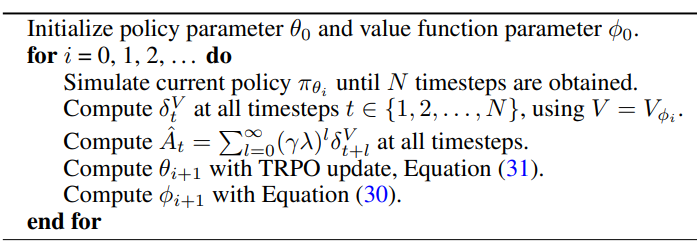

(수정중... 지속적으로 수정될 예정)

## Preliminaries

There are several different related expressions for the policy gradient, which have the form

$$g = \mathbb{E} \left[ \sum_{t=0}^{\infty} \Psi_t \nabla_{\theta} \log \pi_{\theta} (a_t \mid s_t) \right], \tag{1}$$

where $\Psi_t$ may be one of the following

1. $\sum_{t=0}^{\infty}r_t$ : total reward of the trajectory
2. $\sum_{t'=t}^{\infty}r_{t'}$ : reward following action $a_t$.
3. $\sum_{t'=t}^{\infty}r_{t'}-b(s_t)$ : baselined version of previous formula
4. $Q^{\pi}(s_t, a_t)$ : state-action value function
5. $A^{\pi}(s_t, a_t)$ : advantage function
6. $r_t + V^{\pi}(s_{t+1})-V^{\pi}(s_t)$ : TD residual

The latter formulas use the definitions

$$
\begin{align*}
& V^\pi(s_t) := \mathbb{E}_{s_{t+1}:\infty, a_{t:\infty}} \left[ \sum_{l=0}^{\infty} r_{t+l} \right] \quad \quad Q^{\pi}(s_t, a_t) := \mathbb{E}_{s_{t+1}:\infty, a_{t:\infty}} \left[ \sum_{l=0}^{\infty} r_{t+l} \right] \tag{2} \\
& A^{\pi}(s_t,a_t) := Q^{\pi}(s_t, a_t)-V_{\pi}(s_t), \quad \text{(Advantage function.)} \tag{3}
\end{align*}
$$

$\gamma$ parameter corresponds to the discount factor used in discounted formulatiosn of MDPs, but we treat it as a variance reduction parameter in an undiscounted problem; this technique was analyzed theoretically by Marbach & Tsitsiklis (2003); Kakade (2001b); Thomas (2014). The discounted value functions are given by:

$$
\begin{align*}
& V^{\pi, \gamma}(s_t) := \mathbb{E}_{s_{t+1}:\infty, a_{t:\infty}} \left[ \sum_{l=0}^{\infty} \gamma^{l} r_{t+l} \right] \quad \quad Q^{\pi, \gamma}(s_t, a_t) := \mathbb{E}_{s_{t+1}:\infty, a_{t:\infty}} \left[ \sum_{l=0}^{\infty} \gamma^l r_{t+l} \right] \tag{4} \\
& A^{\pi, \gamma}(s_t,a_t) := Q^{\pi, \gamma}(s_t, a_t)-V^{\pi, \gamma}(s_t) \tag{5}
\end{align*}
$$

The discounted approximation to the policy gradient is defined as follows:

$$
g^\gamma := \mathbb{E}_{s_{0:\infty}, a_{0:\infty}} \left[ \sum_{t=0}^{\infty} A^{\pi,\gamma}(s_t, a_t) \nabla_{\theta} \log \pi_\theta(a_t | s_t) \right]. \tag{6}
$$

---

**Definition 1.** *The Estimator $\hat{A}_{t}$ is $\gamma$-just if*

$$
\mathbb{E}_{s_{0:\infty}, a_{0:\infty}} \left[ \hat{A}_t (s_{0:\infty}, a_{0:\infty}) \nabla_{\theta} \log \pi_\theta(a_t \mid s_t) \right] = \mathbb{E}_{s_0:\infty, a_0:\infty} \left[ A^{\pi, \gamma}(s_t, a_t) \nabla_{\theta} \log \pi_\theta(a_t |\mid s_t) \right]. \tag{7}
$$

It follows immediately that if $\hat{A}_{t}$ is $\gamma$-just for all $t$, then

$$
\mathbb{E}_{s_{0:\infty}, a_{0:\infty}} \left[ \sum_{t=0}^{\infty} \hat{A}(s_{0:\infty}, a_{0:\infty}) \nabla_{\theta} \log \pi_\theta(a_t \mid s_t) \right] = g^{\gamma} \tag{8}
$$

One sufficient condition for $\hat{A}_t$ to be $γ$-just is that $\hat{A}_t$ decomposes as the difference between two functions $Q_t$ and $b_t$, where $Q_t$ can depend on any trajectory variables but gives an unbiased estimator of the $γ$-discounted Q-function, and $b_t$ is an arbitrary function of the states and actions sampled before $a_t$.

**Proposition 1.** *Suppose that $\hat{A}_t$ can be written in the form $\hat{A}_t(s_{0:\infty}, a_{0:\infty}) = Q_t(s_{t:\infty},a_{t:\infty})-b_t(s_{0:t}, a_{0:t-1})$ such that for all $(s_t, a_t)$, $\mathbb{E}_{s_{t+1:\infty},a_{t+1:\infty} \mid s_t, a_t} \left[ Q_t (s_{t:\infty}, a_{t:\infty}) \right] = Q^{\pi, \gamma}(s_t, a_t)$*

The proof is provided in Appendix B. It is easy to verify that the following expressions are $\gamma$-just advantage estimators for $\hat{A}_{t}$:

* $\sum_{l=0}^{\infty}\gamma^l r_{t+1}$
* $A^{\pi, \gamma}(s_t, a_t)$
* $Q^{\pi, \gamma}(s_t, a_t)$
* $r_t + \gamma V^{\pi, \gamma}(s_{t+1})-V^{\pi, \gamma}(s_t)$

## 3. Advantage Function Estimation

$$
\hat{g} = \frac{1}{N} \sum_{n=1}^{N} \sum_{t=0}^{\infty} \hat{A}^n_t \nabla_{\theta} \log \pi_{\theta}(a^n_t \mid s^n_t) \tag{9}
$$

* $n$ : indexces over a batch of episodes.

---

* $V$ : An approximate value function
* Define $\delta_{t}^{V}=r_{t} + \gamma V(s_{t+1}) - V(s_t)$
  * TD residual of $V$ with discount $\gamma$
  * $\delta_{t}^{V}$ can be considered as an estimate of the advantage of the action $a_t$.

In fact, if we have the correct value function $V=V^{\pi, \gamma}$, then it is a $\gamma$-just advantage estimator, and in fact, an unbiased estimator $A^{\pi, \gamma}$:

$$
\begin{align*}
\mathbb{E}_{s_{t+1}} \left[ \delta^{V{^{\pi,\gamma}}}_t \right] & = \mathbb{E}_{s_{t+1}} \left[ r_t + \gamma V^{\pi,\gamma}(s_{t+1}) - V^{\pi,\gamma}(s_t) \right] \\ & = \mathbb{E}_{s_{t+1}} \left[ Q^{\pi,\gamma}(s_t, a_t) - V^{\pi,\gamma}(s_t) \right] = A^{\pi,\gamma}(s_t, a_t). \tag{10}
\end{align*}
$$

However, this estimator is only $\gamma$-just for $V=V^{\pi, \gamma}$, otherwise it will yield biased policy gradient estimates.

$$
\begin{align*}
\hat{A}^{(1)}_t := \delta^{V}_t & = -V(s_t) + r_t + \gamma V(s_{t+1}) \tag{11} \\
\hat{A}^{(2)}_t := \delta^{V}_t + \gamma \delta^{V}_{t+1} & = -V(s_t) + r_t + \gamma r_{t+1} + \gamma^2 V(s_{t+2}) \tag{12} \\
\hat{A}^{(3)}_t := \delta^{V}_t + \gamma \delta^{V}_{t+1} + \gamma^2 \delta^{V}_{t+2} & = -V(s_t) + r_t + \gamma r_{t+1} + \gamma^2 r_{t+2} + \gamma^3 V(s_{t+3}) \tag{13}
\end{align*}
$$

$$
\hat{A}^{(k)}_t := \sum_{l=0}^{k-1} \gamma^l \delta^{V}_{t+l} = -V(s_t) + r_t + \gamma r_{t+1} + \dots + \gamma^{k-1} r_{t+k-1} + \gamma^k V(s_{t+k}) \tag{14}
$$

Analogously to the case of $\delta_{t}^{V}=\hat{A}_{t}^{(k)}$, we can consider $\hat{A}_{t}^{(k)}$ to be an estimator of the advantage function, which is only $\gamma$-just when $V=V^{\pi, \gamma}$. However, note that the bias generally becomes smaller as $k \rightarrow \infty$, since the term $\gamma^{k}V(s_{t+k})$ becomes more heavily discounted, and the term $-V(s_t)$ does not affect the bias. Taking $k \rightarrow \infty$, we get

$$
\begin{equation}
\hat{A}^{(\infty)}_t = \sum_{l=0}^{\infty} \gamma^l \delta^{V}_{t+l} = -V(s_t) + \sum_{l=0}^{\infty} \gamma^l r_{t+l}, \tag{15}
\end{equation}
$$

which is simply the empirical returns minus the value function baseline.

The generalized advatnage estimator $\text{GAE}(\gamma, \lambda)$ is defined as the exponentially-weighted average of these $k$-step estimators:

$$
\begin{align*}
\hat{A}^{\text{GAE}(\gamma,\lambda)}_t & := (1 - \lambda) \left( \hat{A}^{(1)}_t + \lambda \hat{A}^{(2)}_t + \lambda^2 \hat{A}^{(3)}_t + \ldots \right) \\
& = (1 - \lambda) \left( \delta^{V}_t + \lambda(\delta^{V}_t + \gamma \delta^{V}_{t+1}) + \lambda^2 (\delta^{V}_t + \gamma \delta^{V}_{t+1} + \gamma^2 \delta^{V}_{t+2}) + \ldots \right) \\
& = (1 - \lambda) \left( \delta^{V}_t (1 + \lambda + \lambda^2 + \ldots) + \gamma \delta^{V}_{t+1} (\lambda + \lambda^2 + \lambda^3 + \ldots) + \gamma^2 \delta^{V}_{t+2} (\lambda^2 + \lambda^3 + \lambda^4 + \ldots) + \ldots \right) \\
& = (1 - \lambda) \left( \delta^{V}_t \left( \frac{1}{1 - \lambda} \right) + \gamma \delta^{V}_{t+1} \left( \frac{\lambda}{1 - \lambda} \right) + \gamma^2 \delta^{V}_{t+2} \left( \frac{\lambda^2}{1 - \lambda} \right) + \ldots \right) \\
& = \sum_{l=0}^{\infty} (\gamma \lambda)^l \delta^{V}_{t+l}, \tag{16}
\end{align*}
$$

There are two notable special cases of this formula, obtained by setting $\lambda=0$ and $\lambda=1$.

$$
\begin{align}
\text{GAE}(\gamma, 0) : \quad \hat{A}_t &:= \delta_t &&= r_t + \gamma V(s_{t+1}) - V(s_t), \tag{17} \\
\text{GAE}(\gamma, 1) : \quad \hat{A}_t &:= \sum_{l=0}^{\infty} \gamma^l \delta_{t+l} &&= \sum_{l=0}^{\infty} \gamma^l r_{t+l} - V(s_t). \tag{18}
\end{align}
$$

* $\text{GAE}(\gamma, 0)$ : $\gamma$-just for $V=V^{\pi, \gamma}$ and otherwise induce bias, but it has typically has much lower variance.
* $\text{GAE}(\gamma, 1)$ : $\gamma$-just regardless of the accuracy of $V$
  * It has high variance due to the sum of terms.
* The generalized advantage estimator for $0 < \lambda < 1$ makes a compromise between bias and variance.

Using the generalized advantage estimator, we can construct a biased estimator of $g^{\gamma}$, the discounted policy gradient from Equation $(6)$

$$
g^\gamma := \mathbb{E}_{s_{0:\infty}, a_{0:\infty}} \left[ \sum_{t=0}^{\infty} A^{\pi,\gamma}(s_t, a_t) \nabla_{\theta} \log \pi_\theta(a_t | s_t) \right]. \tag{6}
$$

$$
g^{\gamma} \approx \mathbb{E} \left[ \sum_{t=0}^{\infty} \nabla_{\theta} \log \pi_{\theta} (a_t \mid s_t) \hat{A}_{t}^{\text{GAE}(\gamma, \lambda)} \right] = \mathbb{E} \left[ \sum_{t=0}^{\infty} \nabla_{\theta} \log \pi_{\theta} (a_t \mid s_t) (\gamma \lambda)^{l} \delta_{t+l}^{V} \right], \tag{19}
$$

## Interpretation As Reward Shaping

$$
\tilde{r}(s, a, s') = r(s, a, s') + \gamma \Phi(s') - \Phi(s), \tag{20}
$$

$$
\sum_{l=0}^{\infty} \gamma^l \tilde{r}(s_{t+l}, a_t, s_{t+l+1}) = \sum_{l=0}^{\infty} \gamma^l r(s_{t+l}, a_{t+l}, s_{t+l+1}) - \Phi(s_t). \tag{21}
$$

$$
\begin{align}
\tilde{Q}^{\pi,\gamma}(s, a) &= Q^{\pi,\gamma}(s, a) - \Phi(s), \tag{22} \\
\tilde{V}^{\pi,\gamma}(s, a) &= V^{\pi,\gamma}(s) - \Phi(s), \tag{23} \\
\tilde{A}^{\pi,\gamma}(s, a) &= (Q^{\pi,\gamma}(s, a) - \Phi(s)) - (V^{\pi,\gamma}(s) - \Phi(s)) = A^{\pi,\gamma}(s, a). \tag{24}
\end{align}
$$

Let's consider using a "steeper" discount $\gamma \lambda$, where $0 \leq \lambda \leq 1$. It's easy to see taht the shaped reward $\tilde{r}$ equals the Bellman residual term $\delta^{V}$, introduced in [Section 3](#3-advantage-function-estimation), where we set $\Phi=V$. Letting $\Phi=V$, we see that

$$
\sum_{l=0}^{\infty} (\gamma \lambda)^l \tilde{r}(s_{t+l}, a_t, s_{t+l+1}) = \sum_{l=0}^{\infty} (\gamma \lambda)^l \delta^{V}_{t+l} = \hat{A}^{\text{GAE}(\gamma,\lambda)}_t. \tag{25}
$$

As shown previously, $\lambda=1$ gives an unbiased esetimate of $g^{\gamma}$, whereas $\lambda < 1$ gives a biased estimate.

$$
\mathcal{X}(l; s_t, a_t) = \mathbb{E}[r_{t+l} \mid s_t, a_t] - \mathbb{E}[r_{t+l} \mid s_t]. \tag{26}

$$

Note that $A^{\pi, \gamma}(s,a)=\sum_{l=0}^{\infty}\gamma^{l} \mathcal{X}(l; s, a)$

The discounted policy gradient estimator from Equation (6) has a sum of terms of the form

$$
g^\gamma := \mathbb{E}_{s_{0:\infty}, a_{0:\infty}} \left[ \sum_{t=0}^{\infty} A^{\pi,\gamma}(s_t, a_t) \nabla_{\theta} \log \pi_\theta(a_t | s_t) \right]. \tag{6}
$$

$$
\nabla_\theta \log \pi_\theta(a_t \mid s_t) A^{\pi,\gamma}(s_t, a_t) = \nabla_\theta \log \pi_\theta(a_t \mid s_t) \sum_{l=0}^{\infty} \gamma^l \mathcal{X}(l; s_t, a_t). \tag{27}
$$

## 5. Value Function Estimation

$$
\underset{\phi}{\text{minimize}} \sum_{n=1}^{N} \| V_\phi(s_n) - \hat{V}_n \|^2, \tag{28}
$$

* $\hat{V}_t=\sum_{l=0}^{\infty}\gamma^{l}r_{t+1}$ discounted sum of rewards, and $n$ indexes over all timesteps in a batch of trajectories.
* Monte Carlo or TD(1) approach for estimating the value function.

$$
\begin{align*}
\underset{\phi}{\text{minimize}} \quad & \sum_{n=1}^{N} \| V_\phi(s_n) - \hat{V}_n \|^2 \\
\text{subject to} \quad & \frac{1}{N} \sum_{n=1}^{N} \frac{\| V_\phi(s_n) - V_{\phi_{\text{old}}}(s_n) \|^2}{2\sigma^2} \leq \epsilon. \tag{29}
\end{align*}
$$

* $\sigma^2 = \frac{1}{N}\sum_{n=1}^{N}\| V_{\phi_{\text{old}}}(s_n) - \hat{V}_n \|^2$
  * $\phi_{\text{old}}$ : parameter vector before optimization

* $g$ : gradient of the objective
* $H=\frac{1}{N} \sum_n j_n j_n^{T}$
  * where $j_n=\nabla_\phi V_\phi (s_n)$
  * $H$ is the "Gauss-Newton" approximation of the Hessian of the objective

### Policy Optimization Algorithm

$$
\begin{align*}
\underset{\theta}{\text{minimize}} \quad & L_{\theta_{\text{old}}}(\theta) \\
\text{subject to} \quad & \overline{D}_{\text{KL}}^{\theta_{\text{old}}}(\pi_{\theta_{\text{old}}}, \pi_\theta) \leq \epsilon \\
\text{where} \quad & L_{\theta_{\text{old}}}(\theta) = \frac{1}{N} \sum_{n=1}^{N} \frac{\pi_\theta(a_n | s_n)}{\pi_{\theta_{\text{old}}}(a_n | s_n)} \hat{A}_n, \\
& \overline{D}_{\text{KL}}^{\theta_{\text{old}}}(\pi_{\theta_{\text{old}}}, \pi_\theta) = \frac{1}{N} \sum_{n=1}^{N} D_{\text{KL}}(\pi_{\theta_{\text{old}}}( \cdot | s_n) \| \pi_\theta( \cdot | s_n)) \tag{31}
\end{align*}
$$

## Appendix

### Proofs

**Proof of Proposition 1** : FIrst we can split the expectation into terms involving $Q$ and $b$,

$$
\begin{align*}
\mathbb{E}_{s_{0:\infty},a_{0:\infty}} \left[ \nabla_{\theta} \log \pi_{\theta}(a_t \mid s_t) ( Q_t (s_{0:\infty}, a_{0:\infty}) - b_t(s_{0:t}, a_{0:t-1}) ) \right] \\
= \mathbb{E}_{s_{0:\infty},a_{0:\infty}} \left[ \nabla_{\theta} \log \pi_{\theta}(a_t \mid s_t) (Q_t (s_{0:\infty}, a_{0:\infty})) \right] \\
- \mathbb{E}_{s_{0:\infty},a_{0:\infty}} \left[ \nabla_{\theta} \log \pi_{\theta}(a_t \mid s_t) (b_t(s_{0:t}, a_{0:t-1})) \right] \tag{33}
\end{align*}
$$

We'll consider the terms with $Q$ and $b$ in turn.

$$
\begin{align*}
\mathbb{E}_{s_{0:\infty},a_{0:\infty}} & \left[ \nabla \log \pi_{\theta}(a_t \mid s_t) Q_t (s_{0:\infty}, a_{0:\infty}) \right] \\
& = \mathbb{E}_{s_{0:t},a_{0:t}} \left[ \mathbb{E}_{s_{t+1:\infty},a_{t+1:\infty}} \left[ \nabla \log \pi_{\theta}(a_t \mid s_t) Q_t (s_{0:\infty}, a_{0:\infty}) \right] \right] \\
& = \mathbb{E}_{s_{0:t},a_{0:t}} \left[ \nabla \log \pi_{\theta}(a_t \mid s_t) \mathbb{E}_{s_{t+1:\infty},a_{t+1:\infty}} \left[ Q_t (s_{0:\infty}, a_{0:\infty}) \right] \right] \\
& = \mathbb{E}_{s_{0:t},a_{0:t-1}} \left[ \nabla \log \pi_{\theta}(a_t \mid s_t) A^{\pi} (s_t, a_t) \right]
\end{align*}
$$

Next,

$$
\begin{align*}
\mathbb{E}_{s_{0:\infty},a_{0:\infty}} & \left[ \nabla_{\theta} \log \pi_{\theta}(a_t \mid s_t) b_t(s_{0:t}, a_{0:t-1}) \right] \\
& = \mathbb{E}_{s_{0:t},a_{0:t-1}} \left[ \mathbb{E}_{s_{t+1:\infty},a_{t:\infty}} \left[ \nabla_{\theta} \log \pi_{\theta}(a_t \mid s_t) b_t(s_{0:t}, a_{0:t-1}) \right] \right] \\
& = \mathbb{E}_{s_{0:t},a_{0:t-1}} \left[ \mathbb{E}_{s_{t+1:\infty},a_{t:\infty}} \left[ \nabla_{\theta} \log \pi_{\theta}(a_t \mid s_t) \right] b_t(s_{0:t}, a_{0:t-1}) \right] \\
& = \mathbb{E}_{s_{0:t},a_{0:t-1}} \left[ 0 \cdot b_t(s_{0:t}, a_{0:t-1}) \right] \\
& = 0.

\end{align*}
$$
