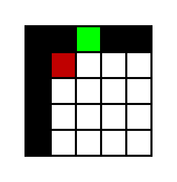

아래 설명중 나오는 게임들의 예시는 다음과 같다

* [snake-game](https://www.google.com/fbx?fbx=snake_arcade)
* [2048](https://play2048.co/)

## 왜 gymnasium API를 써야 할까?

내가 느낀 주요 장점은 다음과 같다.

* `render` 메소드를 잘 구현하면 화면 녹화가 쉽다
* 환경 병렬 처리가 매우 쉬워진다.
  * `numpy`의 난수 제너레이터를 통해 재현성이 쉬워진다.
* 이 뿐 아니라 다양한 Wrapper와 같이 활용이 가능하여 환경의 재구성이 편해진다.

## State와 Observation은 다르다

간단하게 말하면 state는 해당 환경의 현재 상태를 파악할 수 있는 완전한 정보이고, observation은 에이전트가 관찰해서 얻은 것이라고 생각하면 된다.

어떤 게임를 학습시키는 데 학습을 어떤 측면으로 할 것인가에 따라 observation을 어떻게 주느냐가 다르다.

예를 들어 Atari같은 경우 다음 그림을 보자

{: width="30%" height="30%" class="align-center"}

[Image source]([atari_breakout](https://towardsdatascience.com/tutorial-double-deep-q-learning-with-dueling-network-architectures-4c1b3fb7f756))

이 게임의 경우 observation을 두 가지 형태로 줄 수 있다.

1. 캡처된 한 프레임 정보 (이 경우 observation은 (height, width, channel) 형식이 될 것이다)
2. 캡처된 한 프레임 정보 + 공의 방향 + 공의 속도 + 공의 가속도

여기는 자기가 어떤 환경을 해결할 것인가에 따라 다르다. 해당 환경이 공의 추가 정보가 절대 주어지지 않는다면 1번으로 구현하여 FrameStack을 하는 것이 맞을 것이다. 이처럼 자신이 해결/검증/증명 하려는 방식에 따라 observation을 주면 된다. 모두 준 다음에 사람이 observation을 선택하게 해도 된다.

## 게임이 사용자를 종료시키는 특징을 생각하자

혼자하는 게임의 경우 여러 종류가 있는데 두 가지 종류가 있다.

1. 시간적 요소로 사용자의 실수를 유발하는 게임
2. 시간적 요소에 관계없이 사용자의 지능만 사용하는 게임

테트리스같은 경우 시간이 지날수록 블럭이 떨어지는 속도가 빨라져 사용자의 실수를 유발하는 게임이다. 하지만 퍼즐류 게임은 그렇지 않다. 인공지능 환경 특성상 한 스텝이 지나고 게임을 멈추고 학습을 하기 때문에 시간적으로 사용자의 실수를 유발하는 "피지컬" 류 게임은 강화학습을 넘어 엔지니어링적인 (추론 속도를 높이거나 latency를 줄이기) 요소가 더 클 수 있으니 이럴 때는 학습 모델의 크기를 잘 고려해야 한다.

## 게임의 한 step이 무엇일지를 생각하자

보통은 한 프레임으로 정의된다. 턴제 기반의 게임의 경우는 한 턴이 한 step이 된다. 그런데 제한 시간 안에 어떤 행동을 해야 하는 턴제 기반의 경우 제한 시간을 환경에서 구현하기 보다는 모델측에서 최적화 하도록 하는 것이 좋다. (강화학습 환경에서 '시간'은 대게 의미가 없다.)

## 게임의 Observation Space와 Action Space를 생각하자

본인의 형식이 Space에 없을 수도 있는데, 이럴 때는 어쩔수 없다.

### shape

Observation Space의 경우 학습이 편하도록 observation을 리턴할 수도 있지만 보통은 게임 형식을 그대로 따르는 것이 좋다.

* ex) 2d `(n, n)` 격자 게임인데 학습이 편하도록 `(1, n, n)`으로 리턴

### dtype

환경에 맞는 데이터 타입을 미리 생각하고 그에 맞춰 환경을 구현해야 한다. 크기는 용량이 클 수록 줄이도록 고민하는 것이 좋다. 환경이 n개 병렬처리 될 때마다 용량이 n배로 늘어나기 때문에 사용자를 위해 최대한 줄이는 것이 좋다.

또한 예를 들어 본인 환경에는 음수가 절대 나올 수 없을 경우 dtype을 `unsigned`로 지정하는 것이 좋다. 근데 주의할 것은 이럴 경우 내부적으로 처리할 때 알고리즘 구현시 음수를 사용하지 못할 수 있으니 주의해야 한다.

{: width="45%" height="45%" class="align-center"}

위같은 (15, 15) 크기의 이미지를 리턴한다고 하자, 각 요소들은 0아니면 1의 값을 갖기 때문에 dtype을 `np.uint8`로 했다고 하자. 그렇다면 저 배열을 내부적으로 처리할 때는 버그가 일어나기 때문에 음수가 되면 안된다. 이 때문에 내부적인 알고리즘도 잘 고려되어 처리되어야 한다.

### high, low

```python
gymnasium.spaces.Box(low, high, shape=None, dtype=np.float32, seed=None)
```

`spaces.Box`에서 사용되는 인수이다. 내부 알고리즘 구현과도 관계되는 내용인데, 꼭 사람이 보는 화면과 observation이 같을 필요가 없다. 예를 들어 2048게임을 보자

{: width="60%" height="60%" class="align-center"}

위같은 경우 다양한 숫자들이 있는데 2의 제곱수들이다. 이 경우 2048까지 가능할 경우 `high`의 값을 2048로 할 수 있지만 모든 수는 2의 n제곱이기 때문에 11로 할 수도 있다. 이럴 경우 블록이 합쳐졌을 때 합쳐진 블록이 해당 두수의 합으로 하거나, 아니면 합쳐진 블록의 숫자 + 1로 처리될 수 있는데 어차피 구현은 둘다 크게 어렵지 않으니 observation으로 나타내기 편한 것으로 하는 것이 좋다. 여기서 숫자는 그저 "서로 다른 것"을 나타내기 위한 숫자이기 때문에 정규화시에 작은 숫자가 크게 작아지지 않아져 편하다 (2/2048 또는 1 / 11)

## Illegal action 처리에 대해 고민하자

Invalid action 이라고 쓰는 곳도 있지만 보통 illegal action이라는 말을 쓴다.

Illegal Action이란? 모델 내부적으로 action space에 속하지만 모델적으로 가능하지 않은 경우로 다음과 같은 예시가 있다.

* 바둑에서 이미 착수된 곳에 돌을 두는 행위
* 체스에서 자기 말이 있는 곳으로 이동하려는 행위

이와 비슷하게 의미없는 행동들이 있다.

* 2048 게임에서 아무 블록도 움직이지 않는 방향으로 키를 입력하는 행위
* Snake-game에서 가는 방향의 반대방향의 키를 입력하는 행위
* [Breakout](https://gymnasium.farama.org/environments/atari/breakout/)에서 하단바가 맨 오른쪽에 있는데 오른쪽으로 움직이는 행위

이런 행위들에 바로 `assert`를 통해 환경을 종료하거나, 그냥 무시 (No action)하는 방법이 있는데 개인적으로는

"Action에 관계없이 게임이 흘러가는가"를 기준으로 본다

바둑, 체스 2048의 경우는 해당 행동을 제외하고 다른 행동을 하지않으면 게임이 흘러가지 않는다. 하지만 snake-game 같은 경우는 가만히 있으면 snake가 다른 곳에 박아서 게임이 끝나고, breakout의 경우는 내 행동에 관계 없이 공이 이리저리 움직이기 때문에 게임이 진행될 것이다.

이와 같이 action에 관계없이 게임이 흘러갈 경우 해당 action을 "아무것도 안함"으로 처리하고 그렇지 않을 경우 게임을 끝내버리는 것이 좋다.

게임을 끝내버리는 것에는 여러 방법이 있는데

* Illegal action인지를 판단해 Wrapper를 이용해 `termination = True`를 이용해 게임을 끝내는 방법
* 게임 내부적으로 `assert`를 하는 방법

개인적으로 여기서는 multi-agent의 경우 `assert`를 하고 single-agent의 경우 아무 행동도 하지 않은 것으로 처리후 Wrapper를 이용해 처리한다. 왜냐하면 multi-agent는 구현상 진행이 안되지만(아무 행동도 하지 않고 상대 턴으로 넘길 수가 없기 때문에) single-agent의 경우는 진행 자체는 되기 때문이다.

## Action Masking을 구현하는 것이 좋다

여러 측면에서 Action Masking을 구현하는 것이 좋다.

Action Masking은 여러 방법이 있지만 보통은 Action Space에서 legal action은 1로, illegal action은 0으로 하여 리턴한다.

예를 들어 4개의 행동 중 하나를 선택하는데 0, 1 번째 행동이 legal, 2, 3번째 행동이 illegal action이라면 `np.arrray([1, 1, 0, 0])` 을 리턴한다. 나의 경우는 `info` 에 넣는다.

이렇게 구현된 action masking 은 아래와 같이 `sample` method와 같이 활용될 수 있다.

```python
gymnasium.spaces.space.Space.sample(self, mask: Any | None = None) → T_cov
```

* `mask` – A mask used for sampling, expected dtype=np.int8 and see sample implementation for expected shape.

## 보상은 어떻게 주어질 지를 생각하자

보통은 승리시 1, 패배시 -1로 하는 것이 일반적이다. 게임을 더 빨리 끝내고 싶은 경우 한 step마다 약간의 음의 보상을 줄 때가 있는데 이때 두 방식이 충돌하게 된다.

1. 최대한 빨리 보상을 먹고 게임을 클리어 해야지
2. 음의 보상이 누적될 바엔 빨리 죽어버리자

개인적인 해결책으로는 보상이 희귀하지 않게 하거나 최대한 많은 게임을 돌리는 것이었다.

또한 다른 측면으로는 보상은 노력에 비례하는 것이 좋다 (개인적인 경험). 환경 구현 측면이라기 보다 강화학습 측면에서 설명될 수 있지만, 예를 들어 2048게임에서 `2` 블록 두개를 합쳐서 `4`의 블록을 만드는 데 2의 보상을 주고 `128` 블록을 두개 합쳐서 `256`의 블록을 만드는 데 8의 보상을 더 준다고 해보자

그렇다면 에이전트는 `256`의 블록을 만드는 데 `2`의 블록이 128개 필요한데도 불구하고 보상은 4배 차이밖에 안들기 때문에 고생해서 128 두개를 합칠바에 2블록 두개를 합치자고 생각할 것이다. 그렇기에 "어떤 보상을 얻기 위해 드는 노력에 비례해 보상을 설계하는 것이 좋다"

## 내 환경이 MDP를 만족하는지 생각하자

예를 들어 다음과 같은 [snake-game](https://www.google.com/fbx?fbx=snake_arcade)을 설계한다고 해보자

{: width="50%" height="50%" class="align-center"}

사람이 플레이하는 측면에서 해당 게임을 클리어하는 에이전트를 만들기 위한 강화학습 환경을 만들기 위해 사과는 1, 뱀은 2, 나머지는 0으로 observation을 설계한다고 하자. 그렇다면 이것은 좋은 환경일까?

그렇지 않다.

다음 그림을 보자 내 학습 모델은 해당 그림을 다음과 같이 인식할 것이다.

{: class="align-center"}

하얀색이 뱀(2), 초록색이 사과(1), 나머지 공간은 검은색(0)이다. 위의 경우 가만히 있을 때 뱀은 어디로 가는지 알 수 없다. 위로 가는 것일까? 왼쪽으로 가는 것일까? 몸통은 어떻게 꼬여 있을까?

이럴 경우 어느 이상으로 환경이 복잡해지면 학습이 더이상 되지 않을 것이다. 이럴 경우 문제를 알아차리기 정말 힘든데 내가 해당 observation만 봤을때 게임을 클리어할 수 있을지를 제대로 판단해야 한다.

위와 같은 경우는 몸통부터 머리까지 각각 다른 번호를 부여하여 문제를 해결할 수 있다.

{: width="50%" height="50%" class="align-center"}

만족하지 않을 경우 Wrapper를 고려해볼 수 있다.

## 난수를 얻을 때는 `self.np_random`을 사용하자

[`np_random`](https://gymnasium.farama.org/api/env/#env) - The random number generator for the environment. This is automatically assigned during `super().reset(seed=seed)` and when assessing `self.np_random`.

난수가 global state가 아닌 각 환경별로 지정된 인스턴스에 의해 생성되도록 하는 제너레이터이다. 환경의 reproducible sampling과 thread-safe(추측)을 위한 방법이다.

## deepcopy, copy를 잘 판단하자

내부 엔진을 다루다 보면 데이터들이 왔다갔다 하게 되는데 이 경우 deepcopy(`.clone()`)를 해야 할지 shallow copy가 더 효율적일지를 판단해야 한다.

예를 들어 테트리스의 블록들을 보관하고 있다고 하자. 그리고 그것을 화면에 나타내기 위해 복사하고 나중에 블록이 지워질 수 있다. 이 경우 shallow copy로 보드에 덮을 경우, 랜덤으로 제공하는 블록 정보가 손상될 수 있다.

## observation에 관계없지만 디버깅에 도움될 정보는 info에 넣는게 좋다

`action_mask`는 주로 `info`에 들어간다.

예를 들어 [Taxi](https://gymnasium.farama.org/environments/toy_text/taxi/) 환경은 `action_mask`를 `info`에 제공한다. 출력하면 다음과 같다.

```python
{'prob': 1.0, 'action_mask': array([1, 1, 1, 0, 0, 0], dtype=int8)}
```

`p`는 transition proability for the state. 를 의미한다고 한다.

이 외에도 reward와 목표가 간접적으로 연관되어 있을때 활용할 수 있다. 예를 들어 snakegame에서 목표는 뱀을 최대한 길게 만드는 것일경우 아이템을 먹는 것은 1점을 주지만 이동마다 음의 보상을 줄 경우 정확한 최종길이를 파악하기 힘들 수 있다. 이럴 경우 뱀의 길이를 `info`에 담아 줄 수 있다.  

```python
    def _get_info(self):
        return {"snake_length": len(self.snake), "prev_action": self.prev_action}
```

## Wrapper를 적극 활용하자

[`class gymnasium.Env`](https://gymnasium.farama.org/api/env/#gymnasium.Env) 문서의 맨 마지막에 보면 아래와 같이 적혀있다.

> For modifying or extending environments use the `gymnasium.Wrapper` class

환경에서 가능한 것들과 Wrapper에서 할만한 것들이 약간 다르다. 물론 딱 잘라서 역할을 구분하기는 힘들다. 개인적인 생각은 다음과 같다.

* 환경 : 내부적인 구현에 충실
* Wrapper : 학습시 편의성을 위한 구현

일단 가장 중요한 것은 "이미 구현되어 있는 `Wrapper`들이 많으니 참고하여 없을 경우에 구현하자" 이다.

그 환경에 특화된 `Wrapper`를 구현하는 것이 좋다.

예를 들어 Snakegame에서 아무런 아이템을 먹으면 1, 게임이 끝나면 -1의 보상 그리고 이 외의 행동은 0의 보상을 준다고 하자. 그런데 게임이 더 빨리 끝나게 하기 위해 0이 아니라 -0.0001의 보상을 주고 싶다고 한다면 다음과 같은 `Wrapper`를 구현할 수 있다.

```python
class RewardConverter(gym.RewardWrapper):
    def __init__(self, env, moving_reward = 0):
        super().__init__(env)
        self.moving_reward = moving_reward

    def reward(self, reward):
        if reward == 0:
            return self.moving_reward
        else:
            return reward
```

위의 예시에는 `gym.RewardWrapper`만 썼지만 `gym.ObservationWrapper`도 활용할 수 있다. wrapping을 원하는 곳에 해당하는 wrapper를 골라쓰는 것이 좋다.

아래는 `gymnasium`에서 제공하는 기본 `Wrapper`의 예시이다.

```python
import gymnasium as gym
from gymnasium import spaces


class FlattenObservation(gym.ObservationWrapper, gym.utils.RecordConstructorArgs):

    def __init__(self, env: gym.Env):
        gym.utils.RecordConstructorArgs.__init__(self)
        gym.ObservationWrapper.__init__(self, env)

        self.observation_space = spaces.flatten_space(env.observation_space)

    def observation(self, observation):
        return spaces.flatten(self.env.observation_space, observation)
```