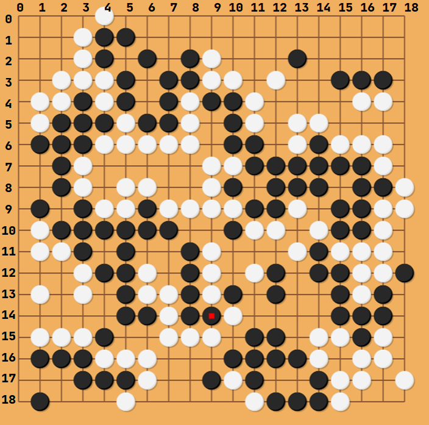
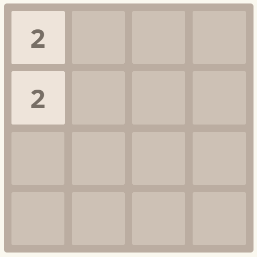
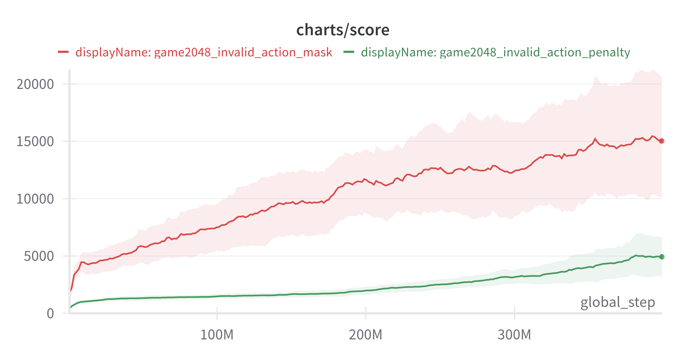
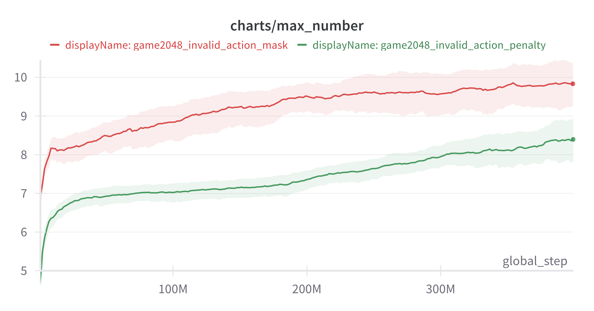
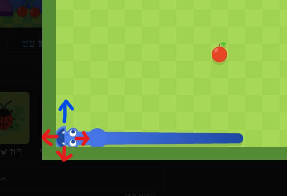
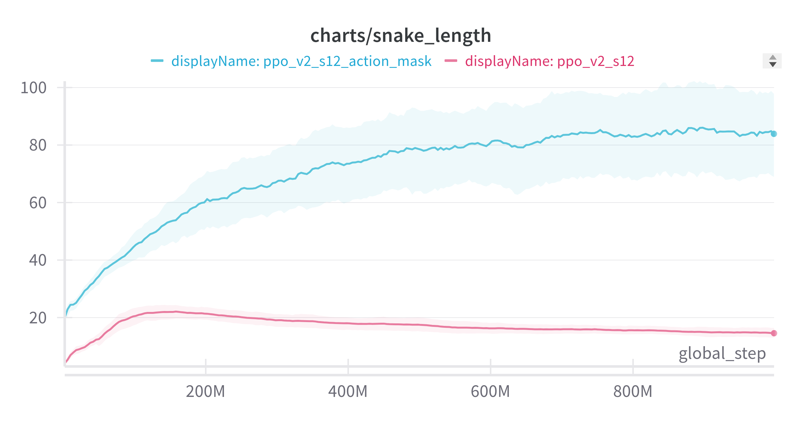
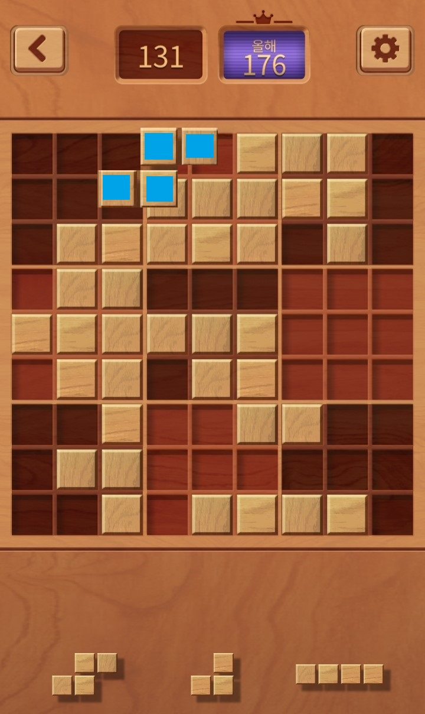
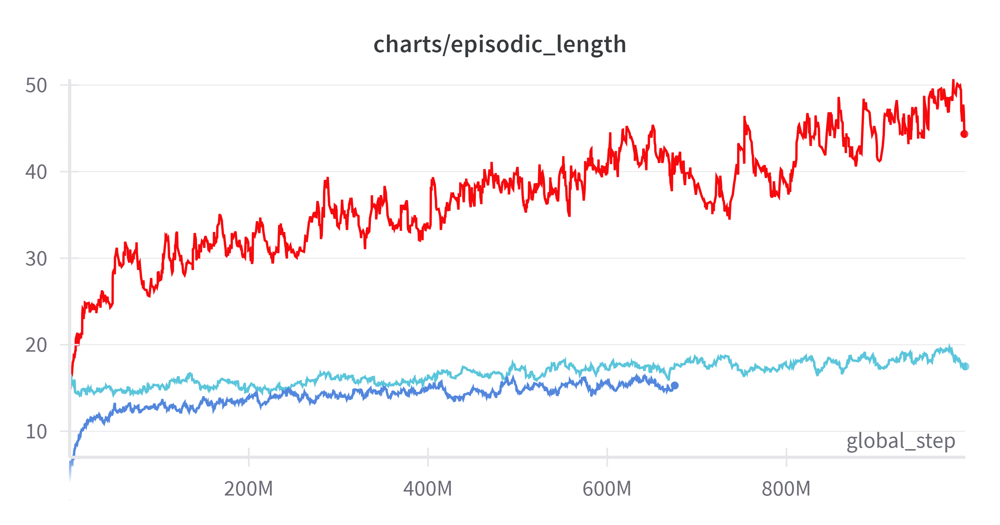

아래 두 자료를 바탕으로 작성된 자료이다.

## 이산 행동공간 환경에서 Action Masking 적용기

* [A Closer Look at Invalid Action Masking in Policy Gradient Algorithms](https://arxiv.org/abs/2006.14171)
* [vwxyzjn/invalid-action-masking](https://github.com/vwxyzjn/invalid-action-masking)

행동공간이 연속적이지 않고 이산적인 환경에서 유효하지 않은 행동이 있을 때가 있다. invalid action혹은 illegal action이라고 불린다. 이 블로그 전에는 illegal action이라고 서술된 부분도 있지만 논문이 invalid action이라고 적혀 있어 invalid action이라고 칭한다.

그럼 invalid action이란 무엇일까? 말 그대로 유효하지 않은 행동이라는 뜻인데 예를 들면 이해가 쉬울 것이다.

바둑을 예로 들어보자 

{: width="50%" height="50%" class="align-center"}

위같은 상황에서 백돌은 빨간점이 찍힌 15행 9열 자리에 돌을 두지 못한다. 행동 공간은 19 × 19 이지만 실제로 어떤 행동을 하려고 할때 어떤 상태에서 유효한 행동은 19 × 19가 아니라는 것이다.

이를 대처하는 방법에는 여러 가지가 있는데

1. invalid action이 수행된 경우 해당 행동을 무시하고 다음 step으로 넘기기
2. invalid action이 수행된 경우 바로 패배 처리하고 특정 보상을 주기 (보통 r <= 0)
3. 사전에 상태에 대해 연산하여 해당 행동을 명시적으로 masking 하기

등등의 방법이 있다. 위 논문에서는 action masking에 대해 행동확률 분포를 계산하기 위한 state-dependent differentiable function으로 볼 수 있기 때문에 3번 방법에 문제가 없다고 하며 실험결과를 보여준다.

위같은 방법이 적용된 사례를 보면

[Toad Brigade’s Approach - Deep Reinforcement Learning](https://www.kaggle.com/competitions/lux-ai-2021/discussion/294993)

Kaggle의 Lux AI라는 곳에서 열린 Competition의 1등의 솔루션인데 내용을 보면 다음과 같은 문구를 볼 수 있다.

The full action space was available to the agent with one exception: transfers. In order to discretize the action space, I decided to only allow a unit to transfer all of a given resource at once. This meant that workers had 19 available actions (no-op, 4 moves, 4 transfers for each of 3 resources, build city, pillage), carts had 17 (same as workers minus build city and pillage), and city tiles had 4 (no-op, research, build worker, build cart). **Additionally, the agent was only allowed to take viable actions, with illegal actions masked by setting the logits to negative infinity.** This did not reduce the available action space – the agent could always elect to take the no-op action – but did reduce the complexity of the learning task.

간단히 말하면 다양한 행동 공간이 있는데 illegal action에 대해 logits를 음의 무한대로 설정하여 실제고 유효한(가능한) 행동만 하게 했다는 것이다.

해당 저자는 IMPALA라는 알고리즘을 사용했는데 Policy based 알고리즘이기 때문에 논문 내용을 적용하는데 문제가 없다.

이 포스트는 해당 논문을 리뷰하기 보다는 내 실험에 적용하고 그 결과를 보여주려고 한다.

[cleanrl-PPO](https://github.com/vwxyzjn/cleanrl) 구현체에 [vwxyzjn/invalid-action-masking](https://github.com/vwxyzjn/invalid-action-masking) 내용을 적용하였다.

핵심 부분은 다음과 같다.

```python
class CategoricalMasked(Categorical):
    def __init__(self, probs=None, logits=None, validate_args=None, masks=[]):
        self.masks = masks
        if len(self.masks) == 0:
            super(CategoricalMasked, self).__init__(probs, logits, validate_args)
        else:
            self.masks = masks.type(torch.BoolTensor).to(device)
            logits = torch.where(self.masks, logits, torch.tensor(-1e+8).to(device))
            super(CategoricalMasked, self).__init__(probs, logits, validate_args)
    
    def entropy(self):
        if len(self.masks) == 0:
            return super(CategoricalMasked, self).entropy()
        p_log_p = self.logits * self.probs
        p_log_p = torch.where(self.masks, p_log_p, torch.tensor(0.).to(device))
        return -p_log_p.sum(-1)
```

원래 사용되던 Categorical을 상속해서 `def __init__` 부분의 `else:` 부분을 보면 유효하지 않은 행동의 logit을 `-1e+8` 로 설정해서 해당 행동이 선택되지 못하도록 하는 것이다.

```python
class Agent(nn.Module):
    def __init__(self, frames=4):
        super(Agent, self).__init__()
        self.network = nn.Sequential(
            layer_init(nn.Conv2d(27, 16, kernel_size=3, stride=2)),
            nn.ReLU(),
            layer_init(nn.Conv2d(16, 32, kernel_size=2)),
            nn.ReLU(),
            nn.Flatten(),
            layer_init(nn.Linear(32*3*3, 128)),
            nn.ReLU(),)
        self.actor = layer_init(nn.Linear(128, envs.action_space.nvec.sum()), std=0.01)
        self.critic = layer_init(nn.Linear(128, 1), std=1)

    def forward(self, x):
        return self.network(x)

    def get_action(self, x, action=None, invalid_action_masks=None):
        logits = self.actor(self.forward(x))
        split_logits = torch.split(logits, envs.action_space.nvec.tolist(), dim=1)
        
        if invalid_action_masks is not None:
            split_invalid_action_masks = torch.split(invalid_action_masks, envs.action_space.nvec.tolist(), dim=1)
            multi_categoricals = [CategoricalMasked(logits=logits, masks=iam) for (logits, iam) in zip(split_logits, split_invalid_action_masks)]
        else:
            multi_categoricals = [Categorical(logits=logits) for logits in split_logits]
        
        if action is None:
            action = torch.stack([categorical.sample() for categorical in multi_categoricals])
        logprob = torch.stack([categorical.log_prob(a) for a, categorical in zip(action, multi_categoricals)])
        entropy = torch.stack([categorical.entropy() for categorical in multi_categoricals])
        return action, logprob.sum(0), entropy.sum(0)
...
```

그리고 행동을 선택할때 action_mask를 `CategoricalMasked`에 인자로 주고 샘플링할 때 해당 행동을 배제하도록 되는 것이다. 위 원본 코드가 multi_categorical이 있는 것은 여러 객체가 각각의 행동을 선택해야 해서 그런 것이다.

행동이 하나일 경우 코드가 간단해지는데 위 action_masking을 다양한 형태로 아래 세 환경에 적용해보았다.

* [**gym-game2048**](https://github.com/helpingstar/gym-game2048)
* [**gym-woodoku**](https://github.com/helpingstar/gym-woodoku)
* [**gym-snakegame**](https://github.com/helpingstar/gym-snakegame)

각각 가능한 행동이 4, 293, 4개인데 다른 형태로 적용하였는데 아래에서 자세히 서술하고 주요 코드는 다음과 같다.

원본 코드/논문과 달리 행동의 형태가 간단하기 때문에 쉽게 적용할 수 있었다.

```python
class CategoricalMasked(Categorical):
    def __init__(self, probs=None, logits=None, validate_args=None, masks=[]):
        self.masks = masks
        if len(self.masks) == 0:
            super(CategoricalMasked, self).__init__(probs, logits, validate_args)
        else:
            self.masks = masks.type(torch.BoolTensor).to(device)
            logits = torch.where(self.masks, logits, torch.tensor(-1e8).to(device))
            super(CategoricalMasked, self).__init__(probs, logits, validate_args)

    def entropy(self):
        if len(self.masks) == 0:
            return super(CategoricalMasked, self).entropy()
        p_log_p = self.logits * self.probs
        p_log_p = torch.where(self.masks, p_log_p, torch.tensor(0.0).to(device))
        return -p_log_p.sum(-1)
```

같은 방식으로 logits를 음의 무한대로 적용하는 코드를 작성하였다. action_mask를 무조건 하는 파일이기에 조건을 제거하였다.

```python
    def get_action_and_value(self, x, action=None):
        hidden = self.network(x)
        logits = self.actor(hidden)
        probs = Categorical(logits=logits)
        if action is None:
            action = probs.sample()
        return action, probs.log_prob(action), probs.entropy(), self.critic(hidden)
```

이전의 위와 같았던 코드를

```python
    def get_action_and_value(self, x, action=None, invalid_action_mask=None):
        hidden = self.network(x)
        logits = self.actor(hidden)
        # probs = Categorical(logits=logits)
        probs = CategoricalMasked(logits=logits, masks=invalid_action_mask)
        if action is None:
            action = probs.sample()
        return action, probs.log_prob(action), probs.entropy(), self.critic(hidden)
```

아래와 같이 행동을 선택하는 곳에서 `invalid_action_mask`를 인자로 받고 `CategoricalMasked`에 같이 넣어 masking된 행동의 확률을 기반으로 행동을 선택하게 하였다.

```python
invalid_action_masks = torch.zeros((args.num_steps, args.num_envs) + (envs.single_action_space.n,)).to(device)
...
invalid_action_masks[step] = torch.Tensor(infos["action_mask"]).to(device)
...
b_invalid_action_masks = invalid_action_masks.reshape((-1, envs.single_action_space.n))
```

그리고 위와 같이 masking도 함께 저장하여 학습을 위해 shuffle되도 masking이 유지될 수 있도록 하였다.

이제 실험 결과를 보자.

## gym-game2048

[**gym-game2048**](https://github.com/helpingstar/gym-game2048)

위 환경을 실험한 것이다. 자세한 실험 코드는 아래에서 확인할 수 있다.

[rl-application-gym-game2048](https://github.com/helpingstar/rl-application-gym-game2048)

{: width="50%" height="50%" class="align-center"}

위와같은 상태에서는 왼쪽으로 블록을 움직이는 행동이 의미가 없다. 이런 행동들을 masking 하여 invalid action penalty(유효하지 않은 행동시 음의 보상을 주고 환경 종료)로 학습한 것과 비교하였다.

{: width="80%" height="80%" class="align-center"}
<p style="text-align: center; font-style: italic;"> (Exponential Moving Average: 0.9, 3 seed) </p>

{: width="80%" height="80%" class="align-center"}
<p style="text-align: center; font-style: italic;"> (Exponential Moving Average: 0.9, 3 seed) </p>

action_masking이 훨씬 좋은 결과를 보여준 것을 확인할 수 있다.

## gym-snakegame

[gym-snakegame](https://github.com/helpingstar/gym-snakegame)

위 환경을 실험한 것으로 자세한 실험 코드는 아래에서 확인할 수 있다.

[rl-application-gym-snakegame](https://github.com/helpingstar/rl-application-gym-snakegame)

이 경우는 약간 다르다. 2048은 유효하지 않은 행동을 masking 했는데 이 경우는 invalid action이 있긴 하다. 왼쪽으로 가는 상황에서 오른쪽키를 누르는 상황, 근데 이런 상황보다는 게임이 종료되는 경우를 의도적으로 masking하면 어떨까? 라는 생각이 들었다.

{: width="80%" height="80%" class="align-center"}

위와 같은 상황에서 몸통이나 벽이 있는 빨간 화살표 방향을 의도적으로 masking하고 파란색 경로만 남기는 것이다. 에이전트가 불가피한 상황이 아니면 죽지 않도록 하고 그 안에서 행동을 선택하게 하기로 한 것이다.

{: width="80%" height="80%" class="align-center"}
<p style="text-align: center; font-style: italic;"> (Exponential Moving Average: 0.9, 3 seed) </p>

action_mask한 결과가 압도적으로 좋았다.

애매한 점은 빨간색 결과 (일반적으로 플레이) 는 보상 디자인에 따라 action_mask과 비슷한 성능을 낼 때도 있다. 하지만 이 과정은 어렵다.

모든 상황에서 action_masking이 무조건 좋다고 할 수는 없지만 위와 같이 보상 디자인에 구애받지 않고 더 편한 학습이 가능하게 해줬다. 라는 결론을 내렸다.

## gym-woodoku

[gym-woodoku](https://github.com/helpingstar/gym-woodoku)

위 환경을 실험한 것으로 자세한 실험 코드는 아래에서 확인할 수 있다.

[rl-application-gym-woodoku](https://github.com/helpingstar/rl-application-gym-woodoku)

{: width="40%" height="40%" class="align-center"}

위 게임은 3개의 블록을 9 × 9 공간 중의 한 곳에 배치하기에 3 × 9 × 9 = 243개의 행동이 선택 가능하다. 하지만 위 첫번째 블록이 파란색 처럼 배치되는 것 같은 것은 불가능하다. 이전에는 행동을 무시하거나, invalid action penalty를 통해 penalty를 주고 바로 게임을 종료시켰는데 이번에 action_masking을 적용해보았다.

{: width="80%" height="80%" class="align-center"}
<p style="text-align: center; font-style: italic;"> (Exponential Moving Average: 0.9) </p>

실험 형태가 바뀌어 제일 공정하게 비교할 수 있는 에피소드 길이를 가져왔다.

빨간색이 invalid_action_masking이고 아래 파란색이 invalid_action_penalty이다. 위 하늘색이 아래 파란색 가중치를 이어받아 학습한 것이다.

invalid_aciton_penalty가 global step이 1.7배정도 많은데도 불구하고 성능이 완전히 떨어지는 것을 볼 수 있다.

## 결론

masking에 대해 알고는 있었으나 직접 임의로 적용하기에는 수학적 엄밀함이 부족하여 안되지 않을까 하는 생각이었는데 혹시나 하고 찾아봤는데 정확히 내가 원하는 논문이 있었고, 그동안 찾지 않은 것에 대해 많은 후회를 했다. 코드만큼 지식도 중요하다는 생각을 많이 했다.

action masking을 적용해보면서 여러 생각을 했다.

* 이래도 되는 걸까?
* 강화학습의 취지에 어긋나지 않나?
* 알고리즘에 모델을 아는 내가 직접 개입해서 모델에 대한 정보를 알려주는 것이 의미가 있을까?

하지만 학계에 있는 것이 아니고 어떤 문제를 "어떻게든" 해결 해야 할 때, 그리고 어떤 action이 최적의 정책을 찾아가는 데 있어서 필요가 없는 것이 너무나도 자명하다면 masking을 하지 않을 이유가 없다는 생각이다. 물론 내 경우는 간단한 게임이었고 복잡한 경우에는 이런 masking이 불가능할 수도 있다.

목적에 따라 다를 수 있지만 내 경우 최적의 에이전트를 만들어 그 에이전트를 통해 내가 배우는 것이 목적이었다. 이럴 경우는 적용하는 것이 좋다는 생각이다.

에이전트 어떤 행동이 문제라는 것을 알기 위해 여러번 실패하고 일반화하여 어떤 행동이 하면 안된다는 것을 알게 되는데 너무 많은 실패를 거듭해야 한다. 이런 페널티들이 모험을 억제하는 경향도 있는 것 같았는데 관련 내용이 논문에 나온다.

> The purpose of avoiding executing invalid actions arguably is to boost exploration efficiency.

> setting r_invalid = -1 seems to have an adverse effect of discouraging exploration
by the agent, therefore achieving consistently the worst performance across maps.

step을 아껴서 exploration도 하고 sample efficiency를 높여주는 좋은 방법이 생겼다는 생각이다.

**하지만 가장 중요한 것은 환경을 제대로 이해하는 것이다. 행동을 masking을 할 때는 환경과, 알고리즘, 정책에 대한 제대로 된 이해를 바탕으로 해야 한다.**