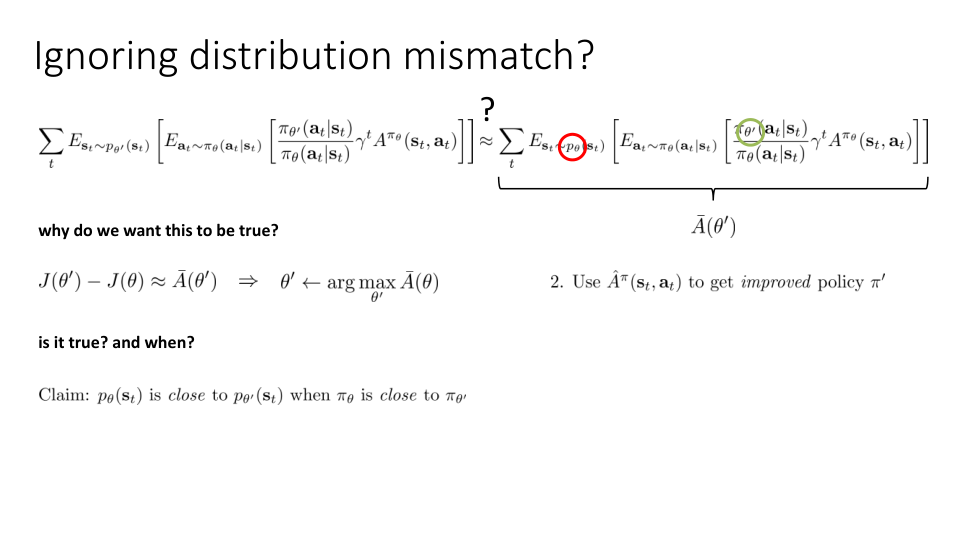

## Recap: policy gradients

## Why does policy gradient work?

* Value based method : 현재 정책에서 advantage가 가장 높은 action에 1의 확률을 부여하는 다음 정책을 선택한다.
* Policy based method : argmax로 바로 선택하지 않고 advantage가 높아지는 방향으로 약간 개선한다.
  * 즉 Advantage가 높은 행동에 더 높은 확률을 할당하고 더 낮은 행동에는 더 낮은 확률을 할당한다.

## Policy gradient as policy iteration

* $J(\theta)$ : objective for some old paramter $\theta$
* $J(\theta ')$ : objective for some new paramter $\theta '$
* $J(\theta ') - J(\theta)$ : old policy $\theta$ 에서 new policy $\theta '$으로 바꿨을 때의 RL objective의 개선 정도를 의미한다.
* $E_{\mathbf{s}_0 \sim p(\mathbf{s}_0)}$를 초기 상태에 대한 marginal이 $p(\mathbf{s}_0)$인 분포로 변경할 수 있기 때문에 이를 $E_{\tau \sim p_{\theta'}(\tau)}$로 바꾼다.

## Policy gradient as policy iteration

$E_{\mathbf{a}_t \sim \pi_{\theta '} (\mathbf{a}_t \vert \mathbf{s}_t)}$는 importnace sampling 을 통해 $\pi_{\theta '}$를 $\pi_{\theta}$로 바꿀 수 있지만 $E_{\mathbf{s}_t \sim p_{\theta '}(\mathbf{s}_t)}$ 는 바꿀 수가 없다.

