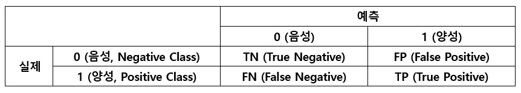
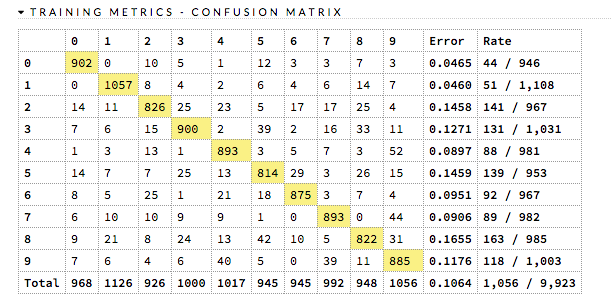
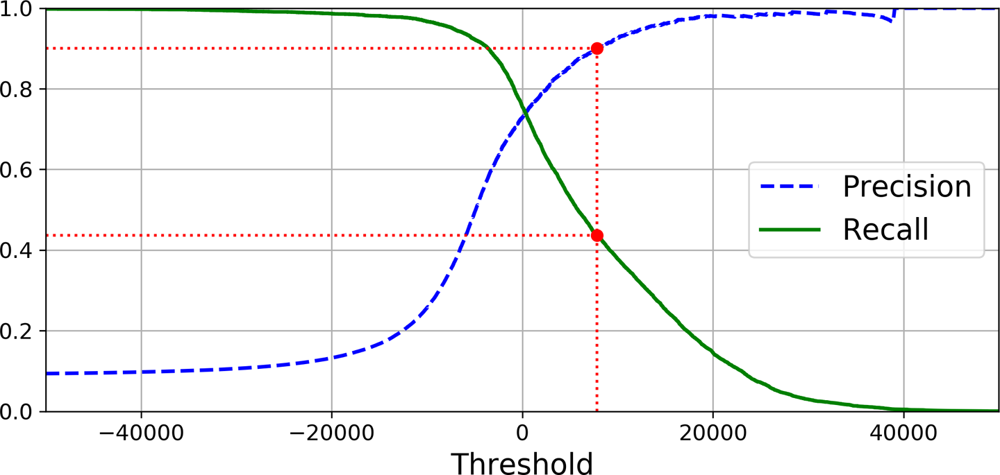
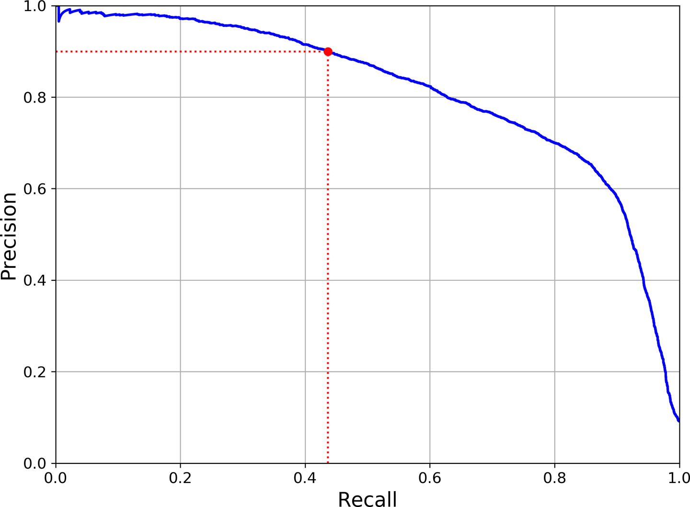
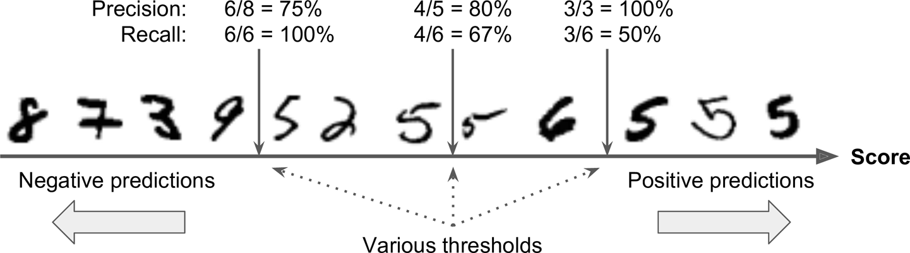
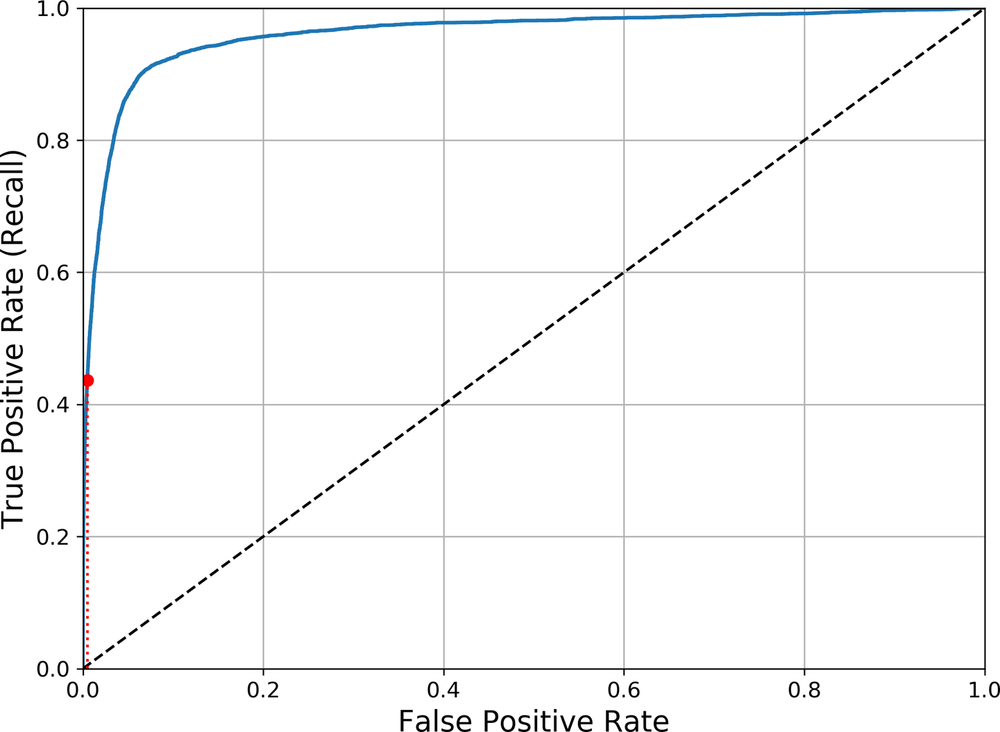

# **오차 행렬**

{: width="75%" height="75%" class="align-center"}

 - **정밀도**(precision) = $\frac{TP}{TP+FP}$
   - True로 분류된 것 중에 실제로 True인 비율
 - 진짜 양성 비율(TPR) = **재현율**(recall) = $\frac{TP}{TP+FN}$
   - 실제 True중에 True로 분류된 비율
 - 거짓 양성 비율(FPR) = $\frac{FP}{FP+TN}$
   - 실제 False중에 True로 분류된 비율
 - 진짜 음성 비율(TNR) = 특이도(specificity) = $\frac{TN}{FP+TN}$
   - 실제 False중에 False로 분류된 비율

$FPR=\frac{FP}{FP+TN}=1-TNR=1-\frac{TN}{FP+TN}$

ex)

{: width="50%" height="50%" class="align-center"}

# **`f1 score`**

{:class="align-center"}

정밀도(precision)와 재현율(recall)의 조화평균

상황에 따라 정밀도, 재현율의 중요도가 다를 수 있다.

ex) 
1. 어린이를 위한 음란물 필터 : 좋은 것이 몇개 걸러지더라도(낮은 재현율) 안전한 것들만 노출시키는(높은 정밀도) 분류기를 선호할 것이다.
2. 도둑을 잡아내는 감시 카메라 : 도둑이 아닌 사람을 도둑으로 감지하더라도(낮은 정밀도) 실제 도둑을 잡을 확률을 높이는(높은 재현율) 알고리즘을 선호할 것이다.

# **`f beta score`**
$F$ 점수의 일반화된 조화 평균 식

{:class="align-center"}

$\beta$가 1보다 크면 재현율이 강조되고 1보다 작으면 정밀도가 강조된다

$\beta$가 1일때의 점수를 $F_{1}$ 점수라고 한다.

$\beta$의 값으로써 두 가지가 가장 많이 사용된다
 - $\beta=2$ : 재현율의 비중이 정밀도보다 높을 때
 - $\beta=0.5$ : 재현율의 비중이 정밀도보다 낮을 때

[$F_{\beta}$ score에서 $\beta$가 아니라 $\beta^{2}인 이유$](https://stats.stackexchange.com/questions/221997/why-f-beta-score-define-beta-like-that)

# **PR Curve**
다른 임계값에 대한 정밀도와 재현율간의 트레이드 오프를 보여준다.

{: width="50%" height="50%"}

{: width="50%" height="50%"}

위 사진의 경우 재현율 80% 근처에서 정밀도가 급격하게 줄어드는데 이 하강점 지점을 정밀도/재현율 트레이드오프로 선택하는 것이 좋다.

정밀도 곡선이 재현율 곡선에 비해 왜 더 울퉁불퉁할까. 그것은 임곗값을 올리더라도 정밀도가 가끔 낮아질 때가 있기 때문이다. 일반적으로는 더 높아져야 한다. 그 이유는 아래 사진을 보면 알 수 있다.

가운데 임곗값에서 오른쪽으로 숫자 하나만큼 이동하면 정밀도는 80%에서 75%로 줄어든다. 반면 재현율은 임곗값이 올라감에 따라 줄어들 수 밖에 없어 부드러운 곡선이다.

다시 말하자면 Recall이 낮으면 True인 것에 대해서 True라고 판정하지 못한것이 많다는 뜻이고 Precision은 True라고 예측한 것중에 True인 것들인데 그에따라 범위를 좁히면서 적은것들(난이도 쉬운 것들)에 대해 잘 맞추기에 수치가 높은 것이다. 그러면 True라고 예측한 것들의 분모가 줄어드는데 거기서 하나라도 False인 것이 나온다면 변동이 크기 때문에 Preicison이 커지는 부분에서 Precision 그래프가 튀는 것이다.

# **ROC Curve**
이진 분류에서 널리 사용한다. 거짓 양성 비율(FPR)에 대한 진짜 양성 비율(TPR, Recall)의 비율, True로 분류된 것들 중에서 실제 값이 어떤것이었느냐에 대한 트레이드오프를 나타낸다.

{: width="50%" height="50%"}{:class="align-center"}

재현율(TPR)이 높을수록 거짓 양성(FPR)이 늘어난다. 점선은 완전 랜덤 분류기이며, 이와 멀수록(왼쪽 모서리에 가까울수록) 성능이 좋다는 뜻이다

## **AUC**
곡선 아래의 면적(area under the curve) 완전한 분류기는 1에 가까울 수록 성능이 좋다는 뜻이며 완전 랜덤 분류기는 0.5이다.

{: width="50%" height="50%"}{:class="align-center"}

## **PR curve vs ROC curve**
PR curve는 양성 클래스가 드물거나 거짓 음성보다 거짓 양성이 더 중요할 때 그렇지 않으면 ROC curve를 사용한다. 

예를들어 `False`가 훨씬 많다고 가정하자 그러면 FPR은 실제 음성인 것 중에 `True`로 예측된 것들인데 이것은 분모가 매우 크고 분자가 작으므로 낮게 나오고 이로 인하여 Recall은 적당히 타협해도 많은 `True`를 `True`로 분류할 수 있기 때문에 성능이 좋게 나오게 된다. 하지만 이경우 PR curve에서는 적당히 타협하느라 `True`로 분류해버린 `False`들이 들키게 되어 이럴 경우 PR이 좋은 것이다.

FFFFFFFFFFFFFFFFFFF~FFFFFFFFFF(1)FFFFFTF(2)FFFFTFTTTFTTTTT

쉽게 설명하면 ~부분이 정말 많다고 하자, 그렇다면 (1)을 threshold로 하던 (2)로 하던 F의 비중이 매우 많기 때문에 FPR이 낮게 나올 것이다. 그리고 많은 T의 대다수를 T로 분류할 수 있게 될 것이다. 그래서 성능이 높아보이는 착각을 일으킬 것인데 PR curve는 Preicison에서 `True`로 분류된 것중에서 실제 `True`를 검사하는데 여기서 (1)과 (2)사이에 있는 F들이 성능지표에 포함되기 때문에 False가 훨씬 많은 경우 PR curve가 좋다.

> 출처
 - Aurelien, Geron, 『핸즈온 머신러닝』, 박해선, 한빛미디어(2020)
 - https://en.wikipedia.org/wiki/F-score
 - https://developers.google.com/machine-learning/crash-course/classification/roc-and-auc?hl=ko
 - https://docs.h2o.ai/h2o/latest-stable/h2o-docs/performance-and-prediction.html?_ga=2.174562212.72305442.1656698706-3838241.1656698706