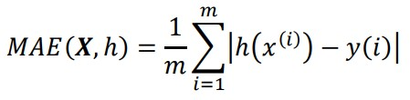

# 노름

일반적으로 원소가 $n$개인 벡터 v의 노름은 

$\left\| v \right\|_{k}=(\left| v_{0}\right|^{k}+\left| v_{1}\right|^{k}+\cdots +\left| v_{n}\right|^{k})^{\frac{1}{k}}$

으로 정의한다. 
- $l_{0}$은 벡터에 있는 0이 아닌 원소의 개수이며, $l_{\infty}$은 벡터에서 가장 큰 절댓값이 된다.
- 노름의 지수가 클 수록 큰 값의 원소에 치우치며 작은 값은 무시한다. 그래서 RMSE가 MAE보다 더 이상치에 민감하다. 하지만 (종 모양 분포의 양 끝단처럼) 이상치가 매우 드물면 RMSE가 잘 맞아 일반적으로 널리 사용된다.

## **평균제곱오차(RMSE)**

유클리디안 노름에 해당한다. $l_{2}$ 노름이라고도 부르며 $\left\| \cdot \right\|_{2}$ 또는 $\left\| \cdot \right\|$ 로 표시한다.

## **평균절대오차(MAE) = 평균 절대 편차**

맨해튼 노름이라고도 하며 $l_{1}$ 노름에 해당한다.

RMSE와 MAE 모두 예측값의 벡터와 타깃값의 벡터 사이의 거리를 재는 방법이다. 

# 결정 계수($R^{2}$)
결정계수(coefficient of determination):
모델 성능을 잘 해석하기 위해 만든 $MSE$의 표준화된 버전, 타깃의 분산에서 모델이 잡아낸 비율

ex)

$R^{2}$이 높다 = 분산의 설명력이 높다.

> 출처
 - Aurelien, Geron, 『핸즈온 머신러닝』, 박해선, 한빛미디어(2020)