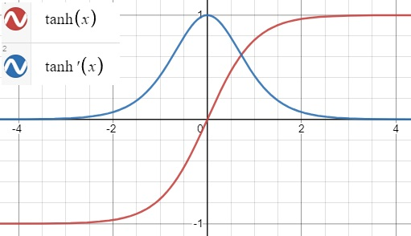

# 활성화 함수의 필요성
활성화 함수는 비선형성(non-linearity)라고도 부른다. 활성화 함수가 없다면 `Dense`층은 선형적인 연산인 점곱과 덧셈 2개로 구성된다

`output=dot(W, input)+b`

그러므로 이 층은 입력에 대한 선형 변환만을 학습할 수 있다. 이 층의 가설공간은 입력데이터를 `units`차원의 공간으로 바꾸는 가능한 모든 선형 변환의 집합이다. 이런 가설 공간은 매우 제약이 많으며, 선형 층을 깊게 쌓아도 여전히 하나의 선형 연산이기 때문에 층을 여러 개로 구성하는 장점이 없다. 즉 층을 추가해도 가설 공간이 확장되지 않는다.

가설 공간을 풍부하게 만들어 층을 깊게 만드는 장점을 살리기 위해서는 비선형성 또는 활성화 함수를 추가해야 한다.

# **시그모이드 함수, sigmoid**

$\sigma (t)=\frac{1}{1+exp(-t)}$

{: width="75%" height="75%" class="align-center"}

 - 출력 범위가 0~1 사이로 한정되어 있어 양극단에서 기울기가 급격히 감소하므로 오차 그레이디언트를 잘 역전파하지 못한다.

# **하이퍼볼릭 탄젠트, tanh**

$tanh(z)=2\sigma(2z)-1$

{: width="75%" height="75%" class="align-center"}

`sigmoid` 함수처럼 S자 모양이고 연속적이며 미분 가능하다. 하지만 출력 범위가 -1에서 1사이이다. 이 범위는 훈련 초기에 각 층의 출력을 원점 근처로 모으는 경향이 있다. 이는 종종 빠르게 수렴되도록 도와준다. 


# 초기화 전략

`Xavier initialization`, `Glorot initialization`

세이비어 글로럿(Xavier Glorot)과 요슈아 벤지오(Yoshua Bengio)는 논문<sup>[1](#footnote_1)</sup>에서 당시 그레디언트를 불안정하게 만드는 원인에 대해 의심되는 원인을 몇가지 발견하였다.

`sigmoid` 활성화 함수와 정규분포로 가중치를 초기화하는 방식을 사용했을 때 각 층에서 출력의 분산이 입력의 분산보다 더 크다는 것을 발견했다. 신경망이 위쪽으로 갈수록 층을 지날 때마다 분산이 계속 커져 가장 높은 층에서는 활성화 함수가 0이나 1로 수렴한다. 이는 로지스틱 함수의 평균이 0이 아니고 0.5라는 사실때문에 더욱 그렇다. 로지스틱 함수는 항상 양수를 출력하므로 출력의 가중치 합이 입력보다 커질 가능성이 높다. (편향 이동)

로지스틱 활성화 함수를 보면 입력이 커지면 0이나 1로 수렴하여 기울기가 0과 가까워져 역전파가 될 때 사실상 신경망으로 전파할 그레이디언트가 거의 없어지게 된다.

글로럿과 벤지오는 논문에서 불안정한 그레이디언트 문제를 크게 완화하는 방법을 제안한다. 

예측을 할 때는 정방향으로, 그레이디언트를 역전파할 때는 역방향으로 양방향 신호가 적절하게 흘러야 한다. 신호가 죽거나 폭주 또는 소멸하지 않아야 한다

저자들은 적절한 신호가 흐르기 위해서는 각 층의 출력에 대한 분산이 입력의 분산과 같아야 한다고 주장한다. 그리고 역방향에서 층을 통과하기 전과 후의 그레이디언트 분산이 동일해야 한다. 

사실 층의 입력(fan-in)과 출력(fan-out) 연결 개수가 같지 않다면 이 두 가지를 보장할 수 없다.

그에 대해 대안을 제시했는데 아래의 식의 방식대로 무작위로 초기화 하는 것이다. 

{: width="75%" height="75%" class="align-center"}

위 식에서 $fan_{avg}$를 $fan_{in}$로 바꾸면 르쿤(LeCun) 초기화라고 부른다(1990) $fan_{in}=fan_{avg}$이면 르쿤 초기화는 글로럿 초기화와 동일하다. 

글로럿 초기화를 사용하면 훈련 속도를 상당히 높일 수 있다.

일부 논문<sup>[2](#footnote_2)</sup>들이 다른 활성화 함수에 대해 비슷한 전략을 제안했다.

| Initialization | Activation functions          | $\sigma^{2}$(Normal) |
|----------------|-------------------------------|-----------------|
| Glorot         | None, tanh, logistic, softmax | $1/fan_{avg}$   |
| He(kaiming)    | ReLU and variants             | $2/fan_{in}$    |
| LeCun          | SELU                          | $1/fan_{in}$    |

위 표에서 보이듯이 $fan_{avg}$ 또는 $fan_{in}$을 쓰는 것만 다르다. 균등 분포의 경우 단순히 $r=\sqrt{3\sigma^{2}}$로 계산한다. `ReLU` 활성화 함수 및 그의 변종들에 대한 초기화 전략을 논문 저자의 이름을 따서 `He(kaiming) initialization` 이라고 부른다. 뒤에 나오지만 `SELU`는 르쿤 초기화를 사용한다.

## 파이토치의 경우
[`Linear`](https://github.com/pytorch/pytorch/blob/caa6ef15a294c96fad3bf67a10a8b4fa605080bb/torch/nn/modules/linear.py#L103-L111)와 [`conv2d`](https://github.com/pytorch/pytorch/blob/caa6ef15a294c96fad3bf67a10a8b4fa605080bb/torch/nn/modules/conv.py#L146-L155)의 경우 해당 소스코드를 보면 확인할 수 있다.

```python
# pytorch/torch/nn/modules/linear.py

class Linear(Module):
    ...
    def reset_parameters(self) -> None:
        init.kaiming_uniform_(self.weight, a=math.sqrt(5))
        if self.bias is not None:
            fan_in, _ = init._calculate_fan_in_and_fan_out(self.weight)
            bound = 1 / math.sqrt(fan_in) if fan_in > 0 else 0
            init.uniform_(self.bias, -bound, bound)
```
```python
# pytorch/torch/nn/modules/conv.py

class _ConvNd(Module):
    ...
    def reset_parameters(self) -> None:
        init.kaiming_uniform_(self.weight, a=math.sqrt(5))
        if self.bias is not None:
            fan_in, _ = init._calculate_fan_in_and_fan_out(self.weight)
            if fan_in != 0:
                bound = 1 / math.sqrt(fan_in)
                init.uniform_(self.bias, -bound, bound)
```

보다시피 `self.weight`에 대해 공통적으로 `kaiming_uniform_`을 적용하는 것을 볼 수 있다. 이 함수를 따라가보자

[`kaiming_uniform_`](https://github.com/pytorch/pytorch/blob/caa6ef15a294c96fad3bf67a10a8b4fa605080bb/torch/nn/init.py#L366)은 다음과 같이 정의되어 있다.
```python
# pytorch/torch/nn/init.py

def kaiming_uniform_(tensor: Tensor, a=0, mode='fan_in', nonlinearity='leaky_relu'):
    ...
    if torch.overrides.has_torch_function_variadic(tensor):
        return torch.overrides.handle_torch_function(
            kaiming_uniform_,
            (tensor,),
            tensor=tensor,
            a=a,
            mode=mode,
            nonlinearity=nonlinearity)

    if 0 in tensor.shape:
        warnings.warn("Initializing zero-element tensors is a no-op")
        return tensor
    fan = _calculate_correct_fan(tensor, mode)
    gain = calculate_gain(nonlinearity, a)
    std = gain / math.sqrt(fan)
    # Calculate uniform bounds from standard deviation
    bound = math.sqrt(3.0) * std  
    with torch.no_grad():
        return tensor.uniform_(-bound, bound)
```

 - `fan` : `_calculate_correct_fan`은 `mode` 변수의 값에 따라 `fan_in` 또는 `fan_out`을 반환한다. 그런데 여기서는 인자를 주지 않았으므로 기본값인 `fan_in`을 반환하게된다
 - [gain](#calculate_gain) : 여기서는 `calcuate_gain` 함수를 호출하는데 (더 자세한 내용은 아래 서술한다 일단 함수에 집중해보자) `nonlinearity=leaky_relu`, `a=math.sqrt(5)`이므로 `negative_slope=math.sqrt(5)`에 해당하여 $\sqrt{2/(1+slope_{negative}^{2})}=1/\sqrt{3}$를 반환하여 `gain`$=1/\sqrt{3}$이 된다.
 - `std` : $\sigma=gain / \sqrt{fan}$
 - `bound` = $\sqrt{3}\sigma$
 - `return` : $\pm bound$ 에 대한 균등 분포가 반환된다.

위에서 서술했던 `He initialization`(=`kaiming init`)인 $r=\sqrt{3\sigma^{2}}$에 대해 $\pm r$을 범위로 하는 균등분포를 쓰는 것이 확인되었다.

## 파이토치에서의 확인
`input=30` 인 `nn.Linear`이 있다고 하자. 그럼 위의 연산을 따라가 보면

- `fan` = 30
- `gain` = $1/\sqrt{3}$
- `std` = $\frac{1}{\sqrt{3}}\times\frac{1}{\sqrt{30}}=\frac{1}{\sqrt{90}}$
- `bound` = $\sqrt{3} \times \frac{1}{\sqrt{90}}=\frac{1}{\sqrt{30}}=0.182574$

이므로 `weight`는 `uniform(-182574, +182574)`가 되야 한다. 확인해보자

{: width="75%" height="75%"}

이로써 파이토치에서의 가중치 초기화가 확인되었다.

## `calculate_gain`

아래 서술되는 `non-linearity`는 `non-linear function`를 의미하는데 편의를 위해 사실상 딥러닝에서의 활성화 함수라고 생각하면 될 것이다.

`gain`은 초기화 함수에 대한 scaling factor라고 한다.<sup>[3](#footnote_3)</sup> `non-linearity`에 적용하는 표준편차를 scale하기 위해 사용된다. `non-linearity`가 활성화의 표준편차에 영향을 주기 때문에 기울기 소실같은 문제가 발생할 수 있다. `non-linearity`에 대한 `gain`은 활성화에 대한 "좋은" 통계를 제공해야 한다.

적절한 `gain` 값으로는 다음과 같다.

| non-linearity    | gain                             |
|-----------------|----------------------------------|
| `Linear/Identity` | $1$                            |
| `Conv{1,2,3}D`    | $1$                            |
| `Sigmoid`         | $1$                             |
| `Tanh`            | $5/3$                            |
| `ReLU`            | $\sqrt{2}$                       |
| `Leaky Relu`      | $\sqrt{2/1+negative \_ slope^{2}}$ |
| `SELU`            | $3/4$                            |

[`calculate_gain`](https://github.com/pytorch/pytorch/blob/caa6ef15a294c96fad3bf67a10a8b4fa605080bb/torch/nn/init.py#L67) 함수는 다음과 같이 정의되어있다.
```python
# pytorch/torch/nn/init.py 

def calculate_gain(nonlinearity, param=None):
    ...
    linear_fns = ['linear', 'conv1d', 'conv2d', 'conv3d', 'conv_transpose1d', 'conv_transpose2d', 'conv_transpose3d']
    if nonlinearity in linear_fns or nonlinearity == 'sigmoid':
        return 1
    elif nonlinearity == 'tanh':
        return 5.0 / 3
    elif nonlinearity == 'relu':
        return math.sqrt(2.0)
    elif nonlinearity == 'leaky_relu':
        if param is None:
            negative_slope = 0.01
        elif not isinstance(param, bool) and isinstance(param, int) or isinstance(param, float):
            # True/False are instances of int, hence check above
            negative_slope = param
        else:
            raise ValueError("negative_slope {} not a valid number".format(param))
        return math.sqrt(2.0 / (1 + negative_slope ** 2))
    elif nonlinearity == 'selu':
        # Value found empirically (https://github.com/pytorch/pytorch/pull/50664)
        return 3.0 / 4  
    else:
        raise ValueError("Unsupported nonlinearity {}".format(nonlinearity))
```
보다시피 위에서 설명했던 `gain`값을 얻는 과정을 나타내고 있으며 `SELU`의 경우 `gain`값이 경험적으로 얻어졌음을 나타내고 있다.

# `ReLU`
글로럿과 벤지오의 2010년 논문에서 얻은 통찰 중 하나는 활성화 함수를 잘못 선택하면 자칫 그레이디언트의 소실이나 폭주로 이어질 수 있다는 것이었다. 그래서 전에는 `sigmoid`함수가 최선일 것이라고 생각했으나 `ReLU` 같은 다른 활성화 함수가 심층 신경망에서 훨씬 더 잘 작동한다는 사실이 밝혀졌다.

$ReLU(z)=max(0, z)$
{: width="75%" height="75%" class="align-center"}

 - 연속적이지만 $z=0$에서 미분 가능하지 않다. 기울기가 갑자기 변해서 경사 하강법이 엉뚱한 곳으로 튈 수 있다.
 - $ReLU(z) > 0$일 때 오차 그레이디언트를 그대로 역전파시킨다. 원점에서는 일반적으로 0을 사용한다. 따라서 $ReLU(z) \leq 0$ 일 때는 오차 그레이디언트를 역전파하지 않는다.
 - 생물학적 뉴런이 (S자 모양의) `sigmoid`를 활성화 한 구현한 것 처럼 보여 연구자들은 `sigmoid`를 한동안 집착했으나 일반적으로 `ReLU`가 인공신경망에서 더 잘 작동하다는 것이 밝혀졌다.
 - 계산 속도가 빠르다
 - 출력에 최댓값이 없어 경사하강법에 있는 일부 문제를 완화해준다.

`ReLU`도 신경망이 복잡한 함수를 학습하기에 좋은 비선형 함수이다. 입력값이 양수면 입력에 대한 `ReLU`의 도함수는 항상 1이다. 이것이 그레디언트 소실 문제를 해결해주므로 심층 신경망에 적합하다.

**죽은 ReLU, dying ReLU**

훈련하는 동안 일부 뉴런이 0 이외의 값을 출력하지 않는다. 특히 큰 학습률을 사용하면 신경망의 뉴런 절반이 죽어있기도 한다. 뉴런이 가중치가 바뀌어 훈련 세트에 있는 모든 샘플에 대해 입력의 가중치 합이 음수가 되면 `ReLU` 함수의 그레이디언트가 0이 되므로 경사 하강법이 더이상 작동하지 않는다.

큰 학습률이 dying ReLU를 초래하는 이유

`learning_rate`가 클 경우 가중치 갱신시에 이동량이 커지므로 음수부분으로 빠지게 될 가능성이 크기 때문이다. 

$w_{i,j}^{(next)}=w_{i,j}+\eta (y_{j}-\hat{y}_{j})x_{i}$


## 어떻게 ReLU는 곡선 함수를 만들까
[Maxim Lopin의 Medium 블로그](https://medium.com/@maximlopin/why-is-relu-non-linear-aa46d2bad518)를 참고하였다

$ReLU(x)=0, \; for \; x \leq 0$
$ReLU(z)=max(0, z)$

{: width="75%" height="75%" class="align-center"}

위 식을 $x$방향으로 $c(=5)$만큼 평행이동 해보자

$ReLU(x-c)=0, \; for \; x \leq c$

{: width="75%" height="75%" class="align-center"}

이제 이 함수를 더하면 다음과 같은 모양이 나온다

$ReLU(x)+ReLU(x-c)$ 

{: width="75%" height="75%" class="align-center"}

이 식을 일반화하면 다음과 같다

$f(x)+ReLU(x-c)=f(x), \; for \; x \leq c$

즉 $ReLU(x-c)$에서 $x \leq c$는 0이기 때문에 영향을 줄 수 없다.

여기서 단순히 더하는 것이 아니라 가중치를 주면 어떨까 다음식을 보자

$ReLU(x) + (-3)ReLU(x-c)$

{: width="75%" height="75%" class="align-center"}

이와같은 방식으로 항을 늘려 보면 다음과 같은 모양도 만들 수 있게 된다

{: width="75%" height="75%" class="align-center"}

순전파 공식을 다시 떠올려보자 

$a = f(w_{0}+\sum_{i=1}^{m}x_{i}w_{i})$

 - $a$ : Output
 - $f$ : non-linear activation function
 - $w_{0}$ : bias
 - $w_{i}$ : weight
 - $x_{i}$ : input
 - $x_{i}w_{i}$ : Linear combination of inputs

여기서 위에서 했던 예시와 연관지어서 $f$가 `ReLU`라 생각해보자, 그러면 가중치 $w_{0}$는 그래프의 평행이동 역할을 하는 것을 알게 될 것이고 output인 $a$는 다시 다른 신경망의 `weight`와 곱해지게 된다. 그럼 곱해지는 이 `weight`들은 $(t)ReLU()$에서 $t$의 역할을 하게 된다.(마지막 예시에서 곱해진 -2, 4, 3, -1, -4, -0.1) 이렇게 layer 의 unit 개수만큼 비선형성을 만들 수 있는데 이렇게 `ReLU` 가 신경망을 통과하면서 비선형함수와 비슷하게 되는 것이다.


## `LeakyReLU`
$LeakyReLU_{\alpha}(z)=max(\alpha z, z)$
{: width="50%" height="50%" class="align-center"}

 - 하이퍼 파라미터 $\alpha$가 이 함수가 새는(leaky)정도를 결정한다.
 - 새는 정도 : $z<0$일 때 이 함수의 기울기, 일반적으로 $\alpha=0.01$
 - 이 작은 기울기가 `LeakyReLU`를 절대 죽지 않게 한다(뉴런이 다시 깨어날 가능성을 얻음).
 - `LeakyReLU`가 `ReLU`보다 항상 성능이 높다는 연구결과가 있다.<sup>[4](#footnote_4)</sup>

## `RReLU`
Randomized Leaky ReLU

{: width="80%" height="80%" class="align-center"}

{: width="80%" height="80%" class="align-center"}

위의 논문<sup>[4](#footnote_4)</sup>에서 $\alpha$를 무작위로 선택하고 테스트시에는 평균을 사용하는 방법도 사용했는데 이 방법도 꽤 잘 작동했으며 규제(regularization)의 역할을 하는 것처럼 보였다.


## `PReLU`
Parametric Leaky ReLU

{: width="80%" height="80%" class="align-center"}

$\alpha$가 훈련되면서 학습된다. 대규모 이미지에서는 `ReLU`보다 성능이 크게 앞섰지만, 소규모 데이터셋에서는 훈련세트에 과대적합될 위험이 있다.

# `ELU`
툐르크-아르네 클레베르트 등의 2015년 논문<sup>[5](#footnote_5)</sup>은 `ELU`(exponential linear unit)이라는 새로운 활성화 함수를 제안했다.

이 함수는 저자들의 실험에서 다른 모든 `ReLU` 변종의 성능을 앞질렀다. 훈련 시간이 줄고 신경망의 테스트 성능도 더 높았다.

{: width="75%" height="75%" class="align-center"}

{: width="50%" height="50%" class="align-center"}

 - $z<0$일 때 음숫값이 들어오므로 활성화 함수의 평균 출력이 0에 더 가까워진다. 이는 그레이디언트 소실 문제를 완화해준다.
 - 하이퍼 파라미터 $\alpha$는 $z$가 큰 음숫값일 때 `ELU`가 수렴할 값을 정의한다. (보통 1)
 - $z<0$이어도 그레이디언트가 0이 아니므로 죽은 뉴런을 만들지 않는다.
 - $\alpha=1$이면 이 함수는 $z=0$에서 급격히 변동하지 않으므로 $z=0$을 포함해 모든 구간에서 매끄러워 경사 하강법의 속도를 높여준다.

단점 
 - 계산이 느리다, 훈련시에는 수렴 속도가 빨라서 느린 계산이 상쇄되지만 테스트시에는 `ReLU`를 사용한 네트워크보다 느릴 것이다.

## `SELU`
권터 클람바우어 등의 2017년 논문<sup>[6](#footnote_6)</sup> `SELU`(Scaled ELU) 함수를 소개한다. 이는 스케일이 조정된 `ELU` 
함수의 변종이다. 저자들은 완전 연결 층만 쌓아서 신경망을 만들고 모든 은닉층이 `SELU` 활성화 함수를 사용한다면 네트워크가 자기 정규화(self-normalize)된다는 것을 보였다. 훈련하는 동안 각 층의 출력이 평균 0과 표준편차 1을 유지하는 경향이 있다. 이는 그레이디언트 소실과 폭주 문제를 막아준다. 그 결과로 `SELU` 활성화 함수는 특히 아주 깊은 네트워크에서 다른 활성화 함수보다 뛰어난 성능을 종종 낸다.

자기 정규화가 일어나기 위한 몇 가지 조건

 - 입력 특성이 반드시 표준화(평균 0, 표준편차 1) 되어야 한다.
 - 모든 은닉층의 기준치는 르쿤 정규분포 초기화로 초기화되어야 한다. 
 - 네트워크는 일렬로 쌓은 층으로 구성되어야 한다. `RNN`이나 `Skip connection` 같은 구조에 `SELU`를 사용하면 자기 정규화되는 것이 보장되지 않는다. 성능 또한 마찬가지로 보장되지 않는다.(`CNN`의 경우에는 성능향상이 가능하다는 의견도 존재한다.)

# 결론
심층 신경망의 은닉층에는 일반적으로

- `SELU` > `ELU` > `LeakyReLU` + a > `ReLU` > `tanh` > `sigmoid` 순이다.
- 네트워크가 자기정규화되지 못하는 구조라면 `ELU`가 `SELU`보다 나을 수 있다. (`SELU`가 $z=0$에서 연속적이지 않기 때문에, 라고 책에 써있긴한데 여기서 `SELU`는 `ELU`에서 $\alpha \neq 1$로 보는 것 같다.)
- 실행 속도가 중요하다면 `LeakyReLU`를 선택할 수 있다.
-  신경망이 과대적합되었다면 `RReLU`
-  훈련세트가 아주 크다면 `PReLU`를 포함시키면 좋다.
-  `ReLU`가 (지금까지) 가장 널리 사용되는 활성화 함수이므로 많은 라이브러리와 하드웨어 가속기들은 `ReLU`에 특화되어 최적화되어 있다. 따라서 속도가 중요하다면 `ReLU`가 가장 좋을 것이다. (2019년 기준으로 2022년 지금은 다를 수 있다.)

<a name="footnote_1">1</a>: [Glorot, Xavier, and Yoshua Bengio. "Understanding the difficulty of training deep feedforward neural networks."](https://proceedings.mlr.press/v9/glorot10a/glorot10a.pdf)

<a name="footnote_2">2</a>: [Kaiming He, "Delving Deep into Rectifiers: Surpassing Human-Level Performance on ImageNet Classification"](https://arxiv.org/pdf/1502.01852)

<a name="footnote_3">3</a>: https://discuss.pytorch.org/t/what-is-gain-value-in-nn-init-calculate-gain-nonlinearity-param-none-and-how-to-use-these-gain-number-and-why/28131

<a name="footnote_4">4</a>: [Bing Xu, "Empirical Evaluation of Rectified Activations in Convolutional Network"](https://arxiv.org/abs/1505.00853)

<a name="footnote_5">5</a>: [Djork-Arné Clevert, "Fast and Accurate Deep Network Learning by Exponential Linear Units (ELUs)"](https://arxiv.org/abs/1511.07289)

<a name="footnote_6">6</a>: [Günter Klambauer, "Self-Normalizing Neural Networks"](https://arxiv.org/abs/1706.02515)

> 출처
 - Aurelien, Geron, 『핸즈온 머신러닝』, 박해선, 한빛미디어(2020)
 - Francois Chollet 『케라스 창시자에게 배우는 딥러닝』, 박해선, 길벗(2018)
 - https://medium.com/@maximlopin/why-is-relu-non-linear-aa46d2bad518