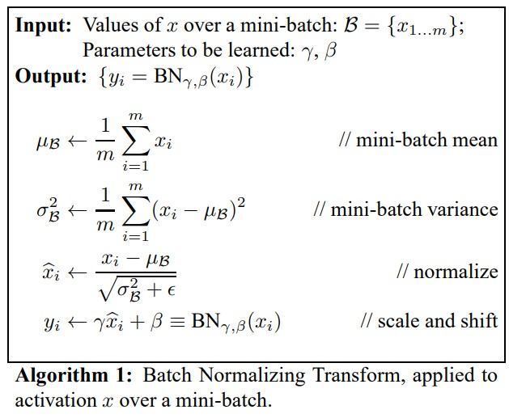

# 배치 정규화
정규화는 머신 러닝 모델에 주입되는 샘플들을 균일하게 만드는 광범위한 방법이다. 이 방법은 모델이 학습하고 새로운 데이터에 잘 일반화되도록 돕는다. 데이터 정규화의 일반적인 형태는 다음과 같다.

$data_{normalized} = \frac{data-\mu}{\sigma}$

데이터에서 평균을 빼서 데이터를 원점에 맞추고 표준 편차로 나누어 데이터의 분산을 1로 만든다. 데이터가 정규 분포를 따른다고 가정하고 이 분포를 원점에 맞추고 분산이 1이 되도록 조정한 것이다.

모델에 데이터를 주입하기 전에 정규화할 수 있다. 하지만 데이터 정규화는 네트워크에서 일어나는 모든 변환 후에도 고려되어야 하는데. `Dense`, `Conv2D` 층에 들어가는 데이터의 평균이 0이고 분산이 1이더라도 출력되는 데이터가 동일한 분포를 가질 것이라고 기대하기 어렵다.

`Sergey Ioffe`, `Christian Szegedy`는 2015년의 한 논문[1](#footnote_1)에서 그레이디언트 소실과 폭주 문제를 해결하기 위한 배치 정규화(Batch Normalization) 기법을 제안했다.

해당 논문에 따르면 기울기 소멸과 폭발 원인은 내부 공변량 변화(internal covariance shift) 때문인데 이것은 네트워크의 각 층마다 활성화 함수가 적용되면서 입력값들의 분포가 계속 바뀌는 현상을 의미한다. 따라서 분산된 분포를 정규분포로 만들기 위해 표준화와 유사한 방식을 미니 배치에 적용하여 평균은 0으로 표준편차는 1로 유지하도록 한다.

훈련하는 동안 평균과 분산이 바뀌더라도 이에 적응하여 데이터를 정규화한다. 훈련 과정에서 사용된 배치 데이터의 평균과 분산에 대한 지수 이동 평균을 내부에 유지한다. 배치 정규화의 주요 효과는 잔차 연결과 매우 흡사하게 그래디언트의 전파를 도와주는 것이다. 결국 더 깊은 네트워크를 구성할 수 있다.

이 기법은 각 층에서 활성화 함수를 통과하기 전이나 후에 모델에 연산을 하나 추가한다. 이 연산은 단순하게 입력을 원점에 맞추고 정규화한 다음, 각 층에서 두 개의 새로운 파라미터로 결괏값의 스케일을 조정하고 이동한다. 하나는 스케일 조정에, 다른 하나는 이동에 사용한다. 많은 경우 신경망의 첫 번째 층으로 배치 정규화를 추가하면 훈련 세트를 표준화할 필요가 없다. 배치 정규화 층이 이런 역할을 대신한다. (한 번에 하나의 배치만 처리하기 때문에 근사적이다. 또한 입력 특성마다 스케일을 조정하고 이동할 수 있다.)

*배치 정규화 알고리즘*
{: width="80%" height="80%" class="align-center"}

 - $\mu_{B}$ : 미니배치 B에 대해 평가한 입력의 평균 벡터(입력마다 하나)
 - $\sigma_{B}$ : 미니배치에 대해 평가한 입력의 표준편차 벡터
 - $m$ : 미니배치에 있는 샘플 수
 - $\hat{x_{i}}$ : 평균이 0이고 정규화된 샘플 $i$의 입력
 - $\gamma$ : 층의 출력 스케일 파라미터 벡터(입력마다 하나의 스케일 파라미터)
 - $\beta$ : 층의 출력 이동 (오프셋) 파라미터 벡터(입력마다 하나의 스케일 파라미터). 각 입력은 해당 파라미터만큼 이동
 - $\epsilon$ : 분모가 0이 되는 것을 막기 위한 작은 숫자(거의 $10^{-5}$)
 - $y_{i}$ : 배치 정규화 연산의 출력. 즉, 입력의 스케일을 조정하고 이동시킨 것. 

훈련하는 동안 배치 정규화는 입력을 정규화한 다음 스케일을 조정하고 이동시킨다.

테스트시에는 샘플의 배치가 아니라 샘플 하나에 대한 예측을 만들어야 한다. 이 경우 입력의 평균과 표준편차를 계산할 방법이 없다. 샘플의 배치를 사용한다 하더라도 매우 작거나 IID 조건을 만족하지 못할 수 있다. 이런 배치 샘플에서 계산한 통계는 신뢰도가 떨어진다. 한 가지 방법은 훈련이 끝난 후 전체 훈련 세트를 신경망에 통과시켜 배치 정규화층의 각 입력에 대한 평균과 표준편차를 계산하는 것이다. 예측할 때 배치 입력 평균과 표준편차로 이 '최종' 입력 평균과 표준편차를 대신 사용할 수 있다. 그러나 대부분 배치 정규화 구현은 층의 입력 평균과 표준편차의 이동 평균을 사용해 훈련하는 동안 최종 통계를 추정한다. 

정리하면 배치 정규화 층마다 네 개의 파라미터 벡터가 학습된다. 

$\gamma$(출력 스케일 벡터)와 $\beta$(출력 이동 벡터)는 일반적인 역전파를 통해 학습된다. 

$\mu$(최종 입력 평균 벡터)와 $\sigma$는 지수 이동 평균을 사용하여 추정된다. $\mu$와 $\sigma$는 훈련하는 동안 추정되지만 훈련이 끝난 후에 사용된다. (배치 정규화 알고리즘에서 배치 입력 평균과 표준편차를 대체하기 위해)

또한 배치 정규화는 규제와 같은 역할을 하여 다른 규제 기법의 필요성을 줄여준다.

그러나 입력 데이터를 정규화할 필요가 없어지지만, 배치 정규화는 모델의 복잡도를 키우고 실행 시간 면에서도 손해이다. 층마다 추가되는 계산이 신경망의 예측을 느리게 한다. 다행히 훈련이 끝난 후에 이전 층과 배치 정규화 층을 합쳐 실행 속도 저하를 피할 수 있다. 이전 층의 가중치를 바꾸어 바로 스케일이 조정되고 이동된 출력을 만든다.

예를 들어 이전 층이 $XW+b$를 계산하면 배치 정규화 층은 $\gamma (XW+b-\mu)/\sigma+\beta$를 계산한다. 만약 $W'=\gamma (W/\sigma)$와 $b'=\gamma (b-\mu)/\sigma+\beta$를 정의하면 이 식은 $XW'+b'$로 단순화된다. 따라서 이전 층의 가중치와 편향($W$와 $b$)을 업데이트된 가중치와 편향($W'$와 $b'$)로 바꾸면 배치 정규화층을 제거할 수 있다.

배치 정규화를 사용할 때 에포크마다 더 많은 시간이 걸리므로 훈련히 오히려 느려질 수 있다. 하지만 배치 정규화를 사용하면 수렴이 훨씬 빨라지므로 보통 상쇄된다. 따라서 더 적은 에포크로 동일한 성능에 도달할 수 있다. 

배치 정규화의 핵심은 입력 범위를 신경망의 활성 함수로 바꿔서 미니 배치가 원하는 분포를 가지게 하는 것이다. 비선형 활성 함수를 활용하면, 함수의 임계 영역에서 입력이 활성 함수에 너무 많이 작용하여 기울기가 소실되고 훈련이 느려지는 상황을 피할 수 있다. 실제로 배치 정규화는 미니 배치 샘플을 통해 중간 위치에서 얻은 평균과 표준편차를 사용하여 중간 입력값을 이동하고 범위를 바꾼다. 따라서 모델이 보는 개별 샘플이나 이로 인한 이후의 활성화 단계에서는 랜덤하게 뽑아 만들어진 미니 배치에서 통계에 의존한 값의 이동과 범위조정이 한정되어 있는 상태다. 이 자체로 원칙적인 데이터 증강인 셈이다. 이 논문에서 저자진은 배치 정규화가 드랍아웃할 필요를 없애거나 줄여준다고 주장한다. 

드랍아웃처럼 배치 정규화도 훈련 때와 추론 때는 각기 다르게 동작해야 한다. 추론 시에 출력은 모델이 이미 봤던 다른 입력의 통계에 의존하는 특정 입력을 위한 것이 되어서는 안된다. 

// TODO 파이토치에서의 구현

**단점**
1. 배치 크기가 작을 때는 정규화 값이 기존 값과 다른 방향으로 훈련될 수 있다. 예를 들어 분산이 0이면 정규화 자체가 안 되는 경우가 생길 수 있다.
2. RNN은 네트워크 계층별로 미니 정규화를 적용해야 하기 때문에 모델이 더 복잡해지면서 비효율적일 수 있다.

## 배치 재정규화
2017년에 `Sergey Ioffe`는 배치 재정규화[2](#footnote_2)를 소개하였다. 이 방법은 추가적인 비용을 들이지 않고 배치 정규화보다 이득이 많다.

## 자기 정규화 신경망
특정 활성화 함수(`selu`)와 초기화 방법(`lecun_normal`)을 사용하여 `Dense` 층의 출력을 정규화한다. 완전 연결 네트워크에만 제한되어있다.

<a name="footnote_1">1</a>: [Sergey Ioffe, Christian Szegedy, "Batch Normalization: Accelerating Deep Network Training by Reducing Internal Covariate Shift"](https://arxiv.org/abs/1502.03167)
<a name="footnote_2">2</a>: [Sergey Ioffe, "BBatch Renormalization: Towards Reducing Minibatch Dependence in Batch-Normalized Models"](https://arxiv.org/abs/1702.03275)

> 출처
 - Aurelien, Geron, 『핸즈온 머신러닝』, 박해선, 한빛미디어(2020)
 - Francois Chollet, 『케라스 창시자에게 배우는 딥러닝』, 박해선, 길벗(2018)
 - 서지영, 『딥러닝 파이토치 교과서』, 길벗(2022)
 - Eli Stevens, 『파이토치 딥러닝 마스터』, 현동석, 책만(2022)