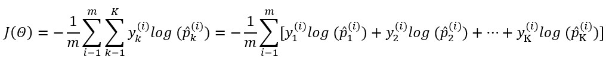

# Cross Entropy

크로스 엔트로피 비용 함수는 다음과 같다

{: width="50%" height="50%" class="align-center"}

 - $m$ : 샘플의 개수
 - $K$ : 클래스(카테고리)의 개수
 - $y_{k}^{(i)}$ : $i$번째 샘플이 클래스 $k$에 속할 확률, 샘플이 클래스에 속하는지 아닌지에 따라 1 또는 0이 된다.

이해를 위해 $\sum_{k=1}^{K}$을 전개해보자

{: width="75%" height="75%" class="align-center"}

## Binary Cross Entropy
`Cross Entropy` 함수에서 `K=2` 일 때 비용 함수는 로지스틱 회귀의 비용 함수와 같다

양성 샘플($y=1$)에 대해서는 높은 확률을 추정하고 음성 샘플($y=0$)에 대해서는 낮은 확률을 추정할 때 높은 값이 나온다.

{: width="75%" height="75%" class="align-center"}