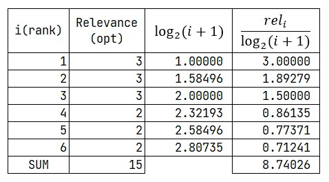

# CG

`Cumulative Gain`

$CG_{p}=\sum_{i=1}^{p}rel_{i}$

등급별 관련도의 합이다. 등급의 위치를 고려하지 않는다.(1등으로 예측한 것과 5등으로 예측한 것의 가중치 차이가 없다.)

 - $rel_{i}$ : 위치 $i$에서의 등급별 관련성

이진 판별 문제의 경우 `precision`(`True`로 분류된 것 중에 실제로 `True`인 비율)과 같은 의미를 가진다. 

단점

 - 순위의 위치를 바꿔도 결과의 변화가 없다.

위와 같은 이유로 보통 `(N)DCG`는 `CG`보다 더 선호된다.

**ex)**

{: width="50%" height="50%" class="align-center"}

$CG_{6}=11$

## DCG

`Discounted Cumulative Gain`

$DCG_{p}=\sum_{i=1}^{p}\frac{rel_{i}}{\log_{2}(i+1)}=rel_{1}+\sum_{i=1}^{p}\frac{rel_{i}}{\log_{2}(i+1)}$

$DCG_{p}=\sum_{i=1}^{p}\frac{2^{rel_{i}}-1}{\log_{2}(i+1)}$

두 공식은 이진 관련성 문제에서 같다 $rel_{i} \in \{0, 1\}$

뒤의 공식은 웹 검색 회사 또는 캐글의 Competition 등 에서 많이 사용된다고 한다.

`DCG`는 분모의 $\log$가 $i$가 증가할 수록 누적값에 페널티를 주어 `Rank`가 낮은 곳에 있는 `Relevance`는 `DCG`의 누적에 있어서 반영을 적게 하게 한다.

**ex)**

{: width="75%" height="75%" class="align-center"}

$DCG_{6}=6.86113$
## NDCG
`DCG`의 값은 `DCG`계산시 취하는 $p$에 따라 변하게 된다.

그러므로 $p$ 범위에 걸쳐 정규화한다.

$nDCG=\frac{DCG_{p}}{IDCG_{p}}$

$IDCG_{p}=\sum_{i=1}^{\left|| REL_{p} \right||}\frac{rel_{i}}{\log_{2}(i+1)}$

 - $REL_{p}$ : $p$ 위치까지 의 관련성 순서

$IDCG_{p}$가 헷갈릴 수 있는데 $IDCG_{p}$는 얻어낸 모든 `Relevance`를 내림차순으로 정렬하고 그것을 $p$개의 `Rank`에 내림차순으로 정렬하고 그것의 $DCG$의 값을 구하는 것이다.

예시를 보면 쉽게 알 수 있다.

**ex)**

`DCG` 의 예시에서 6개의 값 외에 3, 2의 Relevance 를 가지는 것이 각각 있었다고 하자 

{: width="75%" height="75%" class="align-center"}

$IDCG_{6}=8.74026$

$nIDCG_{6}=\frac{DCG_{6}}{IDCG_{6}}=\frac{6.86113}{8.74026}=0.78500$

#

> 출처
 - [DCG WIKI](https://en.wikipedia.org/wiki/Discounted_cumulative_gain)