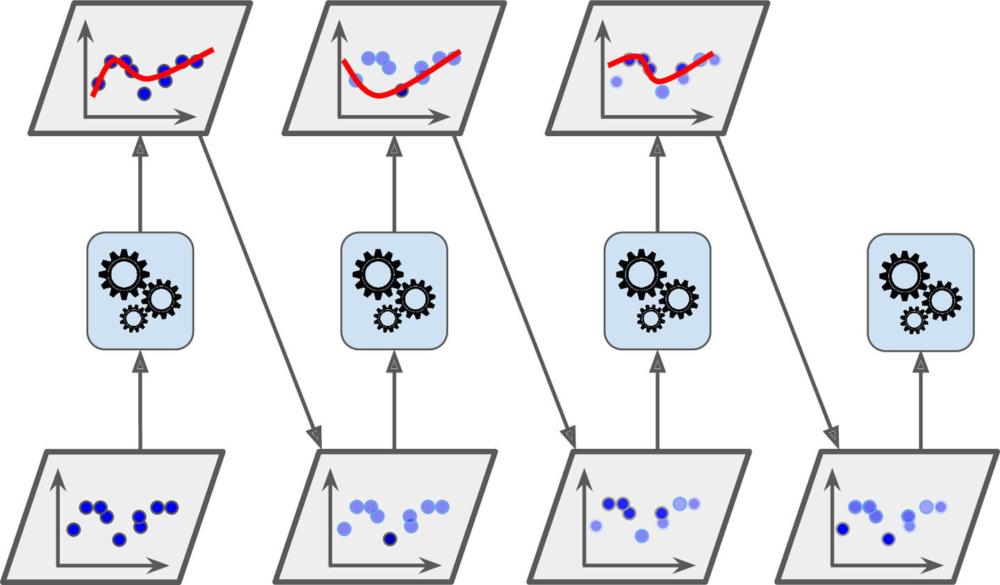
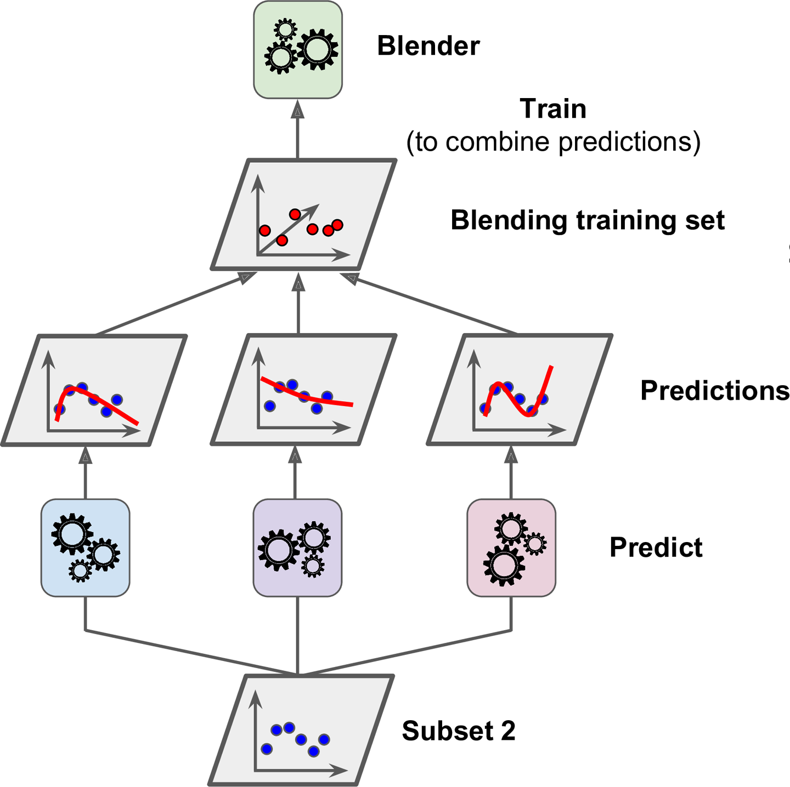

앙상블 방법은 예측기가 가능한 한 서로 독리적일 때 최고의 성능을 발휘한다. 다양한 분류기를 얻는 한 가지 방법은 각기 다른 알고리즘으로 학습시키는 것이다. 이렇게 하면 매우 다른 종류의 오차를 만들 가능성이 높기 때문에 앙상블 모델의 정확도를 향상시킨다.

# `Voting`

**하드 보팅, Hard Voting**

다수결 원칙과 비슷하다. 예측한 결괏값들 중 다수의 분류기가 결정한 예측값을 최종 보팅 결괏값으로 선정한다.

**소프트 보팅, Soft Voting**

분류기들의 레이블 값 결정 확률을 모두 더하고 이를 평균해서 이들 중 확률이 가장 높은 레이블 값을 최종 보팅 결괏값으로 선정한다.

{: width="75%" height="75%" class="align-center"}

위와 같이 예측값이 확률로 산출될 경우 `Hard Voting`과 `Soft Voting`의 최종 예측 Class가 다르게 나올 수 있다.

일반적으로 하드 보팅보다는 소프트 보팅이 예측 성능이 좋아서 더 많이 사용된다.

# `Bagging`, 배깅

각기 다른 훈련 알고리즘을 사용하는 Voting 방식과 달리 같은 알고리즘을 사용하고 훈련 세트의 서브셋을 무작위로 구성하여 분류기를 각기 다르게 학습시킨다.

{: width="75%" height="75%" class="align-center"}

배깅은 훈련 세트에서 **중복을 허용**하여 샘플링하는 방식, bootstrap aggregating의 줄임말이다.

페이스팅(pasting) : 중복을 허용하지 않는 방식

배깅 페이스팅 모두 같은 훈련 샘플을 여러 개의 예측기에 걸쳐 사용할 수 있다.

배깅만이 한 예측기를 위해 같은 훈련 샘플을 여러 번 샘플링 할 수 있다.

모든 예측기가 훈련을 마치면 앙상블은 모든 예측기의 예측을 모아서 새로운 샘플에 대한 예측을 만든다. 

수집함수
 - 분류 : 통계적 최빈값
 - 회귀 : 평균

앙상블은 비슷한 **편향**에서 더 작은 분산을 만든다.

부트스트래핑(중복을 허용한 리샘플링)은 각 예측기가 학습하는 서브셋에 다양성을 증가시키므로 배깅이 페이스팅보다 **편향**이 조금 더 높다. 다양성을 추가한다는 것은 예측기들의 상관관계를 줄이므로 앙상블의 **분산**을 감소시킨다. 전반적으로 배깅이 더 나은 모델을 만들기 때문에 일반적으로 더 선호한다.

# Boosting, 부스팅

{: width="75%" height="75%" class="align-center"}

약한 학습기를 여러 개 연결하여 강한 학습기를 만드는 앙상블 방법, 앞의 모델을 보완해나가면서 일련의 예측기를 학습시킨다. 

## AdaBoost, 에이다 부스트

{: width="75%" height="75%" class="align-center"}

이전 모델이 과소적합했던 훈련 샘플의 가중치를 더 높여서 이전 예측기를 보완하는 새로운 예측기를 만든다. 이렇게 하면 예측기는 학습하기 어려운 샘플에 점점 맞춰지게 된다.

알고리즘이 기반이 되는 첫 번째 분류기(예로 결정 트리)를 훈련 세트에서 훈련시키고 예측을 만든다 그 다음에 알고리즘이 잘못 분류된 훈련 샘플의 가중치를 상대적으로 높인다. 두 번째 분류기는 업데이트된 가중치를 사용해 훈련 세트에서 훈련하고 다시 예측을 만든다. 그 다음에 다시 가중치를 업데이트한다.

각각 개별 약한 학습기는 가중치를 부여해 결합한다.

{: width="75%" height="75%" class="align-center"}

### 원리

각 샘플 가중치 $w^{(i)}$는 초기에 $\frac{1}{m}$으로 초기화된다. 첫 번째 예측기가 학습되고 가중치가 적용된 에러율 $r_{1}$이 훈련 세트에 대해 계산된다.

{: width="75%" height="75%"}

예측기의 가중치 $\alpha_{j}$는 아래의 식을 사용해 계산된다.

$\alpha_{j}=\eta\log\frac{1-r_{j}}{r_{j}}$

 - $\alpha_{j}$ : 예측기의 가중치
 - $\eta$ : 학습률 하이퍼파라미터 (원래는 사용하지 않음)

예측기가 정확할 수록 가중치가 더 높아지게 된다. 만약 무작위로 예측하는 정도라면 가중치가 0에 가까울 것이다. 그러나 그보다 나쁘면 가중치는 음수가 된다.

무작위로 예측시 에러율($r$)이 0.5에 가까워짐 -> $\frac{1-r}{r}=\frac{1}{r}-1 \approx 1$ -> $\log\frac{1-r_{j}}{r_{j}} \approx 0$

그 다음 에이다부스트 알고리즘이 샘플의 가중치를 업데이트한다. 즉 잘못 분류된 샘플의 가중치가 증가된다.

{: width="50%" height="50%"}

그런 다음 모든 샘플의 가중치를 $\sum_{i=1}^{m}w^{(i)}$로 나눠 정규화한다.

마지막으로 새 예측기가 업데이트된 가중치를 사용해 훈련되고 전체 과정이 반복된다. 새 예측기의 가중치가 계산되고 샘플의 가중치를 업데이트해서 또 다른 예측기를 훈련시키는 식이다. 이 알고리즘은 지정된 예측기 수에 도달하거나 완벽한 예측기가 만들어지면 중지된다.

예측을 할 때 에이다부스트는 단순히 모든 에측기의 예측을 계산하고 예측기 가중치 $\alpha_{j}$를 더해 예측 결과를 만든다. 가중치 합이 가장 큰 클래스가 예측 결과가 된다.

{: width="75%" height="75%"}

과소적합시 예측기 수를 증가시키거나 기반 예측기의 규제 하이퍼 파라미터를 감소시켜 볼 수 있다. 또한 학습률을 약간 증가시켜 볼 수 있다.

## Gradient Boosting, 그레이디언트 부스팅

{: width="75%" height="75%"}

앙상블에 이전까지의 오차를 보정하도록 예측기를 순차적으로 추가한다. 에이다부스트처럼 반복마다 샘플의 가중치를 수정하는 대신 이전 예측기가 만든 잔여 오차에 새로운 예측기를 학습시킨다.

{: width="75%" height="75%"}

경사 하강법을 이용하여 가중치를 업데이트한다.

 - 분류의 실제 값 : $y$
 - 피처 : $x_{1}, x_{2}, \cdots, x_{n}$
 - 예측 함수 : $F(x)$
 - 오류식 : $h(x)=y-F(x)$

이 오류식을 최소화하는 방향성을 가지고 반복적으로 가중치 값을 업데이트한다. (경사 하강법)

학습시 `learning_rate`는 각 트리의 기여 정도를 조절하며 낮게 설정하면 앙상블을 훈련 세트에 학습시키기 위해 많은 트리가 필요하지만 일반적으로 예측의 성능은 좋아진다. 이는 축소(shrinkage)라고 부르는 규제 방법이다.

아래 그림은 트리의 개수에 따른 GBRT 앙상블을 보여준다.

{: width="75%" height="75%"}

왼쪽은 훈련 세트를 학습하기에 트리가 충분하지 않은 반면 오른쪽은 트리가 너무 많아 훈련 세트에 과대적합되었다.

과대적합시 학습률을 감소시키거나, (예측기 수가 너무 많으면) 알맞은 개수를 찾기 위해 조기 종료 기법을 사용할 수 있다.

# 스태킹, stacked generalization

스태킹은 개별적인 여러 알고리즘을 서로 결합해 예측 결과를 도출한다는 점에서 배깅(Bagging), 부스팅(Boosting)과 공통점을 가지고 있다. 하지만 가장 큰 차이점은 개별 알고리즘으로 예측한 데이터를 기반으로 다시 예측을 수행한다는 것이다. 즉, 개별 알고리즘의 예측 결과 데이터 세트를 최종적인 메타 데이터 세트로 만들어 별도의 ML 알고리즘으로 최종 학습을 수행하고 테스트 데이터를 기반으로 다시 최종 에측을 수행하는 방식이다.

스태킹 모델은 두 종류의 모델이 필요하다
1. 개별적인 기반 모델
2. 이 개별 기반 모델의 예측 데이터를 학습 데이터로 만들어서 학습하는 최종 메타 모델

스태킹 모델의 핵심은 여러 개별 모델의 예측 데이터를 각각 스태킹 형태로 결합해 초종 메타 모델의 학습용 피처 데이터 세트와 테스트용 피처 데이터 세트를 만드는 것이다.

현실 모델에 적용하는 경우는 그리 많지 않다. 2~3개의 개별 모델만을 결합해서는 쉽게 예측 성능을 향상시킬 수 없으며, 스태킹을 적용한다고 해서 반드시 성능 향상이 되리라는 보장도 없다. 일반적으로 성능이 비슷한 모델을 결합해 좀 더 나은 성능 향상을 도출하기 위해 적용된다.

{: width="75%" height="75%"}

앙상블에 속한 모든 예측기의 예측을 취합하는 간단한 함수를 사용하는 대신 취합하는 모델을 훈련시킬 수 없을까? 라는 기본 아이디어로 출발한다. 

{: width="75%" height="75%"}

새로운 샘플에 회귀 작업을 수행하는 앙상블을 보여주고 있다. 아래의 세 예측기는 각각 다른 값(3.1, 2.7, 2.9)을 예측하고 마지막 예측기(블렌더(blender) 또는 메타 학습기(meta learner))가 이 예측을 입력으로 받아 최종 예측(3.0)을 만든다.

블렌더를 학습시키는 일반적인 방법은 홀드 아웃(hold-out) 세트를 사용하는 것이다. 

{: width="75%" height="75%"}

훈련 세트를 두 개의 서브셋으로 나눈다. 첫 번째 서브셋은 첫 번째 레이어의 예측을 훈련시키기 위해 사용된다.

{: width="75%" height="75%"}

첫 번째 레이어의 예측기를 사용해 두 번째 홀드아웃 세트에 대한 예측을 만든다. 예측기들이 훈련하는 동안 이 샘플들을 전혀 보지 못했기 때문에 이때 만들어진 예측은 완전히 새로운 것이다. 홀드 아웃 세트의 각 샘플에 대해 세 개의 예측값이 있다. 타깃값은 그대로 쓰고 앞에서 예측한 값을 입력 특성으로 사용하는 새로운 훈련 세트를 만들 수 있다.(새로운 훈련 세트는 3차원이 된다.) 블렌더가 새 훈련 세트로 훈련된다. 즉, 첫 번째 레이어의 예측을 가지고 타깃값을 예측하도록 학습된다.

{: width="75%" height="75%"}

하나는 선형 회귀로 하나는 랜덤 포레스트 회귀로 블렌더를 여러 개 훈련시키는 것도 가능하다. 그러면 블렌더만의 레이어가 만들어지게 된다. 이렇게 하려면 훈련 세트를 세 개의 서브셋으로 나눈다. 첫 번째 세트는 첫 번째 레이어를 훈련시키는 데 사용되고 두 번째 세트는 (첫 번째 레이어의 예측기로) 두 번째 레이어를 훈련시키기 위한 훈련 세트를 만드는 데 사용된다. 그리고 세번째 세트는 (두 번째 레이어의 예측기로) 세 번째 레이어를 훈련시키기 위한 훈련 세트를 만드는 데 사용된다. 작업이 끝나면 각 레이어를 차례대로 실행해서 새로운 샘플에 대한 예측을 만들 수 있다.

## CV 기반의 스태킹

# 기타

- 병렬성
  - 배깅, 페이스팅, 랜덤 포레스트: 각 예측기는 독립적이므로 여러 대의 서버에 분산하여 앙상블의 훈련 속도를 높일 수 있다.
  -  부스팅 앙상블 : 이전 예측기를 기반으로 만들어지므로 훈련이 순차적이어야 하고 여러 대의 서버에 분산해서 얻을 수 있는 이득이 없다. 
  -  스태킹 앙상블 : 한 층의 모든 예측기가 각각 독립적이므로 여러 대의 서버에서 병렬로 훈련될 수 있으나 한 층에 있는 예측기들은 이전 층의 예측기들이 훈련된 후에 훈련될 수 있다.

> 출처
 - Aurelien, Geron, 『핸즈온 머신러닝』, 박해선, 한빛미디어(2020)
 - 권철민, 『파이썬 머신러닝 완벽 가이드』, 위키북스(2020)
 - Gradinet Boosting GIF : https://github.com/bgreenwell