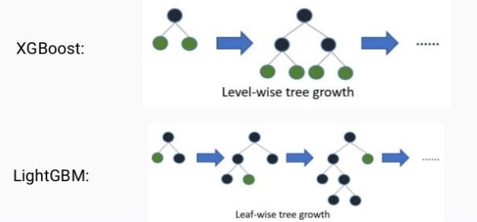

`XGBoost`는 매우 뛰어난 부스팅 알고리즘이지만 `XGBoost`에서 `GridSearchCV`로 수행시간이 너무 오래 걸려서 많은 파라미터를 튜닝하기에 어려움을 겪을 수밖에 없다.

`LightGBM`은 `XGBoost`보다 학습에 걸리는 시간이 훨씬 적으며 메모리 사용량도 상대적으로 적다. 이는 기능상의 부족함으로 비춰질 수 있지만 실제는 그렇지 않다.

적은 데이터 세트에 적용할 경우 과적합이 발생하기 쉽다는 단점이 있다.(10000건 이하)

`LightGBM`은 일반 `GBM` 계열의 트리 분할 방법과 다르게 리프 중심 트리 분할(Leaf Wise) 방식을 사용한다. 기존의 대부분 트리 기반 알고리즘은 트리의 깊이를 효과적으로 줄이기 위한 균형 트리 분할(Level Wise) 방식을 사용한다.

{: width="75%" height="75%" class="align-center"}

균형 트리 분할(Leaf Wise) 방식을 사용하면 최대한 균형 잡힌 트리를 유지하면서 분할하기 때문이 트리의 깊이가 최소화될 수 있다. 이런 균형 잡힌 트리를 생성하는 이유는 오버피팅에 보다 더 강한 구조를 가질 수 있다고 알려져 있기 때문이다. 반대로 균형을 맞추기 위한 시간이 필요하다는 상대적인 단점이 있다.

하지만 `LightGBM`의 리프 중심 트리 분할 방식은 트리의 균형을 맞추지 않고 최대 손실 값(max delta loss)를 가지는 리프 노드를 지속적으로 분할하면서 트리의 깊이가 깊어지고 비대칭적인 규칙트리가 생성된다. 하지만 이렇게 최대 손실값을 가지는 리프 노드를 지속적으로 분할해 생성된 규칙 트리는 학습을 반복할수록 결국은 균형 트리 분할 방식보다 예측 오류 손실을 최소화할 수 있다는 것이 `LightGBM`의 구현 사상이다.

XGBoost 대비 LightGBM의 장점
 - 더 빠른 학습과 예측 수행 시간
 - 더 작은 메모리 사용량
 - 카테고리형 피처의 자동 변환과 최적 분할

> 출처
 - 권철민, 『파이썬 머신러닝 완벽 가이드』, 위키북스(2020)