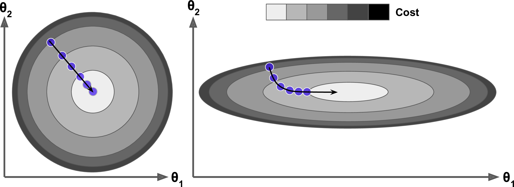
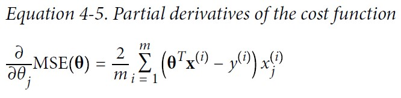

# 경사 하강법, gradient descent

{: width="80%" height="80%" class="align-center"} [source](https://commons.wikimedia.org/wiki/File:Gradient_descent.gif)

비용 함수를 최소화하기 위해서 반복해서 파라미터를 조정해가는 것

{: width="80%" height="80%" class="align-center"}

파라미터 벡터 $\theta$에 대해 비용 함수의 현재 그레이디언트를 계산하고 그레이디언트가 감소하는 방향으로 진행한다. 그레이디언트가 0이 되면 최솟값에 도달한 것이다.

$\theta$를 임의의 값으로 시작해서(random initialization) 한 번에 조금씩 비용 함수가 감소되는 방향으로 진행하여 알고리즘이 최솟값에 수렴할 때까지 점진적으로 향상시킨다.

경사 하강법에서 중요한 파라미터는 `step`의 크기로, 학습률(learning rate) 하이퍼 파라미터로 결정된다. 

{: width="80%" height="80%" class="align-center"}

학습률이 너무 작으면 알고리즘이 수렴하기 위해 반복을 많이 진행해야 하므로 시간이 오래 걸린다.

{: width="80%" height="80%" class="align-center"}

학습률이 너무 크면 골짜기를 가로질러 반대편으로 건너뛰게되어 이전보다 더 높은 곳으로 올라가게 될 수도 있다. 이는 알고리즘을 더 큰 값으로 발산하게 만든다.

{: width="80%" height="80%" class="align-center"}

무작위 초기화로 알고리즘이 왼쪽에서 시작하면 전역 최솟값보다 덜 좋은 지역 최솟값에 수렴한다. 알고리즘이 오른쪽에서 시작하면 평탄한 지형을 지나기 위해 오래 걸리고 (그레이디언트가 작기 때문에 `step`의 크기가 작다) 일찍 멈추게 되어 전역 최솟값에 도달하지 못한다.

`loss function`에 따라 `loss function`이 볼록 함수(convex function, 두 점을 이은 선분이 곡선 위에 위치)일 경우 하나의 전역 최솟값만 가질 수 있다.

**적응형 선형 뉴런(ADAptive LInear NEuron, ADALINE)에서의 경사하강법**

$\phi(w^{T}x)=w^{T}x$
 - $\phi(z)$ : 선형 활성화 함수
 - $x$ : 입력값
 - $w$ : 가중치 벡터
 - $z$ : $w^{T}x$

비용함수 $J$ : 계산된 출력과 진짜 클래스 레이블 사이의 제곱 오차합(Sum of Squared Errors, SSE)

$J(w)=\frac{1}{2}\sum_{i}(y^{(i)}-\phi(z^{(i)}))^{2}$
 - $\frac{1}{2}$ : 그레이디언트를 편하게 계산하기 위한 상수

{: width="80%" height="80%" class="align-center"}

경사 하강법을 사용하면 비용 함수 $J(w)$의 그래디언트 $\nabla J(w)$의 반대방향으로 조금씩 가중치를 업데이트 한다.

$w:=w+\Delta w$

가중치 변화량 $\Delta w$는 음수의 그래디언트에 학습률 $\eta$를 곱한 것으로 정의한다.

$\Delta w=-\eta\nabla J(w)$

비용 함수의 그래디언트를 계산하려면 각 가중치 $w_{j}$에 대한 편도 함수를 계산해야 한다.

$\nabla J(w)=\frac{\partial J}{\partial w_{j}}=\sum_{i}(y^{(i)}-\phi(z^{(i)}))x_{j}^{(i)}$

따라서 가중치 $w_{j}$의 업데이트 공식을 다음과 같이 쓸 수 있다.

$\Delta w_{j}=-\eta\frac{\partial J}{\partial w_{j}}=-\eta\sum_{i}(y^{(i)}-\phi(z^{(i)}))x_{j}^{(i)}$

---

**편미분 유도**

{: width="80%" height="80%" class="align-center"}

---

{: width="80%" height="80%" class="align-center"}

특성들의 **스케일**이 매우 다르면 한쪽으로 길쭉한 모양일 수 있다.
 - 왼쪽의 경사 하강법 알고리즘이 최솟값으로 곧장 진행하고 있어 빠르게 도달한다.
 - 오른쪽 그래프는 처음에 전역 최솟값의 방향에 거의 직각으로 향하다가 평편한 골짜기를 길게 돌아서 나간다. 결국 최솟값에 도달하겠지만 오래 걸릴 것이다.

## 배치 경사 하강법

경사 하강법을 구현하려면 각 모델 파라미터 $\theta_{j}$에 대해 비용 함수의 그레이디언트를 계산해야 한다. 다시 말해 $\theta_{j}$가 조금 변경될 때 비용 함수가 얼마나 바뀌는지 계산해야 한다. 이를 **편도함수**라고 한다. 

{: width="60%" height="60%"}

편도함수를 각각 계산하는 대신 아래 식을 사용하여 한꺼번에 계산할 수 있다. 그레이디언트 벡터 $\nabla_{\theta}MSE(\theta)$는 비용 함수의 (모델 파라미터마다 한 개씩인) 편도함수를 모두 담고 있다.

{: width="60%" height="60%"}

*[Equation 4-7] 경사 하강법의 스텝*

$\theta^{\text{(next step)}}=\theta-\eta\nabla_{\theta}MSE(\theta)$

이 공식은 매 경사 하강법 스텝에서 전체 훈련 세트 $\textbf{X}$에 대해 계산한다. 그래서 이 알고리즘을 배치 경사 하강법이라고 한다. 즉, 매 스텝에서 훈련 데이터 전체를 사용한다. 이런 이유로 매우 큰 훈련 세트에서는 아주 느리다. 그러나 경사 하강법은 특성 수에 민감하지 않아 수십만 개의 특성에서 선형회귀를 훈련시키려면 정규방정식이나 SVD 분해보다 경사 하강법이 훨씬 빠르다.

## 확률적 경사 하강법

`Stochastic gradient descent`=`On-line gradient descent`=`Sequential gradient descent`

엄밀히 말하면 `On-line GD`의 경우 시간의 개념(recent)이 더 들어가는 듯 하다.

첫 번째 수식처럼 모든 샘플 $x^{(i)}$에 대하여 누적된 오차의 합을 기반으로 가중치를 업데이트 하는 대신 두 번째 수식처럼 각 훈련 샘플에 대해서 조금씩 가중치를 업데이트한다.

$\Delta \mathbf{w}=\eta\sum_{i}(y^{(i)}-\phi(z^{(i)}))\mathbf{x}^{(i)}$

$\Delta \mathbf{w}=\eta(y^{(i)}-\phi(z^{(i)}))\mathbf{x}^{(i)}$

가중치가 더 자주 업데이트되기 때문에 수렴속도가 훨씬 빠르다.

배치 경사 하강법의 가장 큰 문제 : 매 스텝에서 전체 훈련 세트를 사용해 그레이디언트를 계산한다. 이는 훈련 세트가 커지면 매우 느려지게 된다.

확률적 경사 하강법은 매 스텝에서 한 개의 샘플을 무작위로 선택하고 그 하나의 샘플에 대한 그레이디언트를 계산한다. 매 반복에서 다뤄야 할 데이터가 매우 적기 때문에 한 번에 하나의 샘플을 처리하면 알고리즘이 훨씬 빠르다. 또한 매 반복에서 하나의 샘플만 메모리에 있으면 되므로 매우 큰 훈련 세트도 훈련시킬 수 있다.

반면 확률적이므로 이 알고리즘은 배치 경사 하강법보다 훨씬 불안정하다. 비용 함수가 최솟값에 다다를 때까지 부드럽게 감소하지 않고 위아래로 요동치며 평균적으로 감소한다. 시간이 지나면 최솟값에 매우 근접하겠지만 요동이 지속되면서 최솟값에 안착하지 못할 것이다. 알고리즘이 멈출 때 좋은 파라미터가 구해지겠지만 최적치는 아니다.

{: width="60%" height="60%"}

(Local Minimum 등)비용함수가 매우 불규칙할 때 알고리즘이 지역 최솟값을 건너뛰도록 도와주므로 확률적 경사 하강법이 배치 경사 하강법보다 전역 최솟값을 찾을 가능성이 높다.

무작위성은 지역 최솟값에서 탈출시켜줘서 좋지만 알고리즘을 전역 최솟값에 다다르지 못하게 한다는 점에서는 좋지 않다. 이를 위해서 학습률을 점진적으로 감소시키는 방법을 사용한다. 시작할 때는 학습률을 크게 하고 점점 작게 줄여서 알고리즘이 전역 최솟값에 도달하게 한다. 반복에서 학습률을 결정하는 함수를 학습 스케줄(learnign schedule)이라고 부른다.

샘플을 무작위로 선택하기 때문에 어떤 샘플은 한 에포크에서 여러 번 선택될 수 있고 어떤 샘플은 전혀 선택되지 못할 수도 있다. 알고리즘이 에포크마다 모든 샘플을 사용하게 하려면 훈련 세트를 섞은 후 차례대로 하나씩 선택하고 에포크에서 다시 섞는 식의 방법을 사용할 수 있다. 그러나 이렇게 하면 보통 더 늦게 수렴된다.

훈련 샘플이 IID(independent and identically distributed)를 만족해야 평균적으로 파라미터가 전역 최적점을 향해 진행한다고 보장할 수 있다. 훈련하는 동안 샘플을 섞으면 된다. 만약 레이블 순서대로 정렬된 샘플처럼 샘플을 섞지 않은 채로 사용하면 확률적 경사 하강법이 먼저 한 레이블에 최적화하고 그 다음 두 번째 레이블을 최적화하는 식으로 진행된다. 결국 이 모델은 최적점에 가깝게 도달하지 못할 것이다.

## 미니배치 경사 하강법

`mini-batch gradient descent`

배치 경사 하강법에 비해 가중치 업데이트가 더 자주 일어나므로 수렴 속도가 더 빠르다. 또한 훈련 샘플을 순회하는 `for` 반복을 벡터화된 연산으로 바꾸어 주므로 학습 알고리즘의 계산 효율성이 크게 향상된다.

각 스텝에서 전체 훈련 세트나 하나의 샘플을 기반으로 그레이디언트를 계산하는 것이 아니라 미니배치라 부르는 임의의 작은 샘플 세트에 대해 그레이디언트를 계산한다. `SGD`에 비해 미니배치 경사 하강법의 주요 장점은 행렬 연산에 최적화된 GPU를 사용해서 얻는 성능 향상이다. 

특히 미니배치를 어느 정도 크게 하면 이 알고리즘은 파라미터 공간에서 `SGD`보다 덜 불규칙하게 움직인다. 결국 미니배치 경사 하강법이 `SGD`보다 최솟값에 더 가까이 도달하게 될 것이다. 하지만 지역 최솟값에서 빠져나오기는 더 힘들지도 모른다.

{: width="60%" height="60%"}

> 출처
 - Aurelien, Geron,『핸즈온 머신러닝』, 박해선, 한빛미디어(2020)
 - Sebastian Raschka,『머신 러닝 교과서 with 파이썬, 사이킷런, 텐서플로』, 박해선, 길벗(2019)