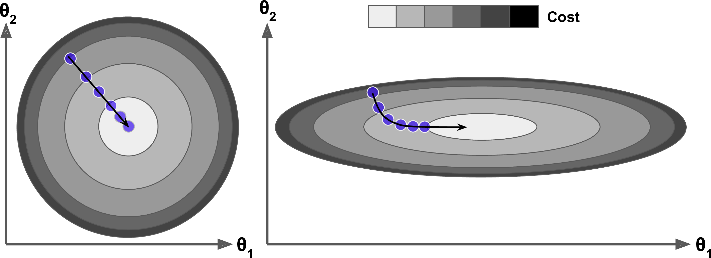
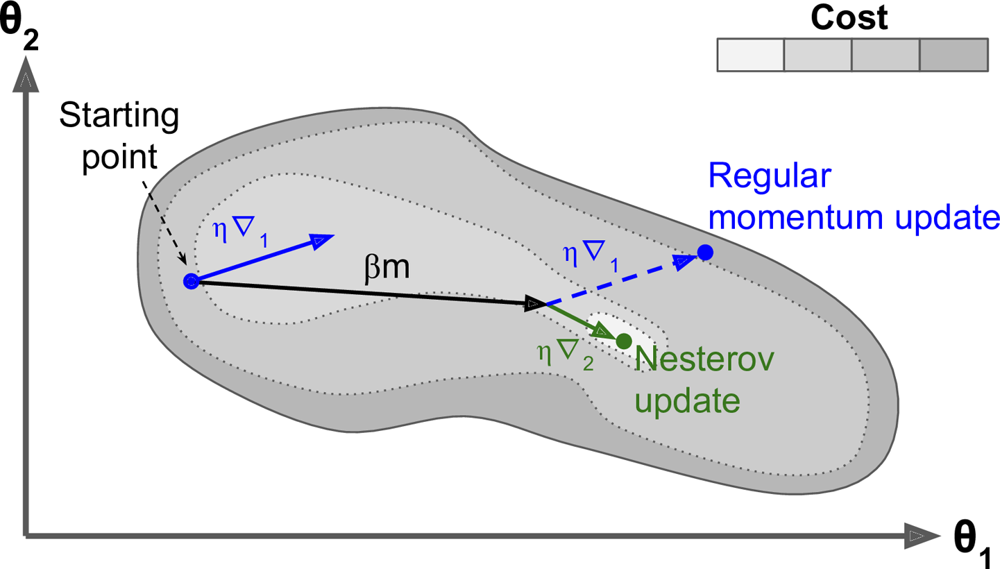
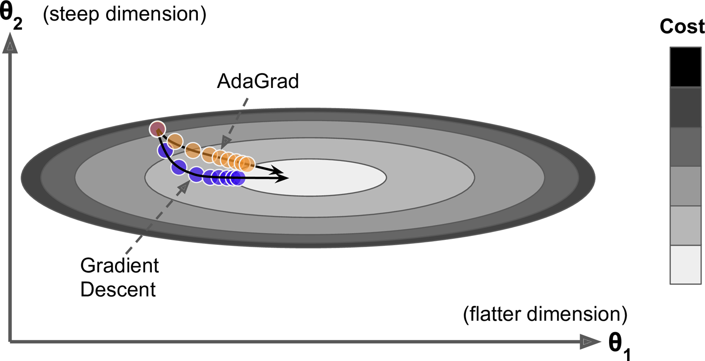

# 경사 하강법

경사 하강법은 가중치에 대한 비용 함수 $J(\theta)$의 그레이디언트 ($\nabla_{\theta}J(\theta)$)에 학습률 $\eta$를 곱한 것을 바로 차감하여 $\theta$를 갱신한다. 공식은 $\theta \leftarrow \theta-\eta \nabla_{\theta}J(\theta)$ 이다. 이 식은 이전 그레이디언트가 얼마였는지 고려하지 않는다. 국부적으로 그레이디언트가 아주 작으면 매우 느려질 것이다.

# 모멘텀 최적화, Momentum

모멘텀 최적화는 이전 그레이디언트를 고려한다. 매 반복에서 현재 그레이디언트를 (학습률 $\eta$를 곱한 후) **모멘텀 벡터** $m$에 더하고 이 값을 빼는 방식으로 가중치를 갱신한다.

다시 말해 그레이디언트를 속도가 아니라 가속도로 사용한다. 

*[Momentum Algorithm]*

1. $m \leftarrow \beta m-\eta \nabla_{\theta}J(\theta)$
2. $\theta \leftarrow \theta+m$

* $\beta$ : 모멘텀(마찰저항), 모멘텀이 너무 커지는 것을 막기 위한 파라미터이다. 0(높은 마찰저항), 1(마찰저항 없음) 사이로 설정되어야 한다. 일반적으로 0.9

그레이디언트가 일정하다면 종단속도(즉, 가중치를 갱신하는 최대 크기)는 학습률 $\eta$를 곱한 그레이디언트에 $\frac{1}{1-\beta}$를 곱한 것과 같다. 

종단속도는 등속도 운동이므로

$m = \beta m-\eta \nabla_{\theta}J(\theta)$

$m(1-\beta) = -\eta\nabla_{\theta}J(\theta)$

$m = -\frac{1}{1-\beta}\eta\nabla_{\theta}J(\theta)$

예를 들어 $\beta=0.9$ 면 종단 속도는 그레이디언트와 학습률을 곱하고 다시 10을 곱한 것과 같으므로 모멘텀 최적화가 경사 하강법보다 10배 빠르게 진행된다. 이는 모멘텀 최적화가 경사 하강법보다 더 빠르게 평편한 지역을 탈출하게 도와준다. 

{: width="80%" height="80%" class="align-center"}

입력값의 스케일이 매우 다르면 비용 함수는 한쪽이 길쭉한 그릇 모양이 되는데, 경사 하강법이 가파른 경사를 꽤 빠르게 내려가지만 좁고 긴 골짜기에서는 오랜 시간이 걸린다. 반면에 모멘텀 최적화는 골짜기를 따라 바닥(최적점)에 도달할 때까지 점점 더 빠르게 내려간다. 배치 정규화를 사용하지 않는 심층 신경망에서 상위층은 종종 스케일이 매우 다른 입력을 받게 된다. 모멘텀 최적화를 사용하면 이런 경우 큰 도움이 된다. 또한 이 기법은 **지역 최적점**을 건너뛰도록 하는 데도 도움이 된다.

모멘텀 때문에 옵티마이저가 최적값에 안정되기까지 건너뛰었다가 다시 돌아오고, 다시 또 건너 뛰는 식으로 여러 번 왔다 갔다 할 수 있다. 이것이 시스템에 마찰저항이 조금 있는 것이 좋은 이유이다. 이는 이런 진동을 없애주고 빠르게 수렴되도록 한다.

위의 내용은 [이곳](https://distill.pub/2017/momentum/)에서 실험해볼 수 있다.

# 네스테로프 가속 경사, Nesterov

1983년 유리 네스테로브가 제안하여 기본 모멘텀 최적화보다 거의 항상 더 빠르다. 

현재 위치가 $\theta$가 아니라 모멘텀의 방향으로 조금 앞선
$\theta+\beta m$ 에서 비용 함수의 그레이디언트를 계산하는 것이다.

*[Nesterov Accelerated Gradient algorithm]*
1. $m \leftarrow \beta m-\eta \nabla_{\theta}J(\theta+\beta m)$
2. $\theta \leftarrow \theta+m$

일반적으로 모멘텀 벡터가 최적점을 향하는 방향을 가리킬 것이므로 이런 변경이 가능하다.

{: width="80%" height="80%" class="align-center"}

* $\nabla_{1}$ : 시작점 $\theta$에서 측정한 비용함수의 그레이디언트
* $\nabla_{2}$ : ($\theta+\beta m$)에서 측정한 비용함수의 그레이디언트

위 그림처럼 원래 위치에서 그레이디언트를 사용하는 것보다 그 방향으로 조금 더 나아가서 측정한 그레이디언트를 사용하는 것이 약간 더 정확할 것이다.

위 그림에서 보듯이 네스테로프 업데이트가 최적값에 더 가깝다. 시간이 지나면 이 작은 개선이 쌓여서 `NAG(Nesterov Accelerated Gradient)` 가 기본 모멘텀 최적화보다 확연이 빨라지게 된다. 또한 모멘텀이 골짜기를 가로지르도록 가중치에 힘을 가할 때 

* $\nabla_{1}$은 골짜기를 더 가로지르도록 독려한다.

* $\nabla_{2}$은 계곡의 아래쪽으로 잡아당기게 된다. 이는 진동을 감소시키고 수렴을 빠르게 만들어준다.

// TODO 실제에서의 손쉬운 계산을 위한 방법론

# AdaGrad

한쪽이 길쭉한 그릇 문제를 다시 생각해보자 경사 하강법은 전역 최적점 방향으로 곧장 향하지 않고 가장 가파른 경사를 따라 빠르게 내려가기 시작해서 골짜기 아래로 느리게 이동한다. 알고리즘이 이를 일찍 감지하고 전역 최적점 쪽으로 좀 더 정확한 방향을 잡았다면 좋았을 것이다.

AdaGrad 알고리즘은 가장 가파른 차원을 따라 그레이디언트 벡터의 스케일을 감소시켜 이 문제를 해결한다. 

*[AdaGrad Algorithm]*
1. $s \leftarrow s+\nabla_{\theta}J(\theta) \otimes \nabla_{\theta}J(\theta)$
2. $\theta \leftarrow \theta-\eta\nabla_{\theta}J(\theta) \oslash \sqrt{s+\varepsilon}$

**1단계** : 그레이디언트의 제곱을 벡터 $s$에 누적한다. 이 벡터화된 식은 벡터 $s$의 각 원소 $s_{i}$마다 $s_{i} \leftarrow s_{i} + (\partial J(\theta)/\partial \theta_{i})^{2}$을 계산하는 것과 동일하다. 다시 말해 $s_{i}$는 파라미터 $\theta_{i}$에 대한 비용 함수의 편미분을 제곱하여 누적한다. 비용 함수가 $i$번째 차원을 따라 가파르다면 $s_{i}$는 반복이 진행됨에 따라 점점 커질 것이다.

**2단계** : 경사하강법과 거의 같다. 그레이디언트 벡터를 $\sqrt{s+\varepsilon}$으로 나누어 스케일을 조정한다. 이 벡터화된 식은 모든 파라미터 $\theta_{i}$에 대해 동시에 $\theta_{i} \leftarrow \theta_{i} -\eta\partial J(\theta)/ \partial \theta_{i}/\sqrt{s_{i}+\varepsilon}$를 계산하는 것과 동일하다.

요약하면 이 알고리즘은 학습률을 감소시키지만 경사가 완만한 차원보다 가파른 차원에 대해 더 빠르게 감소된다. 이를 적응적 학습률이라고 부르며, 전역 최적점 방향으로 곧장 가도록 갱신되는데 도움이 된다. 학습률 하이퍼 파라미터 $\eta$를 덜 튜닝해도 되는 점이 또 하나의 장점이다.

{: width="80%" height="80%" class="align-center"}

`AdaGrad`는 간단한 2차방정식 문제에 대해서는 잘 작동하지만 신경망을 훈련할 때 너무 일찍 멈추는 경우가 종종 있다. 학습률이 너무 감소되어 전역 초적점에 도착하기 전에 알고리즘이 완전히 멈춘다.

심층 신경망에는 가급적 사용하지 않는다. 선형 회귀 같은 간단한 작업에는 효과적일 수 있다.

# RMSProp
`AdaGrad`는 너무 빨리 느려져서 전역 최적점에 수렴하지 못하는 위험이 있다. `RMSProp` 알고리즘은 가장 최근 반복에서 비롯된 그레이디언트만 누적함으로써 이 문제를 해결한다. 

*[RMSProp Algorithm]*
1. $s \leftarrow \beta s+(1-\beta)\nabla_{\theta}J(\theta) \otimes \nabla_{\theta}J(\theta)$
2. $\theta \leftarrow \theta-\eta\nabla_{\theta}J(\theta) \oslash \sqrt{s+\varepsilon}$

보통 감쇠율 $\beta$는 0.9로 설정한다. 이는 보통 잘 작동한다. 아주 간단한 문제를 제외하고는 이 옵티마이저가 언제나 `AdaGrad`보다 훨씬 더 성능이 좋다.

# Adam

적응적 모멘트 추정(adaptive moment estimation)

`모멘텀 최적화`와 `RMSProp`의 아이디어를 합친 것이다. `모멘텀 최적화`처럼 지난 그레이디언트의 지수 감소 평균을 따르고 `RMSProp`철머 지난 그레이디언트 제곱의 지수 감소된 평균을 따른다.

*[Adam Algorithm]*
1. $m \leftarrow \beta_{1} m+(1-\beta_{1})\nabla_{\theta}J(\theta)$
2. $s \leftarrow \beta_{2} s+(1-\beta_{2})\nabla_{\theta}J(\theta) \otimes \nabla_{\theta}J(\theta)$
3. $\hat{m} \leftarrow \frac{m}{1-\beta_{1}^{t}}$
4. $\hat{s} \leftarrow \frac{s}{1-\beta_{2}^{t}}$
5. $\theta \leftarrow \theta+\eta \hat{m} \oslash \sqrt{\hat{s}+\varepsilon}$

* $t$ : (1부터 시작하는) 반복 횟수
* $\beta_{1}$ : 모멘텀 감쇠 하이퍼파라미터, 보통 `0.9`로 초기화한다.
* $\beta_{2}$ : 스케일 감쇠 하이퍼파라미터, `0.999`로 초기화하는 경우가 많다.
* $\varepsilon$ : 안정된 계산을 위해 $10^{-7}$ 같은 아주 작은 수로 초기화한다.

단계 1, 2, 5 : `모멘텀 최적화`, `RMSProp`과 아주 비슷하다.
차이 : 단계 1에서 지수 감소 합 대신 지수 감소 평균을 이용한다. 사실 이들은 상수 배인 것을 제외하면 동일하다.(지수 감소 평균은 지수 감소 합의 $1-\beta_{1}$배이다.)

모멘텀 알고리즘의

1. $m \leftarrow \beta m-\eta \nabla_{\theta}J(\theta)$
2. $\beta=\frac{\beta_{1}}{1-\beta_{1}}$
3. $m \leftarrow \frac{\beta_{1}}{1-\beta_{1}} m-\eta \nabla_{\theta}J(\theta)$
4. $m(1-\beta_{1}) \leftarrow \beta_{1} m-(1-\beta_{1})\eta \nabla_{\theta}J(\theta)$

단계 3, 4 : $m$과 $s$가 0으로 초기화되기 때문에 훈련 초기에 0쪽으로 치우치게 될 것이다. 그래서 이 두 단계가 훈련 초기에 $m$과 $s$의 값을 증폭시키는 데 도움을 준다.

$m$과 $s$가 0부터 시작하므로 $\beta_{1}m$과 $\beta_{2}s$가 반복 초기에 크게 기여를 못한다. 단계 3, 4는 이를 보상해주기 위해 반복 초기에 $m$과 $s$를 증폭시켜주지만 반복이 많이 진행되면 3, 4의 분모는 1에 가까워져($t$를 제곱하기 때문에) 거의 증폭되지 않는다. 

> 출처
 - Aurelien, Geron,『핸즈온 머신러닝』, 박해선, 한빛미디어(2020)