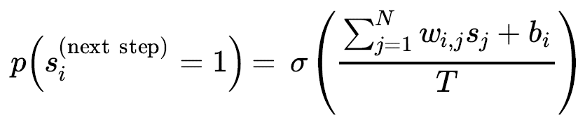
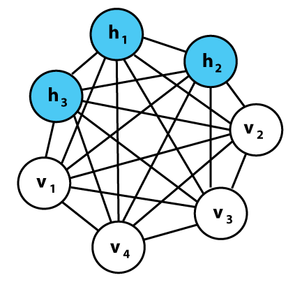
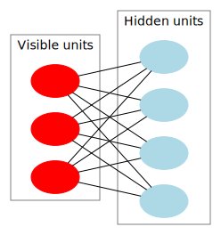
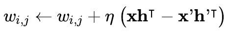

# 볼츠만 머신

1985년 제프리 힌튼과 테렌즈 세즈노스키가 발명했다.

완전 연결된 신경망이며 확률적(stochastic) 뉴런을 기반으로 한다. 계단 함수를 사용하여 결정론적으로 출력값을 만들지 않고 이 뉴런은 어느 정도 확률을 가지면 1을 출력하고 아니면 0을 출력한다. 이 인공 신경망에서 사용하는 확률 함수는 (통계 역학에서 사용하는) 볼츠만 분포에 기초하고 있기 때문에 여기에서 이름이 유래되었다.

*[i번째 뉴런이 1을 출력할 확률]*

{: width="80%" height="80%" class="align-center"}

* $s_{j}$ : $j$번째 뉴런의 상태(0 또는 1)
* $w_{i,j}$ : $i$번째 뉴런과 $j$번째 뉴런 사이의 연결 가중치, $w_{i,i}=0$
* $b_{i}$ : $i$번째 뉴런의 편향. 이를 위해 네트워크에 편향 뉴런을 추가한다.
* $N$ : 네트워크에 있는 뉴런 수
* $T$ : 네트워크의 온도, 온도가 높으면 출력은 더욱 랜덤해진다.(확률이 50%에 가까워짐)
* $\sigma$ : 로지스틱 함수

{: width="80%" height="80%" class="align-center"}

볼츠만 머신의 뉴런은 **가시 유닛**(visible unit)과 **은닉 유닛**(hidden unit) 두 개의 그룹으로 나뉘어 있다. 모든 뉴런은 동일한 확률적 방식으로 작동한다. 하지만 가시 유닛에서만 입력을 받고 출력을 내보낸다.

확률적이기 때문에 볼츠만 머신은 고정된 설정으로 안정화되지 못하고 대신 여러 설정으로 계속 전환된다. 하지만 충분히 긴 시간동안 실행한다면 특정 설정이 관측될 확률은 원래 설정이 아니라 연결 가중치와 편향만의 함수가 될 것이다.(카드 묶음을 충분히 많이 섞으면 초기 상태와 상관없어지는 것과 비슷하다). 네트워크가 이 상태에 도달하면 원래 설정은 잊힌다. 이를 **열평형**(thermal equilibrium)이라고 한다.(설정은 계속해서 바뀌지만) 네트워크가 열평형에 도달하도록 적절하게 네트워크의 파라미터를 지정하고 상태를 관찰함으로써 다양한 종류의 확률 분포를 시뮬레이션 할 수 있다. 이를 **생성 모델**(generative model)이라고 한다.

볼츠만 머신을 훈련시킨다는 것은 훈련 세트의 확률 분포를 근사하는 네트워크의 파라미터를 찾는다는 뜻이다. 예를 들어 세 개의 가시 뉴런이 있고 훈련 세트가 (0, 1, 1) 쌍 75%, (0, 0, 1) 쌍 10%, (1, 1, 1) 쌍 15%로 이루어져 있다면 볼츠만 머신을 훈련시킨 후 거의 비슷한 확률 분포로 랜덤한 0, 1의 쌍을 생성할 수 있다. 예를 들면 75%의 확률로 (0, 1, 1) 쌍이 출력될 것이다.

이런 생성 모델은 여러 방면으로 사용될 수 있다. 예를 들어 이미지에 훈련시킨 후 불완전하고 잡음 섞인 이미지를 네트워크에 주입하면 자동으로 이미지를 적절히 복원할 것이다. 또한 생성모델을 분류 작업에 사용할 수도 있다. 훈련 이미지 클래스를 인코딩하는 몇 개의 가시 뉴런만 추가하면 된다. (에를 들면 10개의 가시 뉴런을 추가하고 훈련 이미지가 5일 때 다섯 번째 뉴런만 켠다). 그런 다음 새로운 이미지가 주어지면 해당하는 클래스를 나타내기 위해 네트워크는 자동으로 적절한 가시 뉴런을 켤 것이다.(즉, 이미지가 5라면 다섯 번째 가시 뉴런만 켜질 것이다.)

안타깝게도 볼츠만 머신을 훈련시키기 위한 효율적인 방법은 없다. 그러나 제한된 볼츠만 머신은 매우 효율적인 훈련 알고리즘이 개발되었다.

# 제한된 볼츠만 머신

제한된 볼츠만 머신(restricted Boltzmann machine, RBM)은 가시 유닛과 히든 유닛 사이에만 연결이 있고 가시 유닛들 사이와 은닉 유닛들 사이에는 어떤 연결도 없는 볼츠만 머신이다.

{: width="80%" height="80%" class="align-center"}

3개의 가시 유닛과 4개의 히든 유닛을 가진 `RBM`

2005년에 미구엘 카레이라 페르미닝과 제프리 힌튼이 CD(Contrastive Divergence)라는 매우 효율적인 훈련 알고리즘을 소개했다.

## 작동원리

알고리즘이 가시 유닛의 상태를 $x_{1},x_2,...,x_n$으로 설정하는 식으로 훈련 샘플 $x$를 네트워크에 주입한다. 그런 다음

{: width="50%" height="50%"}

을 적용하여 은닉 유닛의 상태를 계산한다. 이렇게 하여 은닉 벡터 $h$를 얻는다. ($h_i$는 $i$번째 유닛의 상태). 그 다음에 같은 확률식을 적용하여 가시 유닛의 상태를 계산한다. 이렇게 하면 벡터 $x'$를 얻는다. 그리고 다시 한번 은닉 유닛의 상태를 계산하여 벡터 $h'$를 얻는다.

그런 다음 아래 규칙을 적용하여 각 연결 가중치를 업데이트한다.

*[Contrastive divergence weight update]*

{: width="50%" height="50%"}

* $\eta$ : 학습률

이 알고리즘의 최대 장점은 네트워크가 열평형에 도달할 때까지 기다릴 필요가 없다. 이 네트워크는 정방향, 역방향, 그리고 다시 정방향으로 계산이 진행되는 것이 전부이다. 이는 이전 알고리즘에 비해 비교할 수 없을 정도로 매우 효율적이다. 이것이 다층 RBM에 기초한 딥러닝이 처음으로 성공하게 된 핵심 요소였다.

> 출처
 - Aurelien, Geron,『핸즈온 머신러닝』, 박해선, 한빛미디어(2020)
 - https://en.wikipedia.org/wiki/Boltzmann_machine
 - https://en.wikipedia.org/wiki/Restricted_Boltzmann_machine
