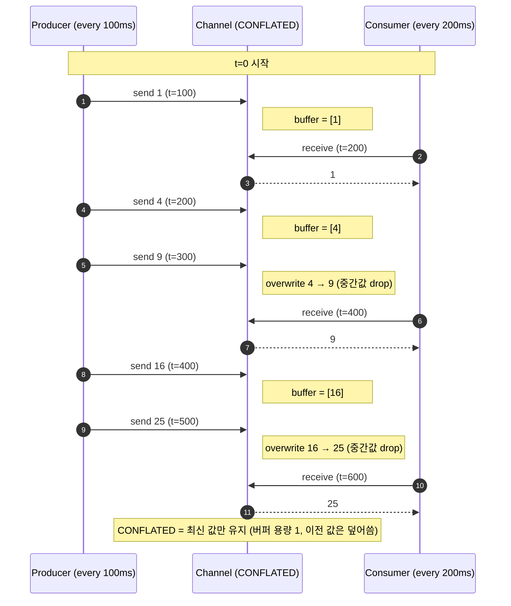
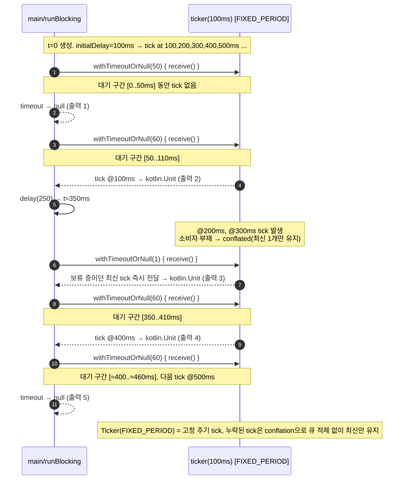

# 참고
- 알렉세이 세두노프, 『코틀린 완벽 가이드』(길벗, 2022) 13.3.1 채널

### 13.3.1 채널

채널은 임의의 데이터 스트림을 코루틴 사이에 공유할 수 있는 편리한 방법이다. `Channel` 인터페이스가 제공하는 채널에 대한 기본 연산은 데이터를 보내는 `send()` 메서드와 데이터를 받는 `receive()` 메서드다. 이런 메서드들이 자신의 작업을 완료할 수 없을 때, 예를 들어 채널 내부 버퍼가 꽉 찼는데 데이터를 채널에 보내려고 하면, 채널은 현재 코루틴을 일시 중단시키고 나중에 처리가 가능할 때 재개한다. 이 부분이 자바의 동시성 API에서 채널과 비슷한 역할을 하는 블로킹 큐(blocking queue)와 채널의 가장 큰 차이다. 블로킹 큐는 스레드를 블록시킨다. 제네릭 `Channel()` 함수를 사용해 채널을 만들 수 있다. 이 함수는 채널의 용량을 지정하는 정숫값을 받는다. 채널 기본 구현은 크기가 정해진 내부 버퍼를 사용한다. 버퍼가 꽉 차면 최소 하나 이상의 채널 원소가 상대방에 의해 수신될 때까지 `send()` 호출이 일시 중단된다. 이와 비슷하게, 버퍼가 비어있으면 누군가가 최소 하나 이상의 원소를 채널로 송신할 때까지 `receive()` 호출이 일시 중단된다. 예제를 살펴보자.

```kotlin
import kotlinx.coroutines.channels.Channel
import kotlinx.coroutines.*
import kotlin.random.Random

fun main() {
    runBlocking {
        val streamSize = 5
        val channel = Channel<Int>(3) // 채널 용량 = 3

        launch {
            for (n in 1..streamSize) {
                delay(Random.nextLong(100))
                val square = n * n
                println("Sending: $square")
                channel.send(square)
            }
        }

        launch {
            for (i in 1..streamSize) {
                delay(Random.nextLong(100))
                val n = channel.receive()
                println("Receiving: $n")
            }
        }
    }
}
```

첫 번째 코루틴은 정수 제곱 값의 스트림을 만들어내고, 원소를 세 개 저장할 수 있는 채널에 이 스트림을 전송한다. 이와 동시에 두 번째 코루틴이 생성된 수를 수신한다. 두 코루틴 중 어느 한쪽이 뒤처져 채널 버퍼가 꽉 차거나 비는 경우가 생겨서 일시 중단이 발생할 수 있게 일부러 지연 시간을 난수로 지정했다. 다양한 출력이 생길 수 있는데, 그중 하나는 다음과 같다.

```
Sending: 1
Receiving: 1
Sending: 4
Receiving: 4
Sending: 9
Receiving: 9
Sending: 16
Receiving: 16
Sending: 25
Receiving: 25
```

출력이 실제 지연 시간 값이나 다른 환경에 의해 달라질 수 있지만, 채널은 모든 값이 송신된 순서 그대로 수신되도록 보장한다.

`Channel()` 함수는 채널의 동작을 바꿀 수 있는 여러 특별한 값을 받을 수 있다. 이러한 값은 `Channel` 인터페이스의 동반 객체에 상수로 정의돼 있다.

• `Channel.UNLIMITED (= Int.MAX_VALUE)`: 이 경우 채널의 용량은 제한이 없고, 내부 버퍼는 필요에 따라 증가한다. 이런 채널은 `send()` 시에 결코 일시 중단되는 일이 없다. 다만 `receive()`를 하는 경우 버퍼가 비어있으면 일시 중단될 수 있다.

• `Channel.RENDEZVOUS (= 0)`: 이 경우 채널은 아무 내부 버퍼가 없는 랑데부 채널이 된다. `send()` 호출은 다른 어떤 코루틴이 `receive()`를 호출할 때까지 항상 일시 중단된다. 마찬가지로 `receive()` 호출은 다른 어떤 코루틴이 `send()`를 호출할 때까지 일시 중단된다. 채널 생성 시 용량을 지정하지 않으면 이 방식의 채널이 생성된다.

• `Channel.CONFLATED (= -1)`: 이 경우에는 송신된 값이 합쳐지는 채널(conflated channel)이다. 이 말은 `send()`로 보낸 원소를 최대 하나만 버퍼에 저장하고 이 값이 누군가에 의해 수신되기 전에 다른 `send()` 요청이 오면 기존의 값을 덮어 쓴다는 뜻이다. 따라서 수신되지 못한 원소 값은 소실된다. 이 채널의 경우 `send()` 메서드는 결코 일시 중단되지 않는다.

• `Channel.UNLIMITED`보다 작은 임의의 양수를 지정하면 버퍼 크기가 일정하게 제한된 채널이 생긴다.

랑데부 채널은 생산자와 소비자 코루틴이 교대로 활성화되도록 보장한다. 예를 들어 `Channel〈Int〉(Channel.RENDEZVOUS)`처럼 앞 예제의 채널 크기를 0으로 바꾸면 딜레이 시간과 관계없이 안정적인 동작 순서를 볼 수 있다.

```
Sending: 1
Receiving: 1
Sending: 4
Receiving: 4
Sending: 9
Receiving: 9
Sending: 16
Receiving: 16
Sending: 25
Receiving: 25
```

값이 합쳐지는 채널은 스트림에 가득한 모든 원소가 도착한 뒤로가 없고 소비자 코루틴이 뒤처지면 생산자가 만들어내 값 중 일부를 버려도 되는 경우 쓰인다. 첫 번째 예제의 소비자 지연 시간을 생산자 지연 시간의 두 배로 설정해보자.

```kotlin
import kotlinx.coroutines.channels.Channel
import kotlinx.coroutines.*

fun main() {
    runBlocking {
        val streamSize = 5
        val channel = Channel<Int>(Channel.CONFLATED)

        launch {
            for (n in 1..streamSize) {
                delay(100)
                val square = n * n
                println("Sending: $square")
                channel.send(square)
            }
        }

        launch {
            for (i in 1..streamSize) {
                delay(200)
                val n = channel.receive()
                println("Receiving: $n")
            }
        }
    }
}
```

실험해본 결과, 생산된 값 중 대략 절반만 수신돼 처리되며 다음과 같은 출력이 나올 수 있다.

```
Sending: 1
Receiving: 1
Sending: 4
Sending: 9
Receiving: 9
Sending: 16
Sending: 25
Receiving: 25
```




앞의 프로그램을 실행하면 마지막 줄을 출력한 다음에도 프로그램이 끝나지 않는다. 수신자 코루틴이 1부터 `streamSize`까지 이터레이션하므로 수신할 것으로 기대하는 원소 개수가 다섯 개이기 때문이다. 하지만 실제 수신되는 원소는 `streamSize/2` 근처이므로 이 기대는 결코 충족될 수 없다. 이 상황에서 필요한 것은 채널이 닫혀서 더 이상 데이터를 보내지 않는다는 사실을 알려주는 인증의 신호다. `Channel` API는 생산자 쪽에서 `close()` 메서드를 사용해 이런 신호를 보낼 수 있게 해준다. 소비자 쪽에서는 이터레이션 횟수를 고정하는 대신 채널에서 들어오는 데이터에 대해 이터레이션을 할 수 있다.


```kotlin
import kotlinx.coroutines.channels.Channel
import kotlinx.coroutines.*

fun main() {
    runBlocking {
        val streamSize = 5
        val channel = Channel<Int>(Channel.CONFLATED)
        launch {
            for (n in 1..streamSize) {
                delay(100)
                val square = n * n
                println("Sending: $square")
                channel.send(square)
            }
            channel.close()
        }
        launch {
            for (n in channel) {
                println("Receiving: $n")
                delay(200)
            }
        }
    }
}
```

이제 데이터 교환이 완료된 후 프로그램이 제대로 끝난다.

소비자 쪽에서는 명시적인 이터레이션을 사용하지 않고 `consumeEach()` 함수를 통해 모든 채널 콘텐츠를 얻어서 사용할 수 있다.

```kotlin
channel.consumeEach {
    println("Receiving: $it")
    delay(200)
}
```

채널이 닫힌 후 `send()`를 호출하면 `ClosedSendChannelException` 예외가 발생하며 실패한다. 채널이 닫힌 후 `receive()`를 호출하면 버퍼에 있는 원소가 소진될 때까지 정상적으로 원소가 반환되지만, 그다음에는 마찬가지로 `ClosedSendChannelException` 예외가 발생한다.

채널 통신에 참여하는 생산자와 소비자가 꼭 하나씩일 필요는 없다. 예를 들어 한 채널을 여러 코루틴이 동시에 읽을 수도 있다. 이런 경우를 팬 아웃(fan out)이라고 한다.

```kotlin
import kotlinx.coroutines.channels.Channel
import kotlinx.coroutines.*
import kotlin.random.Random

fun main() {
    runBlocking {
        val streamSize = 5
        val channel = Channel<Int>(2)

        launch {
            for (n in 1..streamSize) {
                val square = n * n
                println("Sending: $square")
                channel.send(square)
            }
            channel.close()
        }

        for (i in 1..3) {
            launch {
                for (n in channel) {
                    println("Receiving by consumer #$i: $n")
                    delay(Random.nextLong(100))
                }
            }
        }
    }
}
```

생성자 코루틴이 생성한 데이터 스트림을 세 소비자 코루틴이 나눠 받는다. 따라서 다음과 같은 출력이 나올 수 있다.


```
Sending: 1
Sending: 4
Sending: 9
Receiving by consumer #1: 1
Receiving by consumer #2: 4
Receiving by consumer #3: 9
Sending: 16
Sending: 25
Receiving by consumer #3: 16
Receiving by consumer #1: 25
```

마찬가지로 여러 생산자 코루틴이 한 채널에 쓰는 데이터를 한 소비자 코루틴이 읽는 팬 인(fan in)도 있다. 좀 더 일반적인 경우라면, 여러 생산자와 여러 소비자가 여러 채널을 공유할 수도 있다. 일반적으로 채널의 동작은 공정(fair)하다. 즉, 어떤 채널에 대해 `receive()`를 맨 처음 호출한 코루틴이 다음 원소를 읽게 된다.

### 생산자


앞에서 컬렉션 API를 설명할 때 보았듯 `sequence()` 함수와 비슷하게 동시성 데이터 스트림을 생성할 수 있는 `produce()`라는 특별한 코루틴 빌더가 있다. 이 빌더는 채널과 비슷한 `send()` 메서드를 제공하는 `ProducerScope` 영역을 도입해준다.

```kotlin
import kotlinx.coroutines.channels.*
import kotlinx.coroutines.*

fun main() {
    runBlocking {
        val channel = produce {
            for (n in 1..5) {
                val square = n * n
                println("Sending: $square")
                send(square)
            }
        }

        launch {
            channel.consumeEach { println("Receiving: $it") }
        }
    }
}
```

이 경우 채널을 명시적으로 닫을 필요가 없다. 코루틴이 종료되면 `produce()` 빌더가 채널을 자동으로 닫아준다.

예외 처리 관점에서 볼 때 `produce()`는 `async()`/`await()`의 정책을 따른다. `produce()` 안에서 예외가 발생하면 예외를 저장했다가 해당 채널에 대해 `receive()`를 가장 처음 호출한 코루틴 쪽에 예외가 다시 던져진다.

### 티커

coroutines 라이브러리에는 티커(ticker)라고 하는 특별한 랑데부 채널이 있다. 이 채널은 `Unit` 값을 계속 발생시키되 한 원소와 다음 원소의 발생 시점이 주어진 지연 시간만큼 떨어져 있는 스트림을 만든다. 이 채널을 만들려면 `ticker()` 함수를 사용해야 한다. 이 함수를 호출할 때 다음을 지정할 수 있다.

• `delayMillis`: 티커 원소의 발생 시간 간격을 밀리초 단위로 지정한다.

• `initialDelayMillis`: 티커 생성 시점과 원소가 최초로 발생하는 시점 사이의 시간 간격이다. 디폴트 값은 `delayMillis`와 같다.

• `context`: 티커를 실행할 코루틴 문맥이다(디폴트는 빈 문맥이다).

• `mode`: 티커의 행동을 결정하는 `TickerMode` 이넘이다.

  • `TickerMode.FIXED_PERIOD`: 생성되는 원소 사이의 시간 간격을 지정된 지연 시간에 최대한 맞추기 위해 실제 지연 시간을 조정한다.

  • `TickerMode.FIXED_DELAY`: 실제 흘러간 시간과 관계없이 `delayMillis`로 지정한 지연 시간만큼 시간을 지연시킨 후 다음 원소를 송신한다.

티커 모드의 차이를 알아보기 위해 다음 코드를 살펴보자.

```kotlin
import kotlinx.coroutines.*
import kotlinx.coroutines.channels.*

fun main() = runBlocking {
    val ticker = ticker(100)
    println(withTimeoutOrNull(50) { ticker.receive() })
    println(withTimeoutOrNull(60) { ticker.receive() })
    delay(250)
    println(withTimeoutOrNull(1) { ticker.receive() })
    println(withTimeoutOrNull(60) { ticker.receive() })
    println(withTimeoutOrNull(60) { ticker.receive() })
}
```

실행하면 다음 출력을 볼 수 있다.

```
null
kotlin.Unit
kotlin.Unit
kotlin.Unit
null
```

이 코드의 실행 과정을 단계별로 살펴보자.

**1.** 50밀리초 간격으로 티커 신호를 발으려고 시도한다. 티커 지연 시간이 100밀리초이므로 `withTimeoutOrNull()`은 신호를 받지 못하고 타임아웃이 걸려서 넘을 반환한다.

**2.** 그 후 다음 60밀리초 안에 신호를 받으려고 시도한다. 이번에는 티커가 시작하고 나서 100밀리초가 확실히 지난 것이므로 분명히 넘이 아닌 결괏값을 얻는다. `receive()`가 호출되면 티커가 재개된다.

**3.** 그 후 소비자 코루틴이 약 250밀리초 동안 일시 중단된다. 100밀리초 후에 티커는 다른 신호를 보내고 신호가 수신될 때까지 일시 중단된다. 이후 소비자와 티커 코루틴 모두 150밀리초 동안 일시 중단 상태로 남는다.

**4.** 소비자 코루틴이 재개되고 신호를 요청하려고 시도한다. 신호가 이미 보내졌기 때문에 `receive()`는 즉시 결괏를 반환한다(그래서 타임아웃을 1밀리초로 잡게 잡았다). 이제 티커는 마지막 신호를 보내고 나서 얼마나 시간이 지났는지 검사하고, 250밀리초가 지났다는 사실을 알게 된다. 아직 두 번의 완전한 주기(200밀리초와 50밀리초의 나머지에 해당한다. 티커는 지신의 대기 시간을 조정해서 다음 신호를 보낼 때까지의 지연 시간을 100 - 50 = 50밀리초로 줄인다. 이렇게 줄이는 이유는 한 주기에 해당하는 지연 시간(100밀리초)이 지난 후 세 신호를 보내기 위해서다.

**5.** 소비자는 50밀리초 타임아웃 안에 신호를 받으려고 시도한다. 다음 신호가 50밀리초 이전에 보내졌기 때문에 이 시도는 거의 확실히 성공할 것이다.

**6.** 마지막으로, 신호를 받으려는 `receive()` 호출이 거의 즉시 일어난다. 따라서 티커는 전체 지연 시간(100밀리초)을 다시 기다린다. 그 결과, 마지막 `receive()` 호출은 60밀리초 타임아웃 안에 티커로부터 신호를 받지 못하기 때문에 넘을 받는다.



티커 모드를 FIXED_RATE(deprecated)로 고정하면 결과가 다음과 같이 바뀐다.

```
null
kotlin.Unit
kotlin.Unit
null
kotlin.Unit
```

초반부는 앞의 예제(디폴트 티커 모드 FIXED_PERIOD)와 거의 비슷하게 진행된다. 하지만 250밀리초의 긴 지연 이후 소비자 코루틴이 재개될 때부터는 동작이 달라진다. 티커가 250밀리초 지연 사이에 이미 신호를 보냈기 때문에 세 번째 `receive()` 호출은 즉시 반환된다. 하지만 이제 티커는 실제 흐른 시간을 고려하지 않고 그냥 100밀리초를 기다린다. 따라서 네 번째 `receive()`는 60밀리초 안에 신호를 받지 못하고 넘을 반환한다. 반대로 다섯 번째 호출의 경우에는 중간에 신호가 발생하므로 신호를 정상적으로 반는다.

티커 관련 API는 현재 실험 단계에 있으며 미래의 코틀린 라이브러리 버전에서는 언제든 다른 내용으로 바뀔 수 있다는 점에 유의하라.

### 액터

가변 상태를 스레드 안전하게 공유하는 방법을 구현하는 일반적인 방법으로 액터(actor) 모델이 있다. 액터는 내부 상태와 다른 액터에게 메시지를 보내서 통신성 통신을 진행할 수 있는 수단을 제공하는 객체다. 액터는 자신에게 들어오는 메시지를 리슨(listen)하고, 자신의 상태를 바꾸면서 메시지에 응답할 수 있으며, 다른 메시지를 (자기 자신이나 다른 액터에게) 보낼 수 있고, 새로운 액터를 시작할 수 있다. 액터의 상태는 액터 내부에 갇혀져 있으므로 다른 액터가 직접 이 상태에 접

근할 수 없다. 다른 액터는 단지 메시지를 보내고 응답을 받아서 상태를 알 수 있을 뿐이다. 따라서 액터 모델은 각 기반의 동기화와 관련한 여러 가지 문제로부터 자유로울 수 있다.

코틀린 코루틴 라이브러리에서는 `actor()` 코루틴 빌더를 사용해 액터를 만든 수 있다. 액터는 특별한 영역(`ActorScope`)을 만들며, 이 영역은 기본 코루틴 영역에 자신에게 들어오는 메시지에 접근할 수 있는 수신자 채널이 추가된 것이다. `actor()` 빌더는 결과를 생성해내는 것이 목적이 아닌 잡을 시작한다는 점에서는 `launch()`와 비슷하지만 `CoroutineExceptionHandler`에 의존하는 `launch()`와 같은 예외 처리 정책을 따른다.

액터 API의 기본적인 사용법을 알아보겠다. 다음 예제를 통해 은행 계좌 잔고를 유지하고 어떤 금액을 지출하거나 입출할 수 있는 액터를 살펴보자. 우선, 메시지를 표현하는 클래스를 몇 가지 정의해야 한다.

```kotlin
sealed class AccountMessage

class GetBalance(
    val amount: CompletableDeferred<Long>
) : AccountMessage()

class Deposit(val amount: Long) : AccountMessage()

class Withdraw(
    val amount: Long,
    val isPermitted: CompletableDeferred<Boolean>
) : AccountMessage()
```

봉인된 클래스를 사용하면 `AccountMessage` 타입을 처리하는 `when` 식에서 `else`를 쓰지 않아도 된다.

`GetBalance` 인스턴스에는 `CompletableDeferred`라는 타입의 프로퍼티가 있다. 액터는 이 프로퍼티를 사용해서 `GetBalance` 메시지를 보낸 코루틴에게 현재 잔고를 돌려준다. `Withdraw` 클래스에도 인출에 성공하면 `true`를 돌려주고 그렇지 않으면 `false`를 돌려주기 위한 `isPermitted`라는 비슷한 프로퍼티가 있다.

이제 계좌 잔고를 유지하는 액터를 구현할 수 있다. 기본 로직은 단순하다. 메시지가 들어오는 채널을 계속 폴링(polling)하면서 수신한 메시지의 종류에 따라 적절한 동작을 수행한다.

```kotlin
fun CoroutineScope.accountManager(
    initialBalance: Long
) = actor<AccountMessage> {

    var balance = initialBalance

    for (message in channel) {
        when (message) {
            is GetBalance -> message.amount.complete(balance)

            is Deposit -> {
                balance += message.amount
                println("Deposited ${message.amount}")
            }

            is Withdraw -> {
                val canWithdraw = balance >= message.amount
                if (canWithdraw) {
                    balance -= message.amount
                    println("Withdrawn ${message.amount}")
                }
                message.isPermitted.complete(canWithdraw)
            }
        }
    }
}
```

`actor()` 빌더는 `produce()`에 대응한다고 할 수 있다. 두 빌더 모두 통신에 채널을 사용하지만, 액터는 데이터를 받기 위해 채널을 사용하고 생산자는 소비자에게 데이터를 보내기 위해 채널을 생성한다. 액터는 기본적으로 랑데부 채널을 사용한다. 하지만 `actor()` 함수를 호출하면서 용량을 변경하면 채널의 성격을 바꿀 수 있다.

`CompletableDeferred`에서 `complete()` 메서드를 사용하는 부분에 유의하라. 액터 클라이언트에게 요청 결과를 돌려줄 때는 이 방법을 사용한다.

이제 이 액터와 통신하는 코루틴을 한 쌍 만들자.


```kotlin
private suspend fun SendChannel<AccountMessage>.deposit(
    name: String,
    amount: Long
) {
    send(Deposit(amount))
    println("$name: deposit $amount")
}

private suspend fun SendChannel<AccountMessage>.tryWithdraw(
    name: String,
    amount: Long
) {
    val status = CompletableDeferred<Boolean>().let {
        send(Withdraw(amount, it))
        if (it.await()) "OK" else "DENIED"
    }
    println("$name: withdraw $amount ($status)")
}

private suspend fun SendChannel<AccountMessage>.printBalance(
    name: String
) {
    val balance = CompletableDeferred<Long>().let {
        send(GetBalance(it))
        it.await()
    }
    println("$name: balance is $balance")
}

fun main() {
    runBlocking {
        val manager = accountManager(100)
        withContext(Dispatchers.Default) {
            launch {
                manager.deposit("Client #1", 50)
                manager.printBalance("Client #1")
            }

            launch {
                manager.tryWithdraw("Client #2", 100)
                manager.printBalance("Client #2")
            }
        }

        manager.tryWithdraw("Client #0", 1000)
        manager.printBalance("Client #0")
        manager.close()
    }
}
```

액터에게 메시지를 보내려면 액터가 사용하는 채널에 대해 `send()` 메서드를 호출해야 한다. 가능한 출력의 예는 다음과 같다.


```
Deposited 50
Withdrawn 100
Client #1: deposit 50
Client #1: balance is 50
Client #2: withdraw 100 (OK)
Client #2: balance is 50
Client #0: withdraw 1000 (DENIED)
Client #0: balance is 50
```

연산 순서는 달라질 수 있지만(특히 병렬 처리가 관련되면 순서가 다를 수 있다), 결과는 일관성이 있다. 공개적으로 접근 가능한 가변 상태가 없기 때문에 라이나 임계 영역 같은 동기화 요소를 사용하지 않아도 된다.

한 가지 더, 액터 빌더도 현재 실험적인 API이므로 향후 변경될 여지가 있다는 점을 언급해둔다.