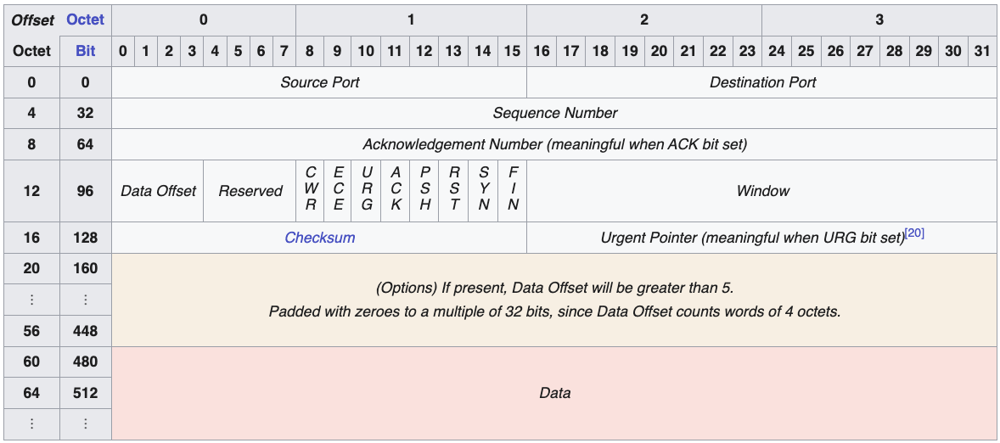

- [Retrofit](https://github.com/square/retrofit) : HTTP API를 인터페이스 기반(type-safe)으로 사용하게 해주는 상위 레벨 HTTP 클라이언트
- [OkHttp](https://github.com/square/okhttp) : 실제 HTTP 통신을 수행하는 네트워크 레벨 클라이언트
- [Okio](https://github.com/square/okio) : OkHttp의 바닥에서 동작하는 입출력(I/O)의 효율을 극대화한 저수준 라이브러리


# 1. 애플리케이션 레벨

## (1) 앱에서 HTTP 요청 생성

모바일 앱(Android/iOS)은 보통 다음과 같은 라이브러리를 사용해 HTTP 요청을 만듭니다.

* Android: Retrofit + OkHttp, HttpURLConnection
* iOS: URLSession
* Flutter/React Native: framework 네트워크 모듈

앱 코드에서 다음 요소를 설정합니다:

1. 어떤 URL로 보낼 것인가 (엔드포인트 설계)
2. 어떤 HTTP Method (GET, POST 등)를 사용할 것인가
3. 어떤 Header (Content-Type, Authorization, Accept-Encoding 등)를 붙일 것인가
4. Body (JSON, Multipart 등)를 어떤 포맷으로 보낼 것인가
5. Timeout 설정을 어떻게 줄 것인가
6. Cache를 어떻게 활용할 것인가

### 1. URL : 어디로 보낼 것인가.

URL은 보통 다음 구조로 나뉜다.

```
<scheme>://<host>:<port>/<path>?<query>
예) https://api.binance.com/api/v3/ticker/price?symbol=BTCUSDT
```

### 2. HTTP Method: 무엇을 할 것인가

- `GET` : 조회 (서버 상태 변화가 없는 Safe Method, idempotent)
- `POST` : 생성 / 명령 (대부분 non-idempotent)
- `PUT` : 전체 업데이트 (idempotent)
- `PATCH` : 부분 업데이트
- `DELETE` : 삭제 (idempotent로 설계하는 것이 일반적)

예시)

```
GET /api/v3/ticker/price
```

Latest price for a symbol or symbols.

```
POST /api/v3/order
```

Send in a new order.

```
DELETE /api/v3/order
```

Cancel an active order.


### 3. Header: 부가 정보와 메타 데이터

- `Content-Type` : Body의 포맷
  - `application/json`
  - `multipart/form-data`
  - `application/x-www-form-urlencoded`
- `Accept` : 클라이언트가 받고 싶은 응답 포맷
  - `Accept: application/json`
- `Authorization` : 인증 토큰
  - `Authorization: Bearer <access_token>`
- `Accept-Encoding` : 압축 허용
  - `Accept-Encoding: gzip, deflate, br`
- `User-Agent` : 클라이언트 정보 (앱 이름 / 버전 / OS 등)

### 4. Body: 무엇을 보내는가 (데이터 포맷)

1. JSON Body : `Content-Type: application/json`
2. Form URL Encoded : `Content-Type: application/x-www-form-urlencoded`

예시

```
// application/json
{
  "symbol": "BTCUSDT",
  "side": "BUY",
  "type": "LIMIT",
  "quantity": 1,
  "price": 50000,
  "timeInForce": "GTC",
  "recvWindow": 5000,
  "timestamp": 1700000000000
}
```

```
// application/x-www-form-urlencoded
symbol=BTCUSDT&side=BUY&type=LIMIT&quantity=1&price=50000&timeInForce=GTC&recvWindow=5000&timestamp=1700000000000
```

### 5. Timeout: 언제까지 기다릴 것인가

너무 짧으면 작은 네트워크 지연에도 실패, 너무 길면 유저가 앱이 멈춘 것 같다고 느낌

- 서버에 연결 시도 하는 데 걸리는 시간 제한
- 연결이 된 이후, 응답을 읽는 시간 제한
- 요청 Body를 서버로 전송하는 시간 제한

### 6. 캐싱 전략: 언제 서버를 다시 안 볼 것인가

- HTTP 캐싱
  - `Cache-Control: max-age=60`
  - `ETag`, `Last-Modified` : 조건부 요청 (변경 없으면 304)
- 앱 레벨 캐싱


# 2. OS 네트워크 스택으로 전달

## (2) 앱 → OS Socket Layer 전달

앱이 만든 요청은 OS의 네트워크 스택으로 전달됩니다.

* DNS 라이브러리
* TCP/UDP socket API
* 네트워크 보안 설정(ATS, Network Security Config 등)

---

# 3. DNS 조회 과정

## (3) DNS Lookup

앱이 요청한 Domain(URL)을 IP 주소로 변환합니다.

예:
`https://api.example.com → 123.45.67.89`

단계:

1. 로컬 DNS 캐시 확인
   - 최근에 같은 도메인으로 통신한 적이 있다면 OS가 IP를 캐싱하고 있음
   - TTL이 지나지 않았다면 그대로 사용
2. hosts 파일 등 로컬 설정 확인
3. DNS Resolver에 쿼리 전송
   - OS는 준비된 DNS 서버 주소 IP를 대상으로 쿼리를 전송한다. (일반적으로 UDP 53번 포트)
   - 이 DNS Query안에는 질의 도메인 이름, 질의 타입, 기타 플래그들이 들어있다.
4. DNS 서버(Resolver)가 도메인의 IP를 찾아서 응답, 아래 과정은 DNS 서버 내부에서 일어나는 일이다.
   - Resolver가 캐시를 확인하여 TTL이 살아있다면 바로 캐시에서 답을 꺼내서 응답.
   - 캐시에 없다면 그 다음부터 재귀 조회를 시작한다.
     1. 루트 DNS 서버 -> `.com`에 대한 권한 있는 서버를 물어보고 답을 받음
     2. `.com` TLD(Top-Level Domain) 서버 -> `example.com`에 대한 권한 서버를 물어봄
     3. `example.com` 권한 DNS 서버(Authoritative Name Server) -> `api.example.com`의 A/AAAA 레코드 요청
     4. `api.example.com` -> `203.0.113.10` (TTL=300초 등)을 알려주면 Resolver는 결과를 캐시에 저장하고 클라이언트 (우리 OS)에게 응답으로 보낸다.
5. IP 주소 획득
   1. OS의 DNS Resolver가 DNS Response 패킷을 받으면 OS는 이 정보를 자신의 DNS 캐시에 저장
      - 이 도메인에 대해 앞으로 300초 동안은 다시 DNS 서버에 묻지 않아도 된다.
   2. 동시에 이 IP 주소를 DNS를 요청했던 상위 콜 스택(소켓을 열려고 했던 네트워크 라이브러리/앱)에게 반환
   3. 위 IP를 대상으로 TCP 3-Way HandShake를 진행할 수 있게 된다.

---

디바이스가 새로운 네트워크에 연결되면, 가장 먼저 IP Configuration이 일어난다.
- Wi-Fi 연결시 Wi-Fi AP(공유기)는 IP 정보를 다음과 같이 알려준다.
- AP -> 디바이스 (DHCP Offer):
  - 디바이스가 사용할 IP 주소
  - 서브넷 마스크
  - 게이트웨이 주소
  - DNS 서버 주소 (Primary, Secondary)
- 셀룰러 연결시 통신사는 기지국과 코어망을 통해 동일한 정보를 단말에 내려준다.
  - 단말이 사용할 IP
  - 게이트웨이
  - DNS 서버 주소

---


# 4. TCP 연결 설정

## (4) TCP 3-Way Handshake



https://en.wikipedia.org/wiki/Transmission_Control_Protocol

서버와 연결을 열기 위해 TCP 연결을 맺습니다.

| 단계 | 송신자           | 플래그     | Seq | Ack |
| -- | ------------- | ------- | --- | --- |
| 1  | Client→Server | SYN     | x   | -   |
| 2  | Server→Client | SYN-ACK | y   | x+1 |
| 3  | Client→Server | ACK     | x+1 | y+1 |


# 5. HTTPS라면 TLS 핸드셰이크 추가

## (5) TLS(Transport Layer Security) Handshake(HTTPS 전용)


https://www.cloudflare.com/learning/ssl/what-happens-in-a-tls-handshake/

TLS handshake는 TCP handshake를 통해 TCP 연결이 먼저 열린 이후에 수행된다.

TLS handshake 동안 무엇이 일어나는가?
- 사용할 TLS 버전을 지정한다.
- 사용할 암호화 알고리즘 목록(cipher suite)를 결정한다.
- server의 public key와 SSL 인증 기관(CA)의 디지털 서명을 통해 server의 신원을 인증한다.
- handshake 완료 후 대칭키 암호화를 사용하기 위한 session key를 생성한다.

TLS Handshake의 단계(RSA key exchange algorithm)
1. The 'client hello' message
   - client 는 "hello" 메시지를 server로 보내 handshake를 시작한다. 다음과 같은 정보를 포함한다.
   - client가 지원하는 TLS 버전
   - 지원하는 cipher suite 목록
   - client random으로 알려진 무작위 바이트 문자열
2. The 'server hello' message
   - server는 client hello에 대한 응답으로 다음 정보를 포함한 메시지를 보낸다.
   - server의 SSL Certificate
   - server가 선택한 cipher suite
   - server random (server가 생성한 또 다른 무작위 바이트 문자열)
3. Authentication
   - client는 server의 SSL Certificate를 이를 발급한 CA를 통해 검증한다. 이를 통해 server가 주장하는 실제 대상임이 확인되고, client는 해당 도메인의 실제 소유자와 통신하고 있음을 보장한다.
4. The premaster secret
   - client는 "premaster secret"이라는 또 하나의 무작위 바이트 문자열을 보낸다.
   - premaster secret은 server의 public key로 암호화되며, server의 private key로만 복호화할 수 있다.
     - client는 server의 SSL certificate에서 public key를 얻는다.
5. Private key used
   - server는 자신의 private key를 사용하여 premaster secret을 복호화한다.
6. Session keys created
   - client와 server는 client random, server random, premaster secret을 기반으로 **동일한 session key**를 생성한다.
7. Finish 메시지 교환 (방금 합의된 session key로 암호화되어 전송)
   1. client -> server : "finished"
   2. server -> client : "finished"
8. 보안 대칭 암호화 설정 완료
   - handshake가 완료되며, 이후 통신은 session key를 사용한 대칭 암호화로 진행된다.

그렇다면 이후에 HTTP를 이용하여 통신을 진행할 것이다.

그렇다면 HTTP의 버전은 무엇으로 결정될까? 언제 어떻게 결정될까?

HTTPS 환경에서 HTTP 버전은 TLS Handshake 과정의 ALPN(Application-Layer Protocol Negotiation) 단계에서 결정된다. 여기서 ALPN이란 무엇일까?

### ALPN

Application-Layer Protocol Negotiation(ALPN)은 추가적인 네트워크 왕복을 요구하지 않고도, 암호화된 연결 위에서 어떤 application-layer 프로토콜이 협상 중인지 식별하기 위해 사용되는 TLS 확장(RFC 7301에 정의됨)이다.

ALPN이 동작하는 방식

**ClientHello 단계 - 클라이언트가 지원 프로토콜 목록 전송**

> "ProtocolNameList" contains the list of protocols advertised by the client, in descending order of preference.
> 
> 클라이언트는 ClientHello 메시지에 ALPN확장을 포함하며, ProtocolNameList에는 **내림차순 선호도 기준으로 여러 개의 프로토콜을 포함한다.**
>
> -RFC 7301 Section 3.1-

```
ClientHello:
  ALPN = ["h2", "http/1.1"]
```

**ServerHello 단계 - 서버는 하나의 프로토콜만 선택하여 응답**

> A new ServerHello extension type ("application_layer_protocol_negotiation(16)") MAY be returned to the client within the extended ServerHello message. The "extension_data" field of the ("application_layer_protocol_negotiation(16)") extension is structured the same as described above for the client "extension_data", except that the "ProtocolNameList" MUST contain exactly one "ProtocolName".
>
> 서버는 확장된 ServerHello 메시지 내에서 새로운 ServerHello extension 타입("application_layer_protocol_negotiation(16)")을 클라이언트에게 반환할 수도 있다(MAY). 이 ("application_layer_protocol_negotiation(16)") extension의 "extension_data" 필드는 클라이언트 측 "extension_data"에 대해 위에서 설명한 것과 동일한 구조를 갖지만, "ProtocolNameList"에는 정확히 하나의 "ProtocolName"만 포함되어야 한다(MUST).
>
> -RFC 7301 Section 3.1-


> It is expected that a server will have a list of protocols that it supports, in preference order, and will only select a protocol if the client supports it. In that case, the server SHOULD select the most highly preferred protocol that it supports and that is also advertised by the client. In the event that the server supports no protocols that the client advertises, then the server SHALL respond with a fatal "no_application_protocol" alert.
>
> 서버는 일반적으로 자신이 지원하는 프로토콜 목록을 선호도 순서로 가지고 있으며, 클라이언트가 지원하는 경우에만 해당 프로토콜을 선택해야 한다. 이 경우 서버는 자신이 지원하면서 동시에 클라이언트가 광고한 프로토콜 중 가장 선호도가 높은 것을 선택해야 한다(SHOULD). 만약 서버가 클라이언트가 광고한 프로토콜 중 어느 것도 지원하지 않는다면, 서버는 fatal "no_application_protocol" alert로 응답해야 한다(SHALL).
>
> -RFC 7301 Section 3.2-

```
ServerHello:
  ALPN = "h2"
```

**TLS handshake 완료 후 사용되는 프로토콜**

> The protocol identified in the "application_layer_protocol_negotiation" extension type in the ServerHello SHALL be definitive for the connection, until renegotiated.  The server SHALL NOT respond with a selected protocol and subsequently use a different protocol for application data exchange.
>
> ServerHello의 ALPN 확장에서 선택된 프로토콜은 재협상 전까지 해당 연결의 최종 프로토콜이며, 서버는 이를 응답한 뒤 다른 프로토콜로 애플리케이션 데이터를 교환해서는 안 된다.
>
> -RFC 7301 Section 3.2-

즉 TLS handshake과정 중, ClientHello, ServerHello 과정 중에서 사용될 프로토콜을 확정짓는다.

```kotlin
// okhttp3/internal/connection/ConnectPlan.kt
class ConnectPlan internal constructor( ... ) {
  ...
  private fun connectTls(sslSocket: SSLSocket, connectionSpec: ConnectionSpec) {
    ...
    // ALPN 프로토콜 설정 (TLS Handshake 전)
    if (connectionSpec.supportsTlsExtensions) {
      Platform.get().configureTlsExtensions(sslSocket, address.url.host, address.protocols)
    }
    
    ...

    // TLS handshake 수행
    sslSocket.startHandshake()
    
    ...
    
    // 협상된 프로토콜 확인
    val maybeProtocol =
      if (connectionSpec.supportsTlsExtensions) {
        Platform.get().getSelectedProtocol(sslSocket)
      } else {
        null
      }
    
    // 프로토콜 결정
    protocol = if (maybeProtocol != null) Protocol.get(maybeProtocol) else Protocol.HTTP_1_1

  }
}
```

```kotlin
val client = OkHttpClient.Builder()
    .eventListener(object : EventListener() {
        override fun connectionAcquired(call: Call, connection: Connection) {
            val handshake = connection.handshake()
            val protocol = connection.protocol()      // HTTP_1_1, HTTP_2 등
            val tlsVersion = handshake?.tlsVersion()  // TLS_1_2, TLS_1_3 등
            val cipherSuite = handshake?.cipherSuite()

            Log.d("NET", "protocol=$protocol, tls=$tlsVersion, cipher=$cipherSuite")
        }
    })
    .build()
```

```
[D]  Protocol=h2, tls=TLS_1_3, cipher=TLS_AES_128_GCM_SHA256
```

# 6. HTTP 요청 전송

## HTTP/1.1 vs HTTP/2

| - | HTTP/1.1 | HTTP/2 |
| - | - | - |
| 연결 방식 | 하나의 연결에서 한 번에 하나의 요청-응답만 처리 | 하나의 연결에서 여러 요청과 응답을 동시에 주고 받는 Mutliplexing을 지원 |
| 헤더 처리 | 헤더를 텍스트 형태로 매 요청마다 전송한다<br>쿠키나 User-Agent 같은 반복되는 헤더가 매번 그대로 전송되어 오버헤드가 발생한다 | HPACK 압축을 사용해 헤더를 압축하고, 이전에 보낸 헤더는 인덱스로 참조하여 중복 전송을 줄인다 |
| 데이터 형식 | 텍스트 기반 프로토콜, 사람이 읽기 쉽지만 파싱이 상대적으로 비효율적 | 바이너리 프레이밍을 사용, 데이터를 작은 프레임 단위로 쪼개어 전송하므로 파싱이 빠르고 오류 가능성이 줄어든다 |
| 서버 푸시 | 클라이언트가 요청한 것만 서버가 응답한다 | 서버 푸시 기능이 있어, 클라이언트가 HTML을 요청하면 서버가 관련 CSS나 JS 파일을 미리 보내줄 수 있다<br>실제로는 캐싱 문제 등으로 많이 사용되지는 않는다. |
| 우선순위 지정 | - | 스트림별로 우선 순위를 지정할 수 있어, 중요한 리소스를 먼저 받도록 할 수 있다.

### 바이너리 프레이밍

멀티플렉싱을 가능하게 하는 기반 기술

HTTP/1.1은 텍스트로 메시지를 구분한다. 줄바꿈 (`\r\n`)으로 헤더를 구분하고, 빈 줄로 헤더와 본문을 나눈다. 단순하지만 파싱이 복잡하고 하나의 연결에서 메시지를 섞어 보내기 어렵다.

HTTP/2는 모든 데이터를 **프레임**이라는 작은 바이너리 단위로 쪼갠다.

```
+-----------------------------------------------+
|                 Length (24bit)                |
+---------------+---------------+---------------+
|   Type (8)    |   Flags (8)   |
+-+-------------+---------------+---------------+
|R|                Stream ID (31bit)            |
+-+---------------------------------------------+
|                   Payload                     |
+-----------------------------------------------+
```

각 프레임에는 어떤 스트림에 속하는지(Stream ID), 어떤 종류인지(HEADERS, DATA 등)가 명시된다. 덕분에 여러 스트림의 프레임을 섞어서 보내도 수신측에서 올바르게 재조립할 수 있다.

### HPACK 압축

HTTP 헤더는 매 요청마다 비슷한 내용이 반복된다. 예를 들어 다음과 같다.

```
GET /page1 HTTP/1.1
Host: example.com
User-Agent: Mozilla/5.0 ...
Accept: text/html
Cookie: session=abc123
```

같은 사이트에 요청할 때마다 Host, User-Agent, Cookie 등이 거의 동일하게 전송된다. 

HPACK은 두 가지 기법으로 이를 압축한다.

- 정적 테이블 : 자주 쓰이는 헤더 (`:method: GET`, `:status: 200` 등) 61개를 미리 정의해두고 인덱스 번호로 대체
- 동적 테이블 : 통신중 사용된 헤더를 양쪽이 기억해두고 이후 인덱스로 참조
- 허프만 인코딩 : 문자열 값을 압축

### 동적 테이블을 이용한 인덱스 참조

첫 번째 요청

```
:authority: example.com  -> 그대로 전송, 동적 테이블에 저장 (index 62)
cookie: session=abc123   -> 그대로 전송, 동적 테이블에 저장 (index 63)
```

두 번째 요청
```
:authority: example.com  -> "62"로 대체 (1바이트)
cookie: session=abc123   -> "63"로 대체 (1바이트)
```

## HTTP2 통신

### 1. Connection Preface

HTTP/2 연결이 시작되면 양측이 **초기 설정을 교환**합니다.

클라이언트가 먼저:
```
PRI * HTTP/2.0\r\n\r\nSM\r\n\r\n   ← 매직 문자열 (24바이트)
[SETTINGS 프레임]                  ← 클라이언트 설정
```


## (6) HTTP Request 전송

이제 실질적인 HTTP 데이터가 송신됩니다.

예:

```
GET /user HTTP/1.1
Host: api.example.com
Accept: application/json
```

또는 POST Body 포함:

```
POST /login
Content-Type: application/json
Content-Length: 120

{"email":"user@test.com","password":"1234"}
```

요청은 TCP 스트림 안에 실려 전송됩니다.

---


# 8. HTTP Response 수신

## (8) 앱이 Response 수신

예:

```
HTTP/1.1 200 OK
Content-Type: application/json
Content-Encoding: gzip
Content-Length: 80
```

Body:

```
{"userId":1,"name":"Alice"}
```

보통 다음 작업이 수행됩니다:

* Gzip 압축 해제(Content-Encoding)
* JSON 파싱
* 오류 코드 판단(4xx, 5xx 등)
* 앱에서 처리 가능한 데이터로 변환


---

# 9. 연결 종료 or Keep-Alive 유지

## (9) Connection 관리

HTTP/1.1부터는 기본적으로 `Connection: keep-alive`로 유지됩니다.

* 동일한 서버에 여러 요청을 보낼 때 재사용 → 성능 향상
* 일정 시간 idle이면 OS/서버가 연결 종료


- 헤더의 순서가 상관이 있을까?

## 참고
- https://www.cloudflare.com/learning/ssl/what-happens-in-a-tls-handshake/
- https://developer.mozilla.org/en-US/docs/Glossary/ALPN
- https://en.wikipedia.org/wiki/Application-Layer_Protocol_Negotiation


TLS는 어디레이어 (3_8)
keep-alive vs websocket