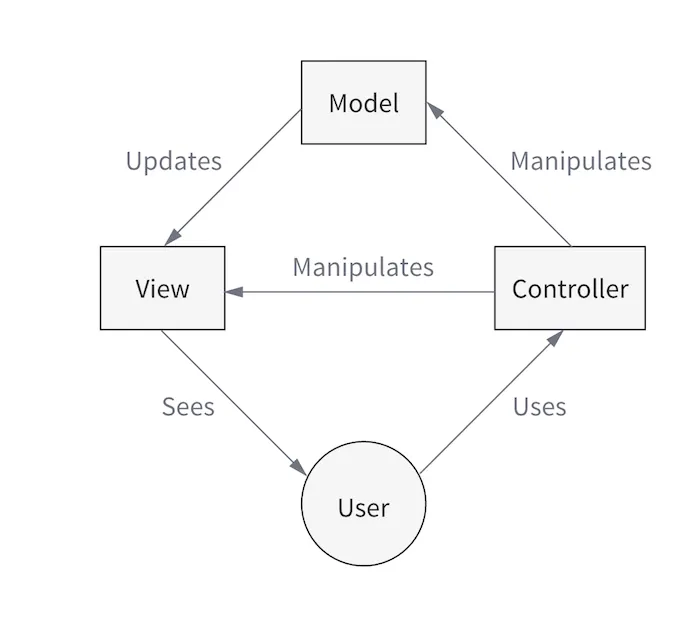
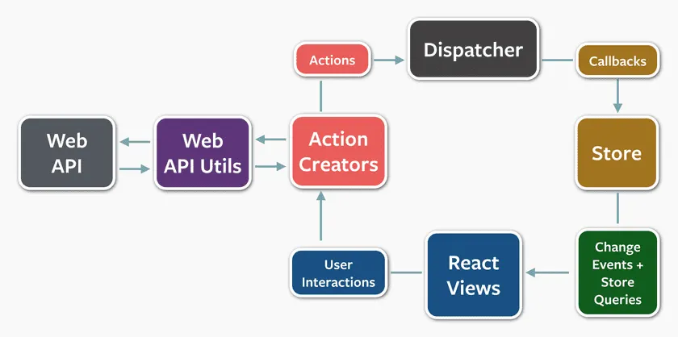
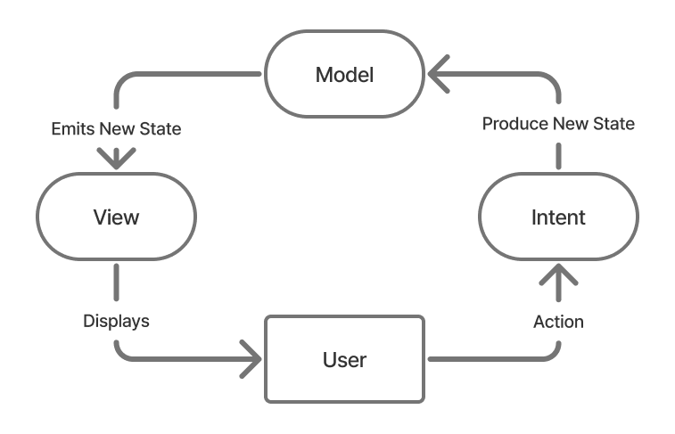
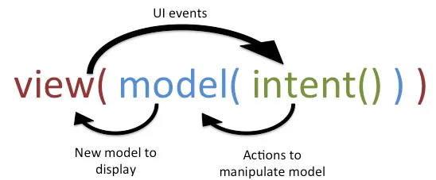
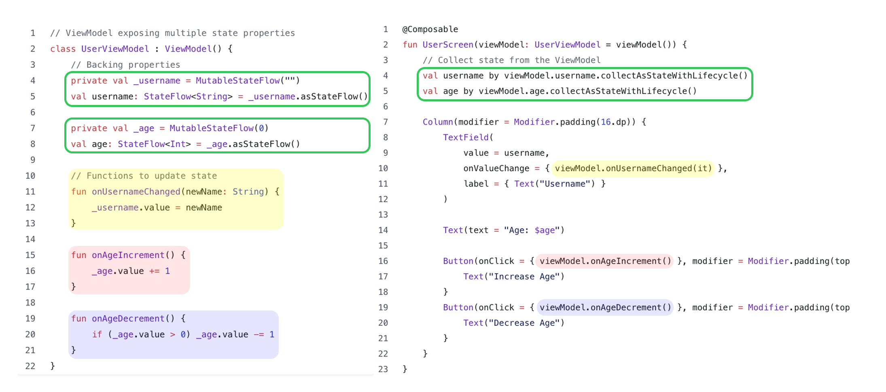
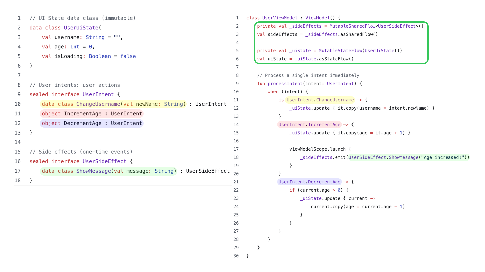

MVC는 애플리케이션을 세 가지 주요 컴포넌트로 분리하였다.



*cycle.js.org*

- Model : 데이터와 비즈니스 로직을 관리함
- View : UI 요소를 렌더링함
- Controller : 사용자 입력을 처리하고 그에 따라 Model을 업데이트함

Andre Staltz는 reactive programming의 관점에서 MVC를 재해석한다.

- Intent : Controller를 대체하며, 사용자 상호작용을 event stream으로 캡쳐함
- Model : 이 Stream에 반응하여 앱 state를 업데이트함
- View : state를 reactive하게 렌더링함

Staltz의 블로그 글이 나오기 직전, Facebook은 React와 함께 Flux를 소개했다.



source : reactjs.org

- React : UI 렌더링에 집중
- Flux : 데이터 흐름을 관리하기 위한 새로운 아키텍처를 도입
  - Action : 어떤 일이 발생했는지 설명
  - Dispatcher : actions를 stores로 전달
  - Stores : 애플리케이션의 state를 보관하고 actions에 반응하여 업데이트
  - Views : store의 변화를 감지하고 다시 렌더링한다.

Flux의 가장 중요한 혁신은 undirectional & circular 데이터 흐름 → UI 앱에서 공유 mutable state로 인해 발생하던 혼란에 질서를 부여하였다.

Staltz는 Flux가 imperative한 방식과 reactive한 방식을 종종 섞어 사용한다는 점을 비판했다. MVI에서 Staltz는 Flux의 단방향 데이터 흐름을 채택하되 더 단순화하였다.
- Dispatcher 제거
- imperative stores를 피함
- observable을 사용해 사용재 intent, state, UI 렌더링을 순수한 reactive 변환으로 직접 모델링하였다.
  - (여기서 observable은 안드로이드의 Flow에 대응)

## MVI

MVI 패턴은 2014년경, Redux가 등장하기 1년 전에 André Staltz가 만든 JavaScript 프레임워크 cycle.js에서 처음 소개되었다.

MVI(Model-View-Intent)는 reactive UI 아키텍처 패턴으로, 다음을 강제한다
- 단일하고(single) immutable한 state(Model)
  - 앱의 state를 보관한다.
- 단방향 흐름의 Intent(unidirectional flow of Intents)
  - Controller를 대체해 사용자 상호작용을 stream형태로 전달한다.
- 각 state를 렌더링하는 View



사용자 intent → state 변화 → UI 렌더링

고전적 MVC, Flux, reactive programming 원칙이 결합하면서 탄생한 것이 MVI 이다.



source: hannesdorfmann.com

Hannes Dorfmann이 André Staltz가 처음 제시한 MVI 아이디어를 자신의 방식으로 해석하고 이를 수학적 표현으로 나타내었다.

MVI & Redux 에 대한 오해, MVI가 Redux보다 먼저 등장하였다.

- MVI : 2014년 Andre Staltz가 작성한 Reactive MVC 블로그 글에서 처음 소개
- Redux : Dan Abramov가 2015년 후반에 발표

두 패턴은 모두 Flux 아키텍처의 영향을 독립적으로 받았다.

MVI & Redux

유사점

- MVI는 user intent를 Redux의 action과 유사하게 처리한다.
- MVI는 state를 immutable하며 시간에 따라 변화하는 값으로 취급한다, Redux의 store와 유사하다.
- MVI는 이전 state와 사용자 입력을 기반으로 새로운 state를 도출하기 위해 reducer 개념을 사용한다.

차이점

| Concept     | Redux                                      | MVI                                            |
|-------------|--------------------------------------------|------------------------------------------------|
| **State**   | 중앙 집중식 global store (단일 state tree) | 분산된 state — 일반적으로 feature/model 단위   |
| **Reducer** | 앱 레벨의 중앙화된 reducers                | reducer 로직이 각 model에 내장되는 경우가 많음 |
| **Flow**    | dispatch(Action) → Store → Reducer → State | Intent → Model → New State → View              |
| **Control** | 외부 dispatcher가 state 전환을 관리        | intent는 model 내부에서 reactive하게 처리      |


MVI & MVVM

공통점

- 명확한 관심사의 분리 (Seperation of Concerns)
- UI 업데이트를 위한 observable stream의 활용
- ViewModel의 사용 (특히 Android 환경에서)

차이점

| Concept            | **MVVM**                                                                                               | **MVI**                                                 |
|--------------------|--------------------------------------------------------------------------------------------------------|---------------------------------------------------------|
| **State**          | 부분적이고 mutable한 경우가 많으며, 여러 UI 요소에 대해 여러 LiveData 또는 StateFlow를 사용함          | 화면 전체를 표현하는 **단일 immutable state object**    |
| **Data Flow**      | **양방향**: View가 ViewModel을 observe하고, ViewModel이 View 업데이트를 위한 callback을 제공할 수 있음 | **단방향**: `Intent → Model → State → View`             |
| **Events**         | ViewModel 내부에서 함수 호출 또는 LiveData 이벤트로 처리됨                                             | Intent(UI action)들의 **stream**을 통해 처리됨          |
| **Reducer**        | 핵심 개념이 아님                                                                                       | 핵심 개념: `state = reducer(state, intent)`             |
| **Error Handling** | 종종 LiveData/StateFlow 안에 섞여 표현됨                                                               | 보통 **UiState** 또는 **Effects**로 명시적으로 모델링됨 |
| **Single source of Truth** | ViewModel 내부의 단일 source of truth를 권장 | 단일하고 immutable한 source of truth를 강조한다. |
| **Complexity** | 구현이 비교적 간단하지만, 관리가 잘 되지 않으면 View와 ViewModel이 강하게 결합될 위험이 있다. | 구조가 엄격하고 boiler plate가 많아 학습 난이도가 높고 초기 구현이 복잡할 수 있다. |

Android에서의 MVI

- 단일 immutable State object
  - 중앙 집중식이 아니라 분산되어 있고, 보통 ViewModel 내부에 존재한다.
- UI interactions as Intents
  - 모든 사용자 action은 stream으로 표현되며, 보통 sealed class나 interface로 정의된다.
- Reducer function
  - 이전 state와 하나의 Intent를 입력으로 받아 새로운 State를 반환하는 pure function
- Unidirectional data flow
  - 아키텍처는 `Intent → Model → State → View`라는 흐름을 엄격하게 따른다.
- Side-effects handled separately
  - navigation, network 호출, 메시지 표시 같은 effect들은 State와 분리된 별도 모델로 표현되며, reducer 바깥에서 처리된다.

## MVVM 코드 예시



https://proandroiddev.com/yes-that-is-mvi-674f810ca4fe

- ViewModel 안에 여러 개의 StateFlow가 있고, 각각을 UI에서 따로 `collectAsStateWithLifecycle()` 해서 쓴다.
- 작은 화면/간단한 상태에는 가볍고 직관적, 화면이 커질수록 StateFlow 개수가 늘어나고, 어디서 뭐가 업데이트되는지, 두 State 간의 일관성(invariant)을 어떻게 보장할지 점점 복잡해진다.
- UI가 `viewModel.onAgeIncrement()`처럼 함수 호출을 한다.
  - View → ViewModel 메서드 호출
  - 메서드 안에서 바로 상태를 바꾸는 명령형(imperative) 접근
- 플로우 : 버튼 A → `onAgeIncrement()` → `_age` 변경 → UI에서 `age` collect → Text 재구성
- 화면이 복잡해질수록 메서드끼리의 의존성 등을 함께 고려해야 해서 문맥 의존성이 커질 수 있다.


## MVI 코드 예시



- 화면 전체 상태를 단일 `data class`로 표현한다.
- UI는 `uiState` 하나만 구독하고, 그 안에서 `state.username`, `state.age`등을 꺼내서 쓴다.
- Single immutable State object
- 상태 변경은 항상 `copy()`를 통해 새로운 객체를 만든다.
- 디버깅/로깅시에 시간에 따라 State 스냅샷들을 추적하기 쉽다.
- View는 "함수 이름"을 호출하는 대신 "무슨 일이 일어났는지"를 데이터로 표현해서 전달한다.
- 플로우 : `UserIntent` → `processIntent()`(=reducer) → `UserUiState` 변경 → UI의 `uiState` collect → 렌더링
- `UserUiState` + `UserIntent` 조합이 있기 때문에 주로 reducer 로직만 따로 테스트하기 좋다.

비슷하지만 약간 다른 부분들
- MVI, MVVM 모두 데이터는 기본적을 한 방향으로 흐른다.
  - View → ViewModel: 이벤트 / 함수 호출 / Intent
  - ViewModel → View: Flow / StateFlow / State
  - MVVM : 일방향이긴 한데, 규약을 강제하기보다는 개발자 컨벤션에 의존
  - MVI : 모든 상태 변화는 Intent를 통해서만 일어난다 (엄격한 unidirectional data flow)

https://proandroiddev.com/yes-that-is-mvi-674f810ca4fe


## MVI

- Model : 애플리케이션의 state를 나타냄
- View : UI를 표시하며 사용자 상호작용을 Intent로 전달한다.
- Intent : 사용자 action 또는 event를 표현한다.

### Unidirectional Data Flow


source: hannesdorfmann.com


- 데이터는 View → Intent → Model → View의 순서로 흐른다.
- View : 사용자의 상호작용을 캡처하고 이를 **Intent**로 변환하여 Model로 전달한다.
- Intent : 사용자가 수행하고자 하는 동작 또는 의도를 나타낸다.
- Model : 이러한 Intent를 받아 처리한 뒤, 그에 따라 자신의 state를 업데이트한다.

## ViewModel

```kotlin
// Shared module
interface UiState
interface UiEvent
interface UiAction

interface StateMediator<S, A> {
    fun getUiState(): StateFlow<S>
    fun onAction(action: A)
}

abstract class BaseViewModel<S : UiState, E : UiEvent, A : UiAction>(
    initialState: S,
    private val reducer: Reducer<S, E>
) : ViewModel(), StateMediator<S, A> {

    private val state: StateFlow<S>
        get() = mutableStateFlow.asStateFlow()

    private val mutableStateFlow: MutableStateFlow<S> = MutableStateFlow(initialState)

    override fun getUiState(): StateFlow<S> = state

    abstract override fun onAction(action: A)

    protected open fun onLoadData() {}

    protected fun sendEvent(event: E) =
        reducer.redux(mutableStateFlow.value, event) { nextState -> setState(nextState) }

    private fun setState(newState: S) = mutableStateFlow.tryEmit(newState)
}
```

https://ebdz.dev/blog/mvi-ampamp-mobile-dev


## 헷갈려서 정리한 것

> MVI에서 ViewModel은 Model이 아니다.

Android 구현에서의 Model의 역할(State 관리 + Reducer)을 실용적으로 담당한다.


> `data class Something(val a, b, c, d)` 가 있을 때 `c`만 바뀌어서 `something.copy(c = newC)` 를 만들면 `a`, `b`, `d`만 쓰는 애들도 다 recomposition 되는 거 아닌가?

`Something` 전체를 들고 있는 `State<Something>`이 있고, `c`만 바뀌어서 `copy()`로 새로운 인스턴스가 emit되면, 그 State를 읽고 있던 composable scope는 invalidation된다. 즉 그 composable 함수는 recompose된다.

```kotlin
@Composable
fun Screen(viewModel: MyViewModel = viewModel()) {
    val uiState by viewModel.uiState.collectAsStateWithLifecycle()

    Text("A: ${uiState.a}")
    Text("B: ${uiState.b}")
    Text("D: ${uiState.d}")
}
```

위 예시에서 `c`만 바뀌어도 `Screen()` 자체는 다시 실행된다.

하지만 Compose는 내부에서 파라미터 값을 비교해서 값이 안 바뀐 하위 composable은 스킵할 수 있다.

```kotlin
data class Something(
    val a: Int,
    val b: Int,
    val c: Int,
    val d: Int
)

@Composable
fun Screen(uiState: Something) {
    Column {
        A(uiState.a)
        B(uiState.b)
        C(uiState.c)
        D(uiState.d)
    }
}

@Composable
fun A(a: Int) { Text("A: $a") }

@Composable
fun B(b: Int) { Text("B: $b") }

@Composable
fun C(c: Int) { Text("C: $c") }

@Composable
fun D(d: Int) { Text("D: $d") }
```

1. `c`의 변경
2. `uiState`의 변경 -> `Screen()` 재실행
3. `A()`, `B()`, `D()` : 스킵 가능
4. `C()` : 실제로 recomposition 필요

```kotlin
@Composable
fun Screen(uiState: Something) {
    Column {
        A(uiState)   // 전체 state
        B(uiState)
        C(uiState)
        D(uiState)
    }
}

@Composable
fun A(state: Something) { Text("A: ${state.a}") }
@Composable
fun B(state: Something) { Text("B: ${state.b}") }
...
```

1. `Something` 인스턴스 변경
2. `A`, `B`, `C`, `D` 모두 파라미터 변경으로 인식되어 각 하위 composable이 재실행(에 가까운 동작이)된다.


# 참고
- https://proandroiddev.com/yes-that-is-mvi-674f810ca4fe
- https://www.geeksforgeeks.org/software-engineering/model-view-intent-mvi-pattern-in-reactive-programming-a-comprehensive-overview
- https://ebdz.dev/blog/mvi-ampamp-mobile-dev
- https://proandroiddev.com/mvi-a-new-member-of-the-mv-band-6f7f0d23bc8a
