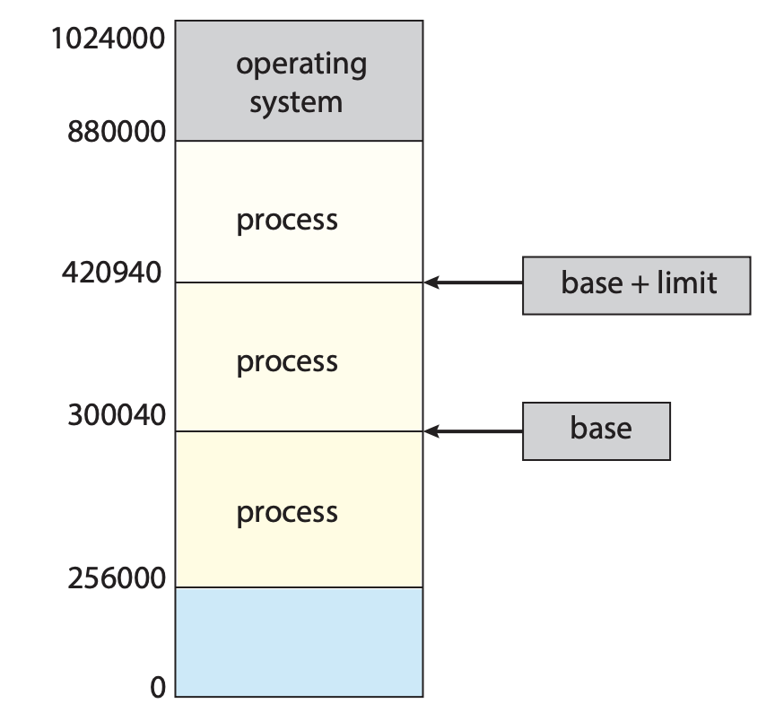

각각의 프로세스가 독립된 메모리 공간을 가지도록 보장해야 한다. 개별적인 프로세스별 메모리 공간은 서로를 보호하고 병행 실행을 위해 여러 프로세스가 메모리에 적재되게 하는 것이 필수적이다. 

- base register : 가장 작은 합법적인 물리 메모리 주소의 값
- limit register : 주어진 영역의 크기를 저장
- ex. base register 값이 300040이고, 상한 레지스터 값이 120900이라면 프로그램은 300040에서 420940(= 300030 + 120900) 까지의 모든 주소를 접근할 수 있따.


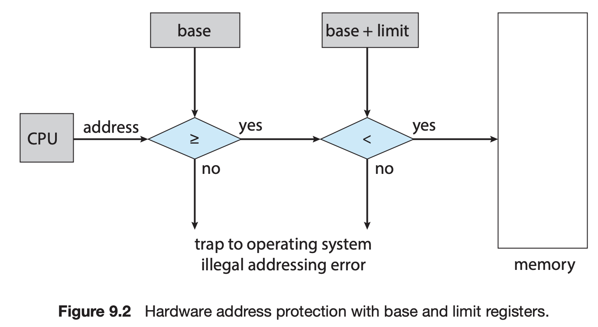

사용자 모드에서 수행되는 프로그램이 운영체제의 메모리 공간이나 다른 사용자 프로그램의 메모리 공간에 접근하면 운영체제는 치명적인 오류로 간주하고 trap을 발생시킨다.

base, limit register는 여러가지 특권 명령을 사용하는 운영체제에 의해서만 적재(load)된다.


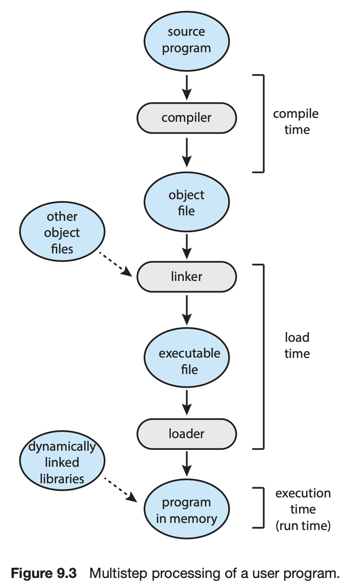

1. 원시 프로그램 : 주소는 숫자가 아닌 (변수 count와 같이) 심볼 형태로 표현된다.
2. 컴파일러는 이 심볼 주소를 재배치 가능 주소(relocatable address, 예. 이 모듈의 첫 번째 바이트로부터 열 네 번째 바이트 주소)로 바인딩한다.
3. 링커나 로더가 재배치 가능 주소를 절대 주소로 바인딩 시킨다. 각각의 바인딩 과정은 한 주소 공간에서 다른 주소 공간으로 맵핑하는 것이다.

전통적으로 메모리 주소 공간에서 명령어(instruction)과 데이터의 바인딩은 그 바인딩이 이루어지는 시점에 따라 다음과 같이 구분된다.

- compile time : 만일 프로세스가 메모리 내에 들어갈 위치를 컴파일 시간에 미리 알 수 있으면 컴파일러는 절대 코드를 생성할 수 없다. 만일 이 위치가 변경되어야 한다면 이 코드는 다시 컴파일 되어야 한다.
  - 컴파일 시점에 프로그램이 메모리의 정확한 시작 주소를 안다고 가정
  - 컴파일러가 절대 주소를 코드에 직접 박아넣음
  - 나중에 시작 주소가 바뀌면 다시 컴파일 해야 한다.
- load time : 만일 프로세스가 메모리 내 어디로 올라오게 될지를 컴파일 시점에 알지 못하면 컴파일러는 일단 이진 코드를 재배치 가능 코드로 만들어야 한다. 이 경우에 심볼과 진짜 번지수와의 바인딩은 프로그램이 메인 메모리로 실제로 적재되는 시간에 이루어지게 된다. 이렇게 만들어진 재배치 가능 코드는 시작 주소가 변경되면 아무 때나 사용자 코드를 다시 적재하기만 하면 된다.
  - 컴파일 시점에 어디에 올라갈지 모름
  - 컴파일러는 relocatable code 생성
  - 로드 시점에 실제 시작 주소가 결정됨
  - 시작 주소가 바뀌어도 recompile 불필요
  - 프로그램이 실행 중에는 이동 불가, 한 번 로드되면 그 위치에 고정
- execution time : 만약 프로세스가 실행하는 중간에 메모리 내의 한 세그먼트로부터 다른 세그먼트로 옮겨질 수 있따면 우리는 바인딩이 실행 시간까지 허용되었다고 이야기한다.
  - 프로그램이 실행 중에도 메모리 위치가 바뀔 수 있음
  - 주소 변환을 run time에 수행
  - 프로그램은 항상 논리 주소(logical address)만 사용
  - 실제 물리 주소(physical address)는 하드웨어가 실시간으로 변환
  - 메모리 관리 가장 유연, swapping, paging, virtual memory 가능
  - 현재 운영체제의 표준 방식

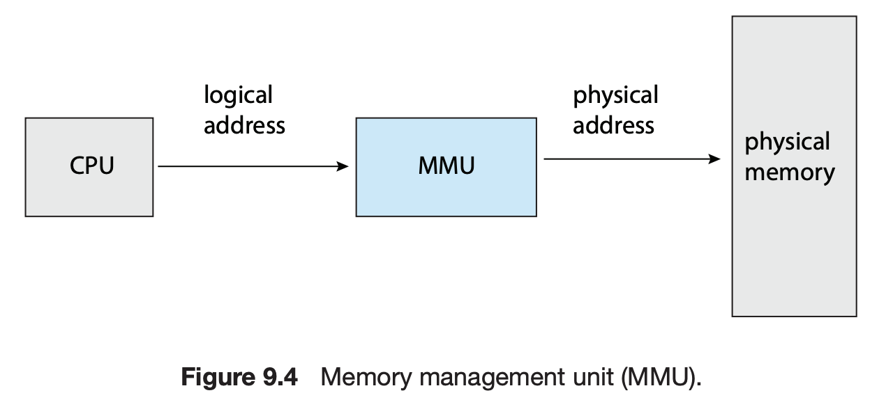

- 논리 주소(logical address) : CPU가 생성하는 주소
- 물리 주소(physical address) : 메모리가 취급하게 되는 주소, (즉, 메모리 주소 레지스터(MAR)에 주어지는 주소)

컴파일 또는 적재시에 주소를 바인딩 -> 논리주소 = 물리 주소  
실행 시간 바인딩 -> 논리 주소 != 물리 주소 -> 이러면 논리 주소를 가상주소라 한다.

- 논리 주소 공간(logical address space) : 프로그램에 의해 생성된 모든 논리 주소 집합
- 물리 주소 공간(physical address space) : 논리 주소와 일치하는 모든 물리 주소 집합
- MMU(Memoery Management Unit) : 가상 주소를 물리 주소로 바꾸어 주는 장치


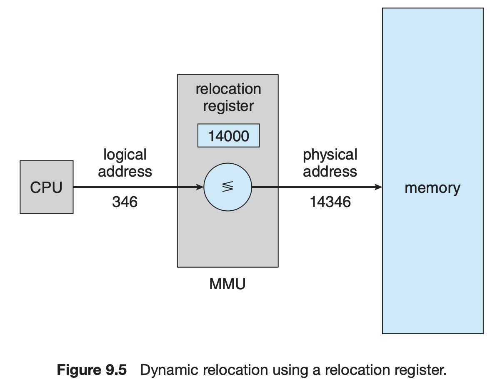

재배치 레지스터(기준 레지스터) 속에 들어있는 값은 주소가 메모리로 보내질 때마다 그 모든 주소에 더해진다.

사용자 프로그램은 결고 실제적인 물리 주소에 접근하지 않는다. 실제 메모리 주소는 접근 순간에 하드웨어가 결정한다.

## 연속 메모리 할당

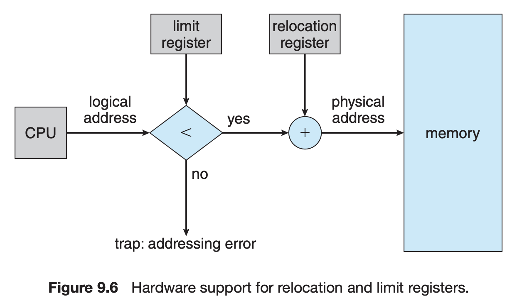

- relocation register : 가장 작은 물리 주소의 값을 저장
- limit register(상한 레지스터) : 논리 주소의 범위 값을 저장한다.

각각의 논리 주소는 상한 레지스터가 지정한 범위 안에 존재해야 한다. MMU는 동적으로 논리 주소에 재배치 레지스터의 값을 더함으로써 주소를 변환하는 역할을 한다. 이렇게 변환된 주소는 메모리로 보내진다.

CPU 스케줄러가 다음으로 수행할 프로세스를 선택할 때, 디스패처(dispatcher)는 문맥 교환의 일환으로 relocation register와 limit register에 정확한 값을 적재한다. CPU에 의해서 생성되는 몯느 주손느 이 레지스터의 값을 참조해서 확인 작업을 거치기 때문에, 우리는 운영체제와 다른 사용자 프로그램을 현재 수행 중인 사용자 프로그램의 접근으로부터 보호할 수 있다.

### 메모리 할당

메모리를 할당하는 가장 간단한 방법 중 하나는 프로세스를 메모리의 가변 크기 파티션에 할당하는 것이다. 각 파티션에는 정확히 하나의 프로세스만 적재될 수 있다. 가변 파티션 기법에서 운영체제는 사용 가능한 메모리 부분과 사용 중인 부분을 나타내는 테이블을 유지한다.

처음에는 모든 메모리가 사용자 프로세스에 사용 가능하며, 하나의 큰 사용 가능한 메모리 블록인 hole로 간주한다.

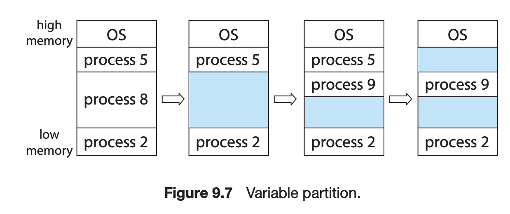

메모리에는 다양한 크기의 hole이 여기저기 산재하게 된다. 프로세스에 공간이 필요할 때 운영체제는 이 hole의 집합에서 적절한 것을 찾아내야 한다. 만약 hole을 찾았는데 그것이 요청한 것보다 약간 크면 두 개로 나누어 한 조각은 프로세스에 할당하고 나머지 하나는 hole 집합으로 되돌아간다. 그 프로세스가 끝나면 그 공간은 hole의 집합으로 되돌아간다. 이 새로운 hole이 다른 hole과 인접해 있다면, 이 두 개의 블록을 합쳐서 한 개의 큰 hole로 만든다.

이 절차는 일반적인 동적 저장 공간 할당 문제의 한 사례로, 여러 개의 빈 메모리 공간 목록에서 크기 n의 요청을 어떻게 만족시킬 것인지를 다룬다. 이 문제를 해결하는 방법은 다양하며, 사용 가능한 빈 공간들 중 하나를 선택하기 위해 가장 널리 사용되는 전략으로는 first-fit, best-fit, worst-fit 방식이 있다.

- 최초 적합 : 첫 번째 사용 가능한 가용 공간을 할당. 검색은 집합의 시작에서부터 하거나 지난번 검색이 끝났던 곳에서 시작될 수 있다. 충분히 큰 가용 공간을 찾았을 때 검색을 끝낼 수 있다.
- 최적 적합 : 사용 가능한 공간 중에서 가장 작은 것을 택한다. 리스트가 크기 순으로 되어 있지 않다면 전 리스트를 검색해야만 한다. 이 방법은 아주 작은 가용 공간을 만들어낸다.
- 최악 적합 : 가장 큰 가용 공간을 택한다. 이 방식에서 할당해 주고 남게 되는 가용 공간은 충분히 커서 다른 프로세스들을 위하여 유용하게 사용될 수 있다. 이때 가용 공간들이 크기 순으로 정렬되어 있지 않으면 전 리스트를 다 검색해야 한다.


### 외부 단편화(external fragmentation)

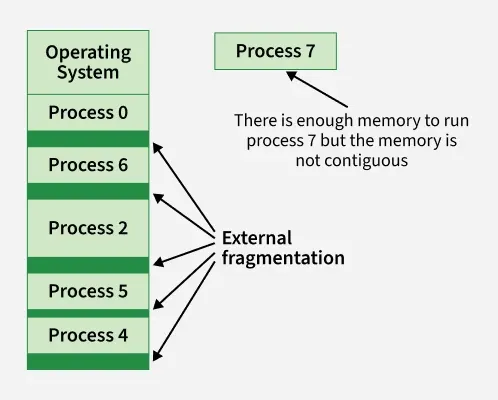

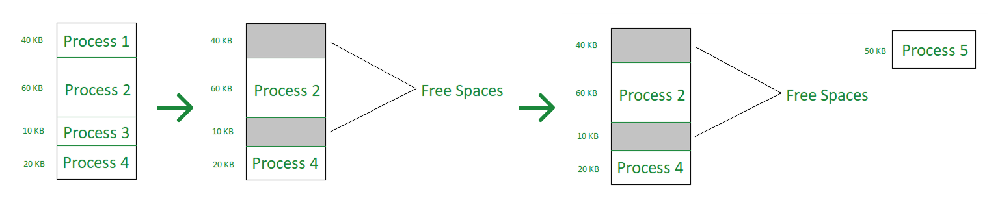

프로세스들이 메모리에 적재되고 제거되는 일이 반복되다 보면, 어떤 가용 공간은 너무 작은 조각이 되어 버린다. 외부 단편화는 이처럼 유휴 공간들을 모두 합치면 충분한 공간이 되지만 그것들이 너무 작은 조각들로 여러 곳에 분산되어 있을 때 발생한다.

- 가용 공간 : 18,462 B
- 프로세스 요청 : 18,462 B
- 할당 후 남은 공간 : 2 B

위 공간은 사실상 쓸모없지만 운영체제는 위 가용공간을 놓치지 않기 위해 2 B 보다 더 큰 부담을 시스템이 가지게 된다.


### 내부 단편화(internal fragmentation)

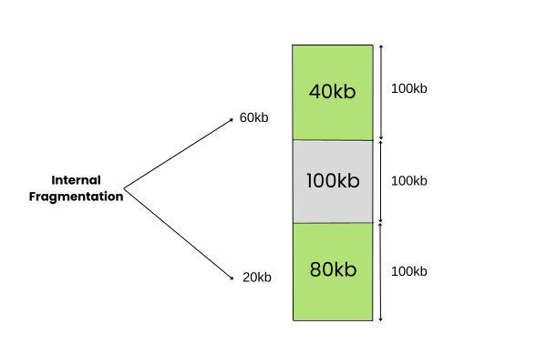

위 문제를 피하기 위해 메모리를 아주 작은 공간들로 분할하고 프로세스가 요청하면 할당을 항상 이 분할된 크기의 정수배로 해주는 것이 보통이다.

이 경우 할당된 공간은 요구된 공간보다 약간 더 클 수 있는데, 이들 두 크기 사이의 남은 부분이 바로 내부 단편화(internal fragmentation)이고, 이 내부 단편화 역시 사용이 될 수 없다.

## 페이징

한 프로세스의 논리 주소 공간을 여러 개의 비연속적인 공간으로 나누어 필요한 크기의 공간이 가용해지는 경우 물리 메모리를 프로세스에 할당하는 방법

물리 메모리는 **프레임**(frame) 이라 불리는 **같은 크기 블록**으로 나누어진다. 논리 메모리는 **페이지**(page)라 불리는 같은 크기의 블록으로 나누어진다.

프로세스를 실행할 때 프로세스는 연속된 메모리 공간을 요구하지 않고, 각 page는 어느 frame에든 load가 가능해진다.

프로세스가 실행될 때 그 프로세스의 페이지는 파일 시스템 또는 예비 저장장치로부터 가용한 메인 메모리 프레임으로 적재된다. 예비 저장장치(backing store)는 메모리 프레임 혹은 프레임의 묶음인 클러스터와 동일한 크기의 고정 크기 블록으로 나누어진다.
- backing store: 물리 메모리에 없는 page들을 저장하는 디스크 영역

CPU에서 나오는 모든 주소는 페이지 번호(p)와 페이지 오프셋(d: offset) 두 개의 부분으로 나누어진다.

| 페이지 번호 | 페이지 오프셋 |
| - | - |
| p | d |

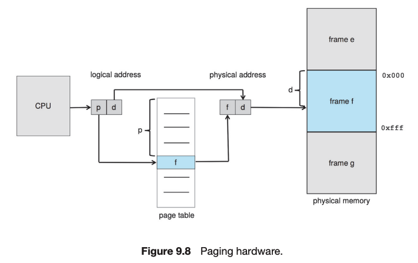

페이지 번호는 페이지 테이블을 엑세스 할 때 사용된다. 페이지 테이블은 물리 메모리의 각 프레임의 시작 주소를 저장하고 있으며 오프셋은 참조되는 프레임 안에서의 위치이다. 따라서, 프레임의 시작 주소와 페이지 오프셋이 결합하여 물리 메모리 주소가 된다.

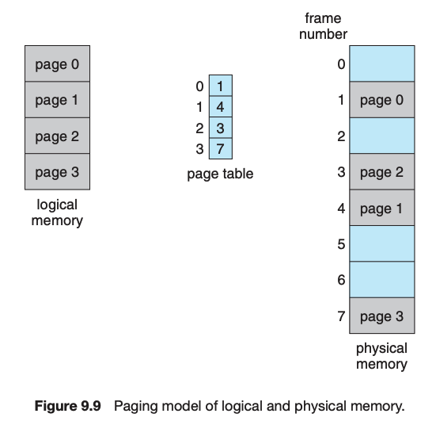

CPU에 의해 생성된 논리 주소를 물리 주소로 변환하기 위해 MMU가 취한 단계
1. 페이지 번호 p를 추출하여 페이지 테이블의 인덱스로 활용
2. 페이지 테이블에서 해당 프레임 번호 f를 추출
3. 논리 주소의 페이지 번호 p를 프레임 번호 f로 바꾼다.

오프셋 d는 변하지 않기 때문에 대체되지 않고, 프레임 번호와 오프셋은 물리 주소를 구성한다.
- 한 페이지의 크기는 d의 범위와 같다.
- d는 page(=frame) 내부에서의 위치(offset)


페이징 기법을 사용하면 외부 단편화가 발생하지 않는다. 하지만 내부 단편화가 발생한다. 할당은 항상 프레임의 정수배로 할당되기 때문이다.

페이지 크기가 작아지면 페이지 테이블의 크기가 커지게 되고 이 테이블이 차지하는 공간이 낭비된다. 현재는 보통 페이지 크기가 4KB 또는 8KB이다.

```
getconf PAGESIZE
16384
```

나의 경우 16KB이다.

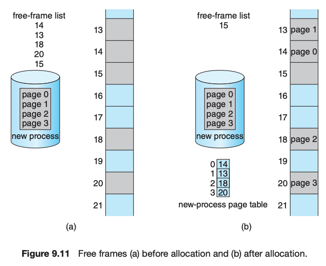


1. 프로세스의 크기를 page 단위로 화깅ㄴ
2. 프로세스가 필요로 하는 page 수 n을 계산하고, page 하나당 frame 하나가 필요하므로 n개의 frame이 필요하다는 사실을 판단
3. n개의 free frame이 메모리에 존재하면 이를 프로세스에 할당
4. 프로세스의 각 page를 할당된 frame들에 하나씩 로드한다.
5. 각 page가 적재된 frame 번호를 page table에 기록

페이지의 가장 중요한 특징은 메모리에 대한 프로그래머의 인식과 실제 내용이 서로 다르다는 것이다. 프로 그램은 여러 곳에 프레임 단위로 분산되어 있고, 프로그래머가 생각하는 메모리와 실제 물리 메모리의 차이는 주소 변환 하드웨어에 의해 해소된다. 이는 운영체제에 의해 조정된다. 페이지 테이블을 통하지 않고서는 다른 공간에 접근할 길이 없고 페이지 테이블은 그 프로세스가 소유하고 있는 페이지들만 가리키기 때문에 사용자 프로세스는 자기의 것이 아닌 메모리는 접근조차 할 수 없다.

프레임 테이블 : 각 프레임당 하나의 항목을 가지고 있으며, 프레임이 비어 있는지, 할당 되었는지, 그리고 할당 되었다면 어느 프로세스의 어느 페이지에 할당되었는지를 나타낸다. 운영체제는 이 정보를 통해 물리 메모리를 관리한다.

## 스와핑

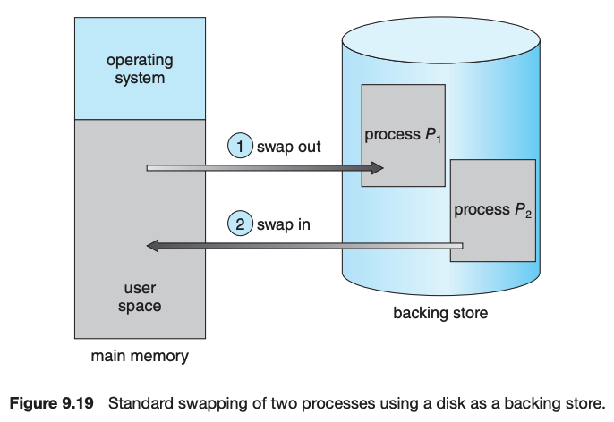

프로세스가 실행되기 위해서는 프로세스의 명령어와 명령어가 접근하는 데이터가 메모리에 있어야 한다. 그러나 프로세스 또는 프로세스의 일부분은 실행 중에 임시로 백업 저장장치(backing store)로 내보내어 졌다가 실행을 계속하기 위해 다시 메모리로 돌아올 수 있다. 모든 프로세스의 물리 주소 공간 크기의 총합이 시스템의 실제 물리 메모리 크기보다 큰 경우에도 스와핑을 이용하면 동시에 실행하는 것이 가능하여 multiprogramming 정도를 증가시킨다.

### standard swapping

Standard swapping에는 메인 메모리와 backing store(일반적으로 빨느 보조저장장치) 간에 **전체 프로세스를 이동**한다.

backing store의 조건
- 충분히 큰 용량 : 스와핑되는 프로세스(또는 그 일부)를 저장할 수 있어야 함
- direct access 가능 ; 프로세스 메모리 이미지를 빠르게 읽고 쓸 수 있어야 함

swap out시 실제로 저장되는 것들
- 프로세스 관련 데이터 구조
- 멀티스레드 프로세스의 경우
  - 스레드당 데이터 구조
  - 각 스레드의 상태 정보

운영체제는 스왑 아웃도니 프로세스에 대한 메타데이터를 유지해야 메모리로 다시 swap in 될 때 복원될 수 있다.

- 장점 : 실제 물리 메모리보다 더 많은 프로세스를 수용할 수 있도록 물리 메모리가 초과 할당될 수 있다(oversubscribed)
- 단점 : 메모리와 백업 저장장치 간에 프로세스 전체를 이동하는 데 걸리는 시간이 엄청나다

### Swapping with Paging

Linux, Windows를 포함한 대부분의 시스템은 프로세스 전체가 아닌 프로세스 페이지를 스왑할 수 있는 변형 스와핑을 사용한다.

스와핑이라는 용어는 일반적으로 표준 스와핑(standard swapping)을 말하며, 페이징은 페이징에서의 스와핑을 말한다.

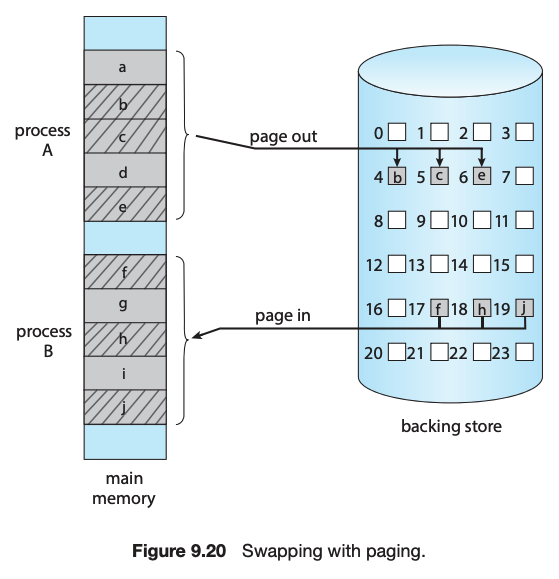

- page-out : 페이지를 메모리에서 백업 저장장치로 이동시킨다.
- page-in : page-out의 반대 방향 연산

페이징에서의 스와핑은 가상 메모리와 함께 잘 작동한다.

### 모바일 시스템에서의 스와핑

PC와 서버용 대부분의 운영체제는 페이지 단위의 swapping을 지원하는 반면, 모바일 시스템은 일반적으로 어떤 형태의 swapping도 지원하지 않는다. 

1. 모바일 기기는 비휘발성 저장장치로 용량이 큰 하드디스크 대신 flash memory를 사용하는데, 이로 인한 저장 공간의 제약
   - flash memory : 전원이 꺼져도 데이터를 보관하는 비휘발성 저장장치
2. flash memory는 쓰기 횟수에 한계가 있어 일정 횟수를 초과하면 신뢰성이 떨어짐
3. main memory와 flash memory 간의 데이터 전송 성능이 낮다
   - 메인 메모리(RAM) : CPU가 직접 실행/연산에 쓰는 작업 공간

**iOS**

1. 가용 메모리가 특정 임계값(threshold) 이하로 떨어짐
2. Apple의 iOS는 애플리케이션에게 할당된 메모리를 자발적으로 반환하도록 요청
3. 읽기 전용 데이터(예: 코드)는 main memory에서 제거되었다가 필요 시 flash memory에서 다시 로드되며, 수정된 데이터(예: stack)는 절대 제거되지 않는다.
   - 읽기 전용 데이터는 내용이 바뀌지 않고 원본이 이미 저장장치에 존재하므로 RAM에서 버려도 나중에 필요해지면 flash memory에서 그대로 다시 읽어오면 된다.
   - stack 같은 데이터는 실행 중 계속 바뀌므로 RAM에서 없애면 정확한 상태를 잃어버리므로 iOS는 이를 피한다.
4. 충분한 메모리를 확보하지 못한 애플리케이션은 운영체제에 의해 종료될 수 있다.

iPadOS 16부터(특정 M1/M2 iPad) 저장 공간을 이용하는 Virtual Memory Swap을 공식적으로 도입했다. ([링크](https://nr.apple.com/d2I7Z511K1))

**Android**

가용 메모리가 부족한 경우 프로세스를 종료할 수 있지만, 종료 전에 애플리케이션 상태를 flash memory에 기록하여 빠르게 재시작할 수 있도록 한다.

- Android는 메모리 압박이 커지면 lmkd(low memory killer daemon)가 시스템 상태를 보고 덜 중요한 프로세스부터 종료해 메모리를 확보한다.
- Android는 보통 storage(플래시)를 스왑 공간으로 쓰지 않는다고 설명합니다. 이유는 잦은 쓰기가 wear를 유발해 수명을 줄일 수 있기 때문이며, 대신 많은 기기에서 zRAM(압축 RAM 스왑) 을 사용한다.


## 참고
- https://www.geeksforgeeks.org/operating-systems/external-fragmentation-in-os/
- https://www.geeksforgeeks.org/operating-systems/internal-fragmentation-in-os/
- https://product.kyobobook.co.kr/detail/S000001868743
- https://nr.apple.com/d2I7Z511K1
- https://developer.android.com/topic/performance/memory-management
- https://source.android.com/docs/core/perf/lmkd