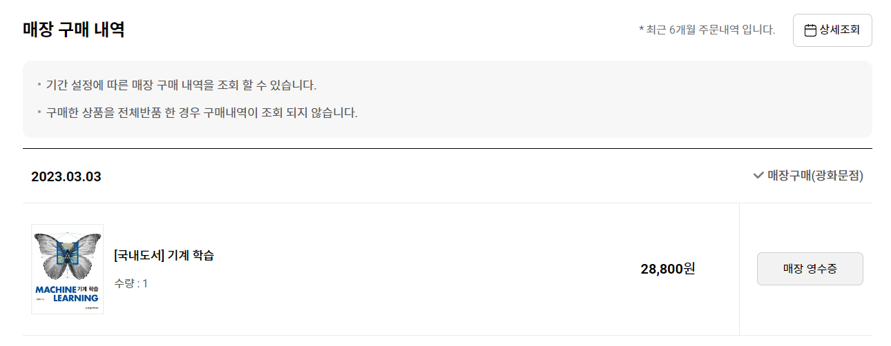

{: width="80%" height="80%" class="align-center"}

*읽어본 책을 리뷰하는 글입니다. 읽은 모든 책을 리뷰하지 않으며 좋은 책이라고 무조건 리뷰하는 것도 아닙니다. 리뷰한 책이라고 해서 모든 부분을 완벽하게 이해한 것도 아닙니다.*

2018년 대한민국학술원 선정 우수학술도서이다. 내가 대단한 사람은 아니지만 여기 선정된 도서들은 신뢰한다. 물론 나는 학교 수업으로 샀다.

2017년에 초판이 발행되었고 현재기준 6년 정도가 지난 책이다. 현재 트렌드에 뒤쳐져 있다는 생각이 들 수도 있지만 책 자체가 기본적인 개념들을 자세히 서술하는 책이기 때문에 큰 불편함은 못느꼈다. 물론 당시 기준으로 유망하다고 서술된 기술들이 현재 이용되지 않는 경우는 몇 번 있었다. 예를 들어 2017년 당시에 A라는 문제가 있었고 이를 위해 B, C라는 기술들이 연구되고 있다고 서술했는데 6년이 지난 지금은 D라는 기술을 활용하고 있다던지 같은 것 말이다.

신경망을 활용한 딥러닝에 중점을 둔 책이다. 뒤에 커널트릭이나. SVM 내용도 자세히 서술되어 있긴 하지만 주된 내용은 신경망이다. **코드는 전혀 없다.** 수학적 관점에 맞춰서 그것의 원리를 설명하는 책이다.

필자는 수학이 약하다고 생각하는데, 그런 관점에서 이 책이 좋았던 부분은 어려우면서 중요한 부분은 수학 공식으로 설명시에 간단한 예시를 들어준다는 것이다. 신경망이 있다면 적은 숫자들로 간단히 예시를 들어 확장하여 생각할 수 있게 해준다.

예전 책이어서 그런지, 대학 수업용 책이어서 그런지 모르겠지만 가끔 어색한 번역들이 있긴 하나, 첫 사용시 병기해주기 때문에 큰 불편함은 없었다.

아무래도 한국인이 직접 쓴 책이다보니 번역투도 없어서 읽기 자연스러운 것이 가장 좋았던 것 같다.

딥러닝을 사용하면서 필요한 필수 개념들은 다 다룬다고 보면 된다. 배치정규화라던지, 옵티마이저, 경사하강법, 크로스 엔트로피 등등 개념에 있어서 복습의 관점으로도 도움이 되었다.

난이도는 훨씬 높은 이앗 굿펠로우의 심층학습 책이랑 느낌은 비슷하다. 난이도 높은 책을 읽기전에 입문용으로도 좋을 것 같다.

어려웠던 개념에 대해 수학적으로 이해를 원하는 사람들에게 권하기 좋은 것 같다. 특히 순환신경망이 이해가 잘 가지 않았었는데 이 책을 읽고 많은 도움이 되었다.
