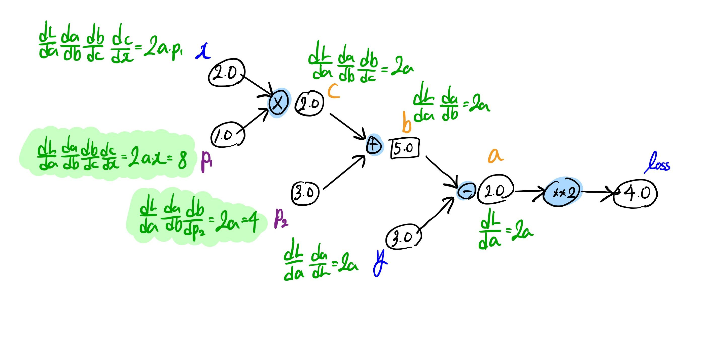
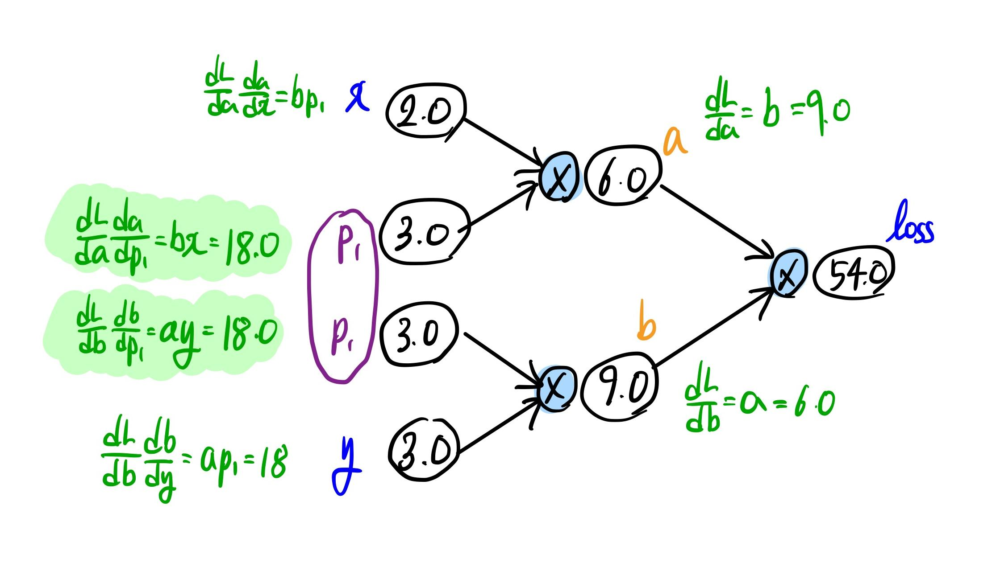
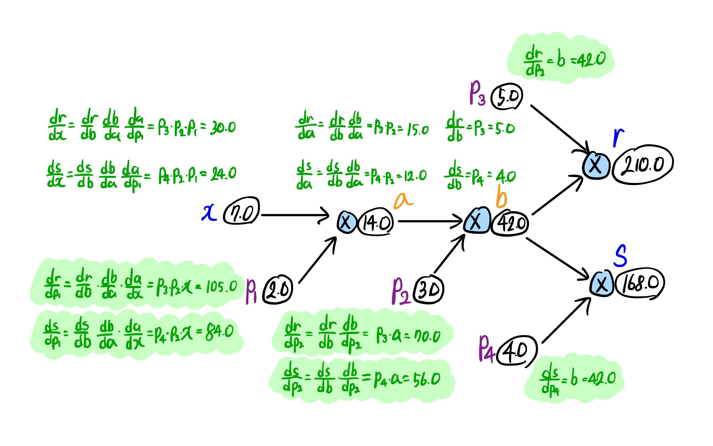
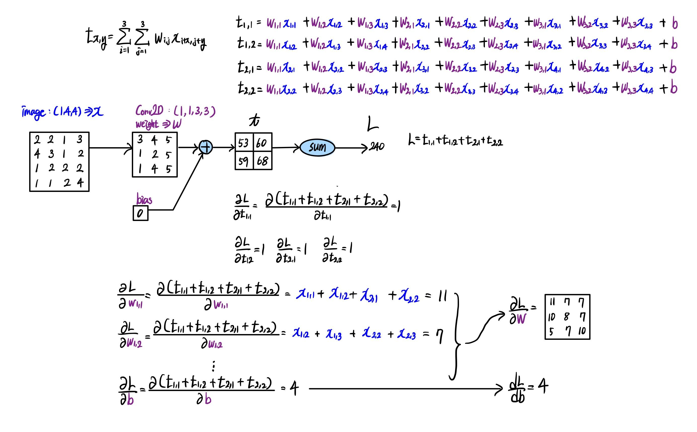

자동 미분 계산 그래프를 연습한다.

## 1.

```py
learning_rate = 0.1

x = torch.tensor([2.0])
y = torch.tensor([3.0])

params = torch.tensor([1.0, 3.0], requires_grad=True)

result = x * params[0] + params[1]

loss = (result - y) ** 2

loss.backward()

print(f"loss: {loss}")
print(f"params.grad: {params.grad}")
```

```text
loss: tensor([4.], grad_fn=<PowBackward0>)
params.grad: tensor([8., 4.])
```



## 2.

```py
learning_rate = 0.1

x = torch.tensor([2.0])
y = torch.tensor([3.0])

params = torch.tensor([3.0], requires_grad=True)

a = x * params
b = y * params

loss = a * b

loss.backward()

print(f"loss: {loss}")
print(f"params.grad: {params.grad}")
```

```text
loss: tensor([54.], grad_fn=<MulBackward0>)
params.grad: tensor([36.])
```

```py
learning_rate = 0.1

x = torch.tensor([2.0])
y = torch.tensor([3.0])

params = torch.tensor([3.0], requires_grad=True)

a = x * params
b = y * params.detach()

loss = a * b

loss.backward()

print(f"loss: {loss}")
print(f"params.grad: {params.grad}")
```

```text
loss: tensor([54.], grad_fn=<MulBackward0>)
params.grad: tensor([18.])
```



## 3.

```py
learning_rate = 0.1

x = torch.tensor([7.0])

params = torch.tensor([2.0, 3.0, 5.0, 4.0], requires_grad=True)

a = x * params[0]
b = a * params[1]
r = b * params[2]
s = b * params[3]
t = r + s

t.backward()

print(f"r: {r}, s: {s}")
print(f"params.grad: {params.grad}")
```

```text
r: tensor([210.], grad_fn=<MulBackward0>), s: tensor([168.], grad_fn=<MulBackward0>)
params.grad: tensor([189., 126.,  42.,  42.])
```



## 4.

```py
image = torch.tensor([[[[2., 2., 1., 3.],
                        [4., 3., 1., 2.],
                        [1., 2., 2., 2.],
                        [1., 1., 2., 4.]]]])

c_weight = torch.tensor([[[[3, 4, 5], [1, 2, 5], [1, 4, 5]]]], dtype=torch.float32)
c_weight = nn.parameter.Parameter(c_weight)

c_bias = torch.tensor([0], dtype=torch.float32)
c_bias = nn.parameter.Parameter(c_bias)

conv = nn.Conv2d(1, 1, 3)
conv.weight = c_weight
conv.bias = c_bias

result = conv(image)
>>> result
"""
tensor([[[[53., 60.],
          [59., 68.]]]], grad_fn=<ConvolutionBackward0>)
"""

loss = torch.sum(result)
>>> loss
"""
tensor(240., grad_fn=<SumBackward0>)
"""

loss.backward()

>>> conv.weight.grad
"""
tensor([[[[11.,  7.,  7.],
          [10.,  8.,  7.],
          [ 5.,  7., 10.]]]])
"""

>>> conv.bias.grad
tensor([4.])
```


<p style="text-align: center; font-style: italic;"> ('새 탭에서 이미지 열기' 를 하면 더 크게 볼 수 있다.
) </p>