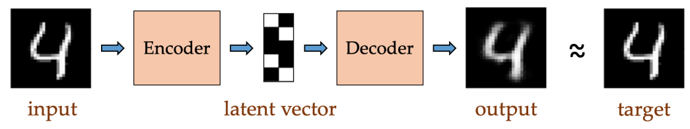
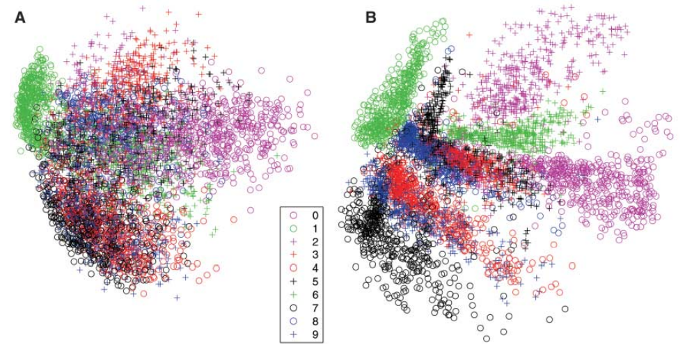
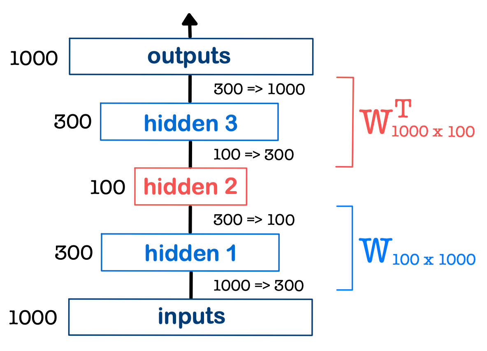
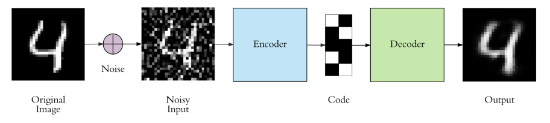
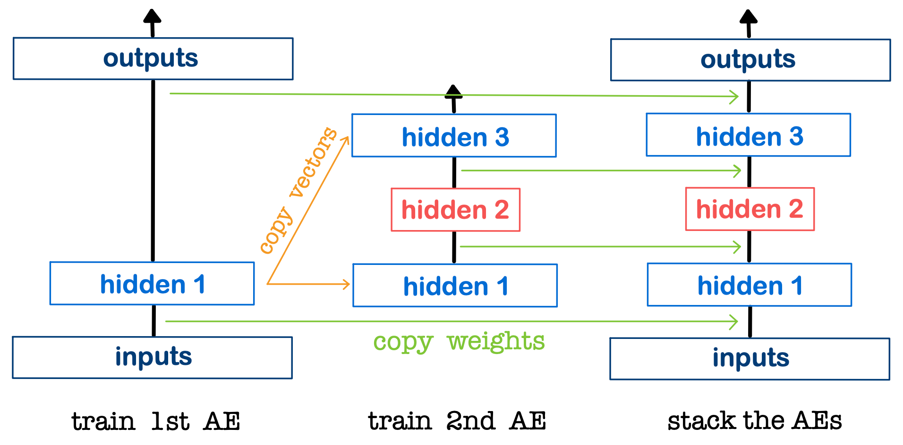
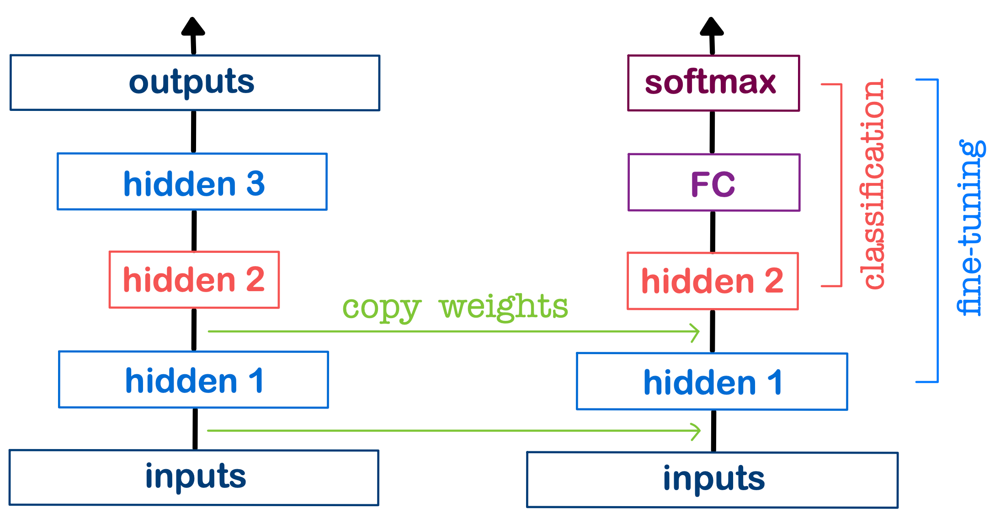

## 참고자료
* [1] [오승상 딥러닝 Deep Learning 34 Auto-Encoder 1](https://youtu.be/1QcttO3rKmw?si=kq6aVrywRRw6vCwj)
* [2] [오승상 딥러닝 Deep Learning 35 Auto-Encoder 2](https://youtu.be/7PuZGRCIFnU?si=5ASm1ub9I_XFFhhx)
* [3] [오승상 딥러닝 강의자료](https://sites.google.com/view/seungsangoh)

## AutoEncoder

[image source](https://www.assemblyai.com/blog/introduction-to-variational-autoencoders-using-keras/)

* input 데이터를 그대로 사용했기 때문에 unsupervised learning
* Encoding : input -> Encoder network -> Latent vector
* Decoding : Latent vector -> Decoder network -> reconstructed output
* Latent Vector : single value for each attribute

특징
* Dimensionality Reduction
* Data-specific
  * 입력 특징 간의 강한 상관관계가 있는 데이터를 의미있게 압축
  * 훈련된 데이터와 유사한 데이터를 의미있게 압축
* Lossy

 (image source : 오승상 딥러닝 강의자료 p.146) 

* Goal: get an output $\hat{y}^k = (\hat{y}_1^k, \ldots, \hat{y}_d^k)$ which is identical with the input $x^k = (x_1^k, \ldots, x_d^k)$.
  * $k$ : 데이터의 개수
  * $x^k$ : k번째 데이터
  * $d$ : 데이터 한 개의 dimension, 이미지에서는 픽셀의 개수
  * target = input
* Loss function
  * MSE for real values: $L(\theta) = \frac{1}{2} \sum_k \| \hat{y}^k - x^k \|^2_2 = \frac{1}{2} \sum_k \sum_i (\hat{y}_i^k - x_i^k)^2$
  * Cross-entropy for binary $\{0, 1\}$: $L(\theta) = - \sum_k \{ x^k \log \hat{y}^k + (1 - x^k) \log (1 - \hat{y}^k) \}$

### Dimensionality Reduction

* 데이터이 차원을 줄이고 새로운 알고리즘의 input으로 사용할 수 있다.
  * AutoEncoder를 통해 차원을 줄이고 classification, clustering, anomaly detection에 의 input으로 활용할 수 있다.
  * input -> latent vector -> 다른 알고리즘의 input
* 기존 데이터의 차원을 훨씬 작게 해서 시각화를 가능하도록 만든다.

Two dimensionality reductions for high dimensional data visualization
* PCA(Principal Component Analysis) : 데이터 사이의 관계가 projection을 해도 유지된다. 
  * 데이터 사이의 관련성을 어느정도 유지시켜 주지만 못하는 경우가 많다.
  * hyperplane : 데이터셋의 차원보다 작은 plane
  * linear
* autoencoder : 곡선이 더 데이터간의 관련성을 잘 나타낼 수도 있다.
  * nonlinear
  * manifold : 휘어짐을 강조하기 위한 표현 
  * 데이터를 더 작은 차원으로 표현하기 위해 nonlinear manifold를 사용해 학습한다.
  * nonlinear generalization of PCA
  * 데이터가 많아야 좋은 성능을 낼 수 있다.

G. E. Hinton, R. R. Salakhutdinov ,Reducing the Dimensionality of Data with Neural Networks. Science

## Tied weight Auto-Encoder

{: width="80%" height="80%" class="align-center"}

 (image source : 오승상 딥러닝 강의자료 p.149) 

* 가운데에 있는 `hidden 2` 가 latent vector가 된다
* non linearity를 고려하지 않는다고 할 때 `inputs` -> `hidden 2` 의 가중치를 통칭해서 W (100, 1000) 라고 하고 input을 x라고 하면 latent vector는 $Wx$ 가 된다. 
* $W$가 역행렬이 존재하면 $W^{-1}Wx$을 계산하면 input이 복원된다.
* 하지만 $W$가 정방행렬(square matrix)이 아니기 때문에 inverse가 존재하지 않는다.
* $W_1$ : encoding의 weight matrix
* $W_2$ : decoding의 weight matrix
  * matrix size of $W_1^T$
  * weight까지 $W_1$과 같은 값(tied weight)을 쓰게 한다. 즉 $W_2 = W_1^T$
* input, output의 dimension이 같아야 한다.
* $W_2$는 $W_1^{-1}$의 역할을 해야 한다. 하지만 이것은 $W_1^T$과 다른데 사용하는 이유
  * $W_1$만 학습하면 되기 때문에 가중치의 개수가 반으로 줄어들어 속도가 빨라지고 overfitting이 억제된다. 
  
## Denoising Autoencoder

{: width="80%" height="80%" class="align-center"}

 (image source : 오승상 딥러닝 강의자료 p.150) 

* noise가 있는 데이터의 noise를 지워서 clean한 데이터로 복원한다.
* output을 target과 비슷하게 해야 한다.
  * noise-free 데이터에 noise(ex. Gaussian noise)를 인위적으로 집어넣는다. 그리고 noise-free 데이터를 target으로 하여 학습한다.
* 위 그림에서는 [Noisy Input -> Code -> Output] 부분이 AutoEncoder 부분이다. 
* 실제 test에서는 noisy data를 집어넣으면 noise-free 데이터를 생성한다.

* Loss Function
  * AE : input, output from the input
  * Denoising AE : input, output from a noisy input

## Stacked Autoencoder

{: width="80%" height="80%" class="align-center"}

 (image source : 오승상 딥러닝 강의자료 p.151) 

* Encoder
  * $W_1$ : inputs -> hidden1
  * $W_2$ : hidden1 -> hidden2
* Decoder
  * $W_2^T$ : hidden2 -> hidden3
  * $W_1^T$ : hidden3 -> output
* Auto-Encoder안의 layer의 숫자를 키우는 것을 의미한다. Deep Encoder라고도 불린다.
* 레이어가 많아지면 학습이 잘 안되는 이유
  * $W_1, W_2, ...$ : weight parameter 가 증가하기 때문에 학습이 어려워짐 
  * dimension이 너무 많이 작아지면 latent vector -> output 부분의 데이터 복원이 어려워진다.
* 이전 레이어의 latent vector를 다음 레이어의 input으로 사용한다.
* 가중치를 점진적으로 줄여나가기 때문에 학습이 용이하다.
* 각 학습단계에서는 하나의 네트워크만 학습하게 된다.

### Classification task using Stacked Auto-Encoder

{: width="80%" height="80%" class="align-center"}

 (image source : 오승상 딥러닝 강의자료 p.152) 

* Weights
  * $W_1$ : inputs -> hidden1
  * $W_2$ : hidden1 -> hidden2
  * $W_3$ : hidden2 -> FC
  * $W_4$ : FC -> softmax
* latent vector : hidden 2
* Unsupervised Learning($W_1, W_2$) + Supervised Learning
* 학습과정
  * AE 학습을 마치면 encoder 부분($W_1, W_2$, pre-trained)만 가져온다
  * latent vector 이후에 FC($W_3, W_4$)를 추가한다.
  * Encoder 부분($W_1, W_2$)의 가중치는 고정하고 학습(supervised, with label)을 진행한다.
* 처음부터 supervised learning을 할 경우 많은 양의 파라미터를 학습해야 한다($W_1, W_2, W_3, W_4$) 하지만 AE 학습을 마친후에 학습을 할 경우 데이터의 차원과 가중치가 줄어들어 효율적인 학습이 가능하다.
* Encoder 에서 학습한 값들은 classification과 전혀 관계가 없다. 하지만 최종 목표는 classification이다. 이 경우를 위해 Encoder의 뒷부분 (=FC와 가까운 부분)을 다시 학습하여 성능을 더욱 높일 수도 있다.
* classification에서 Encoder 부분의 가중치를 고정하지 않고 학습시킨다면 학습 초기에 엉망인 뒷부분 가중치를 기준으로 encoder의 가중치가 업데이트 되기 때문에 값들이 망가지게 된다. 그러므로 classification시에 encoder에서 가져온 weight는 고정시키는 것이 맞다.

### Semi-supervised Learning using Stacked Auto-Encoder

Semi-supervised learning : 대부분 데이터가 라벨링 되어있지 않고 일부만 라벨링 되어있는 데이터를 학습하는 것

* stacked AE를 모든 데이터(labeled, and unlabeled)를 학습한다 (unsupervised)
* encoding 레이어만 재사용하여 FC를 위에 (latent vector 다음)에 추가한다.
* labeled data를 사용해 학습한다(supervised learning)
  * labeled data가 적기 때문에 적절히 학습시에 사용할 파라미터를 줄이는 방법

### Anomaly detection using Stacked Auto-Encoder

기존 dataset에서 outlier(특이한 값)를 찾아내는 방법

* 데이터의 라벨을 사용하지 않는다. (unsupervised learning)
* 학습을 어떤 데이터으로 학습하고 테스트시에 다른 데이터를 집어넣게 되면 AE를 통과시켰을 때 output과 target사이의 에러(reconstruction error)가 커지게 된다.
* reconstruction error 가 큰 것을 outlier로 판단한다.
* ex)
  * network intrusion detection
  * system monitoring
  * sensor network event detection(IoT)
  * abnormal trajectory sensing